# Easy Anomaly Detection + Alerts with Edge Impulse and Blues

In the industrial IoT space, [predictive maintenance](https://www.ibm.com/topics/predictive-maintenance) has evolved from being some kind of unachievable panacea to virtually a table stakes requirement.

The first step in predicting when a machine may fail (and thus require maintenance) is identifying a variety of known states, or conditions, of said machine while it's in operation. To simplify this even further, let's say we have a table fan that represents an industrial machine. What are some known operational states of the fan?

1. Low
1. Medium
1. High

Pretty straightforward!

Now I'm sure we've all had that old fan that vibrates incessantly at high speeds. Maybe a screw is coming loose or the motor is starting to fail. In either case, **those could be examples of anomalies** that we want to identify at the earliest stage possible. This lets us get ahead of any maintenance needs (i.e. tighten that screw!) before the whole thing falls apart.

"Anomaly detection" is a popular machine learning (ML) problem. There are three different types of anomaly detection that are important to understand:

- **Supervised Anomaly Detection:** Think of this as classifying known states, and one (or more) of the known states is anomalous. In this type, both anomalous and nominal observations are labeled.
- **Semi-Supervised Anomaly Detection:** In this type, the full breadth of states are only partially labeled.
- **Unsupervised Anomaly Detection:** None of the states are labeled, but we assume that nominal states far outnumber anomalous ones, therefore allowing us to more easily classify anomalies.

In this project, we are going to incorporate concepts of anomaly detection and preventative maintenance and build a solution that:

1. Uses **supervised anomaly detection** to detect the state of a machine (a fan).
1. Wirelessly **send observed states** of the machine to a cloud dashboard.
1. Generate **SMS alerts when anomalous behavior is detected**.

*Want to see a quick video overview of this project? Look no further:*

https://youtu.be/DU4AJygAIsc

*Likewise, want to see the final Arduino sketch for this project? [Check out this GitHub gist](https://gist.github.com/rdlauer/6fdef0866439690153d3d5149fb46107) for the full details.*

## The Tools

Let's start by briefly looking at the technologies we will be using.

### ML Model Generation with Edge Impulse

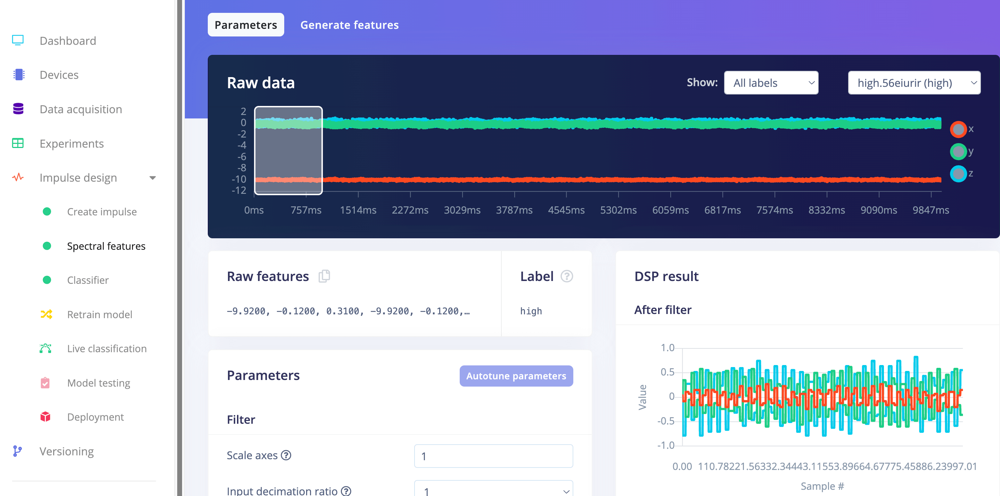

[Edge Impulse](https://edgeimpulse.com/) provides a cutting-edge platform for developing, deploying, and optimizing AI models on edge devices. We'll use [Edge Impulse Studio](https://studio.edgeimpulse.com/) to train and implement an ML model specifically designed for anomaly detection on our machine, using an STM32-based host microcontroller with an attached accelerometer to measure vibration patterns on the fan.

### Blues for Device-to-Cloud Connectivity

The [Blues Notecard](https://blues.com/products/notecard/?utm_source=hackster) and its paired cloud service, [Notehub](https://blues.com/notehub/?utm_source=hackster), allow for adding wireless connectivity to virtually any host microcontroller or single board computer (like the Raspberry Pi).

Providing [cellular](https://blues.com/notecard-cellular/?utm_source=hackster), [LoRa](https://blues.com/notecard-lora/?utm_source=hackster), [Wi-Fi](https://blues.com/notecard-wifi/?utm_source=hackster), and [satellite add-on](https://blues.com/starnote/?utm_source=hackster) options, the Notecard is an easy to use low-power option for IoT projects of all sizes. The Notecard is programmed with a [straightforward JSON-based API](https://dev.blues.io/api-reference/notecard-api/introduction/?utm_source=hackster) that works the same across all radio types, along with [SDKs for popular languages](https://dev.blues.io/tools-and-sdks/firmware-libraries/libraries-overview/?utm_source=hackster) like C, Arduino, and Python.

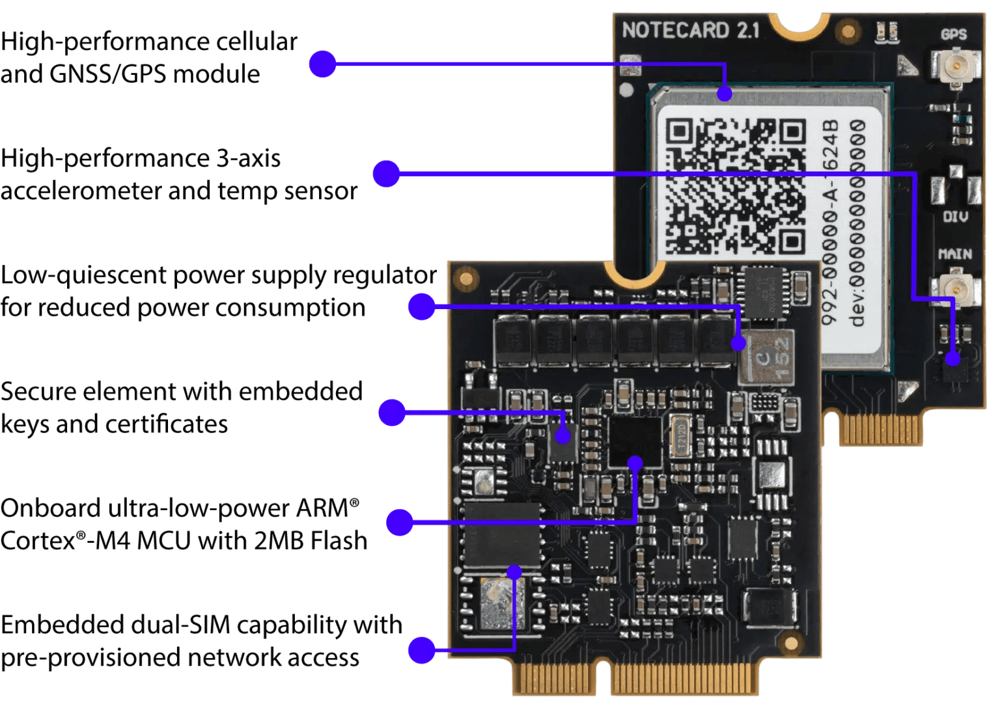

As we will see today, Notehub helps complete the Notecard story by receiving events (or [Notes](https://dev.blues.io/api-reference/glossary/?utm_source=hackster#note) in Blues speak) and then allowing you to *route* those Notes to any cloud service (e.g. AWS, Azure, Ubidots, Datacake, Losant, etc.).

### Datacake for Cloud Dashboards

While we can use *any* IoT platform or cloud service to visualize our data, today we are going to go with [Datacake](https://datacake.co/), one of my personal favorites. Datacake is a low-code IoT platform that requires very little technical knowledge to build out custom IoT applications to bring your data to life.

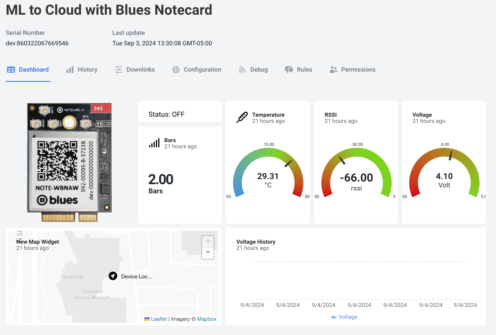

### Twilio for SMS Alerts

When anomalous behaviors are identified, in most cases we probably want to know about these events ASAP. This is where SMS alerts can come into play (though you can certainly integrate email notifications, Slack messages, Teams messages, and so on).

[Twilio](https://www.twilio.com/) is a great option for SMS alerts, just please note that there is a fair amount of setup required nowadays to get your Twilio account configured and verified. This is primarily due to Twilio cracking down on spam, so it's a good thing for the general public, but a bad thing for us developers!

## Project Summary

At a high level, our project is going to use an accelerometer attached to a fan to measure four different vibration patterns:

1. Off
1. Low
1. Medium
1. High (this will also act as our "anomalous state")

These classifications, or inferences, will be generated locally on our STM32-based Swan microcontroller using an ML model created by Edge Impulse, displayed on an attached LCD display, sent to the Blues Notecard for syncing with the cloud, and then on to Datacake for visualizations and Twilio for SMS alerting (when necessary).

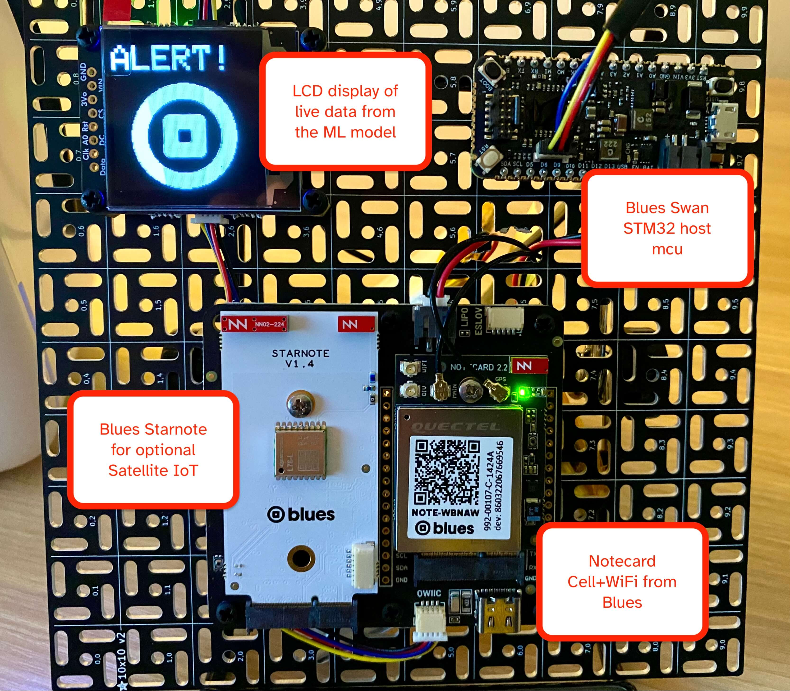

## Creating the ML Model with Edge Impulse

After [signing up for a new account](https://studio.edgeimpulse.com/signup) at Edge Impulse (hey, new accounts are free!), **create your first project** (just give it a name for now).

Next, head to your terminal of choice and [install the Edge Impulse CLI](https://docs.edgeimpulse.com/docs/edge-impulse-cli/cli-installation).

You'll then have to start **acquiring data** to pull in A LOT of samples of accelerometer data for the four different states of our fan.

> You can see [my Edge Impulse project here](https://studio.edgeimpulse.com/studio/512752).

### Data Acquisition

Here is an example Arduino sketch you could use and adapt for the exact accelerometer you might be using. This will simply read `x,y,z` values from the accelerometer and stream them over serial:

```
#include <Arduino.h>
#include <Adafruit_LIS3DH.h>

Adafruit_LIS3DH lis = Adafruit_LIS3DH();

void setup(void)
{
  Serial.begin(115200);
  lis.begin(0x18);
}

void loop()
{
  lis.read(); // get x,y,z data at once
  Serial.print(lis.x);
  Serial.print("\t");
  Serial.print(lis.y);
  Serial.print("\t");
  Serial.print(lis.z);
  Serial.println();
}
```

The output in your serial monitor should look something like this with the above sketch running:

```
-224    -528    16192
-320    -528    16192
112     -624    15792
112     -624    15792
304     -496    16160
304     -496    16160
80      -640    16384
80      -640    16384
-112    -640    16384
```

Your next step is to capture these readings while the fan is in its four different states, and forward this data to Edge Impulse using the **Edge Impulse Data Forwarder**. To start the forwarder, be sure to **close any open serial monitors** and issue this command in your terminal:

```
edge-impulse-data-forwarder
```

You'll be prompted to login and to choose your Edge Impulse project. Head back to Edge Impulse Studio through your browser and go to the **Data Acquisition** tab. Start adding samples for each state of the fan and labelling each sample appropriately (e.g. "off", "low", "medium", "high").

Your terminal will update with each successive sample:

```
[SER] Waiting 2 seconds...
[SER] Reading data from device...
[SER] Reading data from device OK (10020 samples at 1002Hz)
[SER] Uploading sample to https://ingestion.edgeimpulse.com/api/training/data...
[SER] Sampling finished
[WS ] Incoming sampling request {
  path: '/api/training/data',
  label: 'medium',
  length: 10000,
  interval: 0.998003992015968,
  hmacKey: '2db28f0009ab7de2659df25bcebcd31f',
  sensor: 'Sensor with 3 axes (x, y, z)'
}
```

> I recommend at least a few minutes of 10 second samples for each state!

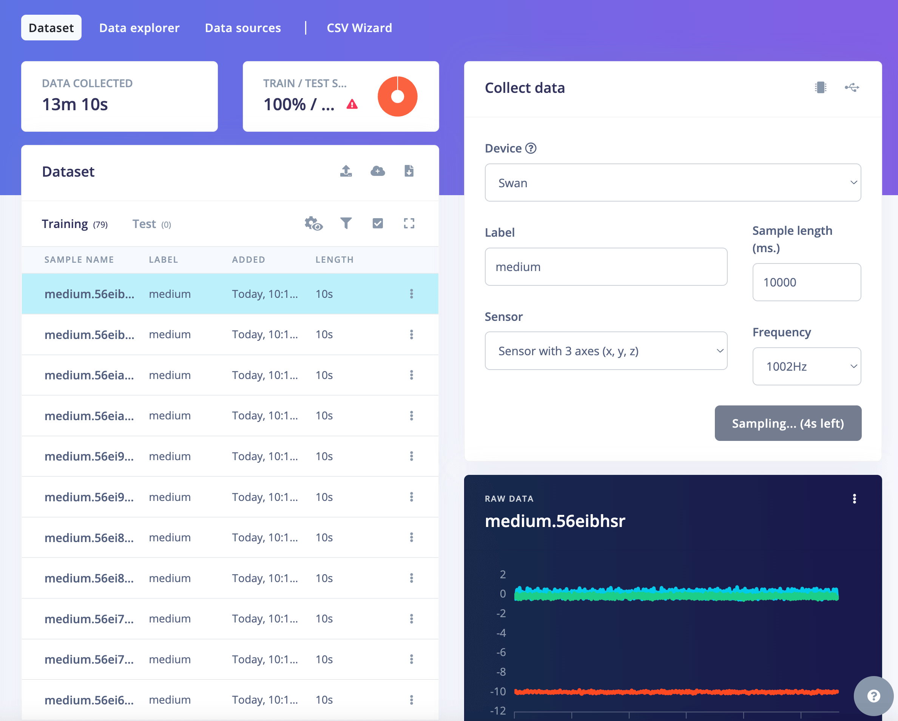

After each sample is acquired, you'll be able to see a visualization of the accelerometer data:

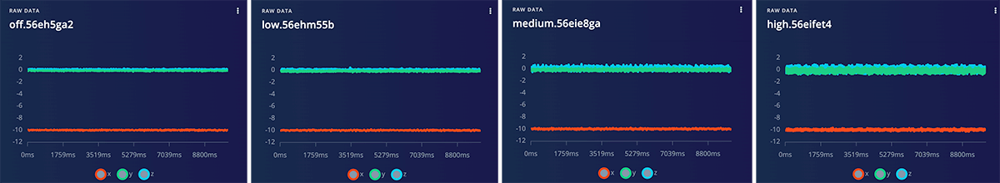

The differences between each are subtle, but you should be able to see how the x, y, and z values of the accelerometer change for each state!

At this point you should have a lot of data samples to work with. I recommend moving 10-15% of your samples to a **test sample set**. This will let you accurately test the model before deploying it to a host MCU.

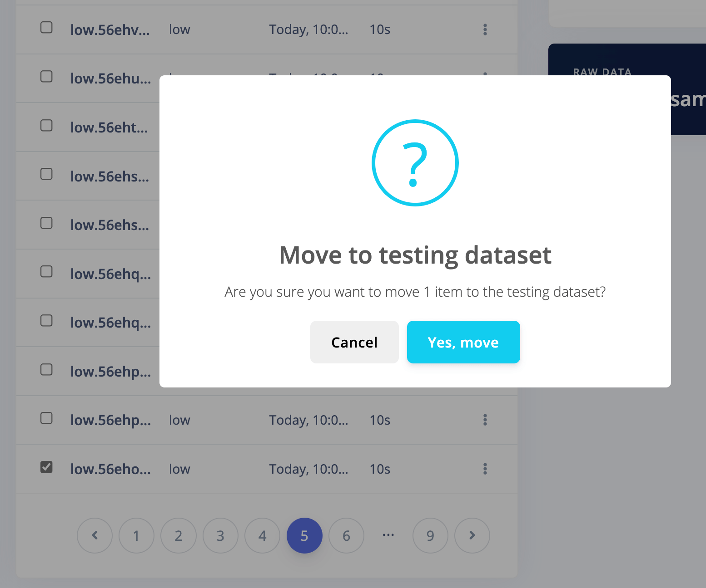

### Create the ML Model

After gathering sufficient data from the accelerometer, proceed to designing and building a model. In Edge Impulse Studio, go to the left-side menu and select **Create impulse** under the **Impulse Design** section. Given your collected data, Edge Impulse Studio will identify your source data as a time series and suggest window sizes and increments, which you can adjust as you experiment and refine your model.

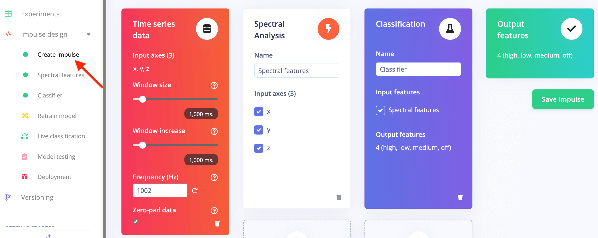

On the **Spectral features** screen, you can modify and fine-tune the parameters as desired or leave them at their default settings.

When you're finished, click **Save parameters** to move to the **Generate features** screen.

Then, click the **Generate features** button. Once the process completes, you'll receive estimates of on-device inference performance and a feature explorer displaying how your gestures cluster along the x, y, and z axes.

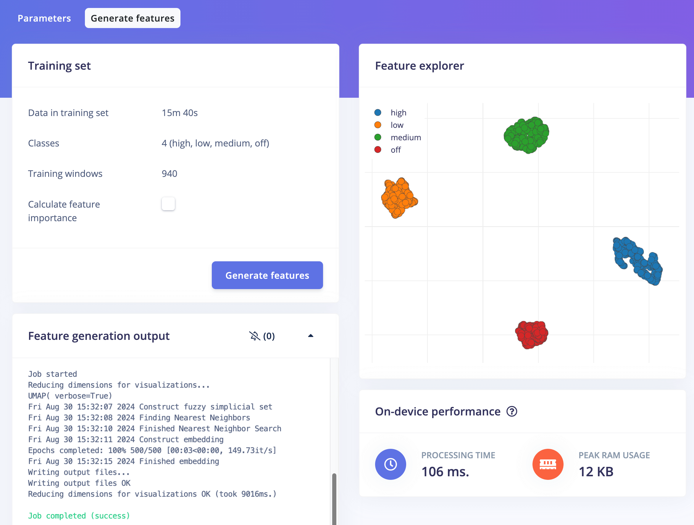

Next, select **Classifier** from the left navigation menu and set the number of training cycles to `300` and the learning rate to `0.0005`. Click **Start training** and take a break while Edge Impulse trains your model.

Once training is complete, Edge Impulse Studio will show the model's performance, a confusion matrix, a feature explorer, and details on on-device performance.

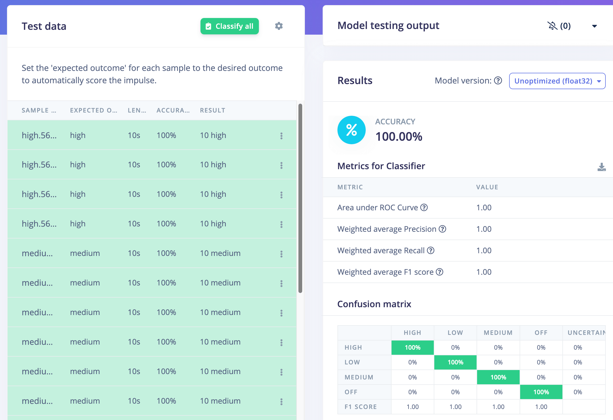

At this point you can now optionally test your model using the **Model testing** menu item.

### Build and Deploy Model

When you're satisfied with your model's performance, it's time to deploy it to your device. Go to the **Deployment** menu in Edge Impulse Studio, and search/select **Arduino library**.

After selecting a deployment type, click **Build**. Edge Impulse Studio will create a model package and provide a zip archive for you to download.

Next, you'll want to include the library in a new Arduino project!

**Using Arduino IDE?** Click the **Sketch** menu, then **Include Library > Add .ZIP Library**. After Arduino IDE processes the library, open the **Sketch > Include Library** menu, and under **Contributed libraries** choose the name of the folder you selected. This will add the appropriate include statement to your sketch.

**Using PlatformIO?** Simply drag-and-drop the *unzipped* archive onto your `lib` directory in your PlatformIO project.

## Configuring the Blues Notecard for Cloud Connectivity

Next up we'll want to learn a bit about connecting this project to the cloud. There are a few fundamental concepts to be aware of when working with the Blues Notecard and Notehub:

1. The **Notecard knows where to go when it's first powered up** (that would be to Notehub). You just have to tell it *where* in Notehub to go (that would be your Notehub project, see below).
1. The **Notecard is a low-power device**, but is incredibly smart about knowing how and when to connect to the cloud. You send data to it and it figures out the best way to sync that data with Notehub.
1. Your **data doesn't live in Notehub forever**. You *route* it to your cloud application of choice.

*Here is a high-level example of data flow with the Notecard and Notehub:*

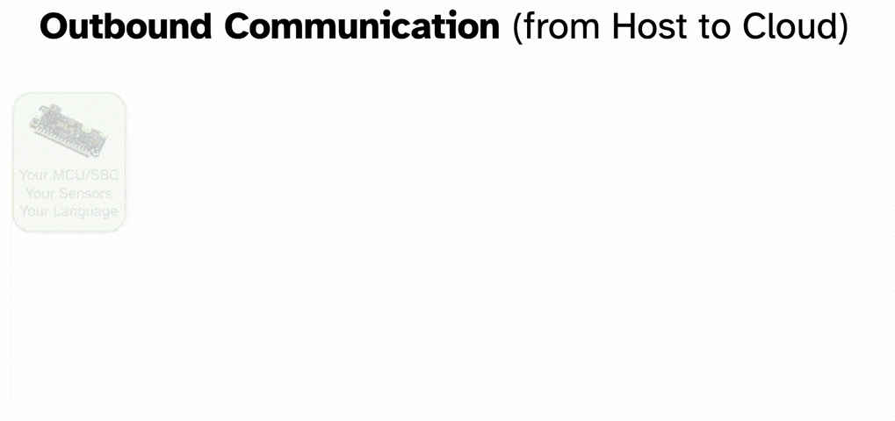

### Set up a Free Notehub Account and Project

Head to [notehub.io](https://notehub.io/) and set up your free Notehub account. Follow the steps provided to create your first Notehub project.

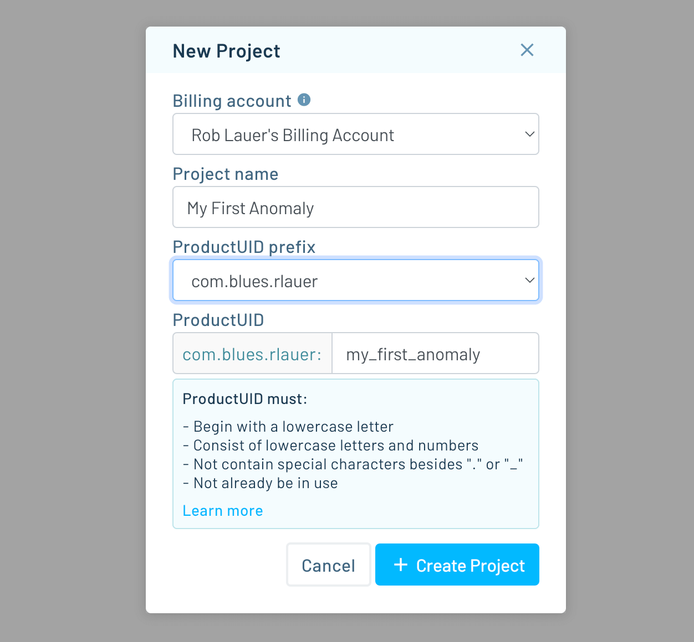

Take note of the `ProductUID` as that's the globally-unique identifier for your project and you'll need that in your final Arduino sketch. It'll look something like this:

```
com.domain.name:project
```

Let's next run through a very abbreviated set of steps to sync data with the cloud.

> As a reminder, you can find the full Arduino sketch in [this GitHub gist](https://gist.github.com/rdlauer/6fdef0866439690153d3d5149fb46107).

Associate this Notecard with your Notehub project, and place it in "continuous" mode, which will maintain a continuous network connection:

```
J *req = notecard.newRequest("hub.set");
if (req != NULL)
{
   JAddStringToObject(req, "product", productUID);
   JAddStringToObject(req, "mode", "continuous");
   notecard.sendRequestWithRetry(req, 5);
}
```

Every time we have new data that we want to relay to the cloud, we'll have to create a Note (which is just an arbitrary payload of JSON-formatted data):

```
    // send note
    J* req = notecard.newRequest("note.add");
    if (req != NULL)
    {
      JAddBoolToObject(req, "sync", true);
      JAddStringToObject(req, "file", "alert.qo");
      J *body = JCreateObject();
      if (body != NULL)
      {
        switch (inference)
        {
        case 0:
          JAddStringToObject(body, "current_state", "OFF");
          break;
        case 1:
          JAddStringToObject(body, "current_state", "LOW");
          break;
        case 2:
          JAddStringToObject(body, "current_state", "MEDIUM");
          break;
        case 3:
          JAddStringToObject(body, "current_state", "ALERT!");
          break;
        default:
          JAddStringToObject(body, "current_state", "N/A");
          break;
        }

        JAddNumberToObject(body, "voltage", voltage);
        JAddNumberToObject(body, "temperature", temperature);
        JAddNumberToObject(body, "rssi", rssi);
        JAddNumberToObject(body, "bars", bars);

        JAddItemToObject(req, "body", body);
      }
      notecard.sendRequestWithRetry(req, 5);
    }
```

There is some additional metadata added to this Note, specifically the voltage, temperature, and RSSI + bars data (which allows us to measure our cellular signal strength). These values are all retrieved using corresponding Notecard APIs: [card.voltage](https://dev.blues.io/api-reference/notecard-api/card-requests/latest/?utm_source=hackster#card-voltage), [card.temp](https://dev.blues.io/api-reference/notecard-api/card-requests/latest/?utm_source=hackster#card-temp), and [card.wireless](https://dev.blues.io/api-reference/notecard-api/card-requests/latest/?utm_source=hackster#card-wireless). For example:

```
    // query notecard for voltage reading
    J *req = notecard.newRequest("card.voltage");
    if (req != NULL)
    {
      J *rsp = notecard.requestAndResponse(req);

      if (rsp && JGetNumber(rsp, "value"))
      {
        voltage = JGetNumber(rsp, "value");
        notecard.deleteResponse(rsp);
      }
    }
```

### Set Up Notehub Routes

Next, it's time to configure some [routes in Notehub](https://dev.blues.io/notehub/notehub-walkthrough/?utm_source=hackster#routing-data-with-notehub) to relay your accumulated data to Datacake and possibly even to Twilio for SMS alerting.

Head to the **Routes** tab and create a new **Datacake Route**. Assuming you've already sent some Notes to Notehub called `alert.qo`, you can specify that those are the *only* Notes you want to send to Datacake. You'll also need a URL from Datacake, more on this in the next section.

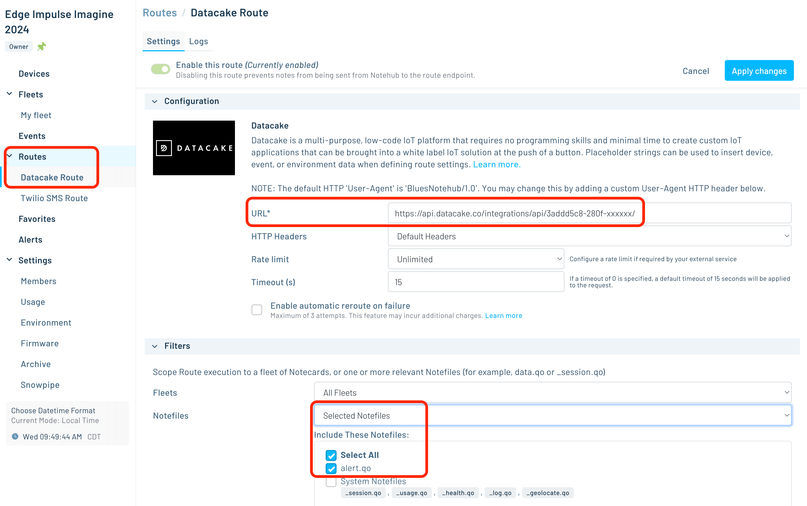

Creating the Twilio route itself is easy, but again, **configuring Twilio can be a bit of a pain**. I suggest [following this guide to create your Twilio SMS route](https://dev.blues.io/guides-and-tutorials/twilio-sms-guide/?utm_source=hackster).

Part of your Twilio route configuration will likely be to **only send an SMS message when an ALERT state is recorded** on your device. While there are many ways you could accomplish this (the simplest being to conditionally create a separate Note for alerts only - like `twilio.qo` for instance). I decided to take advantage of a powerful feature of Notehub, and that's live [JSONata](https://jsonata.org/) transformation of my data.

The following JSONata expression lets me conditionally route this data (i.e. only when an ALERT state is seen):

```
(
  $result := {
    "current_state": body.current_state
  };
  $result := body.current_state = "ALERT!" ?
    $result : $doNotRoute();
)
```

You can read more about [JSONata expressions here](https://dev.blues.io/guides-and-tutorials/notecard-guides/using-jsonata-to-transform-json/?utm_source=hackster).

## Setting Up a Datacake Dashboard

Datacake is a robust IoT platform and a perfect option for visualizing our generated inferences in the cloud.

Blues has an [excellent tutorial on routing data to Datacake](https://dev.blues.io/guides-and-tutorials/routing-data-to-cloud/datacake/?utm_source=hackster#route-to-an-external-service). This guide will help you fill in that missing `URL` field in your route and also includes a section on creating your dashboard.

As a shortcut for you, here is the **HTTP Payload Decoder** function I used in my Datacake dashboard:

```
function Decoder(request) {
    
    var data = JSON.parse(request.body);
    var body = data.body;
    var device = data.device;
    
    var decoded = {};
    
    decoded.voltage = body.voltage;
    decoded.temperature = body.temperature;
    decoded.rssi = body.rssi;
    decoded.bars = body.bars;
    decoded.current_state = body.current_state;
    decoded.device_location = "(" + data.best_lat + "," + data.best_lon + ")";
    
    // Array where we store the fields that are being sent to Datacake
    var datacakeFields = []
    
    // take each field from decodedElsysFields and convert them to Datacake format
    for (var key in decoded) {
        if (decoded.hasOwnProperty(key)) {           
            datacakeFields.push({field: key.toUpperCase(), value: decoded[key], device: device})
        }
    }      
    
    // forward data to Datacake
    return datacakeFields;
}
```

...and here are the **fields** I configured:

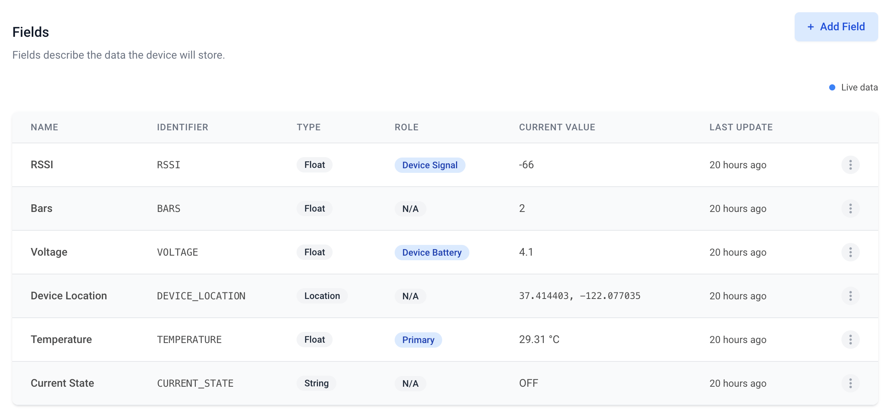

With the **drag-and-drop WYSIWYG interface provided by Datacake**, I was literally able to create the following dashboard in less than 10 minutes:


## Ready, Set, GO!

With my project running, acquiring data from the accelerometer, interpreting that data and generating inferences with my Edge Impulse ML model, sending that data to the cloud with the Notecard and Notehub, I can both see live data AND get an alert when an "anomaly" is detected!

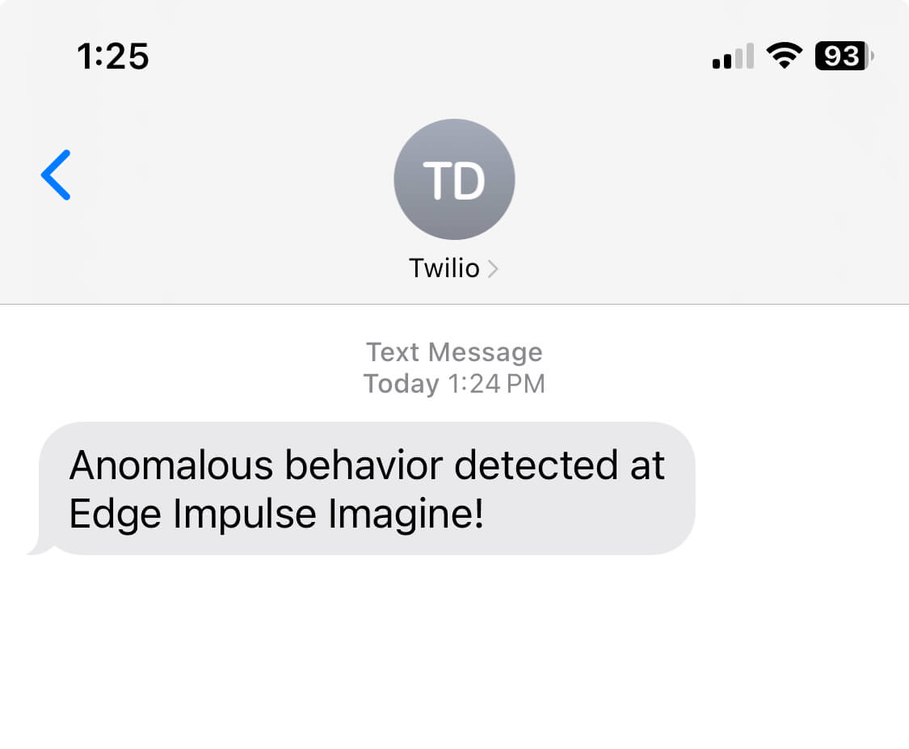

*This project was created as a demo for Edge Impulse's conference, [Imagine](https://edgeimpulse.com/imagine), hence the SMS text!*

If you'd like to see a video of this project in action, [check it out here on YouTube](https://youtu.be/DU4AJygAIsc). Likewise, get the [full Arduino sketch here](https://gist.github.com/rdlauer/6fdef0866439690153d3d5149fb46107) and [see my Edge Impulse project here](https://studio.edgeimpulse.com/studio/512752).

Last but not least, grab your own [Blues Starter Kit for $99](https://shop.blues.com/collections/blues-starter-kits?utm_source=hackster) to get started with wireless connectivity and built out your own IoT solution.

Happy Hacking! 💙
