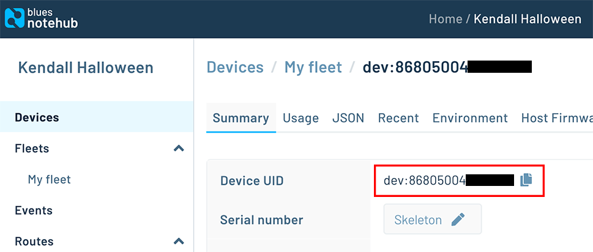

# Remotely Terrorize the Neighborhood Kids on Halloween

Who doesn't love Halloween? The candy. The costumes. The decorations. Traumatizing small children with scary props. 🎃💀


In this project, I'll show you how to remotely trigger a jump-scare skeleton with cellular IoT, giving you the opportunity to be the most hated grown-up on your block!

## The Very Scary Skeleton

This jump-scare skeleton lets you to trigger the action via detected motion or a footpad. Unfortunately the motion-triggering is a little *too* sensitive, often ruining the opportunity for a real surprise when kids are inspecting _what's in the bag_.


Ideally we want to activate the skeleton by replacing the footpad action with a relay switch that can be _remotely_ triggered. Therefore, we need a way to send a signal to toggle said relay from any distance.

Since this IoT deployment will be outdoors, a reasonable connectivity option is cellular, specifically the [prepaid cellular Notecard from Blues Wireless](https://blues.io/products/notecard/?utm_source=hackster&utm_medium=web&utm_campaign=featured-project&utm_content=skeleton). To minimize cost, we will use a new Notecard feature to **set the state of a Notecard AUX pin** to toggle the relay switch, removing the need for a host MCU at the skeleton.

In summary, we will **remotely trigger an AWS Lambda function**, the **Lambda function will call an API to send an event** to the Cellular Notecard attached to the skeleton, and then, **SURPRISE!**


Later on in the project, I'll show you how to (optionally) add a button, host MCU, and _another_ Notecard to let you trigger the skeleton by literally pressing a button (technically from anywhere in the world).


## The Cloud

Let's start with what needs doing in the cloud to make this project a reality.

### Blues Wireless Notehub

[Blues Wireless Notehub](https://blues.io/products/notehub/?utm_source=hackster&utm_medium=web&utm_campaign=featured-project&utm_content=skeleton) is a thin cloud service that is effectively a secure router between the Notecard and your cloud app (which today will be AWS, but can be any cloud service).

The bonus of using Notehub with the Notecard is the Notecard literally knows to how communicate with Notehub as soon as it's powered on. The Notecard is extremely secure as it doesn't have a public IP address and communicates with Notehub through private VPN tunnels.

After [setting up a free account](https://notehub.io/?utm_source=hackster&utm_medium=web&utm_campaign=featured-project&utm_content=skeleton) and a new project in Notehub, we are going to use a feature of [Notehub's API](https://dev.blues.io/guides-and-tutorials/using-the-notehub-api/?utm_source=hackster&utm_medium=web&utm_campaign=featured-project&utm_content=skeleton) to remotely configure a setting on the Notecard to toggle the relay switch.

But for right now, all we need are the [ProjectUID](https://dev.blues.io/reference/glossary/?utm_source=hackster&utm_medium=web&utm_campaign=featured-project&utm_content=skeleton#projectuid) (the unique identifier of the Notehub project) and the [DeviceUID](https://dev.blues.io/reference/glossary/?utm_source=hackster&utm_medium=web&utm_campaign=featured-project&utm_content=skeleton#deviceuid) (the unique identifier of the Notecard, discoverable by connecting the Notecard to the in-browser terminal at [dev.blues.io](https://dev.blues.io/?utm_source=hackster&utm_medium=web&utm_campaign=featured-project&utm_content=skeleton) or after the Notecard connects to your Notehub project).

_Find your Notehub project's ProjectUID:_


_Find your Notecard's DeviceUID in Notehub (available after connecting with a hub.set request - see instructions later on in this tutorial):_



### AWS Lambda Function

Switching gears into AWS, let's write the Lambda function itself, in Python (because why not):

```
import requests
import time

def lambda_handler(event, context):
    url = 'https://api.notefile.net/v1/projects/<project-uid>/devices/<device-uid>/environment_variables'
    timestamp = int(time.time())
    payload = '{"environment_variables":{"_aux_gpio_set":",,low,,1000,' + str(timestamp) + ',60"}}'
    headers = {'content-type': 'application/json', 'Accept-Charset': 'UTF-8', 'X-SESSION-TOKEN': '<your-auth-token>'}
    r = requests.put(url, data=payload, headers=headers)
```

The `url` variable is a call to the [Notehub API](https://dev.blues.io/reference/notehub-api/api-introduction/?utm_source=hackster&utm_medium=web&utm_campaign=featured-project&utm_content=skeleton). It includes placeholders for the aforementioned ProjectUID and DeviceUID you should have from Notehub.

The `payload` variable sets a specific environment variable on the Notecard. [Environment variables](https://dev.blues.io/guides-and-tutorials/notecard-guides/understanding-environment-variables/?utm_source=hackster&utm_medium=web&utm_campaign=featured-project&utm_content=skeleton) are key-value pairs that are shared between Notehub and Notecards.

They can be edited via the Notehub UI or the Notehub API (like we are doing today) and are useful for creating shared variables between a single device or a fleet of devices.

In our case, we are going to **set the state of a Notecard AUX pin without using an MCU** attached to the skeleton by using the `_aux_gpio_set` environment variable.

Specifically, we are setting the `_aux_gpio_set` environment variable to:

```
,,low,,1000,1665941585,60
```

While at first a bit odd, this tells the Notecard to pulse the `AUX3` pin `LOW` for 1000 ms, valid from the UNIX epoch time of 1665941585 for 60 seconds. The empty spaces between the commas are where you could specify the states of the other AUX pins, 1, 2, or 4.

> Please consult the [full AUX mode docs](https://dev.blues.io/notecard/notecard-walkthrough/advanced-notecard-configuration/?utm_source=hackster&utm_medium=web&utm_campaign=featured-project&utm_content=skeleton#using-environment-variables-to-set-and-monitor-aux-gpios) provided by Blues Wireless for additional details.

Finally, the "session token" is a secure token we can create by [following these instructions](https://dev.blues.io/reference/notehub-api/api-introduction/?utm_source=hackster&utm_medium=web&utm_campaign=featured-project&utm_content=skeleton).

To summarize, our Lambda function sets the `_aux_gpio_set` environment variable on the Skeleton Notecard. The variable we send triggers a "pulse" by setting `AUX3` `LOW` for 60 seconds (toggling the relay switch). Once it's done, the Notecard will reset `AUX3` back to its original `HIGH` state.


## The Skeleton Notecard

Since our skeleton doesn't have a host MCU, we need to configure its Notecard to automatically pull in that environment variable and be ready to set the state of its AUX pins.

However, we haven't properly introduced the Notecard yet!

The Notecard provides an easy path to low-power cellular IoT through a prepaid system-on-module (including 500MB of data and 10 years of global service) AND its paired cloud service, Notehub. The Notecard starts at \$49. No monthly fees, unless you plan on routing more than 5,000 events per month (then pricing starts at $0.00075/event).


With the Notecard, gone are the days of archaic AT commands to manage your cellular modem. **The Notecard is all JSON, all the time.**

For example, want to access the onboard GPS module to get your Notecard's location? Just use the [card.location API](https://dev.blues.io/reference/notecard-api/card-requests/?utm_source=hackster&utm_medium=web&utm_campaign=featured-project&utm_content=skeleton#card-location) like so:

```
# Request
{ "req": "card.location" }

# Response
{
  "status": "GPS updated (58 sec, 41dB SNR, 9 sats),
  "mode":   "periodic",
  "lat":    42.577600,
  "lon":    -70.871340,
  "time":   1598554399
}
```

To perform the one-time configuration of the Skeleton Notecard, we need to send two JSON commands directly to it. Using the Skeleton Notecard's carrier board, we connect it over Micro USB to our computer and use the in-browser serial terminal provided at [dev.blues.io](https://dev.blues.io/?utm_source=hackster&utm_medium=web&utm_campaign=featured-project&utm_content=skeleton).

First, we want to configure the Skeleton Notecard to associate with our Notehub project via a `hub.set` request. _Note that the ProductUID is different than your ProjectUID used above!_

```
{"req":"hub.set","product":"<your-product-uid>","mode":"continuous","sync":true}
```

We then need to tell the Skeleton Notecard to **listen for AUX GPIO changes** with a `card.aux` request (in this case, set `AUX3` `HIGH` and listen for changes):

```
{"req":"card.aux","mode": "gpio","state": [{},{},{"high": true},{}]}
```

### Custom Relay Carrier Board

Next, we need to connect the old footpad connector on the skeleton to a custom Notecarrier board that hosts the Skeleton Notecard.


This "relay carrier" allows you to control any normal outlet or high voltage product from anywhere. The carrier comes with two relays that are rated at a max of 220V@10Amp allowing you to control any electric appliance rated at under 2000 watts.

The design is open source and [available here on GitHub](https://github.com/rdlauer/jump-scare-skeleton/tree/main/e21-relay/e21-poc).

### Skeleton in Action

Now, if we hit the public URL of the Lambda function, the appropriate environment variable will get set to:

```
,,low,,1000,1665941585,60
```

...and the skeleton should jump!


But let's take the next step by building out another IoT solution that lets us push a button from anywhere to trigger the Lambda function instead!

## Configuring the Button Host

Using the STM32-based Blues Wireless Swan as our "button host" MCU, we can wire up a simple push button.


Our Arduino sketch starts out quite simple, verifying the push button is wired up properly by lighting the onboard LED of the Swan when the button is pressed:

```
const int buttonPin = 6; // the digital pin of the push button
int buttonState = 0;     // variable for reading button status

void setup()
{
  // initialize digital pin LED_BUILTIN as an output
  pinMode(LED_BUILTIN, OUTPUT);
  // initialize the push button pin as an input
  pinMode(buttonPin, INPUT);
}

void loop()
{
  // read the state of the push button value:
  buttonState = digitalRead(buttonPin);

  // check if the push button is pressed
  if (buttonState == HIGH)
  {
    // turn LED on
    digitalWrite(LED_BUILTIN, HIGH);
  }
  else
  {
    // turn LED off
    digitalWrite(LED_BUILTIN, LOW);
  }
}
```

## Send the Button Press Event over Cellular

Next, we want to wire up another Notecard and its carrier board (this time the [Notecarrier-A](https://blues.io/products/notecarrier/notecarrier-a/?utm_source=hackster&utm_medium=web&utm_campaign=featured-project&utm_content=skeleton)) to our button host MCU over I2C via a Qwiic cable.


We can make some code updates to the `setup()` method by associating the Notecard with our Notehub project (the `product` arg below which is the ProductUID of the Notehub project):

```
J *req = NoteNewRequest("hub.set");
JAddStringToObject(req, "mode", "continuous");
JAddStringToObject(req, "product", "<your-unique-productuid>");
JAddBoolToObject(req, "sync", true);
notecard.sendRequest(req);
```

But where is the JSON? This code snippet uses the note-arduino library which makes it easier to produce the following JSON for the Notecard:

```
{
  "req": "hub.set",
  "mode": "continuous",
  "product": "<your-unique-productuid>",
  "sync": true
}
```

> **NOTE:** You'll want to consult the full sketch, which is available in [this GitHub repository](https://github.com/rdlauer/jump-scare-skeleton/).

When the push button is pressed, we want to send an event (a.k.a. a Note) to our Notehub project. We can do this in the `loop()` method:

```
J *req = NoteNewRequest("note.add");
JAddStringToObject(req, "file", "surprise.qo");
JAddBoolToObject(req, "sync", true);
J *body = JCreateObject();
JAddBoolToObject(body, "jump", true);
JAddItemToObject(req, "body", body);
notecard.sendRequest(req);
```

Again, the output of this Arduino code is simple JSON that is delivered automatically to the Notecard:

```
{
  "req": "note.add",
  "file": "surprise.qo",
  "body": {"jump": true},
  "sync": true
}
```

Now, when the button is pressed, a Note is sent to Notehub along with some additional metadata about the cell tower used, timestamps, and so on:


## Route to AWS Lambda with Notehub

This Note in Notehub doesn't really do us much good (yet), because we need to **hit our AWS Lambda endpoint**.

To do so, we need to _route_ the Note we just created to the Lambda function. We'll do this with a [Notehub route](https://dev.blues.io/notehub/notehub-walkthrough/?utm_source=hackster&utm_medium=web&utm_campaign=featured-project&utm_content=skeleton#routing-data-with-notehub), which allows us to send event data to any arbitrary endpoint.

> **NOTE:** Learn more about Notehub routes with [these cloud-specific tutorials](https://dev.blues.io/guides-and-tutorials/routing-data-to-cloud/?utm_source=hackster&utm_medium=web&utm_campaign=featured-project&utm_content=skeleton).

In the Notehub UI, we can create an AWS route that hits the Lambda function whenever a Note named `surprise.qo` is sent from our button host:


Now when the button is pressed, a Note is sent to Notehub, Notehub routes that to AWS, and the Lambda function tells the Skeleton Notecard to **JUMP!**

## The Scary Results 🙀

EMBED VIDEO

To summarize, here are the steps we took to make this work:

1. We wired up a simple push button to our host MCU.
2. We wired a Notecard to our MCU and sent an event/note to Notehub when the button was pressed.
3. Notehub routed that event to a Lambda function.
4. The Lambda function used the Notehub API to set an environment variable on the Skeleton Notecard.
5. The Skeleton Notecard toggled the relay switch to elicit Halloween scares!

*Looking for some next steps?*

- Consult [this GitHub repo](https://github.com/rdlauer/jump-scare-skeleton/) for the full project code.
- [Take 15% off](https://bit.ly/blues-get-started) your own Blues Wireless Starter Kit.
- Use the [Notecard Simulator](https://dev.blues.io/quickstart/notecard-quickstart/notecard-simulator/?utm_source=hackster&utm_medium=web&utm_campaign=featured-project&utm_content=skeleton) to try before you buy!

Happy Hack-o-ween! 🎃
