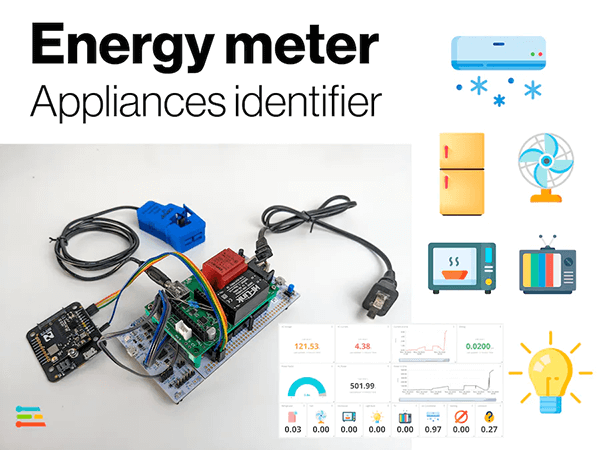
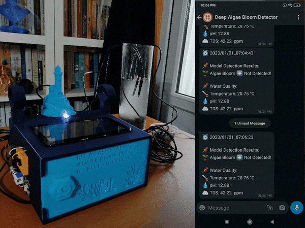
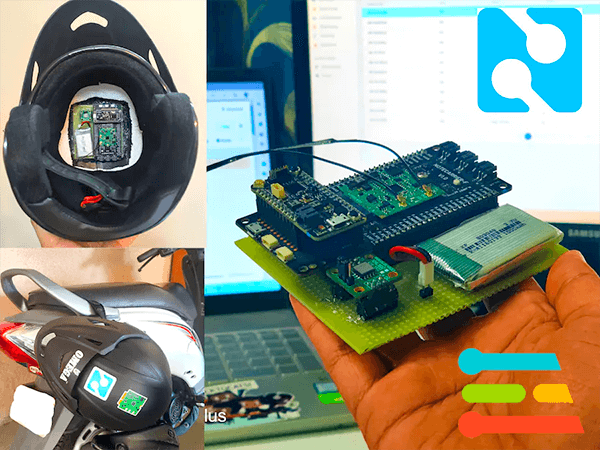
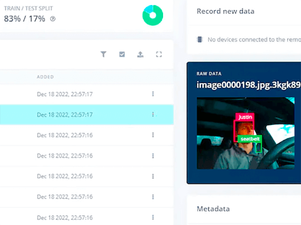
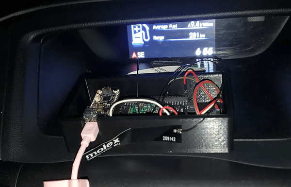

# "Build a Smarter World" Contest Winners

Late last year we announced a new community-driven contest to uncover new and engaging Machine Learning and IoT projects. The idea was straightforward: put together a project that uses combination of ML and cellular IoT on the edge, document it, and share it with the world.

Who could be a better parter with a contest like this than our friends at [Edge Impulse](https://edgeimpulse.com/), the leading developer platform for ML on embedded devices! Enter ["Build a Smarter World"](https://blues.io/contests/smarter-world-edge-impulse/).

Fast forward a few months (and [many Hackster projects](https://www.hackster.io/blues-wireless/projects) later) and I'm proud to announce our contest winners!

> Be sure to check out all of the amazing projects on both the [Blues Wireless](https://www.hackster.io/blues-wireless/projects) and [Edge Impulse](https://www.hackster.io/EdgeImpulse/projects) Hackster pages!

## 🥇 1st Place Overall

[Appliances Identifier Smart Energy Meter](https://www.hackster.io/mcmchris/appliances-identifier-smart-energy-meter-a125f5)

Our pick for the very best project comes from Christopher, who built a project that measures voltage, current, power, power factor, and energy from a variety of devices. Then, after building the ML model with Edge Impulse, the device determines which appliance is connected. Using the Blues Wireless Notecard and Notehub, a cloud-based dashboard is populated (with Ubidots) for monitoring.

## 🥈 2nd Place Overall

[IoT AI-assisted Deep Algae Bloom Detector w/ Blues Wireless](https://www.hackster.io/kutluhan-aktar/iot-ai-assisted-deep-algae-bloom-detector-w-blues-wireless-098343)

A close 2nd place comes from Kutluhan, who took a variety of images of deep algae blooms with a borescope, collected water quality data, trained an ML model with Edge Impulse, and relayed results to the cloud (and WhatsApp) via the Blues Wireless Notecard.

## 🥉 3rd Place Overall

[Smart Helmet powered by Blues Wireless Notecard](https://www.hackster.io/sobhitpanda25/smart-helmet-powered-by-blues-wireless-notecard-b337dc)

3rd place comes from Sobhit and Pratyush, who focused their efforts on safety: specifically by building a "smart" helmet that can determine if a motorcycle/scooter rider was in an accident. Not only that, but it can relay an SMS alert (with GPS location) using the Notecard and Notehub.

Be sure to watch their amazing video content in this project (especially the demonstration of the device in action):

https://www.youtube.com/watch?v=aQkWOZbIgQE

## 🤖 Honorable Mention: Most Creative Use of ML

[Old MacDonald had a FARM, and became a safer driver](https://www.hackster.io/justinelutz/old-macdonald-had-a-farm-and-became-a-safer-driver-a93e30)

Our first honorable mention goes out to what we thought was a very creative use of Machine Learning. Justin built a Machine Learning model that learned how to identify a person, whether or not they are wearing a seatbelt, if they are traveling at a safe speed, if alcohol is detected in the car, and are they driving aggressively (e.g. hard acceleration and/or braking).

## 📶 Honorable Mention: Most Creative Use of Cellular IoT

[Pothole Detection with Blues Wireless and Edge Impulse](https://www.hackster.io/494437/pothole-detection-with-blues-wireless-and-edge-impulse-aa4ecd)

Our other honorable mention is awarded to Michael and Gina for their engaging (and useful!) project that can detect potholes in the street (while driving). Even better, it can report the GPS coordinates of the potholes for future reference and repair.

## 👀 Honorable Mention: Most Views on Hackster

**Coming soon!**

*This award goes out to the project that accumulates the most organic views on Hackster within one month of its publication. Since the project deadline was just last week, we need another couple of weeks to determine this award.*

## Thanks!

A big thanks goes out to everyone who participated in the contest (your Blues Wireless and Edge Impulse swag packs are coming soon!).

For everyone else, stay on top of the latest in IoT news via the [monthly Blues Wireless newsletter](https://blues.io/dev-news/), grab your own [starter kit](https://shop.blues.io/collections/development-kits), and join our [community forum](https://discuss.blues.io/)!
