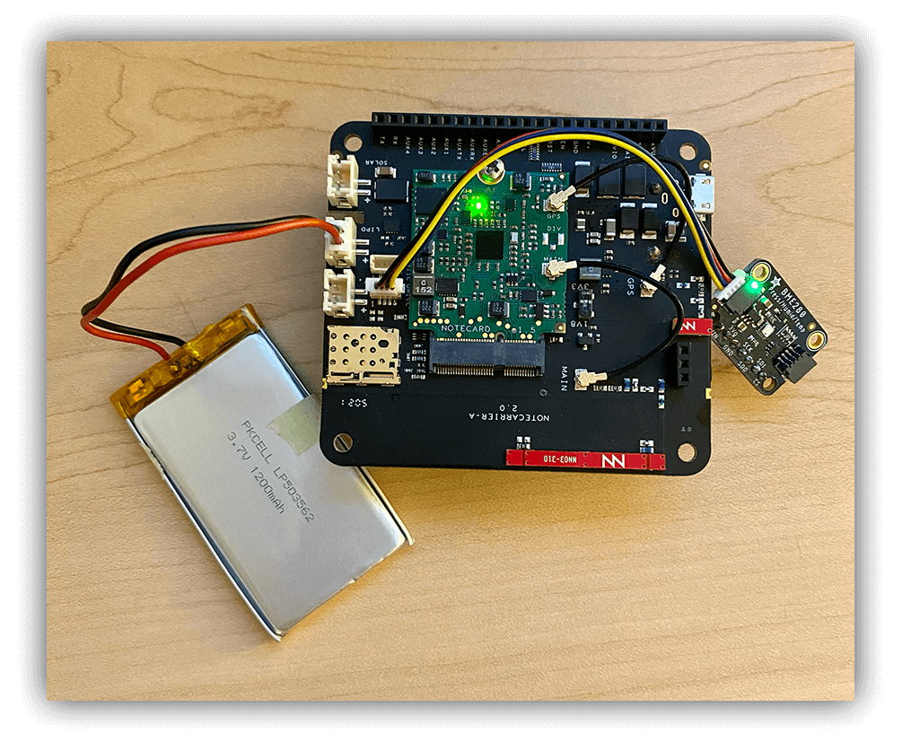

# Remotely Query Sensor Data via SMS

*Learn how to report on remote device data via text message with Twilio and the Blues Notecard.*

They say the "next big thing" for the IoT is Machine Learning, but the "current big thing" is cloud dashboards. Gorgeous visualizations of accumulated data with colorful charts, informative widgets, and live data streams.


*An example dashboard from [Datacake](https://datacake.co/?utm_source=hackster&utm_medium=web&utm_campaign=featured-project&utm_content=blues-sms-sensor-data).*

Do I agree with this? **Absolutely!**

I will, however, suggest that some data-digesting scenarios don't require the full power of a cloud dashboard. Heck, maybe they don't require much of a UI at all.


*Using SMS to retrieve sensor data.*

## Project Summary

Today I'm going to walk you through setting up a simple IoT application that:

1. **Gathers sensor data** (e.g. temp, humidity, pressure, and battery voltage) at a defined interval.
2. **Syncs accumulated sensor data** with a cloud service, using low-power cellular from [Blues](https://blues.io/).
3. **Sends you a data report** in reply to an SMS sent from your phone.

## The (Minimal) Hardware Requirements

I promised you a *simple* IoT application and that starts with a *simple* (but powerful) set of hardware.

Let's begin with the carrier board - that being the [Notecarrier A from Blues](https://blues.io/products/notecarrier/notecarrier-a/?utm_source=hackster&utm_medium=web&utm_campaign=featured-project&utm_content=blues-sms-sensor-data). This is a host board for the [Notecard](https://blues.io/products/notecard/?utm_source=hackster&utm_medium=web&utm_campaign=featured-project&utm_content=blues-sms-sensor-data) (a Cellular IoT system-on-module), which includes on-board cellular and GPS antennas, two Qwiic ports for connecting I2C peripherals, and header pins for hooking up to a host MCU.


*Blues Notecarrier A.*

To gather environmental data with a relatively inexpensive sensor, we are going to use an [Adafruit BME280 sensor with Qwiic](https://www.adafruit.com/product/2652?utm_source=hackster&utm_medium=web&utm_campaign=featured-project&utm_content=blues-sms-sensor-data). The BME280 returns reliable temperature, pressure, and humidity readings.


*Adafruit BME280 with a Qwiic cable.*

Finally, to add connectivity to this project, we are using the aforementioned Blues Notecard ([see the NBGL Notecard datasheet](https://dev.blues.io/datasheets/notecard-datasheet/note-nbgl-500/?utm_source=hackster&utm_medium=web&utm_campaign=featured-project&utm_content=blues-sms-sensor-data)). The Notecard is a prepaid cellular module that provides 500MB of data and 10 years of global service for a one-time fee starting at \$49 (no monthly SIM fees or subscriptions required).


*The NBGL Notecard from Blues.*

The assembled project hardware should look something like the following picture, with LiPo battery and a Micro USB cable attached to the Notecarrier allowing us to communicate with the Notecard via the [REPL provided at dev.blues.io](https://dev.blues.io/notecard-playground/?utm_source=hackster&utm_medium=web&utm_campaign=featured-project&utm_content=blues-sms-sensor-data).



*Notecarrier + Notecard + BME280.*

## The Host Microcontroller

What about the host microcontroller needed to handle the application logic...? And gathering data from the sensor...? And sending that data to the Notecard...?

Sorry to disappoint you, but there is **no host MCU used with this project!**

All of the application logic is accomplished using the [APIs provided by Blues](https://dev.blues.io/api-reference/?utm_source=hackster&utm_medium=web&utm_campaign=featured-project&utm_content=blues-sms-sensor-data). Let's dive into some of those and see how Cellular IoT with Blues actually works.

## Cellular IoT with Blues

To continue the thread of *simplicity*, I'd like to introduce you to Cellular IoT with Blues.


*The Blues Notecard.*

Aside from the **prepaid data** and **global connectivity** (LTE Cat-1, LTE-M, and NB-IoT are all supported), the Notecard is hyper-focused on:

1. **Developer Experience** - While the Notecard is a cellular device, you don't have to program the modem with AT commands.
2. **Low-Power** - The hardware components and firmware defaults are low-power by default (idling at ~8uA).
3. **Security** - Data is transferred via private VPN tunnels and can optionally be encrypted.

Speaking of developer experience, the [Notecard speaks JSON](https://dev.blues.io/api-reference/notecard-api/introduction/?utm_source=hackster&utm_medium=web&utm_campaign=featured-project&utm_content=blues-sms-sensor-data). For instance, if you wanted to ascertain the last known location of the Notecard, you'd use the [card.location API](https://dev.blues.io/api-reference/notecard-api/card-requests/?utm_source=hackster&utm_medium=web&utm_campaign=featured-project&utm_content=blues-sms-sensor-data#card-location):

```
// Request
{ "req": "card.location" }

// Response
{
  "status": "GPS updated (58 sec, 41dB SNR, 9 sats),
  "mode":   "periodic",
  "lat":    42.577600,
  "lon":    -70.871340,
  "time":   1598554399
}
```

### Communicating with the Cloud via Notecard and Notehub

The Notecard communicates with the cloud "off the public Internet", using the [Blues cloud service Notehub](https://blues.io/products/notehub/?utm_source=hackster&utm_medium=web&utm_campaign=featured-project&utm_content=blues-sms-sensor-data) as a secure proxy.


*Blues Notehub dashboard.*

Notehub is _also_ key to this project (and free to use for most applications). Aside from acting as a secure proxy for receiving data from Notecard, it enables cloud connectivity with providers like Twilio, [among many others](https://dev.blues.io/notehub/notehub-walkthrough/?utm_source=hackster&utm_medium=web&utm_campaign=featured-project&utm_content=blues-sms-sensor-data#routing-data-with-notehub) via an extensive routing system.

## Configuring the Notecard and Notehub

If we don't have a host MCU to program our application logic, how do we build out the rest of this project?

The [Notecard API](https://dev.blues.io/api-reference/notecard-api/introduction/?utm_source=hackster&utm_medium=web&utm_campaign=featured-project&utm_content=blues-sms-sensor-data) enables a multitude of capabilities that let you program complicated scenarios without using a host MCU.

Assuming your Notecard + Notecarrier + Sensor are fully assembled - and you can communicate with the Notecard via USB (see the [Blues quickstart](https://dev.blues.io/quickstart/notecard-quickstart/notecard-and-notecarrier-a/) for help!) - let's configure this application.

> **NOTE:** If you previously used this Notecard with a different application, I recommend performing a full reset on it with the `card.restore` API: `{"req":"card.restore", "delete":true}`.

### Set up a Notehub Project

While the Notecard knows where to go when it's powered-on (it automatically knows to use a private APN to communicate with Notehub), it does need you to tell it which Notehub project it should use.

Head to [notehub.io](ttps://notehub.io/?utm_source=hackster&utm_medium=web&utm_campaign=featured-project&utm_content=blues-sms-sensor-data) and set up a new project (again, Notehub is free to use for most projects). You'll need to copy the `ProductUID`, which is a globally-unique identifier for your project:


*Get the unique ProductUID from your Notehub project.*

Now, let's program the Notecard!

### Associate the Notecard with Your Notehub Project

By using the `hub.set` API, you can tell the Notecard that it should sync any pending data (known as [Notes](https://dev.blues.io/api-reference/glossary/?utm_source=hackster&utm_medium=web&utm_campaign=featured-project&utm_content=blues-sms-sensor-data#note)) to your Notehub project on a regular interval. In this case, you're telling it to sync every 15 minutes:

```
{
   "req": "hub.set",
   "product": "<your-product-uid>",
   "mode": "periodic",
   "outbound": 15
}
```

Again, you can send this JSON request to your Notecard using the [REPL provided at dev.blues.io](https://dev.blues.io/notecard-playground/?utm_source=hackster&utm_medium=web&utm_campaign=featured-project&utm_content=blues-sms-sensor-data).

### Place the Notecard in "AUX Track Mode"

The Notecard's [AUX track mode](https://dev.blues.io/notecard/notecard-walkthrough/advanced-notecard-configuration/?utm_source=hackster&utm_medium=web&utm_campaign=featured-project&utm_content=blues-sms-sensor-data#using-aux-track-mode) allows you to supplement sensor readings from the Notecard with temperature, pressure, and humidity readings from a BME280 sensor wired to the AUX pins.

Send this request to configure AUX track mode on the Notecard:

```
{
  "req": "card.aux",
  "mode": "track"
}
```

### Gather Sensor Data on the Notecard

Using an optional parameter of the [card.temp API](https://dev.blues.io/api-reference/notecard-api/card-requests/?utm_source=hackster&utm_medium=web&utm_campaign=featured-project&utm_content=blues-sms-sensor-data#card-temp) (which is normally used to retrieve the temperature from the Notecard's onboard temperature sensor), we can tell the Notecard to gather sensor values at the specified `seconds` interval (which automatically uses the BME280 sensor due to the `card.aux` call above).

Send this request to the Notecard:

```
{
   "req": "card.temp",
   "seconds": 600
}
```

## Viewing Accumulated Sensor Data in Notehub

With those three API requests sent to your Notecard, your solution should start saving sensor data every 600 seconds (the `card.temp` request above) and then syncing that data with Notehub every 15 minutes (the `outbound` parameter of the `hub.set` request above).

Each reading of sensor data will appear in Notehub like so:


But it's not all that useful to see the data in Notehub. Remember, our end result is to **access this data via SMS!** Luckily, using a combination of **Twilio Functions and the Notehub API**, this is a surprisingly simple endeavor.

## Accessing Sensor Data via SMS

### Using the Notehub API

Let's start with the [Notehub API](https://dev.blues.io/api-reference/notehub-api/api-introduction/?utm_source=hackster&utm_medium=web&utm_campaign=featured-project&utm_content=blues-sms-sensor-data), because we need a means to programmatically pull the most recent set of sensor data sent by our device.

The Event API includes the [Get Events by Project](https://dev.blues.io/api-reference/notehub-api/event-api/?utm_source=hackster&utm_medium=web&utm_campaign=featured-project&utm_content=blues-sms-sensor-data#get-events-by-project) endpoint. This API call requires two arguments:

1. The [ProjectUID](https://dev.blues.io/api-reference/glossary/?utm_source=hackster&utm_medium=web&utm_campaign=featured-project&utm_content=blues-sms-sensor-data#projectuid) of your Notehub project (NOT to be mistaken with the `ProductUID` used above!).
2. The name of the Note (i.e. the event) that is sent to Notehub. In our case this is `_temp.qo`.

*Resulting in the following URL:*

```
https://api.notefile.net/v1/projects/<your-project-uid>/events?&sortBy=captured&sortOrder=desc&files=_temp.qo
```

Sorting by `captured` in `desc` order assures us that the most recently-captured sensor data will be the first in the list of events returned (with additional meta data about the event):

```
{
   "events":[
      {
         "event":"d88acdc6-dae0-4275-b53b-b5b2b7636759",
         "session":"5c0a9b77-7aa6-4ddc-9335-c533b47565f1",
         "best_id":"dev:864475044220000",
         "device":"dev:864475044220000",
         "product":"product:com.blues.your-product-uid",
         "app":"app:1ed79a67-39e1-4943-9527-ef3sr258eeee",
         "received":1687376930.459287,
         "req":"note.add",
         "file":"_temp.qo",
         "body":{
            "count":1,
            "humidity":44.362686,
            "pressure":98819.734,
            "temperature":25.769419,
            "voltage":3.8789062
         },
         "best_location_type":"tower",
         "best_location_when":1687376924,
         "best_lat":43.0738875,
         "best_lon":-89.44357812499999,
         "best_location":"Shorewood Hills WI",
         "best_country":"US",
         "best_timezone":"America/Chicago",
         "tower_when":1687376924,
         "tower_lat":43.0738875,
         "tower_lon":-89.44357812499999,
         "tower_country":"US",
         "tower_location":"Shorewood Hills WI",
         "tower_timezone":"America/Chicago",
         "tower_id":"310,410,17169,77315601",
         "fleets":[
            "fleet:0a930fe2-b947-4c2f-9623-df1504f83729"
         ]
      },
      ...
```

> **NOTE**: Be sure to [consult the Notehub API docs](https://dev.blues.io/api-reference/notehub-api/api-introduction/?utm_source=hackster&utm_medium=web&utm_campaign=featured-project&utm_content=blues-sms-sensor-data) to learn how to authenticate your API requests.

### Using a Twilio Function

Now that we can programmatically pull event data from Notehub on demand, we need to use [Twilio](https://www.twilio.com/) to call the Notehub API and send an SMS. To do that, we are going to use a [Twilio Function](https://www.twilio.com/docs/serverless/functions-assets/functions).


*Twilio Function diagram. Image source [Twilio](https://www.twilio.com/docs/serverless/functions-assets/functions).*

If you haven't already, [sign up for a Twilio account](https://www.twilio.com/try-twilio). Then head to your Twilio Console, specifically to the [Services](https://console.twilio.com/us1/develop/functions/services) section of Functions and Assets.

Create a new **Service** (name it whatever you like). In the **Service**, create a new **Function** (which is essentially just an endpoint, and can also be named arbitrarily).


*My Twilio Function, with important sections highlighted for reference below.*

This function is a serverless function written in JavaScript (every embedded developer's favorite language I know 😜).

Here is the complete Node.js (JavaScript) function I used, with some inline comments to explain what is happening at each step:

```
const axios = require('axios');

exports.handler = async (context, event, callback) => {
  
  // Create a new messaging response object
  const twiml = new Twilio.twiml.MessagingResponse();

  // Access the incoming text content from `event.Body`
  // (this is the inbound SMS message)
  const incomingMessage = event.Body.toLowerCase();

  // if the incoming SMS includes the word "report", 
  // use the Notehub API to pull event data from Notehub
  if (incomingMessage.includes('report')) {

    try {
      const notehub_token = '<your-Notehub-token>';
      const url = "https://api.notefile.net/v1/projects/<your-project-uid>/events?&sortBy=captured&sortOrder=desc&files=_temp.qo";

      const response = await axios.get(url, {
        headers: {
          'Authorization': `Bearer ${notehub_token}`
        }
      })

      // pull out the temp, humidity, pressure, voltage values 
      // from the Notecard event
      const body = response.data.events[0].body;
      const temperature = body.temperature;
      const humidity = body.humidity;
      const pressure = body.pressure;
      const voltage = body.voltage;

	   // send the SMS response back to the sender!
      twiml.message('Temp: ' + temperature + '\nHumidity: ' + humidity + '\nPressure: ' + pressure + '\nVoltage: ' + voltage );

      return callback(null, twiml);
    } catch (error) {
      // In the event of an error, return a 500 error and the error message
      console.error(error);
      return callback(error);
    }
  } else if (incomingMessage.includes('test')) {
    // great for testing a simple response!
    twiml.message('Hello there!');
  } else {
    // undefined incoming message
    twiml.message('Not sure what you meant!?!');
  }

  return callback(null, twiml);
};
```

> **NOTE:** Before deploying, you will need to update your **Dependencies** under **Settings** and import the `axios` package.

When your Twilio Function is ready to publish, click the **Deploy All** button to deploy your function.

Finally, send an SMS with the word `report` to your Twilio phone number, and wait for the magic to happen 🪄:


*Notecard event data...via SMS!*

**Having trouble?** Be sure to check your Notehub project's list of Events to make sure data is being sent successfully from your Notecard to the cloud. Also, utilize the "live logs" feature of the Twilio console to debug any issues with your Twilio Function

## Next Step: Real-Time Data

What if you wanted to get **real-time data from a Notecard** in this same scenario, instead of the most recent event published to Notehub? That's also possible, but you would need to add a host MCU to the equation. You can use the same workflow, but instead of *pulling* data out of Notehub, you would [send an inbound request](https://dev.blues.io/notecard/notecard-walkthrough/inbound-requests-and-shared-data/?utm_source=hackster&utm_medium=web&utm_campaign=featured-project&utm_content=blues-sms-sensor-data) to the Notecard, telling the host MCU to gather sensor data and [send that in an SMS with Twilio](https://dev.blues.io/guides-and-tutorials/twilio-sms-guide/). 👍

Reach out on the [Blues community forum](https://discuss.blues.io/?utm_source=hackster&utm_medium=web&utm_campaign=featured-project&utm_content=blues-sms-sensor-data) if you have any questions or would like to learn more.

## Conclusion

Hopefully you've seen how easy it can be to create a simple reporting system that uses SMS to report on sensor data from the cloud.

This combination of the **Notehub API** and **Twilio Functions** allows you to customize your server-side logic and effectively retrieve any data from any device (or even from fleets of devices as you scale). Imagine sending an SMS like `report gas device-123` which would be parsed inside a Twilio Function to return specific data (e.g. gas readings) from a specific device (e.g. one with an ID of `device-123`). The options are really are endless.

Ready to go? Grab your own [Blues Starter Kit](https://shop.blues.io/collections/blues-starter-kits?utm_source=hackster&utm_medium=web&utm_campaign=featured-project&utm_content=blues-sms-sensor-data)...and happy hacking! 🧑‍💻