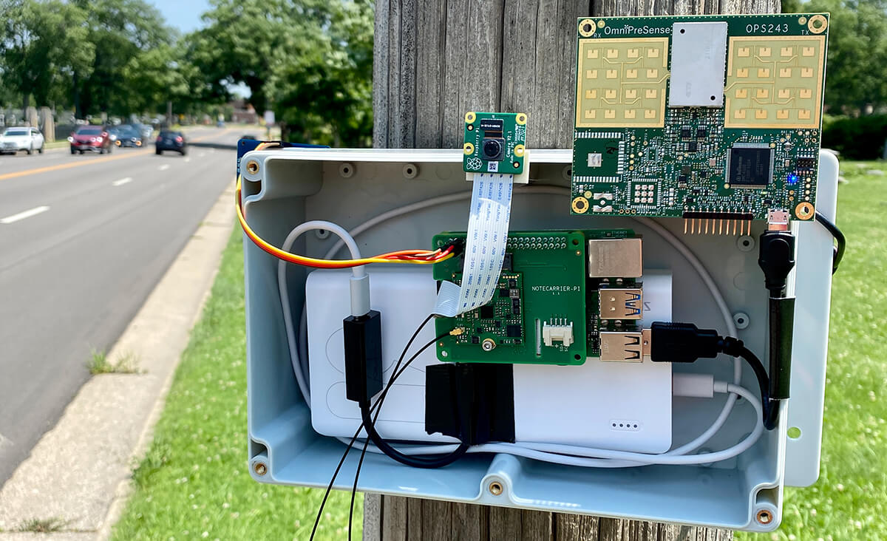

# Busted! Create an ML-Powered Speed Trap

tags: python, ml, cellular, iot

One relatively positive side effect of living through a global pandemic has been filling the void with family walks.

Yep, we actually had to interact with each other.

One thing I started to notice, though, was the reckless driving on some neighborhood streets. With others in similar situations, walking around and crossing busy intersections, I thought it would be cool to stop *assuming* reckless driving behaviors and start *measuring the frequency of speeding* along some nearby roads.

So I did something about it!

https://youtu.be/IpvHeAGUA7I

I built a portable "speed trap" that uses a machine learning model from [Edge Impulse](https://www.edgeimpulse.com/) to identify vehicles, a [doppler radar sensor](https://omnipresense.com/product/ops243-doppler-radar-sensor/) to measure speed, and a [cellular module](https://blues.io/?utm_source=devto&utm_medium=web&utm_campaign=featured-project&utm_content=speedtrap) to report data to the cloud.

**Ready? View the complete tutorial over at [hackster.io](NEED LINK)!**