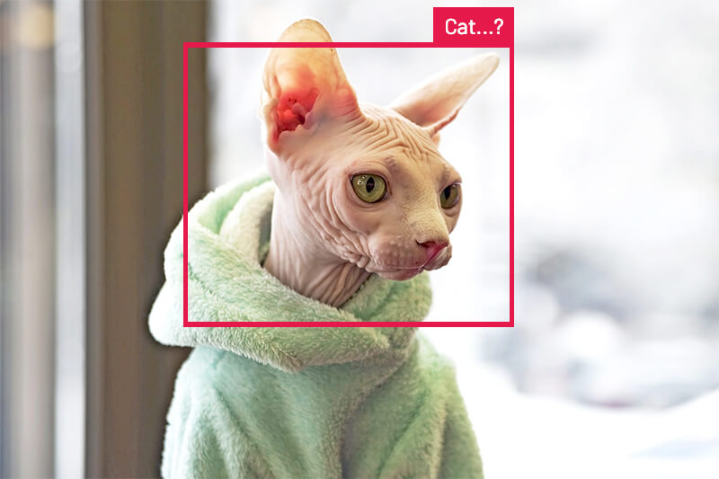

# Busted! Create an ML-Powered Speed Trap

For my family, one of the positive side effects of living through a global pandemic was coming up with activities to fill the void normally occupied by soccer practices and Girl Scout meetings.

Yep, we actually had to interact with each other.

So we focused on walking. A lot. We made up arbitrary journeys like dropping the car off for maintenance and trekking home across town (a journey made longer with whining kids through neighborhoods I had never visited before).

Thus, to the chagrin of my kids, began our regiment of family neighborhood walks. What my kids affectionately refer to as "death marches".


*I assure you this walk is WAY LONGER than 2 hours 18 minutes with kids!* 😅

One thing I started to notice, though, was the reckless driving on some neighborhood streets. With hoards of people in similar situations, walking around and crossing busy intersections, I thought it would be cool to stop *assuming* reckless driving behaviors and start *measuring the frequency of speeding* along some nearby roads.

So I did something about it!

This tutorial covers building a portable "speed trap" that uses **machine learning** to identify vehicles, a **doppler radar sensor** to measure speed, and a **cellular module** to report data to the cloud.

I wasn't aiming to identify individual cars or capture license plate numbers, but rather to aggregate data that could be used by the city for planning traffic mitigation efforts.

*See a quick preview of the project in this video:*

https://youtu.be/IpvHeAGUA7I

## Assembly of a Speed Trap

When starting a new project, I loosely follow Alec Baldwin's advice from his infamous scene in Glengarry Glen Ross:


ALWAYS. BE. CLOSING. Or...actually a test of sorts that any hardware or service component must pass:

- **A**ge: Am I working with mature and reliable technology?
- **B**asic: Are the APIs and code samples easy to use?
- **C**ost: Is the component reasonably priced?

Let's take a brief look at the hardware components of this build:

### Raspberry Pi 4 and PiCamera

I've created a [few Raspberry Pi projects recently](https://www.hackster.io/rob-lauer/projects), so I was set on moving to a low-power MCU for this project. However, Edge Impulse (which we'll get to in a bit) recently [announced object detection support for the Raspberry Pi 4](https://www.edgeimpulse.com/blog/ei-extends-the-edge-to-embedded-linux-with-official-support-for-raspberry-pi-4), which swayed me back into the RPi camp.

To identify vehicles, of course I'd a camera! The [PiCamera Module v2](https://www.raspberrypi.org/products/camera-module-v2/) was an obvious choice due to its quality, the compatible camera module port on the RPi, and an easy to use API.

### Radar Sensor

I was pleased to stumble upon the [OPS243-A Doppler Radar Sensor](https://omnipresense.com/product/ops243-doppler-radar-sensor/) from OmniPreSense as a solution for determining the speed of detected vehicles.


This $249 device has been around for years, provides a serial interface, and a mature API for accessing speed data up to ~150mph.

### Simple Display

Since the Raspberry Pi would be running in a "headless" state, I wanted to have some active feedback while it's working. I chose to use a simple [seven-segment display](https://www.adafruit.com/product/879) to report on inference results and gathered speed data.

### Cellular Data (and Power!)

When making an IoT project portable, there are two main considerations:

1. How are you gonna power this thing?
2. How are you gonna get the data off of it?

To solve the power issue, I used a 30,000 mAh USB-C battery pack. On another project I was able to get [41 hours of unoptimized run time](https://www.hackster.io/rob-lauer/optimizing-a-raspberry-pi-for-off-grid-power-consumption-22cec6) out of a Raspberry Pi with this power bank, which is ideal for this project.

To solve the data issue, I went with the [Blues Wireless Notecard](https://blues.io/?utm_source=hackster&utm_medium=web&utm_campaign=featured-project&utm_content=speedtrap). The Notecard (and its companion Notecarrier-Pi HAT) provide not only cellular data access but also integration with the Blues Wireless cloud service, Notehub.io, to securely relay collected data to my cloud application for reporting purposes.


### Putting it All Together

With all of the puzzle pieces in-hand, I was ready to start my build. Thankfully, even though there are a fair number of pieces, most everything was plug-and-play. 

*For instance:*

- The OPS243 module connects to the RPi via USB.
- The PiCamera connects to the dedicated RPi camera module port.
- The Notecarrier-Pi HAT connects via the provided 40-pin header.

The only exception was the seven-segment display, which I connected to the pass-through headers on the Notecarrier-Pi HAT:


*Image credit [RaspberryPi.org](https://www.raspberrypi.org/documentation/usage/gpio/).*

I powered the seven-segment display via the 3.3v pin, attached ground to ground, and GPIOs 2 and 3 on the RPi to the SDA and SCL pins respectively on the display.

My pre-production testing build ended up looking like this mess of spaghetti hardware:


## Machine Learning on the Edge

Yes, I could've dramatically simplified this project by simply capturing the speed of *whatever* object was registered by the OPS243 module. But then I'd have birds, bikes, annoying kids, and joggers polluting my data set.

What better use of machine learning to identify vehicles before tracking speed? And what better time to learn more about the up-and-coming ML platform, [Edge Impulse](https://www.edgeimpulse.com/)!

Here's an overview of how I tackled machine learning using Edge Impulse:

### Garbage In, Garbage Out

If I know anything about machine learning, it's that your results are only going to be as good as the model you provide.

For instance, if you expect a neural network to be able to identify *any* cat after supplying it a couple images of a hairless Sphynx, you're gonna have a bad time.



Therefore, step zero of creating an image-based ML model is making sure you have an appropriate selection of images with which to train the model.

Since I was trying to identify vehicles driving on the road, I started by downloading ~100 generic photos of cars, trucks, vans, and bikes on the road. I then spent an hour taking some "real world" photos that mimic what my Raspberry Pi was going to have to process.

For example: 😬


### Edge Impulse FTW

Edge Impulse enables developers of all types to utilize machine learning on low-power edge computing devices, without being an expert in ML.

For my purpose, I needed Edge Impulse to identify one or more objects in a given frame (I actually simplified vehicles down to "car" and "bike"). This is known as "object detection" and is a very common ML use case.

To get started with Edge Impulse, I created a free account and was directed to create my first project in Edge Impulse Studio.

I set up a new project by choosing a project type of **Images** and then **Classify multiple objects** (since any single frame of video could contain one or more vehicles):


Next, I uploaded all of my vehicle images in the **Data Acquisition** tab. By default, Edge Impulse automatically segments these into training images vs testing images (it's important to allocate enough images to test your model).

Finally, I navigated to the **Labeling Queue** to assign a label to each object in each image I uploaded. (See the police vehicle image above for an example.)

The rest of the Edge Impulse Studio work was just point-and-click! In fact, instead of me droning on about it, you're better served by following the instructions provided in this video tutorial from Edge Impulse:

https://youtu.be/dY3OSiJyne0

When all was said and done, the model achieved an 87% accuracy score. Satisfactory for my use case and amazing considering I only supplied about 150 images to train the model.


### Using the Edge Impulse Model

With the construction of the Edge Impulse ML model complete, it was time to deploy the model to the Raspberry Pi.

> **NOTE:** Edge Impulse explicitly states support only for the Raspberry Pi 4. Your mileage may vary if you try this on an older RPi model!

First, I [installed Edge Impulse for Linux](https://docs.edgeimpulse.com/docs/raspberry-pi-4) on the RPi with the following commands:

```
curl -sL https://deb.nodesource.com/setup_12.x | sudo bash -
sudo apt install -y gcc g++ make build-essential nodejs sox gstreamer1.0-tools gstreamer1.0-plugins-good gstreamer1.0-plugins-base gstreamer1.0-plugins-base-apps
npm config set user root && sudo npm install edge-impulse-linux -g --unsafe-perm
```

To verify the installation was successful, I ran the `edge-impulse-linux` command to log in to Edge Impulse and register my RPi as a device.

Next, I needed the [Edge Impulse Linux Python SDK](https://docs.edgeimpulse.com/docs/linux-python-sdk) installed:

```
sudo apt-get install libatlas-base-dev libportaudio0 libportaudio2 libportaudiocpp0 portaudio19-dev
pip3 install edge_impulse_linux -i https://pypi.python.org/simple
```

With Edge Impulse dependencies installed (drumroll please...🥁) I downloaded my model file using this command:

```
edge-impulse-linux-runner --download model.eim
```

## All the Python Codez

With my hardware assembled and ML model in place, it was time to write some Python!

> **NOTE:** If you want to skip the play-by-play, you can find the [completed Python project on GitHub](https://github.com/rdlauer/pispeedtrap).

I decided to segment my Python code into five discreet tasks:

1. Use the Edge Impulse ML model to identify a vehicle;
2. Immediately measure that vehicle's speed;
3. Display the speed on the seven-segment display;
4. Send the event over cellular to the cloud;
5. Create a cloud-based dashboard for reporting.

Let's see how these problems were solved.

### 1. Edge Impulse with Python

With the Edge Impulse Python SDK installed, utilizing the ML model couldn't have been much easier. By [borrowing sample Python code](https://github.com/edgeimpulse/linux-sdk-python/blob/master/examples/image/classify.py) provided by the Edge Impulse team, I was able to piece together a solution that took video frames and output an inference result.

During testing it become fun to watch the processing, as it was taking < 400ms to run each inference!

```
Found 0 bounding boxes (383 ms.)
Found 0 bounding boxes (385 ms.)
Found 1 bounding boxes (384 ms.)
```

When a match was found, the Edge Impulse APIs returned a variety of data elements, but the only ones I cared about were `label` and `value` which tell me the type of vehicle (i.e. car vs bike) and the % confidence of the match.

```
Found 1 bounding boxes (377 ms.)
what is it? car - and how confident? 64
```

In my case, I was willing to bet that a confidence level >= 60% was enough to continue on to the next step.

### 2. Check the Speed

At this point my program could be reasonably confident it was looking at a vehicle, so it was now time to check the speed from the OPS243 doppler radar module. I refactored some [sample Python code](https://github.com/omnipresense/OPS241A_RasPiLCD/blob/master/speed.py) provided by the OmniPreSense team to gather the speed reported by the OPS243 module:

```
def ops_get_speed():
    """
    capture speed reading from OPS module
    """
    while True:
        speed_available = False
        Ops_rx_bytes = ser.readline()
        Ops_rx_bytes_length = len(Ops_rx_bytes)
        if Ops_rx_bytes_length != 0:
            Ops_rx_str = str(Ops_rx_bytes)
            if Ops_rx_str.find('{') == -1:
                try:
                    Ops_rx_float = float(Ops_rx_bytes)
                    speed_available = True
                except ValueError:
                    print("Unable to convert to a number the string: " + Ops_rx_str)
                    speed_available = False

        if speed_available == True:
            speed_rnd = round(Ops_rx_float)
            return float(speed_rnd)
```

This code simply reports back the latest reading, which should correlate almost perfectly timing-wise with the vehicle identified by the ML model.

In order to determine whether or not the vehicle is speeding, I wanted to be able to programmatically set the speed limit for whatever street I was on. To do this, I used the [environment variables](https://dev.blues.io/notecard/notecard-guides/understanding-environment-variables/?utm_source=hackster&utm_medium=web&utm_campaign=featured-project&utm_content=speedtrap) capability of Notehub.io to sync data from the server, to my Notecard.

This allowed me to adjust speed limits on the fly using only a web browser:


These variables can be set on a device, project, or fleet basis.

### 3. Display the Speed

Since this was a headless RPi, I got a little nervous that my Pi might be locked up and not actually *doing* anything. However, by using a simple seven-segment display I could at least verify that my program was running, by displaying a speed whenever a car drove by.

Using the [HT16K33 library](https://circuitpython.readthedocs.io/projects/ht16k33/en/latest/) provided by Adafruit, it was only a couple lines of code to initialize the display:

```
disp_i2c = busio.I2C(board.SCL, board.SDA)
display = segments.Seg7x4(disp_i2c)
```

Then, printing numbers to the display simply meant clearing out the previous values and filling in the new numbers:

```
display.fill(0)
display.print(speed)
```

### 4. Cellular to the Cloud

The final coding step was to take these accumulated data elements and package them up for secure delivery over cellular to my cloud application.

The [Notecard from Blues Wireless](https://blues.io/?utm_source=hackster&utm_medium=web&utm_campaign=featured-project&utm_content=speedtrap) made this exceptionally simple. As a pre-paid cellular module with global service and an easy "JSON-in, JSON-out" API, the Notecard makes cellular accessible to all developers.

For instance, here is an example of sending a speeding "event" with Python from the Notecard to the Blues Wireless service, Notehub.io:

```
rsp = note.add(nCard,
               file="speed.qo",
               body={
                   "timestamp": timestamp,
                   "confidence": confidence,
                   "lat": lat,
                   "lng": lon,
                   "speed": current_speed,
                   "speed_limit": speed_limit,
                   "is_speeding": is_speeding
               })
```

Notehub.io then allows you to **securely relay data** to your cloud application of choice. Whether you're invested in AWS, Azure, Google Cloud or one of the myriad cloud IoT platforms, Notehub.io provides [integration options](https://dev.blues.io/get-started/tutorials/route-tutorial/azure/?utm_source=hackster&utm_medium=web&utm_campaign=featured-project&utm_content=speedtrap).

To initialize the Notecard, I issued a few commands (which associate it with my project created on Notehub.io):

```
# initialize the Blues Wireless Notecard (blues.io)
productUID = keys.PRODUCT_UID
port = I2C("/dev/i2c-1")
nCard = notecard.OpenI2C(port, 0, 0)

# associate Notecard with a project on Notehub.io
rsp = hub.set(nCard,
              product=productUID,
              mode="periodic",
              outbound=10,
              inbound=10)
```

Then, anytime I want to send a captured event (known as a "Note" in the Blues Wireless world) to Notehub.io, I use the fluent API provided by the [note-python library](https://github.com/blues/note-python) to issue the `note.add` command displayed above.

> **NOTE:** Again, you can find the [entire Python project on GitHub](https://github.com/rdlauer/pispeedtrap).

### 5. Cloud-based Reporting

With data being sent from my Raspberry Pi over cellular to Notehub.io, the next step was to securely sync this data with my cloud application.

For this project I chose [Ubidots](https://ubidots.com/), as it's a great platform for visualizing IoT data in a point-and-click manner.


While following the [Blues Wireless Ubidots routing tutorial](https://dev.blues.io/get-started/tutorials/route-tutorial/ubidots/?utm_source=hackster&utm_medium=web&utm_campaign=featured-project&utm_content=speedtrap), I configured a Notehub.io route to deliver data to Ubidots.

> **NOTE:** Blues Wireless offers [numerous routing tutorials](https://dev.blues.io/get-started/tutorials/route-tutorial/?utm_source=hackster&utm_medium=web&utm_campaign=featured-project&utm_content=speedtrap) for other cloud IoT platforms as well.

Within Ubidots, I used their straightforward UI to add numerous widgets to a single dashboard report.

## Deployment

- Hardware assembled? ✅
- ML model in place? ✅
- Python code written? ✅
- Test data syncing with my cloud? ✅

Time for the big deployment!

I took some time to clean up my hardware assembly to make deployment *slightly* more beautiful:


*No, I won't be commercializing this solution any time soon!* 😃

I then deployed the device on some neighborhood streets that I've personally felt have drivers who are a little too aggressive.

And the results? I found what I expected: a significant percentage of speeding cars mere feet from where pedestrians frequent.

*Notably:*

- 50% of cars were speeding (I calculated "speeding" as >= 5 mph over the speed limit).
- The max speed was recorded as 54 mph in a 30 mph zone. Yikes.
- The average car was actually speeding at 35.45 mph.


## Conclusion (plus Tips-and-Tricks)

**Overall? Success!** Thanks to the ease of use of Edge Impulse, Ubidots, and the Notecard, I had very few issues setting up and deploying this project.

A few tips-and-tricks that anyone trying to replicate this project should consider:

1. Optimize your ML model by providing it as many real world images as possible.
2. If running a Raspberry Pi "off-grid" make sure you [optimize the power usage](https://blues.io/blog/tips-tricks-optimizing-raspberry-pi-power/?utm_source=hackster&utm_medium=web&utm_campaign=featured-project&utm_content=speedtrap).
3. Test, test, test! The position of the camera relative to the road/vehicles is critical.

*Looking for some next steps?*

- Learn more about how the [Notecard is making cellular IoT accessible for developers](https://blues.io/products/?utm_source=hackster&utm_medium=web&utm_campaign=featured-project&utm_content=speedtrap).
- Try out machine learning on your edge devices with [Edge Impulse](https://www.edgeimpulse.com/).

And if you're a crazy driver, watch out for this device on a street near you! 🚔

