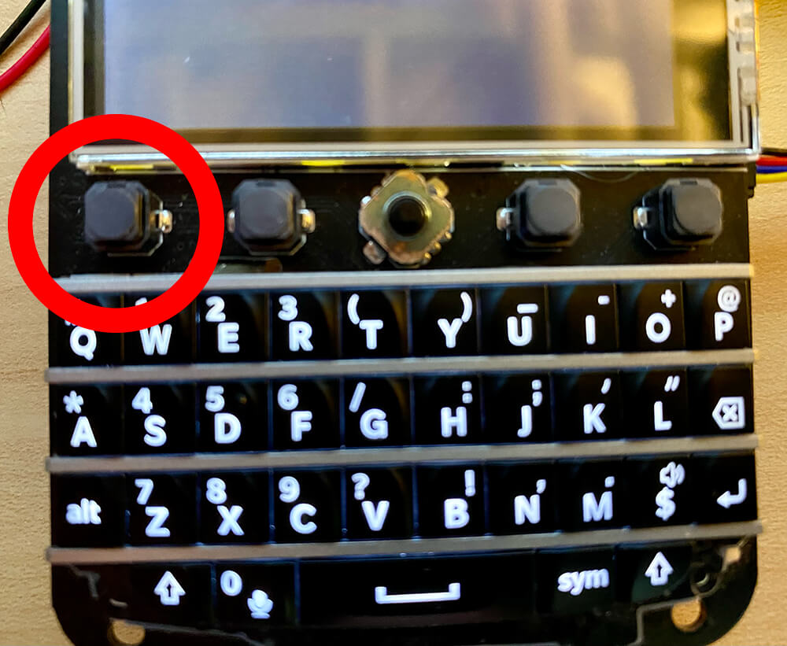

# Two-Way Satellite Messaging with Blues Starnote

If you're anything like me, you probably assume that wireless connectivity for embedded devices starts and ends with Wi-Fi. Maybe cellular if you get ambitious. But satellite? No way. The hardware costs and monthly minimums alone are too expensive, not to mention the ridiculous per/KB data fees.

That's definitely what I thought, at least until the [Blues Starnote](https://shop.blues.com/products/starnote) came around.


Starnote is a failover satellite communication device that works with the well-known [Blues Notecards](https://shop.blues.com/collections/notecard). "Failover" meaning you start by using a Blues Notecard with cellular or Wi-Fi and if you lose connectivity, the Notecard will _automatically_ failover to using Starnote for satellite comms. 🤯

And yes it is just as easy as that.

In this project, I'm going to show off how to get started with the Blues Starnote and use it as a remote messaging platform by both sending and receiving SMS messages using cloud services from Blues and Twilio.

Here's a short functional demo of what I'm about to show off:

TODO: VIDEO DEMO

## Blues Starnote Background

As previously mentioned, Starnote works _alongside_ an existing Notecard. It has to be paired with a Notecard because you program the Notecard to help it determine when and how to use the Starnote. Effectively you rely on the Notecard to figure out the best time to use satellite data.


Blues has architected the Notecard/Starnote combination this way to help you be **extremely conservative about data usage over satellite** (because yeah, Blues makes it less expensive, but that doesn't mean it's cheap!).

That all being said, Starnote is still a cost-effective satellite option because:

1. There are no monthly minimum costs or per-device fees.
1. Starnote ships with 18KB of prepaid data for $49 (including hardware + data).
1. Additional data beyond 18KB is $0.75/KB.

Keeping in mind that payloads you send with Starnote will end up in the 50-256 byte range, that means those initial 18KBs of data can last quite some time.

For some perspective on satellite connectivity costs, here's what you will pay with some competitors:


### Starnote Satellite Service

Starnote access geostationary (GEO) satellites through Blues's connectivity partner, [Skylo Technologies](https://www.skylo.tech/). Skylo is a "Non-Terrestrial Network service provider" and their technology is built on top of the latest cellular industry standards – so you **don’t need new modems or antennas**, making satellite connectivity more affordable and easier to integrate.

Skylo's coverage today encompasses most of the US, Europe, Canada, Australia, and New Zealand, along with their near shore areas. Coming soon though they are opening up many other regions including Brazil, Japan, Taiwan, and much of Southeast Asia. As their coverage is always updating, be sure to [check their coverage maps](https://www.skylo.tech/resources/geographical-coverage) for the latest info.


### Starnote Hardware

As of today, there are two variants of the Starnote. Since satellite service with Skylo only requires usage of cellular LTE antennas, one variant is longer and includes onboard LTE and GPS/GNSS antennas from [Ignion](https://ignion.io/). The other includes u.FL connectors for using your own external LTE and GPS/GNSS antennas:


In addition, to make it easier to use Starnote and incorporate it in a design that's using a Notecard, Blues offers a new Notecarrier called the Notecarrier XS. With a slot for the Starnote and another slot for a cellular, Wi-Fi, or Cell+WiFi Notecard, it's certainly the easiest way to get started with Starnote (though you can also use the JST connector on the front of the Starnote!).


## Building a Two-Way Messaging System (The Hardware)

With that Starnote background behind us, let's take a look at how to build out this product, step-by-step.

TODO: BANNER IMAGE REPEATED HERE

### What's that Blackberry-Looking Thing?

Glad you noticed! This is a [Keyboard FeatherWing](https://www.tindie.com/products/arturo182/keyboard-featherwing-qwerty-keyboard-26-lcd/) crafted by [arturo182](https://github.com/arturo182). It provides a LCD display, connected Blackberry Q10 keyboard, and a Feather socket on the back for your host MCU (the host I'm using is the [STM32-based Blues Swan](https://shop.blues.com/collections/swan/products/swan)).


### FeatherWing to Notecarrier XS

The Keyboard FeatherWing is attached to the Notecarrier XS via a Qwiic cable:


...and after attaching the external antennas (if not using the Starnote with onboard antennas),we are fully assembled (no soldering required!).

## Building a Two-Way Messaging System (Firmware)

With the hardware fully assembled, let's move over to programming the firmware using Arduino/C.

> Please note that the [full sketch is available in this GitHub gist](https://gist.github.com/rdlauer/81d222b5a47e63e14f63f77f34793950) as I won't be covering literally every line of code here!

### Setup: Required Libraries

These open source libraries will make everything else so much easier:

```
blues/Blues Wireless Notecard@^1.5.4
adafruit/Adafruit GFX Library@^1.11.9
adafruit/Adafruit BusIO@^1.16.1
adafruit/Adafruit ILI9341@^1.6.0
adafruit/Adafruit NeoPixel@^1.12.2
arturo182/BBQ10Keyboard@^1.1.0
```

Most of these should be pretty self-explanatory:

1. The Notecard library helps us to interface with the Notecard and Starnote.
1. The Adafruit GFX/BusIO/ILI9341 libraries help us to work with the LCD display.
1. The FeatherWing has an onboard neopixel that we can use.
1. Finally arturo182 himself crafted a library to work with the BBQ10 keyboard.

### Setup: Link Notecard to a Notehub Project

The secret sauce of the Blues Notecard is its automatic "off the public Internet" communications with the [Blues cloud service Notehub](https://notehub.io/). Notehub acts as a **secure proxy for the Notecard and Starnote**, allowing the Notecard to route data through Notehub to any other cloud service (e.g. AWS, Azure, Datacake, Ubidots etc).

If you sign up for a (free) Notehub account and then create a project, you'll be prompted to save your "ProductUID", which is a globally unique ID for your project:


Next, in the `setup()` method of the sketch, we need to make sure we are telling the Notecard which Notehub project to connect to, via that ProductUID:

```
// Connect Notecard to your Notehub account (the productUID)
J *req = notecard.newRequest("hub.set");
if (req != NULL)
{
  AddStringToObject(req, "product", "your-product-uid");
  JAddStringToObject(req, "mode", "minimum");
  notecard.sendRequestWithRetry(req, 5);
}
```

Notice that we are putting the Notecard in a "minimum" mode, which effectively tells the Notecard that we don't want it to communicate with Notehub until we explicitly tell it to. This will help us to save bandwidth when on satellite data!

### Setup: Understanding NTN Mode

NTN stands for "non-terrestrial networking" and the Notecard has a new "NTN" mode that provides a pathway for delivering bandwidth-constrained data (again, helping us to reduce data usage over satellite).

Since this project uses the [Notecard Cell+WiFi](https://shop.blues.com/products/notecard-cell-wifi), this command tells the Notecard to start with Wi-Fi, but if that fails try cellular, and if _that_ fails fallback on satellite (a.k.a. NTN):

```
// Put the Notecard in the relevant NTN mode
req = notecard.newRequest("card.transport");
if (req != NULL)
{
  JAddStringToObject(req, "method", "wifi-cell-ntn");
  notecard.sendRequestWithRetry(req, 5);
}
```

### Setup: Note Templates

Next we need to create two Note templates.

**Hold up. What's a "Note"? And what's a Note template?** Just think of a [Note](https://dev.blues.io/api-reference/glossary/#note) as JSON object that contains event or data payloads which are synced between Notecard/Starnote and the cloud. A _Note template_ acts as a "hint" to the Notecard so it can efficiently store and send data in a packed binary format. You can [read more about Note templates](https://dev.blues.io/notecard/notecard-walkthrough/low-bandwidth-design/#working-with-note-templates) on the Blues developer site.

We need two templates, one for **outbound messages** from our device to the cloud and another for **inbound messages** from the cloud. The "cloud" meaning Notehub and Twilio.

```
// Create a Note template for OUTBOUND messages
req = notecard.newRequest("note.template");
if (req != NULL)
{
  JAddStringToObject(req, "file", "outbound_msg.qo");
  JAddStringToObject(req, "format", "compact");
  JAddNumberToObject(req, "port", 45);

  J *body = JCreateObject();
  if (body != NULL)
  {
    JAddStringToObject(body, "message", "x");
    JAddItemToObject(req, "body", body);
  }

  notecard.sendRequestWithRetry(req, 5);
}

// Create a Note template for INBOUND messages
req = notecard.newRequest("note.template");
if (req != NULL)
{
  JAddStringToObject(req, "file", "inbound_msg.qi");
  JAddStringToObject(req, "format", "compact");
  JAddNumberToObject(req, "port", 46);

  J *body = JCreateObject();
  if (body != NULL)
  {
    JAddStringToObject(body, "message", "x");
    JAddItemToObject(req, "body", body);
  }

  notecard.sendRequestWithRetry(req, 5);
}
```

### Setup: Need to Know the Device Location!

In order for Starnote to access GEO satellites, it has to know where in the world it physically is. One way to ascertain location is via the onboard GPS/GNSS module on the Notecard. This can happen automatically when the Notecard first tries to use Starnote. However, there is a way to circumvent this process, and that's by setting a "fixed" location for the device.

This "fixed" option is great for testing or if you know your deployment isn't going to move more than a 100 meters or so.

```
// OPTIONAL: Set a fixed GPS location
req = notecard.newRequest("card.location.mode");
if (req != NULL)
{
  JAddStringToObject(req, "mode", "fixed");
  JAddNumberToObject(req, "lat", your-lat);
  JAddNumberToObject(req, "lon", your-lon);
}
notecard.sendRequestWithRetry(req, 5);
```

### Setup: Sync Everything Once with Notehub over Cell or Wi-Fi

Lastly, with all of these configuration options set, you MUST establish at least one sync with Notehub over cellular or Wi-Fi. This is because Notehub needs to know about those newly-created templates before they any additional data can be sent over satellite.

This only has to happen one time on the device (i.e. only when any Note templates are created or changed):

```
// Force a sync between the Notecard and Notehub
req = notecard.newRequest("hub.sync");
if (req != NULL)
{
  notecard.sendRequestWithRetry(req, 5);
}
```

Again, be sure to [consult the GitHub gist](https://gist.github.com/rdlauer/81d222b5a47e63e14f63f77f34793950) for the rest of the code in the `setup()` method!

### Loop: Sending an Outbound Message

Moving on to our `loop()` method, in the sketch there is an empty string called `msg` that we will concatenate with keyboard button presses. Here is an abbreviated code snippet that gives you an idea of what is happening when a keyboard button is pressed:

```
if (key.state == BBQ10Keyboard::StateRelease)
{
  // flash the neopixel on every key press
  pixels.setPixelColor(0, pixels.Color(0, 255, 0));
  pixels.show();

  // print the key on the display
  tft.print(key.key);

  // concatenate our string
  msg += key.key;
}
```

Now we don't want _literally every key pressed on the keyboard_ to add to the `msg`. There are special keys like backspace and return that perform different functions. So let's look at intercepting the return key to send the outgoing message as a Note.

```
if ((int)key.key == 10 && msg.length() > 0)
{
  // it's a carriage return - send the message!

  theaterChase(pixels.Color(0, 0, 127), 50); // flash the neopixel blue

  // add a note
  J *req = notecard.newRequest("note.add");
  if (req != NULL)
  {
    JAddStringToObject(req, "file", "outbound_msg.qo");
    J *body = JCreateObject();
    if (body != NULL)
    {
      JAddStringToObject(body, "message", msg.c_str());
      JAddItemToObject(req, "body", body);
    }
    notecard.sendRequestWithRetry(req, 5);
  }

  req = notecard.newRequest("hub.sync");
  if (req != NULL)
  {
    notecard.sendRequestWithRetry(req, 5);
  }

  tft.print("Message sent!\n");

  msg = "";
}
```


### Loop: Routing the Note from Notehub to Twilio

We haven't gone back to Notehub since creating the project, so now is a good time to make sure the message is showing up. Head to the **Events** tap to see a list of all the Notes/events synced between the Notecard/Starnote and Notehub. We can see some inbound/outbound test Notes sent previously:


That's great and all. I mean, it is pretty great, as in this case I sent data over cellular with only minimal configuration steps and yes, we will "force" satellite at the end! But now I want to send an SMS.

Luckily Notehub offers a set of [routing options](https://dev.blues.io/notehub/notehub-walkthrough/#routing-data-with-notehub) and one of them is for [Twilio SMS messaging](https://dev.blues.io/guides-and-tutorials/twilio-sms-guide/). I set up the route to only process Notes named `outbound_msg.qo` since that's the name of our outbound Notes.

> **TIP:** There is a some setup to be done on the Twilio side, so [follow this guide](https://dev.blues.io/guides-and-tutorials/twilio-sms-guide/()) to configure your Twilio account and finish setting up the route.


### Viewing the SMS on a Phone

With the Twilio route set up in Notehub, seeing an SMS appear on your phone is as easy as sending another Note from the Keyboard FeatherWing!


That's it - we now have an end-to-end solution for outbound messaging from the device. Now let's flip this story on its head to see how we can **receive inbound SMS messages** from a phone on the Keyboard FeatherWing. Then we'll wrap up by _forcing_ our device to use satellite data!

## Receiving an Inbound Message via SMS

Thanks to both [serverless Twilio Functions](https://www.twilio.com/docs/serverless/functions-assets/functions) and [the Notehub API](https://dev.blues.io/api-reference/notehub-api/api-introduction/), we can create a workflow that:

1. Accepts an arbitrary SMS message sent to your custom Twilio phone number.
1. Processes that SMS and uses the Notehub API to create an inbound message (an inbound Note).
1. Configures the Swan + Notecard to download and display the Note's message on the FeatherWing.


### Using a Twilio Function and the Notehub API

Twilio Functions let you interact with Twilio's messaging APIs to both send and receive SMS messages. We can also program the function to interact with the Notehub APIs through RESTful API requests.

In the Twilio Console, specifically in the [Services](https://console.twilio.com/us1/develop/functions/services) section of Functions and Assets, is where this chapter of the story begins.

Create a new **Service** and then a new **Function** (which is essentially just an endpoint, and both can be be named arbitrarily).

This function is a serverless function written in JavaScript (Note.js). and here is the complete code of my function with some additional context beneath it:

```
const axios = require('axios');

exports.handler = async (context, event, callback) => {

  // Access the incoming text content from `event.Body`
  const incomingMessage = event.Body;

    try {
      const auth_resp = await axios.post('https://notehub.io/oauth2/token', {
          grant_type: 'client_credentials',
          client_id: 'your-notehub-client-id',
          client_secret: 'your-notehub-client-secret'
        }, {
          headers: {
            'Content-Type': 'application/x-www-form-urlencoded'
          }
        }
      )

      const notehub_token = auth_resp.data.access_token;

      const url = "https://api.notefile.net/v1/projects/your-notehub-app-id/devices/your-notecard-device-id/notes/inbound_msg.qi";

      const data = {"body": {"message": incomingMessage }};

      await axios.post(url, data, {
        headers: {
          'Authorization': `Bearer ${notehub_token}`
        }
      })

      return callback(null);
    } catch (error) {
      // In the event of an error, return a 500 error and the error message
      console.error(error);
      return callback(error);
    }
  }
```

Yes, there is A LOT going on here. Two key aspects to learn more about on your own are [Notehub authentication](https://dev.blues.io/api-reference/notehub-api/api-introduction/#authentication-with-oauth-bearer-tokens) and more specifically the creation of [inbound Notes via the Notehub API](https://dev.blues.io/api-reference/notecard-api/note-requests/#note-add).

With this function deployed, we can send an SMS back to the Twilio phone number.


### Downloading and Processing Inbound Notes

With the Twilio Function deployed, back in the sketch let's see how to process this inbound Note data that will be waiting to be retrieved from Notehub.

> **TIP:** In more typical Notecard-based projects, you can tell the Notecard to automatically download inbound Notes from the cloud. We don't want to do that with satellite data though, as those roundtrips to check for new data can eat into our data allocation quickly.

In the `loop()` method we are going to check to see if the top left "custom" button was pressed on the BBQ10 keyboard:



This specific button press will tell our device to go out and check Notehub for new inbound messages:

```
if (key.key == '\6')
{
  // this is the top left "custom" button on the keyboard
  J *req = notecard.newRequest("hub.sync");
  if (req != NULL)
  {
    notecard.sendRequestWithRetry(req, 5);
  }

  tft.print("Manually checking for inbound message!\n");
}
```

We can then tell the Notecard to keep an eye out for newly-downloaded Notes with the [note.get API](https://dev.blues.io/api-reference/notecard-api/note-requests/#note-get) by issuing a request every five seconds:

```
// Check to see if there are any inbound messages (Notes) needing processing

time_now = millis();

if (time_now > last_inbound_check + 5000) // check every 5 secs
{
  last_inbound_check = millis();

  J *req = NoteNewRequest("note.get");
  if (req != NULL)
  {
    JAddStringToObject(req, "file", "inbound_msg.qi");
    JAddBoolToObject(req, "delete", true);

    J *rsp = notecard.requestAndResponse(req);

    if (rsp && JGetObject(rsp, "body"))
    {
      theaterChase(pixels.Color(255, 0, 0), 50); // red notification for inbound msg

      J *body = JGetObject(rsp, "body");
      String inbound_msg = JGetString(body, "message");
      tft.print("New inbound message:\n");
      tft.print(inbound_msg);
      tft.print("\n");
    }
  }
}
```

In this code block, you'll see that if there is in fact a newly-downloaded Note named `inbound_msg.qi`, we delete it from flash storage and display the message sent on our device:


**There it is, a bi-directional data syncing mechanism that works over Wi-Fi, cellular, and even satellite!**

> **Last reminder:** Consult the [full GitHub gist](https://gist.github.com/rdlauer/81d222b5a47e63e14f63f77f34793950) for the complete sketch!

## Forcing Satellite-Only Mode

Of course this project could just as easily be done over Wi-Fi or cellular only. In fact, it's kind of the beauty of the Notecard and Starnote in that you don't have to worry about which radio technology you're using, the Notecard takes care of everything for you!

However, when testing or if you're trying to build a nearly "satellite-only" implementation, you're probably wondering if you can "force" the Notecard to use Starnote. The answer is yes!

Again, once your device has synced with Notehub **at least once over cellular or Wi-Fi** (see above for details), you can use the `"ntn"` mode in your `card.transport` call in the `setup()` method to force the Notecard to always use the Starnote for satellite communications.

```
// Put the Notecard in the relevant NTN mode
req = notecard.newRequest("card.transport");
if (req != NULL)
{
  JAddStringToObject(req, "method", "ntn"); // NOT RECOMMENDED!
  notecard.sendRequestWithRetry(req, 5);
}
```

Obviously this is not recommended for production deployments as you will eat into your satellite data allocation when it may not even be necessary. This is why using a `"wifi-cell-ntn"` or `"cell-ntn"` mode is far preferable.

To verify that your Starnote is _actually_ sending data, you can connect your Notecarrier to the [in-browser terminal available at dev.blues.com](https://dev.blues.com/terminal). Then, issue the `t +req` command to see a stream of communications with the Notecard and Starnote:

```
{"cmd":"ntn.uplink","id":22,"time":1717171415,"ltime":1717170135,"lat":32.070824999999993,"lon":-78.433070999999996,"payload":"AC0AEQANdGVzdCBvdXRib3VuZA=="}
S05:19.42 ntn: sent 17-byte packet containing 1 notes
```

## Summary

I hope you saw how easy it can be to implement a two-way messaging system that works over Wi-Fi, cellular, AND satellite!

You can get your own Starnote Starter Kit on the [Blues store](https://shop.blues.com/) to create your own satellite-powered IoT solution. I can't wait to see what you build.

Happy Hacking! 💙🛰️💙
