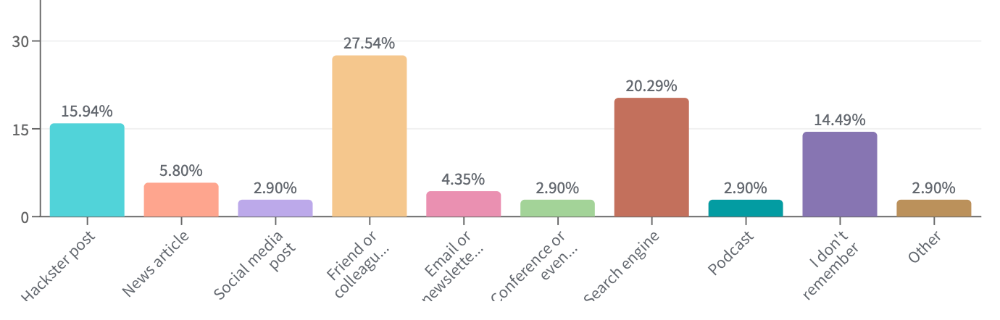
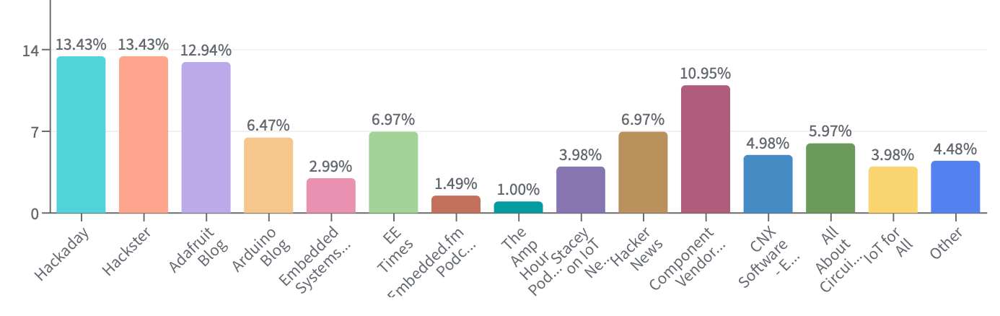
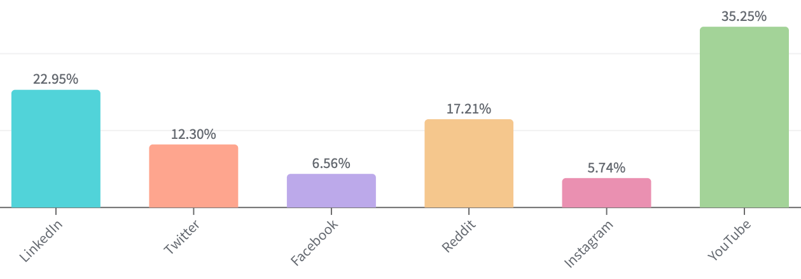
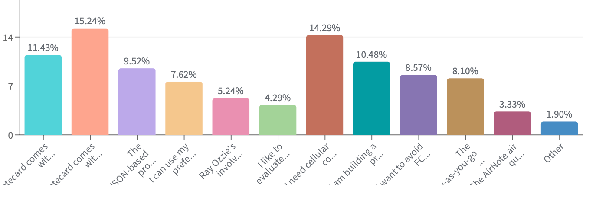
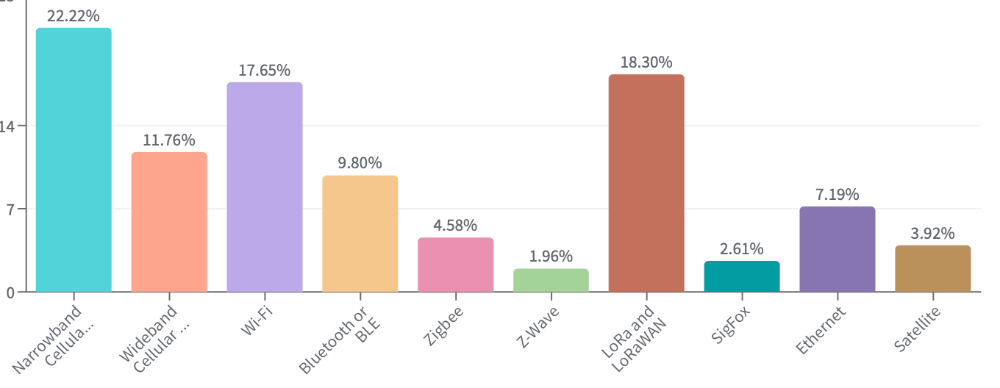
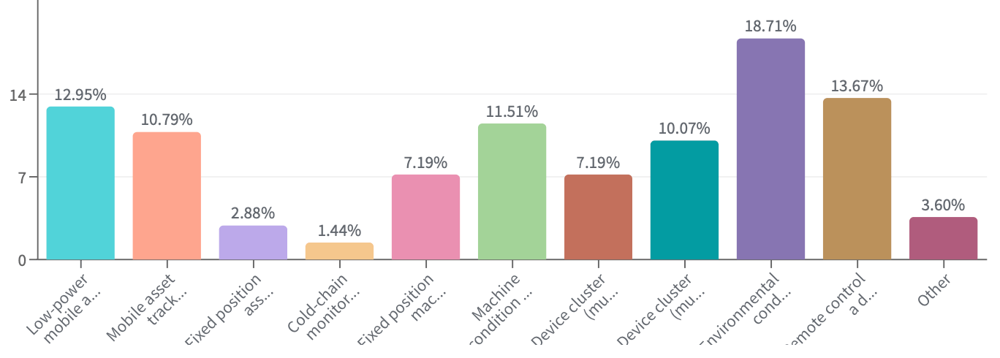
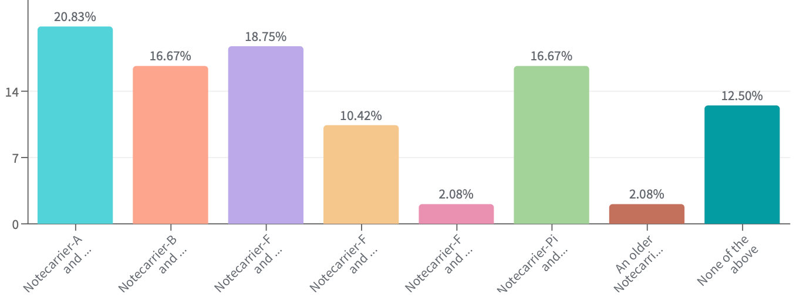
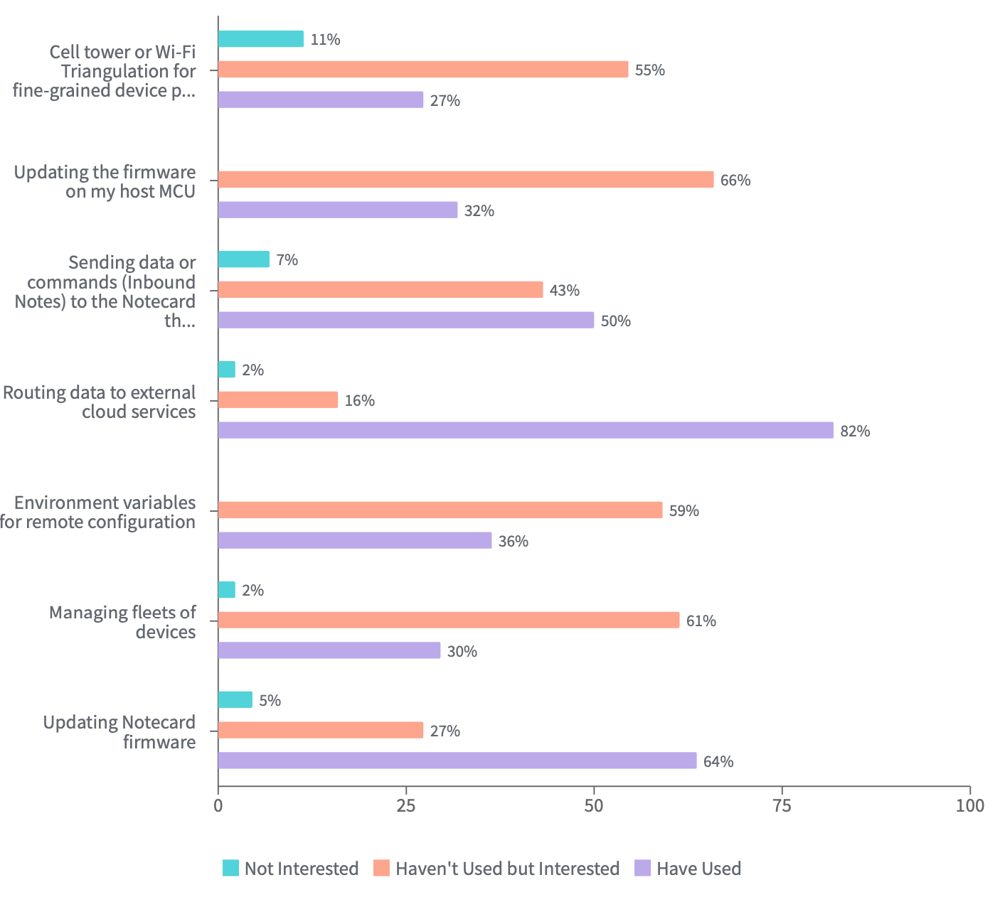
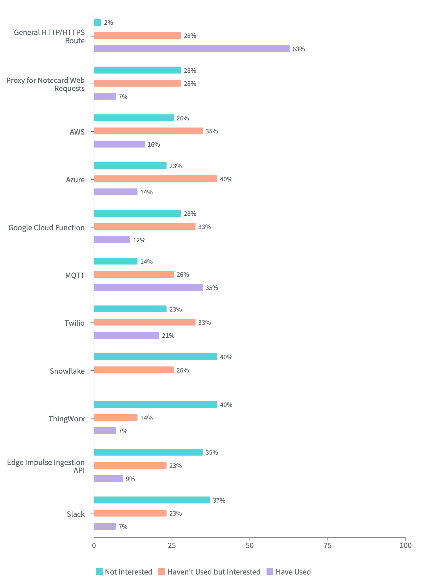
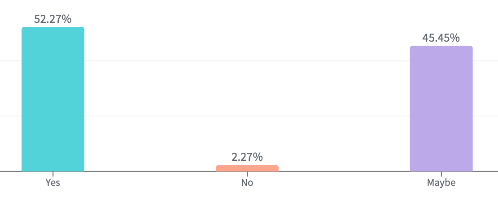

# Results from the 2023 Blues IoT Survey

Let me make a confession straightaway - I love surveys. ❤️📊

While they are but one data point when crafting both product roadmaps and community engagement plans, I propose (when done correctly) they can be a *critical* data point. 

The Blues Developer Relations team recently released a survey to our community of loyal users. We asked for your feedback, be it positive or negative (and frankly, the negative feedback is generally more useful).

What follows is a high-level overview of the results we felt comfortable making public, with a little of my own color mixed in.

*All results below are expressed in percentages of the total number of survey submissions.*

> But first, the prize winners! We gave out a custom Blues hardware kit to two lucky survey participants. Congratulations again to Eric L. and Zach G., we appreciate your feedback.

## How did you first hear about Blues?

I love this question. I'm always dying to know where people first hear about us and how we can improve our messaging to make sure we are reaching the right audiences.

Of course "friend or colleague" is what you want to be #1 and we were not disappointed. The most valuable referrals are genuine ones from people you trust. The projects we [build and publish on Hackster](/community/projects/) are key sources for us as well.

## Where do you typically get news about embedded/IoT development?

This may be interesting to the general audience, but you all appear to get your tech news from a variety of unique sources (no clear "winners" in this category!).

## What social media networks do you frequent?

Nobody likes to be advertised to, but we **do** like to consume content on social media that is useful and engaging. Hey, that's what my team is here to do!

Based on this feedback, you'll be seeing a lot more [useful video content on YouTube](https://www.youtube.com/blueswireless) from us.

## What first drew your interest in Blues?

Another favorite question of mine. What is it about Blues, the Notecard, and Notehub that first drew you in? While it's kind of hard to read the response options in the image below, the tops for you were:

1. "Notecard comes with 10 years of cellular service"
2. "I need cellular connectivity and don't want to source the components myself"
3. "Notecard comes with 500MB of cellular data"

## What are your preferred method(s) of network communication?

Well, we knew this question would lead to some biased answers, but it's still validating to see narrowband cellular come out on top (though LoRa/LoRaWAN is not far behind).

## What type of IoT solution are you building?

It's always interesting to hear what our customers are building. And a slim majority of you told us you are focused on **environmental condition monitoring** and **remote control** solutions.

## Which Notecarrier and host are you using?

I'll admit the result of this question was a bit of a surprise to me. Our customers are using [Notecarriers](https://blues.io/products/notecarrier/) at a shockingly similar rate (though if you add them up, the [Notecarrier F](https://blues.io/products/notecarrier/notecarrier-f/) comes out at the top, which is not surprising considering how useful it is to use with a Feather-compatible host).

## Which Notehub features have you used/will use?

Notehub has a lot of features that, I think, run a bit "under the radar". I wanted to know which of these features people have used, and which ones they may want to use in the future. Needless to say, I wasn't disappointed, as effectively every feature holds a fair amount of interest.

## Where are you routing data from Notehub?

On a similar note, while we keep internal analytics to maintain our routing capabilities, it's useful to know which types of [Notehub routes](/notehub/notehub-walkthrough/#routing-data-with-notehub) people foresee using in the future.

## Have you used the Notehub API?

Personally, I fear the [Notehub API](https://dev.blues.io/api-reference/notehub-api/api-introduction/) is an underutilized feature (check out the [Postman Collection](/api-reference/notehub-api/api-introduction/#postman-collection-for-notehub-api) as well). However, my fears were unfounded as the vast majority of you are either using it or may use it in the future.

## Summary (and Thanks!)

Thanks again to everyone who participated in the 2023 Blues IoT Survey. We truly do incorporate feedback like this into our short- and long-term planning activities.

I'm consistently humbled by our customers who are investing in us and building amazing solutions. Happy hacking with Blues! 🧑‍💻