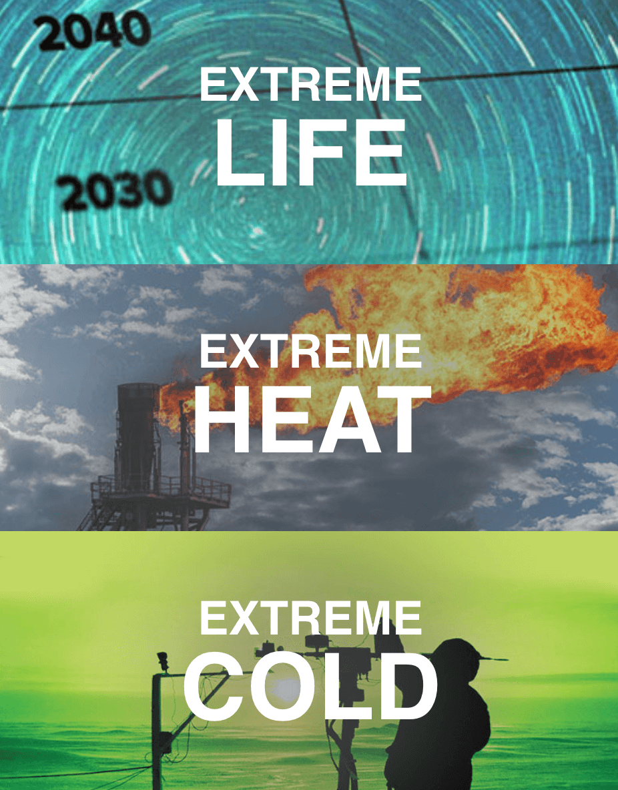
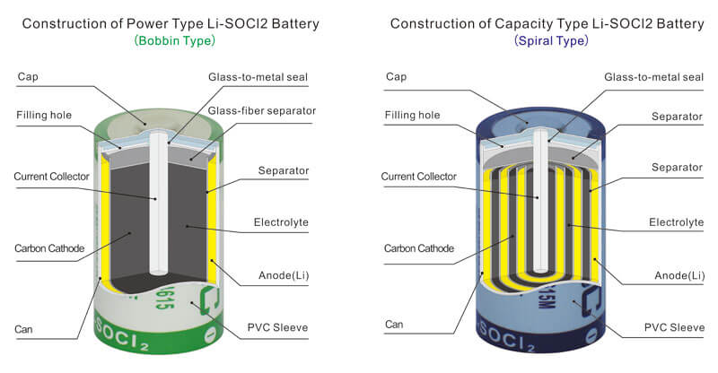
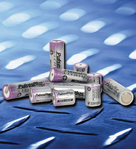
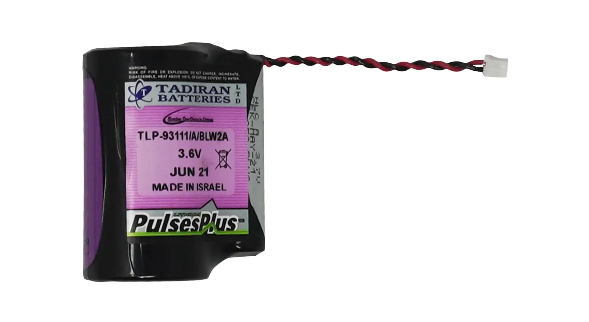
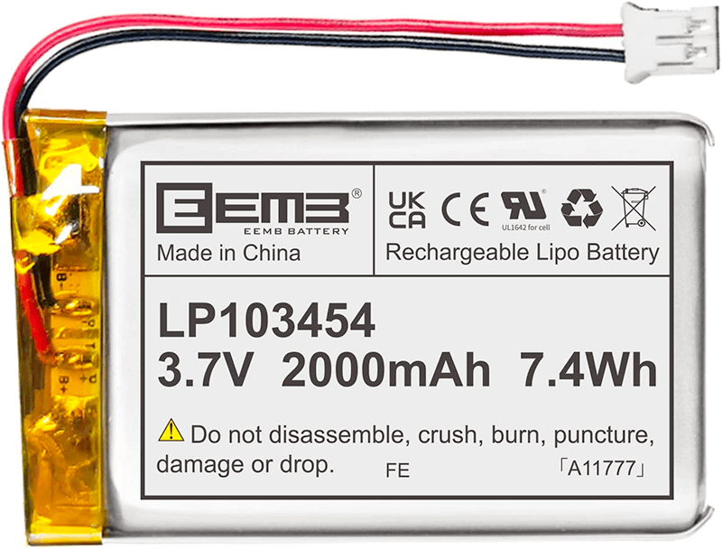
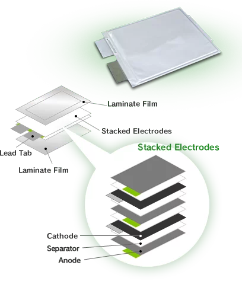
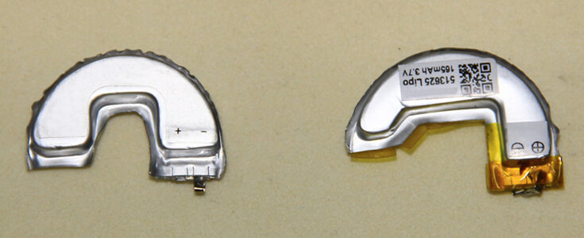
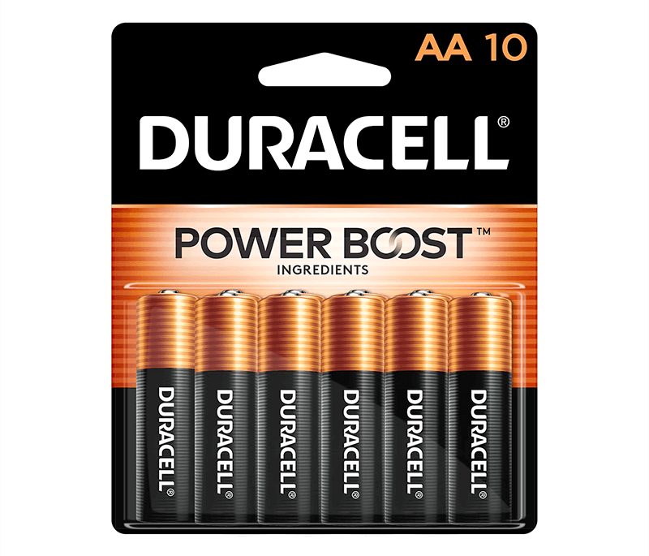

# When to Use Tadiran (Li-SOCl2) vs Lithium Polymer (LiPo) Batteries in IoT Applications

As a product designer or embedded engineer, selecting the appropriate battery technology is crucial for ensuring the best performance/longevity combination to power your embedded device or IoT application.

In this article, we will perform a high-level comparison of Tadiran (i.e. Li-SOCl2) batteries and Lithium Polymer (LiPo) batteries, helping you to decide which is best suited for your deployment scenario.

*Specifically, we will answer the following questions:*

- What are Tadiran Li-SOCl2 batteries?
- What are LiPo batteries?
- What are the optimal temperature ranges for Tadiran and LiPo batteries?
- What are the self-discharge rates of Tadiran and LiPo batteries?
- What are some valid use cases for Tadiran vs LiPo batteries?
- And why aren't we talking about alkaline batteries!?

## What is a Tadiran Battery?

[Tadiran](https://tadiranbat.com/) is the brand name of a type of Lithium Thionyl Chloride (Li-SOCl2) battery. Tadiran Li-SOCl2 batteries are known for their **long shelf-life** (up to 40 years in optimal conditions), relatively **high voltage** (3.6 V), **low self-discharge rates** (~0.7% per year), and the ability to operate in **extreme temperature ranges** (-80°C to 125°C).

*Yes, Tadiran likes to acknowledge these "extreme" capabilities in their marketing materials!*

> NOTE: While known for their Li-SOCl2 batteries, Tadiran does offer Li-ion batteries as well. However, for the purposes of this article, we are going to focus only on their Li-SOCl2 batteries.

While Li-SOCl2 Tadirans are **not rechargeable**, they are often used in low-power, long-life applications such as remote monitoring systems, smart meters, asset tracking, and IoT deployments in relatively harsh environmental conditions.

### How do Li-SOCl2 Tadiran Batteries Work?

Li-SOCl2 battery technology takes advantage of the high reactivity of lithium, the lightest of all metals, and a highly electronegative chlorinated compound, thionyl chloride (SOCl2).

*Two types of Li-SOCl2 battery structures. Image credit [gebc-energy.com](http://www.gebc-energy.com/).*

In these batteries, lithium serves as the anode, and thionyl chloride serves as the cathode active material. When the battery discharges, the lithium is oxidized, and the thionyl chloride is reduced. The resulting reaction generates a high nominal voltage (again, typically around 3.6V).

### Pros and Cons of Li-SOCl2 Tadiran Batteries

Li-SOCl2 Tadirans shine in scenarios where a long shelf-life, low self-discharge rate, high pulses, and ability to function in wildly varying temperature ranges are key requirements. Their high cell voltage also may allow **fewer batteries to be used in a series**, potentially saving space and reducing complexity in the design of device enclosures.

*The Tadiran PlusesPulse series of Li-SOCl2 batteries.*

However, Li-SOCl2 batteries are not without their limitations. Since they are not rechargeable, once they are depleted they must be manually replaced. Therefore, they aren't suitable for applications that require frequent charging and discharging, or in remote scenarios where solar/wind/hydro power is readily available for recharging purposes. Likewise, Tadirans are not inexpensive! Li-SOCl2 Tadiran batteries often cost considerably more than LiPo batteries when comparing $ per amp hour (though the total cost of ownership may vary, depending on the use case).

### Common IoT Applications for Li-SOCl2 Tadiran Batteries

Thanks to their unique properties, Li-SOCl2 Tadiran batteries are often found in a variety of IoT deployments, including:

- **Utility Metering Systems:** Gas, water, and electricity metering systems often use Tadirans due to their long operational lifespan and reliability.

- **Emergency Devices:** Devices like fire/smoke detectors and alarm systems often use these batteries due to their long shelf-life.

- **Edge Computing Devices:** Devices deployed in remote or difficult-to-access locations often use Tadrian batteries due to their high energy density and long operational life.

When it comes to integrating with the [Blues Notecard](https://blues.io/products/notecard/), [this Tadiran](https://shop.blues.io/collections/accessories/products/tadiran-lithium-battery) is ideal for the high current pulses the Notecard may require when used in a region that requires access to a GSM network:

*The Blues version of the Tadiran TLP-93111 battery.*

> **NOTE:** This battery is based on the Tadiran TLP-93111 and was modified for Blues to include a JST connector so that you can easily use this battery with any of our [Notecarriers](https://blues.io/products/notecarrier/).

## What is a Lithium Polymer (LiPo) Battery?

Lithium Polymer (LiPo) batteries are a type of rechargeable battery that utilize a *polymer electrolyte* instead of a *liquid electrolyte* found in other lithium-ion batteries. This unique composition allows LiPo batteries to be **lightweight and flexible**, making them a popular choice for low-cost powering of embedded/IoT devices, consumer electronics, and devices that require custom battery sizes.

*An example LiPo battery.*

### How do LiPo Batteries Work?

LiPo batteries work on the same fundamental principles as other lithium-ion batteries. They move lithium ions from the negative electrode (anode) to the positive electrode (cathode) during discharge - and move them back while charging. The anode in a LiPo battery is typically made of a type of lithium compound (like lithium cobalt oxide), which can readily give up lithium ions.

*LiPo battery structure. Image credit [dnkpower.com](https://www.dnkpower.com/lithium-polymer-battery-guide/).*

### Pros and Cons of LiPo Batteries

Like other lithium-ion batteries, LiPo batteries have a **high energy density**, meaning they can store a large amount of energy for their size and weight. Unlike Tadiran batteries, LiPo batteries **can be recharged hundreds of times**, making them a popular choice for many electronics devices. LiPo batteries are also **lightweight**, can deliver power quickly with high discharge rates, and as mentioned are very **flexible in their shape and size**.

*LiPo batteries can be manufactured in virtually any shape or size. Image credit [lipolbattery.com](https://www.lipolbattery.com/Novel-LiPo-Battery.html).*

LiPo batteries are no silver bullet though - they do have some downsides! Care must be taken not to over-charge or over-discharge them, as this can significantly reduce their lifespan (or even cause them to catch fire). It's important to note that most devices using LiPo batteries include safety circuits to prevent these issues from happening. Finally, while LiPo batteries can be recharged many times, each charge and discharge cycle *slightly* reduces their capacity. After numerous cycles, the capacity may be significantly reduced, at which point the battery will need to be replaced.

### Common IoT Applications for LiPo Batteries

While there is plenty of overlap between LiPo and Li-SOCl2 Tadiran batteries in terms of use cases, lower-power and more cost-sensitive applications tend towards using LiPo battery technology:

- **Remote Monitoring Systems:** Remote systems for weather monitoring, wildlife tracking, and other environmental sensors often use LiPo batteries for their longevity, ability to be recharged, and operating in somewhat unpredictable conditions (but less "extreme" conditions than a Tadiran).

- **Smart Agriculture:** In smart farming, sensors and devices are used for monitoring soil moisture, weather conditions, and livestock tracking. These devices often use LiPo batteries because they can provide low-cost reliable operation for an extended period.

- **Backing Up Home Automation Devices:** Devices like smart locks, security cameras, and other IoT home automation systems are often line-powered, but also utilize LiPo batteries as a backup in case of a power outage.

## So...Which Should I Choose?

The answer, as you may expect, is: "it depends on your use case!". Which of the following are most important for your deployment scenario?

### Operating Temperature Range

When comparing the operating temperature ranges of Tadiran and LiPo batteries, **Tadiran batteries have a clear advantage** of -80°C to 125°C. Their Li-SOCl2 chemistry enables them to perform well in extreme temperatures, making them suitable for applications in harsh environments.

While LiPo batteries have a more limited temperature range (-20°C to +60°C) compared to Tadiran batteries, they still offer a wide operating range suitable for most consumer electronics and portable devices.

✅ Tadiran Li-SOCl2 ⛔️ LiPo

### Longevity (Self-Discharge Rate)

The self-discharge rate of a battery refers to the percentage of charge it loses over time when not in use. This is an important factor to consider, especially for applications requiring long periods of inactivity. **Tadiran batteries offer an extremely low self-discharge rate** (~0.7% per year) while LiPo batteries self-discharge at a rate around 5% per month when not in use.

✅ Tadiran Li-SOCl2 ⛔️ LiPo

### Flexibility

The unique composition of LiPo batteries allows them to be not only lightweight (which is critical for many solutions) but also flexible and able to be shaped to virtually any custom size or shape. Tadirans, on the other hand, are limited to very specific shapes (though with their high voltages, may consume less physical space in an enclosure).

⛔️ Tadiran Li-SOCl2 ✅ LiPo

### Cost

Comparing the cost of Tadiran Li-SOCl2 batteries and LiPo batteries can be complex because the true cost of a battery can depend on many different factors. You need to factor in its capacity along with recharge cycles/total power delivered, and the specifics by manufacturer/model (not to mention quantity purchased!).

In general, Tadiran Li-SOCl2 batteries are considered "specialty batteries" that aren't as widely available. They tend to be more expensive than LiPo batteries, as they possess unique properties noted previously. When comparing total energy delivered between Tadiran and LiPo batteries, **LiPo tends to come out ahead when it comes to total cost of ownership**.

> **WARNING:** Please note that the specifics can vary, and for an accurate and up-to-date comparison, you would need to look at the prices from various suppliers or directly from the manufacturers.

⛔️ Tadiran Li-SOCl2 ✅ LiPo

## What about Alkaline Batteries?

Generally speaking, alkalines are the "worst of both worlds" in comparison with LiPo and Tadiran batteries. Aside from their low cost and wide availability, alkalines have a very low energy density (when compared to LiPo and Tadiran). This primarily impacts longevity, as devices won't last as long under comparable usage conditions. Alkalines also perform more poorly at high current-drain rates, aren't rechargeable, and their capacity decreases dramatically in low temperatures.

*The venerable Duracell AA battery. Image credit [Duracell](https://www.duracell.com/).*

## Conclusion

When choosing between Tadiran Li-SOCl2 and LiPo batteries for a embedded device or IoT application, it is crucial to consider factors such as energy density, operating temperature range, self-discharge rate, and the specific requirements of your application.

Tadiran batteries excel in low-power, long-life applications, and extreme temperature environments, while LiPo batteries are ideal for lower-cost deployments, scenarios where they may be recharged, and devices requiring custom battery shapes.

If you need help determining the best battery tech for your individual solution, feel free to reach out to use via the [Blues community forum](https://discuss.blues.io/). 🔋
