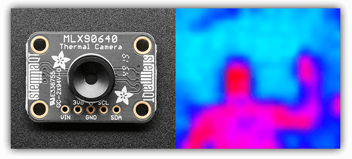
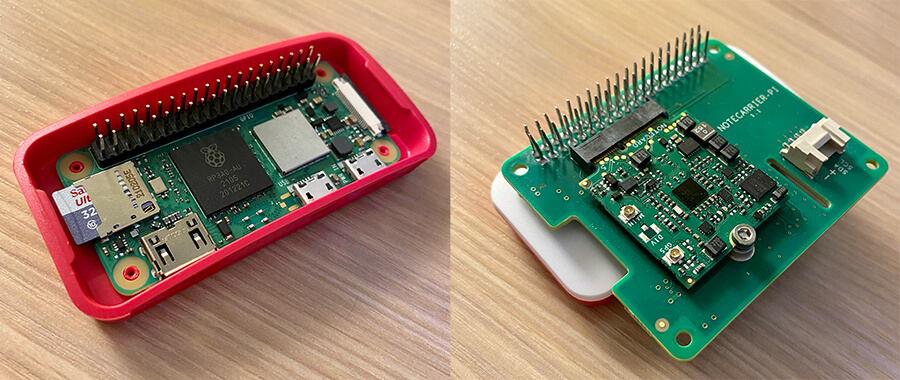
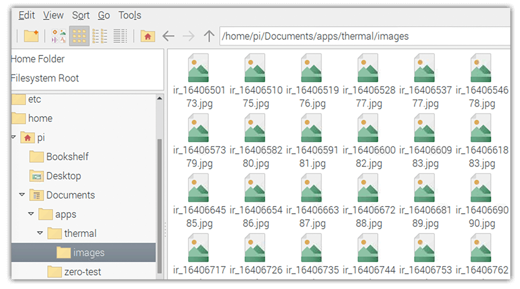
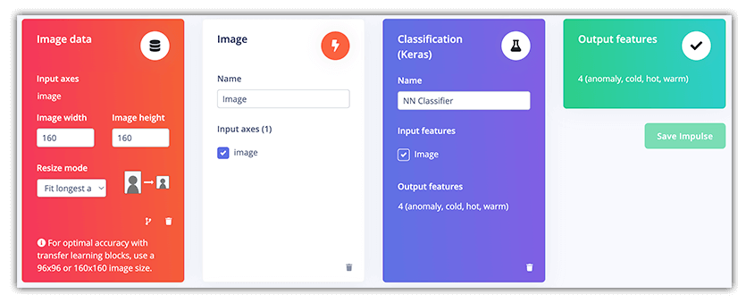
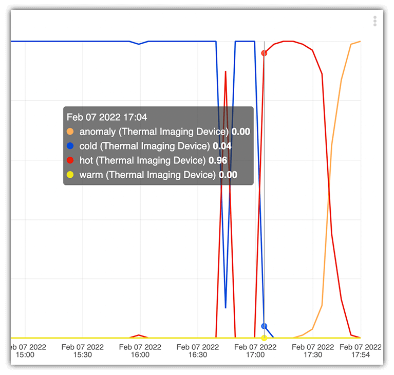

# Thermal Image Anomaly Detection with TinyML

When I say "anomaly detection" you may instantly imagine an overtly complicated process, something exclusive to deep learning algorithms and indecipherable coding. In reality, the concept of uncovering anomalous behavior in a system is really just the act of *identifying an unclassified or uncertain state*.

In the two Machine Learning projects I've published here on Hackster/Electromaker (an [ML speed trap](https://www.hackster.io/rob-lauer/busted-create-an-ml-powered-speed-trap-b1e5d1) and [remote birding](https://www.hackster.io/rob-lauer/remote-birding-with-tensorflow-lite-and-raspberry-pi-8c4fcc)), I've created ML models with different data inputs, and asked them to generate inferences based on the *known* data provided. But what happens when I ask the model to create an inference about something it *doesn't know*?

This, in essence, is what I tried to accomplish in this project.

INCLUDE VIDEO HERE

I created an **anomaly detection ML model** with [Edge Impulse](https://edgeimpulse.com/) that processes thermal images to detect unknown states of thermal readings and relays collected data to the cloud with the [Blues Wireless Notecard](https://blues.io/?utm_source=hackster&utm_medium=web&utm_campaign=featured-project&utm_content=thermal).

While I built this around my home heating system, in an industry setting this type of solution could be used to monitor virtually any type of heat-producing equipment.


By using the "edge ML" capabilities provided by Edge Impulse, the cellular Notecard device-to-cloud data pump from Blues Wireless, a Raspberry Pi Zero 2, and an Ubidots dashboard, I was able to create a simple, low-power, thermal monitoring station with only a small bit of Python coding required 🐍.

## The Problem to Be Solved 🤔

Put simply, any machinery that generates a significant amount of heat is at risk of catastrophic failure. Even home heating systems burn more than an insignificant amount of oil or natural gas daily. The risk of failure may be very low, but if you scale up to an industrial setting, a failure can be devastating.

But today we are going keep the scale down to my hot water boiler system, in which I recently replaced the boiler itself with this fancy beast:


What could possibly go wrong with a boiler? As the owner of a 100+ year old house, I'll spare you the details, but needless to say there is a lot of complexity and many pipes going into and out of the boiler that could be monitored. One example "problem" is a water pressure release valve that should never really open:


If it does, it's a sign of some internal problem only my HVAC company should tackle. So I set out to build a system that could monitor the thermal readings of most of the pipes you see and warn me if any "hot spots" showed up where they shouldn't.

> **NOTE:** Notice all the copper piping? Copper has an [extremely low emissivity rating](https://www.flir.com/discover/professional-tools/how-does-emissivity-affect-thermal-imaging/), making it difficult to read on a thermal camera. Luckily there are enough iron components mixed in to make this project work well enough for my proof-of-concept!

## The Puzzle Pieces 🧩

With the problem fairly well understood, it was time to put together the hardware puzzle pieces I needed to make this work.

Within the basement of a 100+ year old house, Wi-Fi access is spotty at best and there aren't nearly enough standard outlets to power any devices without running a lengthy extension cord. Therefore, building a low-power solution using LTE-M cellular was at the top of my list.

I started with the [Blues Wireless Notecard](https://blues.io/products/notecard/?utm_source=hackster&utm_medium=web&utm_campaign=featured-project&utm_content=thermal), which provides prepaid global cellular access **including 500MB of data and 10 years of service**. The model I chose works with both LTE-M and NB-IoT protocols, so even with just "one bar" of cell service in my basement, there was enough bandwidth to pump the data I needed to the cloud. It's also an extremely low-power device to the tune of ~8uA when idle.


Next up, I needed a thermal imaging camera. I chose the [MLX90640 IR Thermal Camera from Adafruit](https://www.adafruit.com/product/4469). It generates a 32x24 resolution thermal image that, while not seeming like much, can provide a reasonably accurate thermal image:



Picking a host microcontroller or single-board computer became the next hurdle. And I'll confess, it was highly dictated by the [Linux-only example provided by Adafruit](https://github.com/adafruit/Adafruit_CircuitPython_MLX90640/blob/main/examples/mlx90640_camtest.py) for the thermal camera!

I went with a [Raspberry Pi Zero 2 W](https://www.raspberrypi.com/products/raspberry-pi-zero-2-w/) as it's probably the best option for low-power computing that still supports a full Linux distro (Raspbian).

The [Notecarrier-Pi HAT from Blues Wireless](https://blues.io/products/notecarrier/notecarrier-pi/?utm_source=hackster&utm_medium=web&utm_campaign=featured-project&utm_content=thermal) makes adding cellular to any Raspberry Pi a snap:



For a power supply I went with a large 30,000 mAh USB-C power bank. **Confession Time:** I didn't do a very good job of measuring power drain, but it did well enough to keep my Pi running for a few days, with power to spare.


It was then time to start the assembly of a different type: building an ML model from scratch, and wiring it up with some Python code and cloud services.

## Building a Thermal 🔥 TinyML Model

What may at first appear to be the most intimidating aspect of this entire project (building a Machine Learning model from scratch) arguably turned out to be the easiest thanks to [Edge Impulse](https://edgeimpulse.com/).

Edge Impulse is a development platform used for building and deploying ML models on edge computing devices.

Here is how I built a "tiny" ML model in no time at all, using the web-based UI provided by Edge Impulse Studio to create a new **image classification** project.

> **NOTE:** While Edge Impulse does support the creation of true anomaly detection models with audio or accelerometer data, they don't yet support images. That's why I stuck with an image classification model to build more of a proof-of-concept anomaly detection model!


**1) Data Acquisition**

With my hardware assembled, I was at least ready to start taking pictures with the thermal camera and save them on the RPi Zero. By setting a simple Python function to run every 10 minutes, I generated a set of ~120 images that were a good approximation of the different *states* of proper boiler operation (e.g. cold, warm, and hot).



*Note that the Python code for generating images is presented a little further down in this tutorial, but it's also available [in this GitHub repository](https://github.com/rdlauer/pizero-thermal).*

With the complete set of images uploaded to my project in Edge Impulse studio, I had to **label** the individual images:

🥶 "Cold" - meaning the system is not on at all:


😏 "Warm" - meaning the system is either warming up or cooling down:


🥵 "Hot" - meaning the system is actively heating the house:


And also "Anomaly" - meaning an anomalous (i.e. uncertain or unknown) state was recognized.

Images were uploaded to Edge Impulse studio, under the **Data acquisition** tab:


But wait, how could I identify anomalous states **without recording any anomalous behavior**? Through the magic of Photoshop of course!

Going into this project I knew I wanted to equate anomalous behavior with hot spots that occurred away from any known hot points (like the aforementioned pressure relief area). By 'shopping in some hot spots, I created an additional set of images that might represent anomalies - giving me a set of four states:


**2) Create an Impulse**

In Edge Impulse speak, an impulse "takes raw data, uses signal processing to extract features, and then uses a learning block to classify new data". My impulse was comprised of the following *processing* and *learning* blocks:



**3) Train the Model**

Using the default options provided, I trained my ML model based on the aforementioned dataset and configuration. The initial output of this process showed me that my model was going to be remarkably accurate (the testing is based on Edge Impulse pre-allocating a subset of images to a "training" dataset).

A fantastic "feature explorer" also helps you to identify any mislabelled images before you use the model in any real world setting.


And *that's* all it took for me to initialize and train a TinyML model with Edge Impulse!

Next up, I needed to configure the Raspberry Pi Zero, install a few requisite software packages, download the ML model, and get to writing some Python to wire it all up!

## Setting Up the Pi 🥧

Every time I start a new project on my Pi, I like to make sure all of the installed packages are up-to-date with:

```
sudo apt update
sudo apt full-upgrade
sudo apt clean
```

### Setting Up the Pi for Machine Learning

I then needed to [install some dependencies](https://docs.edgeimpulse.com/docs/raspberry-pi-4#2-installing-dependencies) to use the Edge Impulse runner on the Pi. Note that the instructions provided are for the Raspberry Pi 4, but they ran smoothly for me on the Pi Zero 2!

To connect this device to Edge Impulse (which is needed to download the generated ML model file), I needed to run:

```
edge-impulse-linux --disable-camera
```

The `--disable-camera` flag is used if your Pi does not have a camera module attached to it.

I [installed the Linux Python SDK](https://docs.edgeimpulse.com/docs/linux-python-sdk) for Edge Impulse. For some reason, on the Pi Zero I had to install the dependencies listed under the "Raspberry Pi" section separately, so YMMV 🤷.

The last Edge Impulse step involved running this command to build and download the Machine Learning model file (`modelfile.eim`) to the Pi:

```
edge-impulse-linux-runner --download modelfile.eim
```

I knew all would be right with the world when I saw this output in the terminal:

```
[RUN] Downloading model...
```

### Setting Up the Pi for the Thermal Camera

One trick with using the MLX90640 on the Raspberry Pi is the `adafruit_blinka` library. This translates the CircuitPython hardware API to whatever library the Pi provides. The advantage here is any code that runs on CircuitPython will run smoothly on a Raspberry Pi!

You can (and should) review the [full setup instructions provided by Adafruit](https://learn.adafruit.com/adafruit-mlx90640-ir-thermal-camera/python-circuitpython). However, they can be boiled down to the following terminal commands:

	cd ~
	sudo pip3 install --upgrade adafruit-python-shell
	wget https://raw.githubusercontent.com/adafruit/Raspberry-Pi-Installer-Scripts/master/raspi-blinka.py
	sudo python3 raspi-blinka.py

The `adafruit-circuitpython-mlx90640` can then be installed via pip:

	sudo pip3 install adafruit-circuitpython-mlx90640

### Setting Up the Pi for Cellular

The only other dependencies to be installed were the [Python SDK for the cellular Notecard](https://github.com/blues/note-python) (and `python-periphery` for the Pi to communicate with the Notecard over I2C):

```
pip3 install note-python python-periphery
```

## All the Python Codez 🐍

With the hardware assembled, TinyML model created, and software dependencies installed, it was time to write some Python.

> **NOTE:** All of the code used for this project is [available in this GitHub repository](https://github.com/rdlauer/pizero-thermal).

The first Python I "wrote" was actually, ahem, [borrowed from Adafruit](https://github.com/adafruit/Adafruit_CircuitPython_MLX90640/blob/main/examples/mlx90640_camtest.py) and lightly edited. That being a script used to access the thermal camera, generate a color-coded image, and save it to the filesystem. Here is a highly-abridged version of the code:

*thermal.py*

```
MINTEMP = 20.0  # low range of the sensor (deg C)
MAXTEMP = 40.0  # high range of the sensor (deg C)
COLORDEPTH = 1000  # how many color values we can have
INTERPOLATE = 20  # scale factor for final image

mlx = adafruit_mlx90640.MLX90640(board.I2C())

def takePicture():
    # get sensor data
    frame = [0] * 768
    success = False
    while not success:
        try:
            mlx.getFrame(frame)
            success = True
        except ValueError:
            continue

    # create the image
    pixels = [0] * 768
    for i, pixel in enumerate(frame):
        coloridx = map_value(pixel, MINTEMP, MAXTEMP, 0, COLORDEPTH - 1)
        coloridx = int(constrain(coloridx, 0, COLORDEPTH - 1))
        pixels[i] = colormap[coloridx]

    # save to file
    img = Image.new("RGB", (32, 24))
    img.putdata(pixels)
    img = img.transpose(Image.FLIP_LEFT_RIGHT)
    img = img.resize((32 * INTERPOLATE, 24 * INTERPOLATE), Image.BICUBIC)
    ts = str(int(time.time()))
    filename = "ir_" + ts + ".jpg"
    img.save("images/" + filename)

    return filename
```

I had to make sure to set proper `MINTEMP` and `MAXTEMP` constants, as this provided the best range of cold/hot colors based on the scenario I was measuring.

As you can see above, when the `takePicture` method is executed, a thermal image is generated and saved as a jpeg in an `images` subdirectory with a timestamp.

The other significant Python script in this app is `main.py` which performs the following functions *every 5 minutes*:

**1)** Call the `takePicture` method in `thermal.py` and load the image into a `cv2` image object:

	filename = thermal.takePicture()
	img = cv2.imread("images/" + filename)

**2)** Process the image with the Edge Impulse Linux runner to generate a classification inference (e.g. anomaly, cold, warm, hot):

    features = runner.get_features_from_image(img)
    
    res = runner.classify(features)

    if "classification" in res["result"].keys():
        print('Result (%d ms.) ' % (
            res['timing']['dsp'] + res['timing']['classification']), end='')

The `print` command in this code outputs a string like so:

	Result (65 ms.) anomaly: 0.12 cold: 0.00 hot: 0.88 warm: 0.00

**3)** Store the generated inferences (image classifications) in JSON and sync them with the cloud using the cellular Notecard:

    note_body = {}
    for label in labels:
        score = res['result']['classification'][label]
        print('%s: %.2f\t' % (label, score), end='')
        note_body[label] = round(score, 4)

    print('', flush=True)

    note.add(nCard,
             file="thermal.qo",
             body=note_body)

For example, the `note_body` object might look something like this, with an image that represents a "cold" state:

	{
	    "anomaly": 0.0,
	    "cold": 0.99850000000000019,
	    "hot": 0.0,
	    "warm": 0.0015
	}

In code above I mentioned I "sync [the JSON data] with the cloud". Let's see *where* exactly that data goes.

## Building a Cloud Dashboard ☁️

Since the Notecard is a device-to-cloud data pump, it doesn't live on the public Internet (making it an extremely secure device) and therefore needs a proxy with which to sync data. Enter [Blues Wireless Notehub](https://blues.io/services/?utm_source=hackster&utm_medium=web&utm_campaign=featured-project&utm_content=thermal)!


Notehub is a thin cloud service that securely accepts data from the cellular Notecard (off the public Internet, using private VPN tunnels) and then **instantly routes the data** to the cloud provider of your choice (be it AWS, Azure, Google Cloud, or any IoT-optimized service like Ubidots, Datacake, Losant, and others).

Recall the `note.add` command used in `main.py` above?

    note.add(nCard,
             file="thermal.qo",
             body=note_body)

The JSON created (`note_body`), is saved on the Notecard as a [Note](https://dev.blues.io/reference/glossary/?utm_source=hackster&utm_medium=web&utm_campaign=featured-project&utm_content=thermal#note). See the `file` parameter? That is a [Notefile](https://dev.blues.io/reference/glossary/?utm_source=hackster&utm_medium=web&utm_campaign=featured-project&utm_content=thermal#notefile) - one Notefile can store multiple Notes. As soon as the Notecard makes a connection to Notehub, any stored Notefiles get synced with the cloud along with some session data:


> **NOTE:** (Pun intended, ha!) The [Notecard and Notehub APIs](https://dev.blues.io/reference/notecard-api/introduction/?utm_source=hackster&utm_medium=web&utm_campaign=featured-project&utm_content=thermal) are JSON-based. [Get a sneak peek of the API](https://dev.blues.io/?utm_source=hackster&utm_medium=web&utm_campaign=featured-project&utm_content=thermal#sneakpeek) and view all the developer resources provided at dev.blues.io.

With my data synced with Notehub, it was time to make some sense of it and build out a dashboard where I could actually view a visual representation of the data. In this case I used [Ubidots](https://ubidots.com/) which I've used numerous times in the past to create really engaging dashboards:


By following the [comprehensive routing tutorial provided by Blues Wireless](https://dev.blues.io/guides-and-tutorials/routing-data-to-cloud/ubidots/?utm_source=hackster&utm_medium=web&utm_campaign=featured-project&utm_content=thermal), I created a simple route from Notehub to Ubidots by passing an endpoint URL, authorization header, and a **JSONata expression** to transform my data on the fly:

	{
	    "cold": {"value": body.cold, "timestamp": when * 1000},
	    "warm": {"value": body.warm, "timestamp": when * 1000},
	    "hot": {"value": body.hot, "timestamp": when * 1000},
	    "anomaly": {"value": body.anomaly, "timestamp": when * 1000}
	}

The above expression turned a relatively large chunk of JSON...

	{
	    "event": "5ffa7e24-c559-40a0-8228-46ff8426b387",
	    "session": "9afdece2-9fd2-48ff-8e7d-5e66ce118b3c",
	    "best_id": "dev:864475",
	    "device": "dev:864475",
	    "product": "product:com.blues.xxx:xxx",
	    "received": 1644340365.888508,
	    "routed": 1644340370,
	    "req": "note.add",
	    "when": 1644340339,
	    "file": "thermal.qo",
	    "body": {
	        "anomaly": 0.0,
	        "cold": 0.99850000000000019,
	        "hot": 0.0,
	        "warm": 0.0015
	    },
	    "best_location_type": "tower",
	    "best_lat": 43.073787499999995,
	    "best_lon": -89.44367187499999,
	    "best_location": "Shorewood Hills WI",
	    "best_country": "US",
	    "best_timezone": "America/Chicago",
	    "tower_when": 1644340365,
	    "tower_lat": 43.073787499999995,
	    "tower_lon": -89.44367187499999,
	    "tower_country": "US",
	    "tower_location": "Shorewood Hills WI",
	    "tower_timezone": "America/Chicago",
	    "tower_id": "310,410,17169,77315601",
	    "log": {
	        "app:ca3aaf6f-6bf7-4e16-aada-ad3a7fd78f54/route:d1d3823edbf687f8b27b217e33b2d423": {
	            "status": "200",
	            "text": "{\"anomaly\":[{\"status_code\":201}],\"cold\":[{\"status_code\":201}],\"hot\":[{\"status_code\":201}],\"warm\":[{\"status_code\":201}]}"
	        }
	    }
	}

...into the following optimized payload for Ubidots:

	{
	    "cold": {"value": 0.99850000000000019, "timestamp": 1644340339000},
	    "warm": {"value": 0.0015, "timestamp": 1644340339000},
	    "hot": {"value": 0.0, "timestamp": 1644340339000},
	    "anomaly": {"value": 0.0, "timestamp": 1644340339000}
	}

> [Learn more about JSONata](https://dev.blues.io/guides-and-tutorials/notecard-guides/jsonata-1-2-3/?utm_source=hackster&utm_medium=web&utm_campaign=featured-project&utm_content=thermal) in a guide provided by Blues Wireless.

On the Ubidots side, I saw data appearing almost instantaneously, allowing me to create a simple but effective line chart of the recorded states of the thermal images:



## Alert! 🚨 Anomaly Detected!

What's an anomaly detection system without realtime alerts!?!

[Notehub also provides an integration with Twilio](https://dev.blues.io/guides-and-tutorials/routing-references/twilio-route/?utm_source=hackster&utm_medium=web&utm_campaign=featured-project&utm_content=thermal) to allow for email or SMS messages to be sent when a specified condition is met. In my case, I only wanted to be alerted if my system detected an anomaly (an SMS message does just fine in this case).

To send an SMS with Twilio, I simply had to create a new route in Notehub by following the Twilio routing tutorial. However, I only wanted this route to be triggered under certain circumstances (e.g. when an anomaly was detected).

By extending the existing code provided in `main.py`, I created a conditional statement and triggered the other route, like so, when an anomaly label was found with a value > 0.7:

	if anomaly > 0.7:
	    note.add(nCard,
	             file="alert.qo",
	             body=note_body)

Again, you may [follow the provided Twilio routing guide](https://dev.blues.io/guides-and-tutorials/routing-references/twilio-route/?utm_source=hackster&utm_medium=web&utm_campaign=featured-project&utm_content=thermal) for more information on sending SMS messages via Notehub.

## Conclusion (and Thanks!)

As an employee of Blues Wireless, I may appear biased at time when writing about how easy to use our products are. The thing is, I'm not lying or stretching the truth. **The Notecard just works.**

I'm equally as satisfied working with Edge Impulse - it has become my go-to platform for creating robust ML models that run on the tiniest of devices.

And the same goes for Ubidots. They have been a fantastic partner to work with and I can't recommend them enough.

All that being said, if you're looking for some next steps...

- Get your own [Blues Wireless starter kit](https://shop.blues.io/collections/development-kits?utm_source=hackster&utm_medium=web&utm_campaign=featured-project&utm_content=thermal) for cellular or Wi-Fi.
- Take a look at the [Edge Impulse getting started resources](https://docs.edgeimpulse.com/docs).
- [Browse other Hackster projects](https://www.hackster.io/blues-wireless) that use the Notecard in edge scenarios.

Happy hacking! 👩‍💻