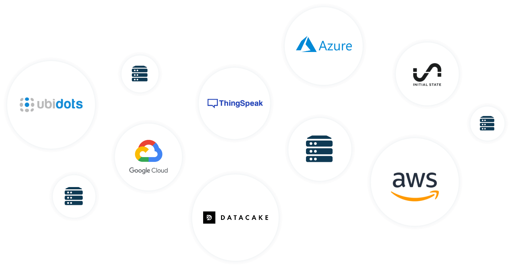
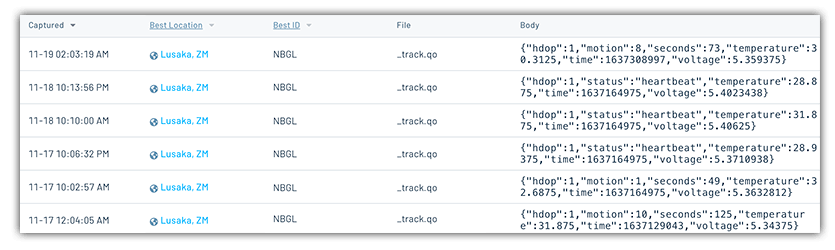
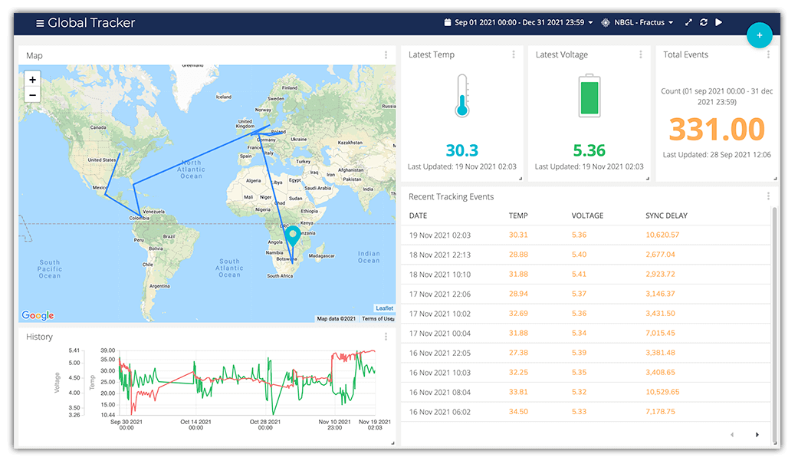

# Sending a Cellular/GPS Tracker Around the World (Literally)

"If you don't know where you are going, you'll end up someplace else." - Yogi Berra.

*I couldn't agree with you any more Yogi!*

One of the more intriguing use cases to be born out of the IoT is the ability to actively monitor the location and condition of, well, *anything*. Whether you are monitoring the temperature, humidity, and fall detection of a critical vaccine shipment, or tracking your location on a cross-country road trip, using off-the-shelf sensors with cellular and GPS modules has made asset tracking easier than ever.

But what if you don't know where to start? Or what if you don't want to invest serious 💰💰💰 in a fully decked-out tracker? Well, have I got a tutorial for you!

I built a low-cost (< $100 USD) cellular- and GPS-enabled tracking system and sent it, literally, around the world to almost every continent. I tracked its location with a cloud-based dashboard from Ubidots, and even updated some settings on the trackers themselves **after** I had sent them on their journey.


Let's dive into the hardware used, the low-code tracker configuration steps, and the cloud dashboard built to monitor this little tracker and its amazing voyage around the globe 🌍.

## Minimal Required Hardware

When speccing out this project, I wanted to double down on the low cost hardware angle. There are plenty of off-the-shelf asset tracking systems out there, but the prices are generally too high for a minimalist asset tracking solution.

Therefore, I started with the following requirements:

1. GPS tracking module (no kidding)
1. Cellular module (the only realistic way to get global data connectivity)
1. Low-power hardware (it's a long journey, can't have a power hog)
1. Cheap and reliable GPS and cellular antennas
1. Reasonably-sized (and priced) LiPo battery
1. Avoid using a host microcontroller (to save on power and cost)

### GPS and Cellular in One

We all know the old adage: kill two birds with one stone. How violent! So how about kill three birds with one stone? Wait, still violent. Let's knock out three requirements (cellular, GPS, and low-power) with one piece of hardware.

The core of my asset tracker is the [Notecard from Blues Wireless](https://blues.io/products/notecard/?utm_source=hackster&utm_medium=web&utm_content=globaltracker). The Notecard is a device-to-cloud data pump with an onboard cellular and GPS module that, by default, is **low power** to the tune of ~8mA when idle. The Notecard ships with an embedded SIM and 10 years + 500 MB of data included.

How about global connectivity? [137 countries and counting.](https://dev.blues.io/hardware/notecard-datasheet/note-nbgl-500/#cellular-service) Should be more than enough for this trip.

But I can't drop a Notecard in a box by itself and send it around the world (yet). I need some antennas, a means of powering it, and presumably a microcontroller to configure it (or do I...🤔).


### Finding the Right Antennas

Ever do a search for "cellular antenna" on Digikey? Good luck my friend! Luckily Blues Wireless also provides [Notecarriers](https://blues.io/products/notecarrier/?utm_source=hackster&utm_medium=web&utm_content=globaltracker), which are a line of development boards that act as a bridge between a Notecard and your MCU or Raspberry Pi-compatible single-board computer.

*There are two main advantages to using the Notecarrier for this project:*

1. Certain Notecarrier models ship with low-profile cellular and GPS antennas.
2. Notecarriers allow for connections to solar panels and LiPo batteries.


### Need to Be Power-Conscious

In this day of supply chain issues and shipping delays, not to mention the fact that I had to send this tracker to nearly every corner of the globe, I needed to craft a very power-wise solution (the last thing I needed was to have the tracker go offline in the middle of the Atlantic).

Again, the Notecard becomes invaluable here due to its [low-power hardware and power-conscious firmware](https://dev.blues.io/notecard/notecard-walkthrough/low-power-design/?utm_source=hackster&utm_medium=web&utm_content=globaltracker) (its default settings are very battery-aware). Just as important was picking the right battery. I went with a [fairly beefy 6600 mAh Lithium Polymer battery](https://www.adafruit.com/product/353) from Adafruit, just to be safe.

> **NOTE:** Every country has their own unique laws and restrictions when it comes to shipping lithium batteries. As long as they are actively powering something (as is the case with a tracker) you should be fine, but you will want to check with local regulations to be sure.

**Done and done!** The tracker is starting to come together:


### Picking a Host Microcontroller

With so many low-power host MCUs available to choose from...I actually chose no host at all!

A key advantage of using the Notecard as an asset tracker is the ability to configure the Notecard firmware directly with JSON commands using the [Notecard API](https://dev.blues.io/reference/notecard-api/introduction/?utm_source=hackster&utm_medium=web&utm_content=globaltracker). The Notecard even ships with an on-board temperature sensor and a `card.voltage` API request to read the battery voltage, rendering the need of a host MCU to almost zero.

## Low-Code Tracker Configuration

As just mentioned, **the way you program the Notecard API is with JSON**. Everything into and out of the Notecard is pure JSON. Gone are the days of those archaic AT commands for configuring a cellular modem.

With my hardware assembled, it was time to program the tracker itself. Using the in-browser REPL provided at [dev.blues.io](https://dev.blues.io/?utm_source=hackster&utm_medium=web&utm_content=globaltracker) (which utilizes the [Web Serial API](https://developer.mozilla.org/en-US/docs/Web/API/Web_Serial_API) in a very engaging manner), I plugged in my Notecarrier with a Micro USB cable and issued my first command to verify connectivity and retrieve basic details about the Notecard:

The request:

```
{"req":"card.version"}
```

The response:

```
{
   "body":{
      "org":"Blues Wireless",
      "product":"Notecard",
      "version":"notecard-1.5.6",
      "ver_major":1,
      "ver_minor":5,
      "ver_patch":6,
      "ver_build":13807,
      "built":"Oct  7 2021 14:32:14"
   },
   "version":"notecard-1.5.6.13807",
   "device":"dev:864475040543182",
   "name":"Blues Wireless Notecard",
   "sku":"NOTE-NBGL-500",
   "board":"1.11",
   "api":1
}
```

**Now let's look at the steps involved to program the tracker:**

### Step 1: Assign Notecard to a Cloud Project

Data sent from the Notecard is securely routed through [Notehub.io](https://notehub.io/?utm_source=hackster&utm_medium=web&utm_content=globaltracker) (a cloud service provided by Blues Wireless). More on Notehub in the next section, but my first config step was to issue a command to the Notecard to tell it which Notehub project it should to connect to:

```
{
   "req":"hub.set",
   "product":"io.blues.me:global_tracker",
   "mode":"periodic",
   "voutbound":"usb:30;high:180;normal:360;low:1440;dead:0",
   "vinbound":"usb:30;high:360;normal:720;low:1440;dead:0"
}
```

*Looking at the individual parameters in the above hub.set API request we see:*

- `product` is the Notehub project identifier (again, more on this in the next section)
- `mode` defines the `periodic` or `continuous` cellular connection
- `voutbound` and `vinbound` determine the cadence of syncing with the cloud based on the measured battery voltage (i.e. perform an outbound sync of data every 180 minutes when the voltage reads "high")

### Step 2: Tell Notecard the Type of Battery

Those `voutbound` and `vinbound` parameters above are really important, especially in low-power scenarios. We therefore need to tell the Notecard which *type* of power supply it's using, so it knows which voltage thresholds to compare it to:

```
{
   "req":"card.voltage",
   "mode":"lipo"
}
```

> Check out the complete [Low Power Guide](https://dev.blues.io/notecard/notecard-walkthrough/low-power-design/?utm_source=hackster&utm_medium=web&utm_content=globaltracker) provided by Blues Wireless.

### Step 3: Sample the GPS Location

Next, I configured the GPS module on the Notecard to attempt to ascertain its current location with the [card.location.mode API](https://dev.blues.io/reference/notecard-api/card-requests/?utm_source=hackster&utm_medium=web&utm_content=globaltracker#card-location-mode) (awfully important for tracking positioning!):

```
{
   "req":"card.location.mode",
   "mode":"periodic",
   "vseconds":"usb:1800;high:3600;normal:7200;low:43200;dead:0"
}
```

You'll notice the same `mode` options as the `hub.set` request above. In addition, the `vseconds` parameter attempts a GPS position fix at a cadence that maps to same battery voltage above.

### Step 4: Start Gathering Tracking Events

Finally, I needed to **start tracking** with the [card.location.track API](https://dev.blues.io/reference/notecard-api/card-requests/?utm_source=hackster&utm_medium=web&utm_content=globaltracker#card-location-track):

```
{
   "req":"card.location.track",
   "start":true,
   "heartbeat":true,
   "hours":12,
   "file":"_track.qo"
}
```

*This API call will:*

- Immediately enable tracking with the `"start":true` parameter;
- Send a "heartbeat" every 12 hours (indicating that it's still alive, even if no motion is detected);
- Optionally specify the name of the [Notefile](https://dev.blues.io/reference/glossary/?utm_source=hackster&utm_medium=web&utm_content=globaltracker#notefile) in which tracking events are stored (e.g. `_track.qo`)

> **NOTE:** To preserve power, the Notecard will only turn on its GPS module if it detects movement using the onboard accelerometer. You may change the sensitivity of the onboard accelerometer with the card.motion.mode API's `sensitivity` parameter.

**And that's it!** You may also want to consult the [list of advanced configurations](https://dev.blues.io/notecard/notecard-guides/asset-tracking/?utm_source=hackster&utm_medium=web&utm_content=globaltracker#advanced-tracker-configurations) for configuring a GPS asset tracker on the Blues Wireless developer portal.

## Sending Tracking Data to the Cloud

With the Notecard tracker properly configured, it's ready to start collecting GPS location data at regular intervals. But where is that data going to go? To the cloud of course! ☁️

The Notecard ships pre-configured to securely communicate with the aforementioned [Blues Wireless cloud service, Notehub.io](https://blues.io/services/?utm_source=hackster&utm_medium=web&utm_content=globaltracker). Notehub allows for secure routing of data (data is transferred via private VPN tunnels **off the public Internet** 🔐). This data can then be routed to any big cloud, IoT platform, or your own RESTful endpoint.



Since you've already seen how the API commands for configuring the Notecard are all JSON, you might as well learn that the _output_ from the Notecard to the cloud is _also_ all JSON, all the time!

For example, the `_track.qo` file that stores each tracking "event" on my Notecard contains the following JSON (abridged for clarity):

```
{
    "event": "763934fe-6dc1-4f5b-baa9-jd2ed04bb75d",
    "session": "8a055a18-0f99-4196-93ed-c0088bf978fh",
    "device": "dev:864475049999999",
    "product": "product:io.blues.me:tracker",
    "when": 1638163718,
    "file": "_track.qo",
    "updates": 1,
    "body": {
        "hdop": 1,
        "motion": 1,
        "seconds": 65,
        "temperature": 22.5,
        "time": 1638163716,
        "voltage": 5.3476562
    },
    "where_olc": "5GPCG9GV+GHVP",
    "where_lat": -15.4736325,
    "where_lon": 28.393925781249997,
    "where_location": "Lusaka",
    "where_country": "ZM",
    "where_timezone": "Africa/Lusaka",
    "tower_when": 1638170698,
    "tower_lat": -15.478562499999999,
    "tower_lon": 28.402578124999998,
    "tower_country": "ZM",
    "tower_location": "Lusaka",
    "tower_timezone": "Africa/Lusaka",
    "tower_id": "645,1,22131,9382"
    }
}
```

If you look closely, you'll see GPS location, cell tower location, temperature, voltage, and timestamps all included.

As the Notecard starts tracking data, I saw it appearing under the **Events** tab in Notehub.io immediately (but this isn't where we want the data to live in the long term!).



## Securely Routing Tracking Data to Ubidots

A key value of Notehub is its ability to *route* accumulated data to any cloud. We accomplish this using [Notehub Routes](https://dev.blues.io/guides-and-tutorials/routing-data-to-cloud/?utm_source=hackster&utm_medium=web&utm_content=globaltracker). A route not only allows us to securely transfer data, but we can also utilize JSONata to optimize and customize our data payload _before_ it's delivered to our cloud provider.

> **TIP:** If you're new to JSONata, check out this [JSONata 1-2-3 guide](https://dev.blues.io/guides-and-tutorials/notecard-guides/jsonata-1-2-3/?utm_source=hackster&utm_medium=web&utm_content=globaltracker).

For example, as you'll see in the next section, I used [Ubidots](https://ubidots.com/) as my cloud dashboard provider. Configuring this route from Notehub to Ubidots was as simple as supplying an endpoint URL, an authentication token, and then optimizing the tracking data sent from the Notecard with a JSONata expression:

```
{
    "position": {"lat": where_lat ? where_lat : tower_lat, "lng": where_lon ? where_lon : tower_lon, "timestamp": when * 1000},
    "temperature": {"value": body.temperature, "timestamp": when * 1000},
    "voltage": {"value": body.voltage, "timestamp": when * 1000},
    "syncdelay": {"value": received - when, "timestamp": when * 1000}
}
```

This expression shows off just some of the power of JSONata. If you look closely, you'll see that if the `where_lat` and `where_lon` params are unavailable (the GPS-derived position) it falls back on `tower_lat` and `tower_lon` (the cell tower location).

## Building a Cloud Dashboard in Ubidots

Ubidots is a great option for quickly creating powerful IoT dashboards. With numerous built-in widgets like maps, dials, charts, gauges, and tables, it's easy to point-and-click your way to an engaging solution.

Blues Wireless [provides a tutorial for routing data to Ubidots](https://dev.blues.io/guides-and-tutorials/routing-data-to-cloud/ubidots/?utm_source=hackster&utm_medium=web&utm_content=globaltracker) and creating your own basic dashboard. For this global asset tracker project, I ended up building a dashboard with a wide variety of widgets, providing me a quite nice looking UI:



## Updating Settings On-the-Fly

Yet another advantage of using the Notecard with Notehub.io is the ability to use [environment variables](https://dev.blues.io/guides-and-tutorials/notecard-guides/understanding-environment-variables/?utm_source=hackster&utm_medium=web&utm_content=globaltracker). These are key/value pairs of arbitrary data that allow you to manage device state remotely.

For instance, you could set up an environment variable that specifies the frequency at which it gathers sensor or location data. If you wanted to change that setting later, instead of recalling all of your devices and reprogramming firmware, you could set a new environment variable value in Notehub!


In this tracking project, I used some of the [reserved system environment variables](https://dev.blues.io/guides-and-tutorials/notecard-guides/understanding-environment-variables/?utm_source=hackster&utm_medium=web&utm_content=globaltracker#reserved-environment-variables) to override defaults when needed (e.g. there were a few times when I wanted to enable `continuous` cellular mode and retrieve data closer to real time).

## Around the World and Back Again

With the hardware assembled, Notecard configurations complete, data routed to (and displayed on) an Ubidots dashboard, it was time to send the little tracker on its massive journey around the world.

*And where did it stop along the way?*

In **Mexico** we learned what happens when the Notecard is in a rural setting and can't connect to a cell tower for a lengthy amount of time. (Actually everything worked fine and location updates were stored offline for a cloud sync once connectivity was reestablished!)

**Colombia** provided a quick stop at the Ubidots home office:


In **Denmark** my good friend Sebastian took it on a journey around the city (and with him on a short trip to **London**!):


It was then off to **Zambia** where a friend shared an ice cold brew with the Notecard before experiencing the joy of trying to ship electronics through the local DHL and FedEx outlets.

Next it was off to **India** for a holiday trip from Bengaluru to Goa with a friend and former co-worker:


> Note that the embedded SIM in the Notecard does not offer connectivity in India. However, there is an external SIM slot on the Notecarrier and a [guide to enable usage of the external SIM](https://dev.blues.io/notecard/notecard-guides/using-external-sim-cards/?utm_source=hackster&utm_medium=web&utm_content=globaltracker).

And finally **Australia** where the last of my remote friends received the tracker on the Gold Coast.

When it was all said and done, here is the map of this tracker's journey around the world as provided by Ubidots:


## Next Steps

Hopefully you've seen how easy it really can be to create a low-cost, low-code, yet robust, asset tracker with the Notecard from Blues Wireless.

Looking for any next steps?

1. Grab your own [Blues Wireless starter kit](https://shop.blues.io/collections/development-kits?utm_source=hackster&utm_medium=web&utm_content=globaltracker);
2. Consult the [full Asset Tracker guide](https://dev.blues.io/notecard/notecard-guides/asset-tracking/?utm_source=hackster&utm_medium=web&utm_content=globaltracker);
3. Enjoy watching your own little tracker travel the globe!