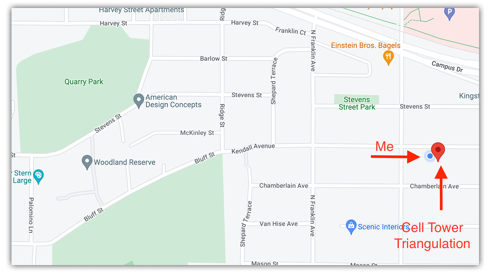

# Use Cell Tower and Wi-Fi Triangulation to Achieve Pin-Point Locations, without GPS

Many IoT solutions include one basic requirement: to know precisely _where_ they are in the world.


While ascertaining location is usually handled with a GNSS/GPS module, there are scenarios where GPS is not reliable or practical. In fact, I'll give you three exact scenarios:

1. Indoor deployments where getting a GPS satellite fix is impossible.
2. Use of a physical enclosure that prevents a GPS fix.
3. Low-power solutions that can't afford the power drain of GPS.

Here at Blues Wireless, when we talk about gathering lat/lon coordinates, we usually refer people to the onboard GPS capabilities of the [Cellular Notecard](/products/notecard/), which we highly recommend as the first (and often only) way of ascertaining location.

However, today I want to look more closely at a lesser-known capability of the Notecard: [Cell Tower and Wi-Fi Triangulation](https://dev.blues.io/notecard/notecard-walkthrough/time-and-location-requests/#using-cell-tower-and-wi-fi-triangulation).

## Triangulation

If you've taken basic trigonometry or geometry courses, you already know that triangulation is the process of determining a location by forming triangles to the point of interest, from a series of other known points.


The Notecard provides built-in capabilities of utilizing triangulation in a few different ways: cell tower triangulation, Wi-Fi triangulation, or both!

## Cell Tower Location

If you're experienced with the Cellular Notecard, you've likely noticed the `tower_` parameters that show up in Notehub events:

```
"tower_when": 1656000634,
"tower_lat": 43.074087500000005,
"tower_lon": -89.44282812499999,
"tower_country": "US",
"tower_location": "Shorewood Hills WI",
"tower_timezone": "America/Chicago",
"tower_id": "310,410,17169,77315594",
```

The `tower_lat` and `tower_lon` values are an approximate location of the **single cell tower** this Notecard was connected to at the given `tower_when` timestamp. While this is a nice (rough) location, it's not useful on its own when trying to determine the precise location of a device.

For example, here is the approximate position of the cell tower used in a recent request, relative to my location:


## Cell Tower Triangulation

In scenarios where GPS is unusable, performing **cell tower triangulation** with the Notecard can provide a massive improvement, thanks to the magic of the [card.triangulate](https://dev.blues.io/reference/notecard-api/card-requests/#card-triangulate) API.

To enable cell tower triangulation on a Cellular Notecard, simply issue this request:

```
{
  "req": "card.triangulate",
  "mode": "cell"
}
```

The next time the Notecard establishes a *new session* with Notehub, information about every *visible* cell tower will be uploaded and processed. A new set of location data will appear in every Notehub event, prepended with `tri_`, like so:

```
"tri_when": 1656011112,
"tri_lat": 43.07113895,
"tri_lon": -89.43272533,
"tri_location": "Shorewood Hills WI",
"tri_country": "US",
"tri_timezone": "America/Chicago",
"tri_points": 16,
```

Here is the updated location estimate, based on cell tower triangulation only:



As you can see, the actual location has improved significantly, and will only improve as more cell towers are visible.

> **NOTE:** It's important to know that cell tower triangulation comes with a non-trivial power penalty because the modem scan for nearby cell towers can take almost as long as an entire sync. Triangulation also only occurs during a connection to Notehub and there is no way to "re-triangulate" during a `continuous` Notehub session.

## Wi-Fi Triangulation

If your host MCU has an onboard Wi-Fi module, you can perform a Wi-Fi access point (AP) scan and send this data to the Notecard to perform Wi-Fi triangulation.

> **NOTE:** Wi-Fi triangulation is an experimental, technical preview feature that is free 
for use today, but may use [Consumption Credits](https://blues.io/pricing/) in 
the future.

The format of the `card.triangulate` call is a little different when using Wi-Fi triangulation. Note that you can use `cell`, `wifi`, or both with `wifi,cell` when enabling triangulation.

```
{
  "req": "card.triangulate",
  "mode": "wifi",
  "text": "+CWLAP:(4,\"Blues\",-51,\"74:ac:b9:12:12:f8\",1)\n+CWLAP:(3,\"AAAA-62DD\",-70,\"6c:55:e8:91:62:e1\",11)\n+CWLAP:(4,\"Blues\",-81,\"74:ac:b9:11:12:23\",1)\n+CWLAP:(4,\"Blues\",-82,\"74:ac:a9:12:19:48\",11)\n+CWLAP:(4,\"Free Parking\",-83,\"02:18:4a:11:60:31\",6)\n+CWLAP:(5,\"GO\",-84,\"01:13:6a:13:90:30\",6)\n+CWLAP:(4,\"AAAA-5C62-2.4\",-85,\"d8:97:ba:7b:fd:60\",1)\n+CWLAP:(3,\"DIRECT-a5-HP MLP50\",-86,\"fa:da:0c:1b:16:a5\",6)\n+CWLAP:(3,\"DIRECT-c6-HP M182 LaserJet\",-88,\"da:12:65:44:31:c6\",6)\n\n"
}
```

What's that scary-looking `text` field? It's a newline-terminated list of Wi-Fi access points that follows a pattern similar to the [ESP32's AT+CWLAP command output](https://docs.espressif.com/projects/esp-at/en/latest/esp32/AT_Command_Set/Wi-Fi_AT_Commands.html#id17).

If you're comfortable issuing AT commands to your host MCU, you can send `AT+CWLAP` and format the response per the above requirements. However, not many of us are so cozy with AT syntax, which is why we provide the 
[Notecard Auxiliary Wi-Fi Arduino library](https://github.com/blues/notecard-aux-wifi) 
for an easier way of programmatically pulling a list of Wi-Fi access points with 
your Wi-Fi enabled host MCU, and sending them to the Notecard in one command:

```
// Update Notecard Triangulation Data
aux_wifi.updateTriangulationData();
```

> Using the [Wi-Fi Notecard](/products/wifi-notecard/)? See below for information on how Wi-Fi triangulation is used automatically with this Notecard!

How different are my results when using Wi-Fi triangulation? Well the only access point my ESP32 was able to find was my own router. However, even with just that one AP, here are the results:

```
"tri_when": 1656011112,
"tri_lat": 43.07113895,
"tri_lon": -89.43272533,
"tri_location": "Shorewood Hills WI",
"tri_country": "US",
"tri_timezone": "America/Chicago",
"tri_points": 16,
```

Which becomes amazingly accurate when displayed on a map!


Wi-Fi triangulation becomes **even more valuable** when you realize the power requirements are minimal, and it adds only 1-2 seconds to the sync time with Notehub.

## Triangulation with Wi-Fi Notecard

Up until now, all of these instructions have revolved around using the Cellular Notecard. What about if you're using the Wi-Fi Notecard (which doesn't have an onboard GNSS/GPS module)?

Luckily enough, Wi-Fi triangulation is enabled on the Wi-Fi Notecard by default, no configuration changes required!

After setting up a Wi-Fi Notecard, here were the results in a given event:

```
"tri_when": 47,
"tri_lat": 43.07121864,
"tri_lon": -89.43263674,
"tri_location": "Shorewood Hills WI",
"tri_country": "US",
"tri_timezone": "America/Chicago",
"tri_points": 3,
```

Which, again, when plotted on a map, comes shockingly close to landing on my location:


## Summary

While GPS is the de facto standard for identifying the precise location of an IoT device, and should be the first option when gathering location data, the Notecard's triangulation capabilities provide options when GPS isn't available.

Happy Mapping with the Notecard and Notehub! 📍🗺