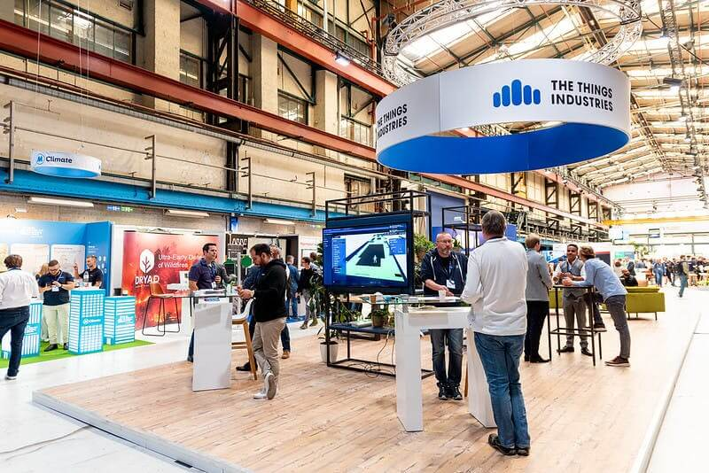
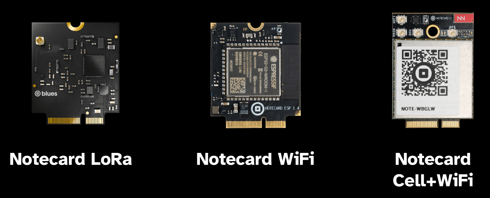
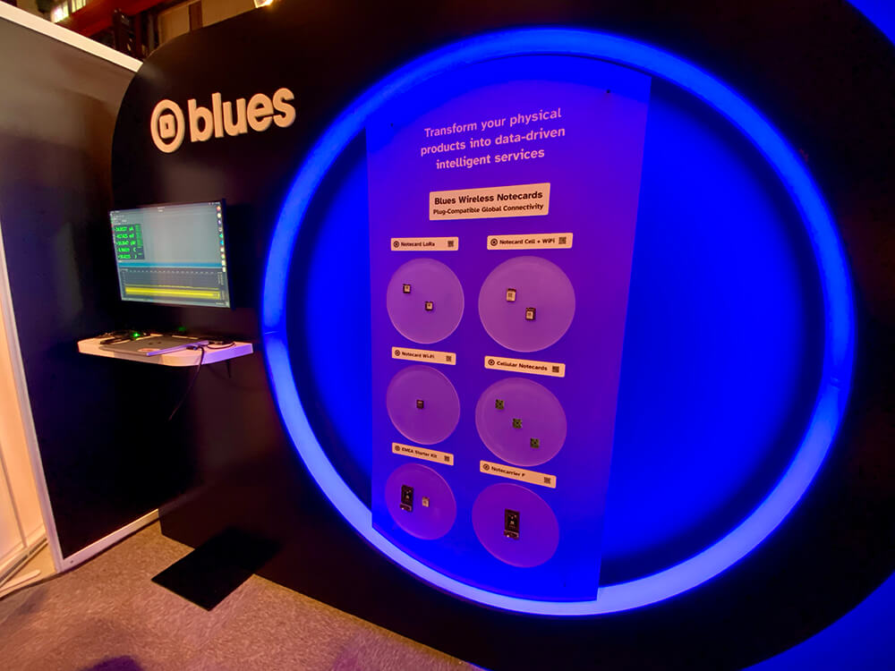
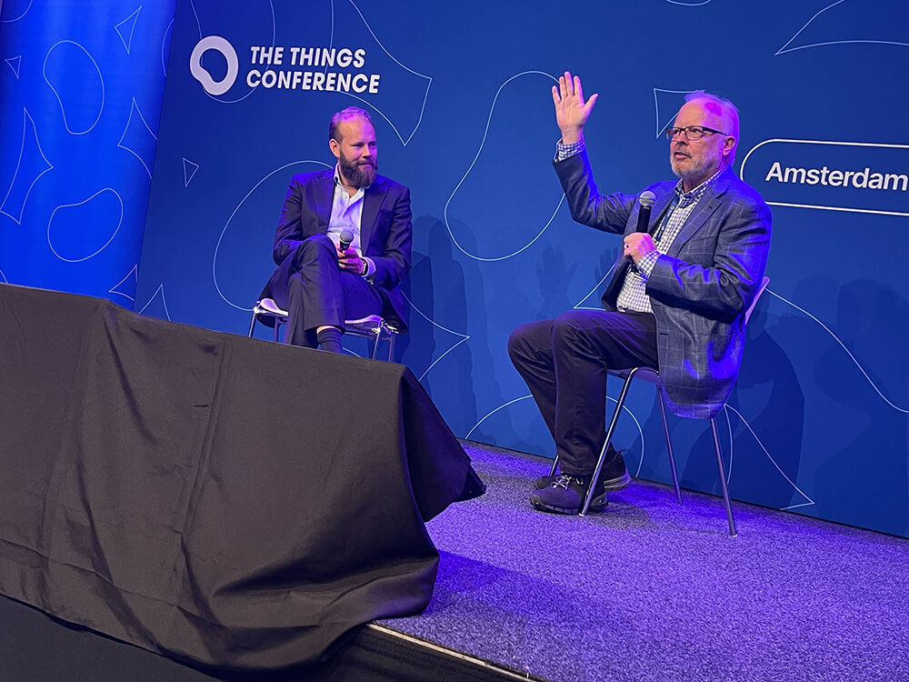
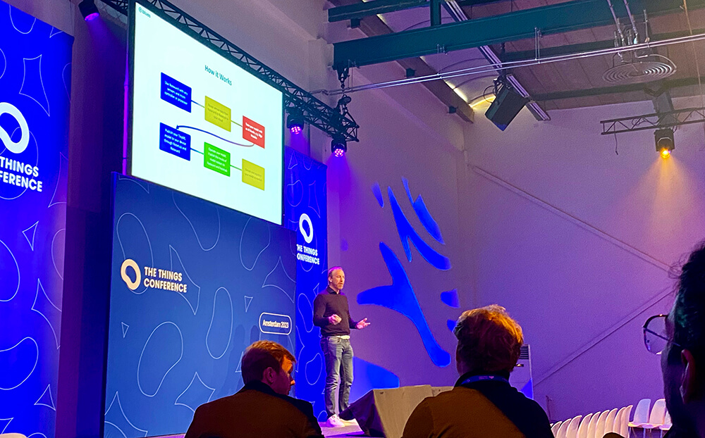
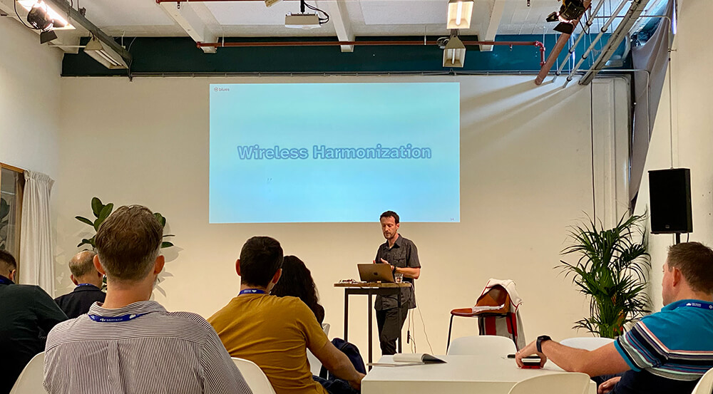
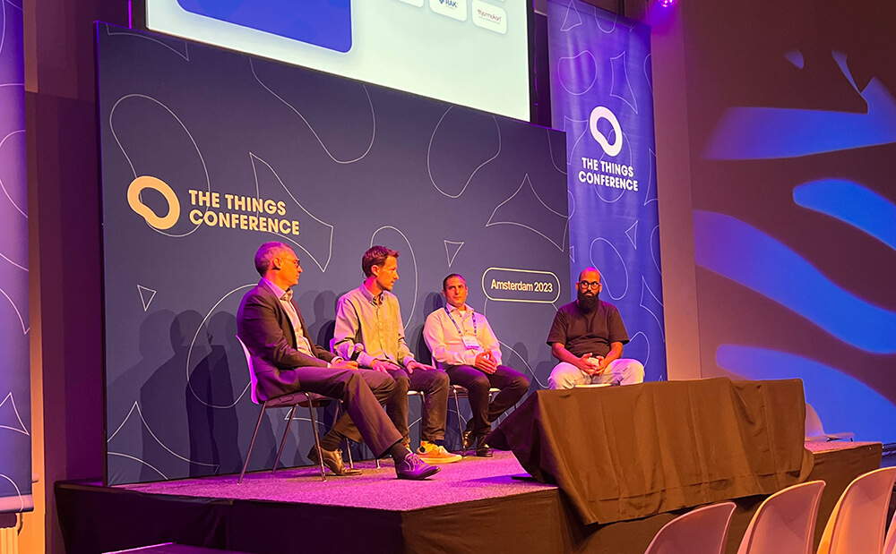
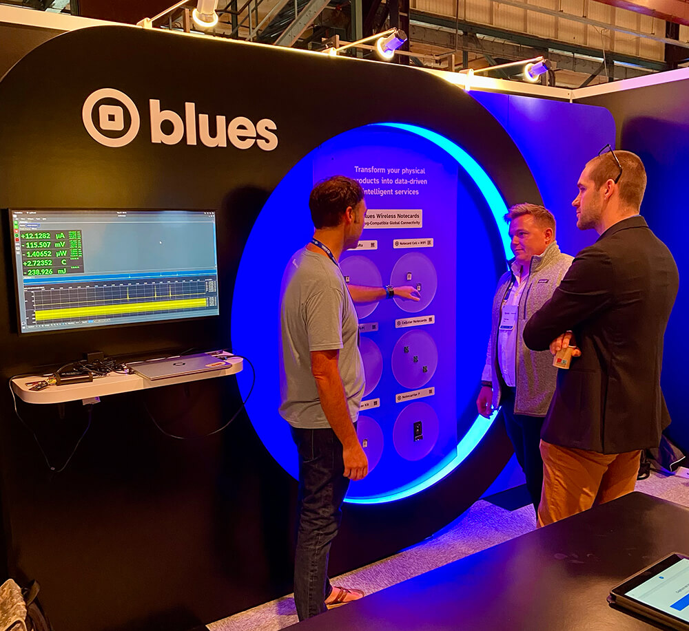
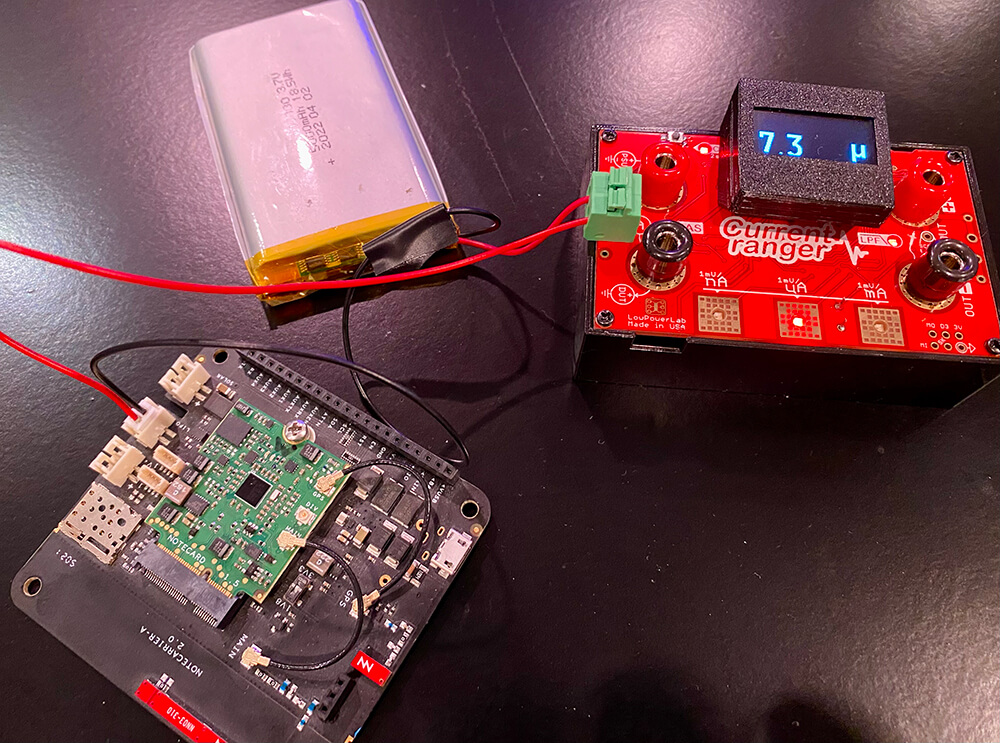

# Blues Launches into LoRa at The Things Conference

Last week the Blues team had the pleasure of sponsoring one of our favorite events of the year, [The Things Conference](https://www.thethingsconference.com/) in Amsterdam.

While widely known as the **premiere LoRaWAN event** (which only makes sense, considering the event hosts are [The Things Industries](https://www.thethingsindustries.com/)), this year felt different. It felt as though both attendees and vendors alike are starting to realize the importance of **wireless harmonization** - the idea that product builders should be able to choose the right Radio Access Technology at the point of deployment, and not up-front.

This played out through numerous 1:1 conversations with booth visitors and the wide array of sponsors who don't limit themselves to LoRaWAN, but instead have branched out into Wi-Fi, cellular, and even satellite!

Of course, this approach fits nicely into our recent launch of:

1. [Notecard Cell+WiFi](https://shop.blues.io/products/notecard-cell-wifi) (providing dual cellular and Wi-Fi on a single board).
2. [Notecard LoRa](https://shop.blues.io/products/notecard-lora) (provision-free access to public LoRaWAN gateways).
3. [Notecard WiFi](https://shop.blues.io/products/wifi-notecard) (a low-cost Wi-Fi solution).

In terms of the event itself, the Blues booth was a sight to behold (there were multiple mentions that our booth was the most striking!):

Likewise the extended Blues team participated in numerous presentations during the conference. This included our founder and CEO, Ray Ozzie, who joined CEO & Co-founder of The Things Industries, Wienke Giezeman, in a "Fireside Chat with Wienke and Ray":

Our President and CRO, Jim Hassman, leveraged his AI background to give an engaging talk on "Interconnected Intelligence: When IoT meets AI" to a full house:

Our VP of Developer Experience, Brandon Satrom, got hands-on with the new line of Notecards in a workshop on "Building Hybrid Connected Solutions with Blues":

Brandon also participated in a panel on the appropriately named, "What is going on in cellular IoT?":

The rest of us? Well, suffice it to say we held fort at the booth and talked some eager customers through the benefits of wireless connectivity with Blues!

We also featured the **low-power capabilities of the Notecard** in a demo that connected an idling Notecard + Notecarrier A to a current meter called the [Current Ranger](https://lowpowerlab.com/guide/currentranger/). Yes, the Notecard _really does_ idle at ~8uA!

Thanks to those of you who took the time to join as at The Things Conference - and we look forward to seeing you in-person again next time. 💙