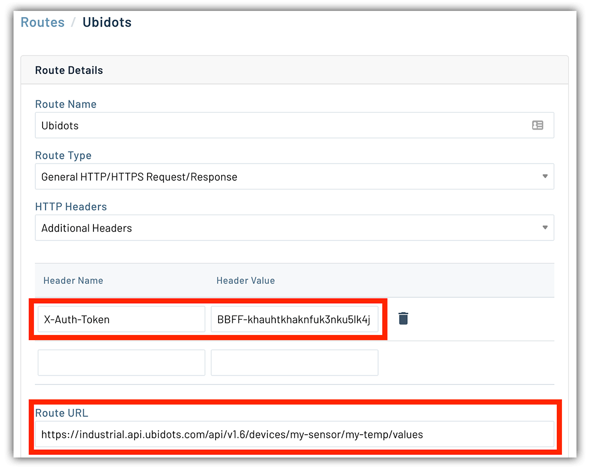

# Craft IoT Data Visualizations with Ubidots

To say IoT device deployments of every shape and size are booming is a bit of an understatement. Want some hard numbers? [IDC is predicting](https://www.idc.com/getdoc.jsp?containerId=prAP46737220) more than 55 *billion* devices will be deployed in the field by 2025. And the data associated with said devices? How does 73 *zettabytes* (that's 80,000,000,000,000 GB) sound? 🤯

Collected data might be something minuscule: a single data point from a single sensor logged once per hour. On the other end of the spectrum consider environmental sensor data monitoring volatile compounds. Data from these sensors could be accumulated in millisecond timeframes, 24/7/365, to ensure stability.

One piece of the puzzle is the collection of this data in the cloud. Another piece is tackling the ability to **derive meaningful insights** from the data. The ability to create intuitive dashboards and data visualizations is paramount. This is where customizable solutions like [Ubidots](https://ubidots.com/) come into play.

In this article we'll take a high level look at routing data collected from a device to a dashboard with hardware and services from [Blues Wireless](https://blues.io/) and Ubidots.

## From Device to Cloud

It's no secret that pumping sensor data from your average IoT implementation to the cloud is no trivial task. Factor in remote deployments outside the range of WiFi and Bluetooth, and cellular is likely your best option. Why? It's secure, reliable, and ubiquitous (especially when even 2G is more than enough for transmitting sensor data).

Where am I going with this? Let me introduce you to the [Notecard](https://blues.io/products/) from Blues Wireless:

<iframe width="560" height="315" src="https://www.youtube.com/embed/kixNa2tLTLU" frameborder="0" allow="accelerometer; autoplay; clipboard-write; encrypted-media; gyroscope; picture-in-picture" allowfullscreen></iframe>

The Notecard is a developer-focused device-to-cloud data pump built to address key pain points experienced today with cellular IoT:

- It's developer-friendly. 🤗
- Pricing is predictable (and affordable). 🤑
- Provisioning is automatic and security is baked-in. 🔐

For just a moment let's hone in on the "developer-friendly" aspect. Traditional cellular IoT platforms rely on using the arcane AT command syntax, such as:

	AT+CSQ
	AT+CREG=1
	AT+CREG?
	AT+COPS=?

...OR do a 180 degree pivot and abstract the complexity away to such an extent that individual use cases are nearly impossible to implement.

How does the Notecard solve this? JSON!

All commands to and from the Notecard are pure JSON, opening the door to developers of all types. For example, should we want to send sensor data in an event (i.e. "note") from Notecard to the cloud, this is how it might be composed:

	{
	    "req":"note.add",
	    "body":{
	        "temp":35.5,
	        "humid":56.23
	    }
	}

> Curious to know more about Notecard in action? Check out the [Blues Wireless developer portal](https://dev.blues.io/).

## From Cloud to Route

The beauty of Notecard lies not just in the cellular hardware and developer experience, but in its cloud-connected service: [Notehub](https://blues.io/services/).

Notehub enables synchronization of data between the cloud and your Notecard devices. It's available as a SaaS platform at [notehub.io](https://notehub.io/), but is also [open-source](https://github.com/blues), allowing you to customize it for your needs.

There is a lot we *could* talk about with Notehub, such as:

- Cloud-initiated device firmware updates.
- Organizing IoT projects and teams.
- Managing fleets of IoT devices.

However, the key feature that enables us to utilize the data visualization capabilities of Ubidots are *Notehub routes*.

## From Route to Dashboard

Notehub routes allow you to pipe (and optionally transform) data to your cloud provider of choice. Are you already invested in AWS, Azure, or GCP? Or in the context of this article, IoT-optimized platforms like ThingSpeak, InitialState, or Ubidots? Notehub has you covered.

To route our data to Ubidots, we simply provide Notehub authentication credentials and an endpoint. Every time Notehub receives events from a Notecard, they will immediately be routed to Ubidots.

*What's Ubidots you ask?*

Ubidots is a cloud service which provides data collection, analysis, and visualization tooling for connected IoT projects.

<video width="700" autoplay loop>
  <source src="https://ubidots.com/_nuxt/videos/out.70f9c29.mp4" type="video/mp4" />
</video>

With data streaming through from a Notehub route to Ubidots, we're able to add visualizations to better understand what our devices are telling us.

The intuitive interface of Ubidots allows you to quickly add one of many pre-defined data visualization templates.

Case in point: I spent all of about three minutes creating a histogram to show the frequency of temperature ranges over a given time period along with a thermometer to show the most recent reading:

## Next Steps

Adding engaging data visualizations for your IoT-generated data can make sense for more use cases than running an industrial sensor pulling in MBs of data every day. Take your next step with the Notecard and Ubidots by:

1. Reading over the [Ubidots routing tutorial](https://dev.blues.io/build/tutorials/route-tutorial/ubidots/) in the Blues Wireless developer portal.
2. Grab your own [Notecard Developer Kit](https://shop.blues.io/collections/development-kits) (and go through the tutorial for real!).
3. [Sign up with Ubidots](https://ubidots.com/) and create some amazing dataviz dashboards.

> And if you've made it this far, we're happy to offer a discount code for your Notecard Developer Kit! [Just use this link](https://shop.blues.io/discount/5JM00D2M3SA2_BLOG) for 10% off.