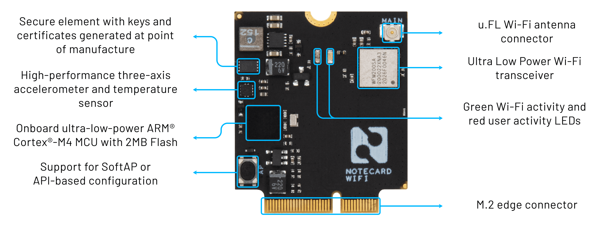

# Introducing the Wi-Fi Notecard

*Expand your wireless reach with a 30mm x 35mm System-on-Module that's compatible with any Cellular Notecard-based design.*

The Blues Wireless story began with prepaid low-power cellular, all wrapped up in a developer-friendly package. Today we mark a new chapter as we bring another connectivity option online: the [Wi-Fi Notecard](/products/wifi-notecard).

## Why Wi-Fi?

Cellular is the most ubiquitous (and secure) network connectivity option available. However, we've heard from many customers who *also* wanted a Wi-Fi option. *Why?* Well, you provided us with two key use cases:

1. You have mixed deployments where cellular makes sense at Location A, and Wi-Fi at Location B.
2. When prototyping, you'd rather use Wi-Fi instead of cellular to save on Notecard cellular data usage.

Let's see how the Wi-Fi Notecard can help.

> Be sure to consult the [Wi-Fi Notecard datasheet]() for more technical details.

## What the Wi-Fi Notecard Provides

While there is no shortage of Wi-Fi modules available for IoT developers, the Wi-Fi Notecard differentiates itself in five key ways:

### It's Swappable with the Cellular Notecard

If you're working on an IoT deployment that has mixed access to Wi-Fi and cellular, the Wi-Fi Notecard is fully hardware-interchangeable with the Cellular Notecard on any Notecarrier. This allows you to use different connectivity methods on the same PCB design.

### It Maintains Notecard API Compatibility

Building off of the "swappable" nature of the Wi-Fi Notecard, you can continue to use the same [Notecard APIs](https://dev.blues.io/reference/notecard-api/introduction/) you've been using with the Cellular Notecard (the exception being any Wi-Fi or cellular/GPS-specific requests and responses!).

	// Wi-Fi or Cellular:
	
	{
	  "req": "note.add",
	  "file": "sensors.qo",
	  "body": {"temp": 72.22 },
	  "sync": true
	}

### It Provides Secure Communications from Device-to-Cloud

The Wi-Fi Notecard provides end-to-end security from your device, to Notehub.io, and beyond to your cloud using TLS and optional [encryption of your data](https://dev.blues.io/guides-and-tutorials/notecard-guides/encrypting-data-with-the-notecard/).

### It's a Low-Power Wi-Fi Module

Like the cellular Notecard, the Wi-Fi Notecard is low-power by default, to the tune of ~8uA when idle. Network connectivity over Wi-Fi is not maintained continuously (unless you specify it to be), meaning your device doesn't have to sustain a network connection, thus saving power.

> Note that the Wi-Fi Notecard only connects to 2.4GHz access points (another power-saving feature).

### It's Easy to Setup

One of the advantages of the cellular Notecard is its zero-friction getting started experience, free from device provisioning and certificate management. We've also made the Wi-Fi Notecard setup experience as easy as possible by providing both an API to connect to a Wi-Fi access point (via [card.wifi]()):

	{
	  "req":"card.wifi",
	  "ssid":"<ssid name>",
	  "password":"<password>"
	}

...or alternatively through a UI on your smartphone to select the Wi-Fi access point you need:

## Get Your Wi-Fi Notecard

We welcome you to accelerate your IoT solution with the new Wi-Fi Notecard. Buy yours today on the [Blues Wireless store]().

Happy Hacking...on Wi-Fi! 👩‍💻

    