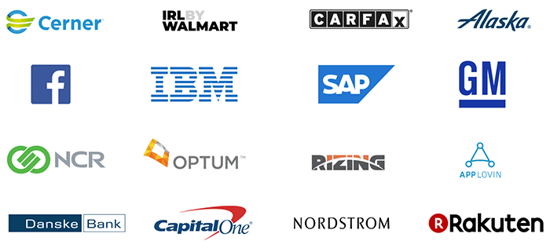

# Begin Your DevSecOps Journey on Learn Chef

For years now, [Learn Chef](https://learn.chef.io/) has been the destination of choice for IT ops practitioners to learn how to expand their DevOps skill sets. Whether it be learning about [securing your infrastructure](https://learn.chef.io/courses/course-v1:chef+Automate101+Perpetual/about), [managing a fleet of IT resources](https://learn.chef.io/courses/course-v1:chef+Infra101+perpetual/about), or [delivering applications](https://learn.chef.io/courses/course-v1:chef+Habitat101+Perpetual/about), Learn Chef has you covered.

But what about folks who are new to DevOps and DevSecOps (not to mention the extensive Chef portfolio)? Diving straight into these topics can be intimidating without the proper context.

This is why we are happy to announce the release of another new course on Learn Chef! [Beginning Your Chef Journey](#).

## So What's in the Course?

This new Learn Chef course was crafted especially for those of you who are new to the Chef portfolio. The course will help you to:

- Define **IT automation** and how it can benefit you and your organization;
- Learn about some of **Chef's best-known customers** (TIP: see below! 🧐);
- Explain what the **Chef automation** products and solutions do;
- Understand where Chef Software fits into **DevSecOps**.

*A look at just some of the organizations invested in Chef:*

In addition you'll get a brief intro to what DevOps even is, how it relates to DevSecOps, and where Chef fits into this IT operations puzzle. Finally, we provide some insight into **open source at Chef**. Case in point, did you know the following Chef tools are fully open source and comprised of one or more open source projects?

- Chef Infra
- Chef InSpec
- Chef Habitat
- Chef Workstation
- Chef Automate

> You can view all of our open source projects [on GitHub](https://github.com/chef/).

We ❤️ open source here at Chef and hope you do too!

## Your Next Step is Your First Step

If you've ever been curious about what Chef has to offer, we can't recommend a better resource for this first step on your Chef journey.

Curious about what app delivery with [Chef Habitat](https://www.chef.io/products/chef-habitat/) has to do with the [Chef Enterprise Automation Stack](https://www.chef.io/products/enterprise-automation-stack/)? What about Infra vs InSpec vs Automate!?! Don't worry, we've got your back.

There's no time like the present to enroll in [Beginning Your Chef Journey](#) on Learn Chef! 🎓