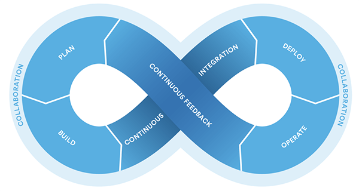
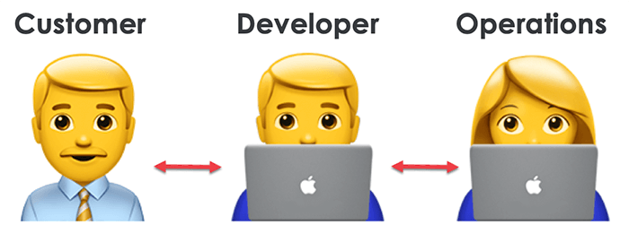
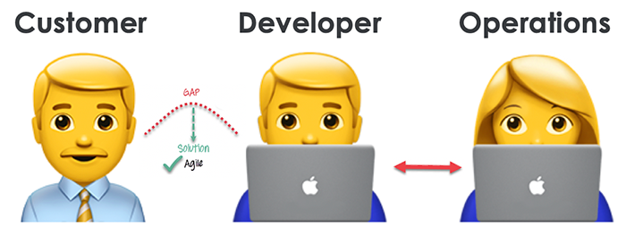
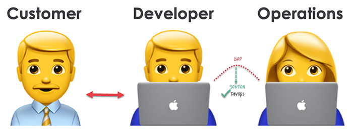

# DevOps for the Telerik App Developer

# A Brief Introduction to DevOps for App Developers

If you've been paying close attention, Progress (the company behind the Telerik UI components you know and love) recently completed its acquisition of Chef. Chef has been around since 2008 and is a well-established DevOps/DevSecOps company (more on those terms in a bit). Adding Chef to the Progress portfolio helps to round out this comprehensive offering of app development, management, and deployment tools and services.

So what does this mean for you, an app developer who just wants to write and ship code?

I'll be honest: it might not mean anything to you! Traditionally, folks in IT operations aren't the same people who write application code. In fact, they (again, traditionally) might not write code at all. This is part of what sets Chef apart: IT infrastructure and application delivery *as code*.

Before we continue, let's make sure we are all on the same page regarding "DevOps" and "DevSecOps".

## So What Exactly is DevOps?

Let me save you a trip to Wikipedia:

> DevOps is a set of practices that combines software development (*Dev*) and IT operations (*Ops*).

DevOps is a fundamental aspect of collaboration between engineering and IT operations to deploy better code, faster, in an automated manner. DevOps helps to improve an organization's velocity to deliver apps and services. DevOps is all about alignment: alignment of engineering and IT ops via improved collaboration and communication.

*For example:*

In the **old model of infrastructure allocation**, you either allocate existing server space or purchase new servers. The dev team finishes building their app and transitions to testing. Ops works on provisioning servers and the extensive paperwork required to deploy this new infrastructure. Under the **DevOps model of infrastructure allocation**, engineering and ops work together to allocate and provision access to a cloud, on-premises, or hybrid infrastructure.

Likewise, the lack of transparency in infrastructure transparency led to dev team issues with failover, redundancy, unknown data center locations, and opaque storage. This is wildly ironic as they are the ones with deep knowledge of the apps they are deploying. With a proper DevOps model, all these issues and projections of issues can be resolved easily due to the cloud infrastructure but more importantly due to the collaboration between engineering and ops.

Another example is with load testing. Before going to production, load testing could crash the app in a staging environment. The release is delayed, which infuriates stakeholders and requires other groups like marketing and sales to adjust their plans. With DevOps, well before production, load testing is done on these pre-provisioned servers. Identifying issues early and often during building. This allows plans to be adjusted earlier and expectations to be better managed.

So a lot of what devops brings is improved collaboration and improved communication. You may also hear about CI or CD, continuous integration or continuous delivery. Those concepts dovetail nicely into the devops conversation as well. As again, these speak to launching products faster with higher quality into the market.

## The DevOps Life Cycle

Next let’s talk a bit about the devops lifecycle. By now we realize that devops really means a deep integration between engineering and ops. But you can’t truly understand and appreciate devops without knowing the full continuous mobius-strip devops lifecycle.

1. Development
Development is constant, right. In this phase the entire dev process is separated into small cycles. This enables the DevOps team to speed up dev and delivery processes.
2. Testing
QA teams use tools like Selenium and Telerik Test Studio to identify and fix bugs in new code just delivered, and to perform regression testing on old code.
3. Integration
In the integration stage, new functionality is integrated with legacy code and the aforementioned regression testing can take place as well. Continuous development is only possible with continuous integration and continuous testing.
4. Deployment
Deployment also takes place in a continuous manner. Any time the code changes it shouldn’t impact the functioning of a highly used app or website.
5. Monitoring
In the monitoring phase, the ops team will take care of any inappropriate system behaviors or bugs which are inevitably found in production as we all know.

## DevOps vs Agile

Where then does DevOps fit in relative to agile methodologies of app development? Some folks think there is a fundamental conflict between the two, but I think it's precisely the opposite. A typical IT process involves customers or stakeholders….developers….and operations. I think we can all basically agree on that.

Agile is extremely important and addresses gaps in communications between customers and developers.

Whereas DevOps addresses these communication gaps that can exist between developers and IT operations.

To me DevOps addresses a fundamentally different part of the app development and deployment equation.

## And DevSecOps...?

A relatively new entry in the DevOps space is this concept of DevSecOps. The "Sec" in DevSecOps stands for security. And if you've learned anything so far, you can probably guess that DevSecOps adds security-conciousness to your DevOps methodology.

Again, according to Wikipedia:

> DevSecOps is an augmentation of DevOps to allow for security practices to be integrated into the DevOps approach.

I like that description, but an even easier way of grokking this is to think of the purpose of DevSecOps being to consider security at all stages of the app development and delivery process. It truly builds on this new mindset that everyone at every stage is responsible for app and data integrity and security.

## DevOps in Summary

So to summarize what devops is and the benefits it provides, I give you six guiding principles which are really essential when your organization adopts the devops practice.

1. Customer-Centric Actions: The devops team must constantly invest in products and services that directly benefit their customers and users.
2. End-To-End Responsibility: The DevOps team needs to continually provide support. This raises the level of responsibility and the quality of the products engineered.
3. Continuous Improvement: Your DevOps culture should focus on continuous improvement. Continuously speed up the velocity and quality of products and services you offer.
4. Automate Everything: Automation is vital. Not only for software dev but for the entire infrastructure.
5. Work as One Team: Designer, developer, and tester are well defined and they need to work as one team with uninterrupted collaboration.
6. Monitor and Test: The team has to have robust monitoring tools and full-fledged testing procedures.

So how does Chef play into this?

## Chef

When Chef Software first launched, it played squarely in the infrastructure-as-code space, but in 2016 the company expanded its horizons with the release of Habitat, which brings automation to the software delivery lifecycle. Last year, Habitat became a part of the company’s more comprehensive offering, called the Enterprise Automation Stack, which offers security policies, application lifecycle, and infrastructure, all expressed as code, along with deployment, management, and observability tools.

infra: Chef Infra automates infrastructure configuration, ensuring every system is configured correctly and consistently.

desktop: Chef Desktop allows IT resource managers to automate the deployment, management, and secure maintenance of any large fleet of IT resources – such as laptops, desktops, and kiosk workstations – from a centralized location. With Chef Desktop, organizations can gain control over IT resources, ease the management burden, and ensure compliance to minimize risk.

inspec: Chef InSpec provides a language for describing security and compliance rules that can be shared between software engineers, operations, and security engineers. Chef InSpec, compliance is evaluated at every stage of development, ensuring issues are captured early, and problems don’t resurface allowing for faster, safer releases.

https://d33wubrfki0l68.cloudfront.net/898165be365d7e99eb84965000140b8dfc28179a/2586b/images/products/graph-inspec-beforeafter@2x-1.png

Habitat:

xplained that the culmination of agile development methods, the advent of microservices, along with a mixture of on-premise and cloud environments, not to mention tools like Docker and Kubernetes, has created a messy situation for many modern enterprises.  “Every application, every technology you pick, every new cloud deployment, it adds another layer of complexity. You’ve got new databases, middleware, new system libraries, new build systems, new build processes, and it gets to be messy and really quickly,” Krasnow told The New Stack. “How do you tame that mess in a way to bring some consistency to that process? Habitat is basically automation for defining packaging and delivering applications. You define everything the application needs to run — here’s the code, how to build it, how to run it, what healthy looks like — and then you can go deploy that using our agent and make sure that it gets deployed successfully.”

In essence, Chef Habitat enables you to pack everything your application needs to run, including all of the automation steps, into a coherent package that is runtime environment agnostic. It makes it easier for you to not only automate the provisioning of your infrastructure but also ensure that all the dependencies are in place for your application to run reliably.

Next, a single dashboard brings together infrastructure configuration information from Chef Infra, compliance status from Chef InSpec, and application delivery data from Chef Habitat, providing a single view into the entire Enterprise Automation Stack.

https://cdn.thenewstack.io/media/2020/01/aa88a2c2-hab-service-groups.png

## The Next Step on Your DevOps Journey

Hopefully you now have a slightly better idea of what DevOps is and how DevOps practices can help you and your business. If you'd like to know more about what's happening at Chef, I welcome you to check out a fantastic resource: Learn Chef.

Learn Chef is a collection of deep-dive courses that tackle all of the important aspects of DevOps and their linked product in the Chef portfolio. For example, if you're interested in improving app delivery, you'll want to look at Chef Habitat and the Learn Chef course, "xxx".

Otherwise, hit up the Chef community on Slack and take advantage of the numerous free resources provided. Happy DevOpsing!