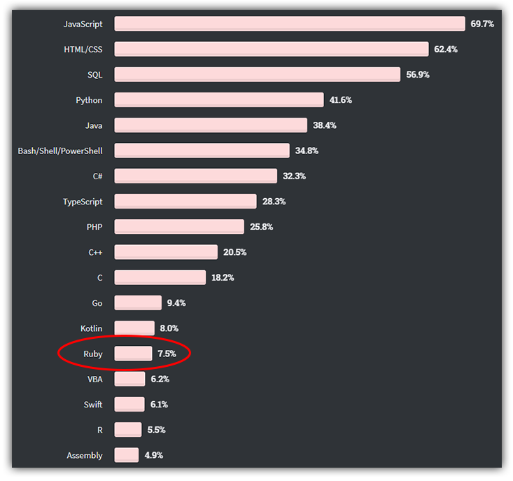
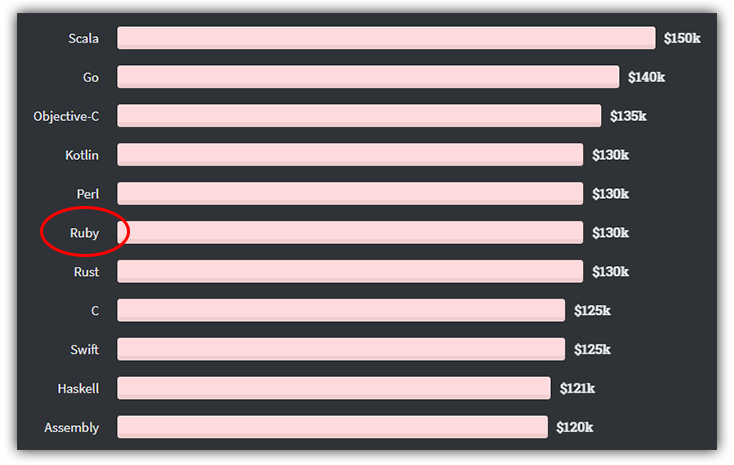

# Learn Ruby Basics on Learn Chef

Ruby. Few programming languages (save for maybe JavaScript 😛) draw such passionate lovers and haters of a free and open source offering. Promoters exalt on the power and simplicity of the language. It's easy to learn, yet still extremely powerful when mastered. Detractors counter with lackluster performance and immature documentation issues as their reason to shy away.

Opinions are like...well...let's just say everyone has one! Objectively speaking, Ruby is still a relatively "new" language. It was first released in the mid-90's, which may mean there is still a lot of upside to be discovered! Not to mention, some of the top companies in the world rely on Ruby to run their business:

- Twitter
- Shopify
- Airbnb
- Basecamp
- Discourse
- ...and many more!

> Want to skip the blog post and get right to the point? Check out our new course on Learn Chef: ????

While the Ruby language itself is not among the most popular:

...it IS however one of the highest paying! 🤷

*Source: [Stack Overflow 2020 Developer Survey](https://insights.stackoverflow.com/survey/2020)*

## What is Ruby?

For those of you out there who are Ruby-curious, we can't say it much better than the maintainers of Ruby:

> [Ruby is a] dynamic, open source programming language with a focus on simplicity and productivity. It has an elegant syntax that is natural to read and easy to write.

The syntax is fairly terse and generally accepted as easy to grok:

	# Output "I love Ruby"
	say = "I love Ruby"
	puts say
	
	# Output "I *LOVE* RUBY"
	say['love'] = "*love*"
	puts say.upcase
	
	# Output "I *love* Ruby"
	# five times
	5.times { puts say }

At its core Ruby is a general-purpose, interpreted, dynamic, object-oriented Language. It is open-source and functions identically on Windows, macOS, and Linux. Ruby can be used for a variety of purposes, from web development to game development and beyond.

Some of the key high-level features of Ruby include the fact that it's...

- **A High Level Language:** Ruby reads like English, which makes reading and writing Ruby easy.
- **A Dynamic Programming Language:** Operations otherwise done at compile time can be performed at run time.
- **Object Oriented:** Everything in Ruby is an object that you can manipulate to build and execute programs.
- **Interpreted:** You can execute Ruby programs without compiling the code first.
- **Extended by Frameworks:** Ruby is supported by a number of useful, well-maintained frameworks like [Ruby on Rails](https://rubyonrails.org/), [Sinatra](http://sinatrarb.com/), and [Padrino](http://padrinorb.com/).

Any way you look at it, Ruby is a popular, modern programming language that is easy to learn, yet powerful enough to develop industry-leading enterprise applications.

**So what does this all have to do with Learn Chef?** Yes, the Learn Chef platform has traditionally focused on free DevOps- and DevSecOps-focused courses. However, we are actively branching out into *complementary technologies and languages* that support the Chef portfolio.

> Ruby is a critical for Chef practitioners to know when understanding and writing code in resources, recipes, and cookbooks!

## What's in the Course?

This free course on Learn Chef will introduce you to Ruby and help you go from zero knowledge to being a productive novice Ruby user. We start off with Ruby basics and advance along with fundamentals of programming like control flows, functions, OOP, and I/O. We'll even venture into the Ruby testing ecosystem.

*Here are just some of the topics covered:*

- Basic Ruby Syntax
- Control Flow and Collections
- Functions
- Classes and OOP
- File, Console, and Network I/O
- Testing

## Learn Ruby Today!

When you're ready to start your journey with Ruby and Chef, join us on Learn Chef and the ????? course. 🎓
