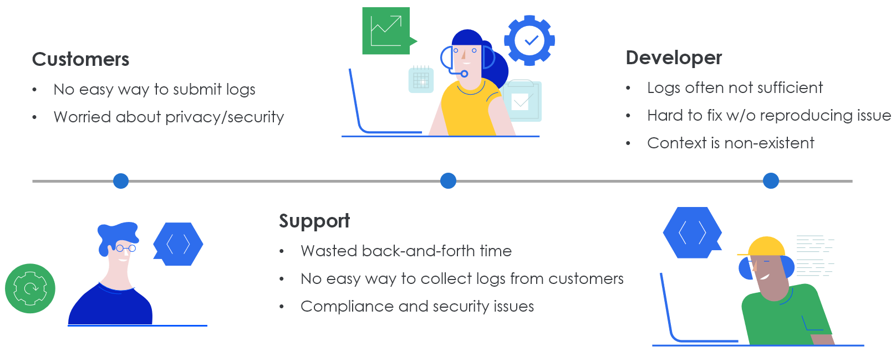
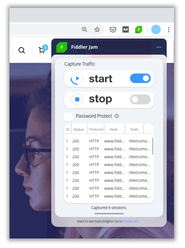
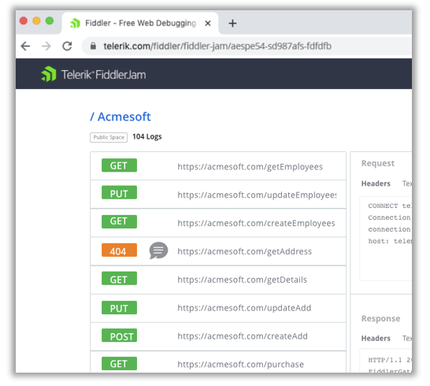
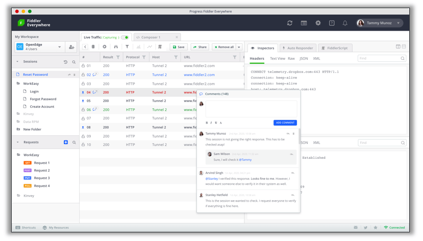

# Introducing Fiddler Jam

It's time we all faced a harsh reality: debugging customer issues remotely is, at best, difficult and at worst...impossible.

The vast majority of web, mobile, and desktop apps consume remote APIs and services. What happens when the end user's network fails? What if a third-party API goes down? And if your backend stops responding? I'll tell you what happens: your users complain! 🗣️

Nowadays support teams can spend an inordinate amount of time on just determining what basic issues your customers are experiencing. Then they have to collect adequate information from customers to properly convey the issues to the dev teams. Even with a well-documented story, it can still be difficult for engineering to properly replicate the issues at-hand. Not to mention the **security and privacy considerations** we face when sharing potentially sensitive network and application logs.

We have ourselves quite the problem, don't we?

## Enter Fiddler Jam

For years now, [Fiddler](https://www.telerik.com/fiddler) (and now Fiddler Everywhere) users have been using built-in product capabilities to effectively capture, re-create, and replay issues to help resolve these problems. And of course Fiddler works great, but doesn't truly address the pain experienced by customers and support teams. This is where a new product from the Fiddler team comes into play: **Fiddler Jam**.

> Fiddler Jam is a troubleshooting solution for support & dev teams to help them troubleshoot issues in a fast, easy, and secure manner.

Fiddler Jam helps **non-technical end users** to isolate issues by capturing HTTP(S) network logs in the customer's own environment. It then enables the secure sharing of these logs between the customers and your **support teams**. Finally, with full Fiddler Everywhere integration, the dev team can load the logs and replicate the issue locally, using tooling they are already comfortable with.

*If you're heard enough already, head on over to the [Fiddler Jam website](https://www.telerik.com/fiddler-jam) to sign up for early access!*

So how does Fiddler Jam work...really?

### The Customer

*Your customers will:*

- Install a lightweight client (starting with a Chrome browser extension)
- Start recording network requests/responses
- Reproduce the issue at-hand
- Save their recordings and share them via the cloud

### The Support Team

*Your support team will then:*

- Open the customer-provided issue in a browser
- Access the protected private space where issues are stored
- Triage the issue, add context, and share with the development team

### The Development Team

*Finally, your development team will:*

- Receive a notification of a new issue
- Review any notes provided by the support team
- Load the log files into Fiddler Everywhere for further analysis

All leading to a seamless method of remotely debugging issues. It's a literal win-win-win for customers, support teams, and development teams!

## What's Next?

We are still in *very* early stages of product development with Fiddler Jam. However, if this scenario intrigues you, we highly recommend you [take a look at the Fiddler Jam website](https://www.telerik.com/fiddler-jam). Here you can learn a little more about Fiddler Jam and sign up for early access via our [Fiddler Jam Pilot Program](https://www.telerik.com/fiddler-jam#register).

Happy network debugging with Fiddler! 🐛🚫