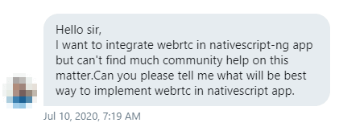
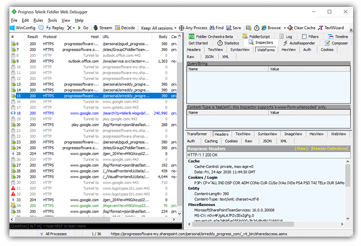
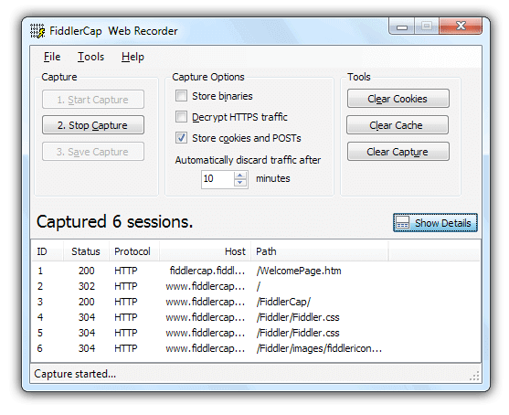
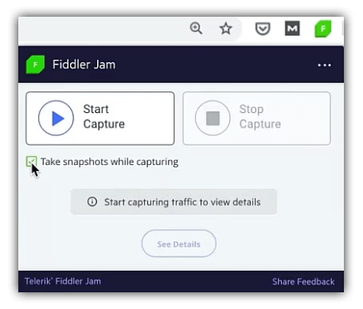
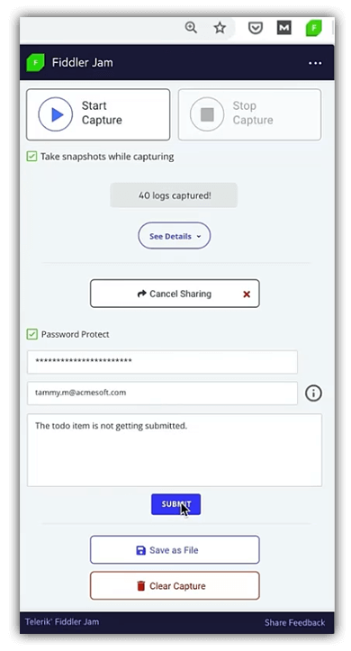
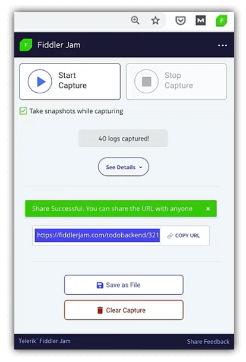
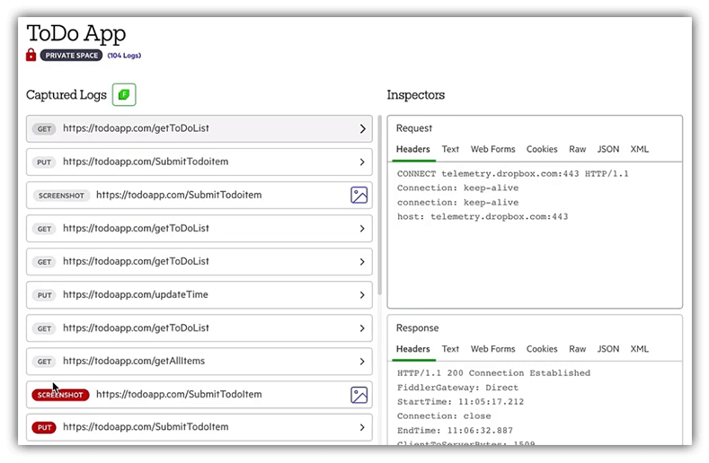
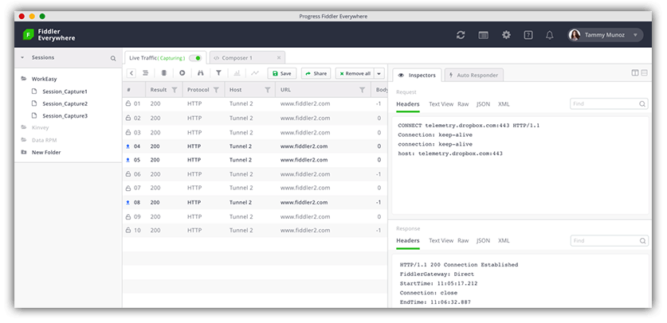

# Bridging the Debugging Gap Between End Users and Developers

I'm sure many of y'all have seen the movie [Office Space](https://en.wikipedia.org/wiki/Office_Space). And I'm guessing a subset remember the scene with Tom Smykowski, justifying his position at Initech:

<iframe width="560" height="315" src="https://www.youtube.com/embed/RAY27NU1Jog" frameborder="0" allow="accelerometer; autoplay; encrypted-media; gyroscope; picture-in-picture" allowfullscreen></iframe>

The cruel irony in this scene is that while yes, his job is to literally relay information from the customers to the engineers, it's the critical aspect of *communication from non-technical to technical* that is omitted. It's a better joke that way in the movie, but in real life, communication between technical and non-technical people isn't as easy as we might hope.

Take tech support for example. If you're a technically-oriented end user paying for a technical product, you probably interface with support engineers via a private forum or email system. And if you're not a paying customer? Well, you likely find any and every way you can to reach out to product experts. That could be GitHub issues or my (least) favorite, DMs on Twitter:

But I get it. End users are under duress and looking for any option for help. For us technical folks, this mostly works just fine. We are both (generally) speaking the same speak. We can translate our issues directly into actionable tasks for the people ultimately responsible for the products/features/frameworks we use.

What about non-technical end users? Or what about technical folks who want an *even easier* way of communicating problems? This is a problem the [Fiddler](https://www.telerik.com/fiddler) team is aware of, and has been working to solve, for years now.

Let's take a quick look at what we've done in the past and how we are looking to help solve this problem in the near future.

## The Past: FiddlerCap

Fiddler is widely known as a robust Windows-only tool for inspecting and debugging network requests. Have a problem with a remote endpoint? Just boot up Fiddler and analyze literally all of the traffic to/from that endpoint.

**But we can't expect end users to do the same.** This is where [FiddlerCap](https://www.telerik.com/fiddler/fiddlercap) came into play. FiddlerCap is a lightweight client (but also Windows-only) that is fairly easy for non-technical users to install and run to capture logs and share with a tech support team.

FiddlerCap works well for this specific Windows-only use case, but it doesn't help to solve all of today's problems:

- ❌🍎 FiddlerCap is Windows-only in an increasingly macOS-oriented world;
- ❌🧍 While easier to use than Fiddler, it's not easy enough for non-technical end users;
- ❌🤝 There are no built-in session sharing features with FiddlerCap. That part is all manual (and potentially not secure).

We can do better! 🏆

## The Future: Fiddler Jam

Let me introduce you to the newest member of the Fiddler family: [Fiddler Jam](https://www.telerik.com/fiddler-jam).

Fiddler Jam's primary value prop is to eliminate the friction that exists between end users, support/QA teams, and developers when dealing with remote support issues.

*If you're more into videos than reading the rest of this article, check out our "Introducing Fiddler Jam" video:*

<iframe width="560" height="315" src="https://www.youtube.com/embed/JID1mdKIgXQ" frameborder="0" allow="accelerometer; autoplay; encrypted-media; gyroscope; picture-in-picture" allowfullscreen></iframe>

Now I'm making a pretty **bold** claim here. The communication cycle of `end users <--> support teams <--> developers` is fraught with peril. Context is lost between each step. Key technical details are often missed entirely. End users are naturally frustrated as not only are they dealing with a problem, they also have to work on *effectively communicating* that problem while *experiencing frustration*. Yikes! 😱

**So how does Fiddler Jam help to alleviate these problems?** Let's walk through some key steps in the process and maybe I can prove to you how Fiddler Jam (while maybe not solving the problem entirely) can reduce some of the friction.

> If this sounds interesting to you at all, be sure to sign up for the [Fiddler Jam pilot program](https://www.telerik.com/fiddler-jam#register)!

## Fiddler Jam for End Users

The tool our end users will use is the Fiddler Jam Chrome extension. This is a dead-simple browser extension that enables both technical and non-technical users to capture, save, and securely share logs associated with their web browsing experience. If you can install an extension and click on a couple of buttons, you can create log files the support team needs to do their job.

With the problem website open, the user will simply click on **Start Capture** to record their experience on the open browser tab. They have the additional option to capture screenshots on mouse clicks to add additional context to the captured session.

When a session is captured, users will click to **Stop Capture**, provide a password to encrypt the log files, and add some prose to round out the narrative.

With the encrypted session saved to the cloud, a URL is provided, which allows the end user to securely share the session in any manner they desire (e.g. email, forum, chat, whatever). Since sessions are securely stored in our cloud, it's up to the end user to then safely share the private password with the support team.

## Fiddler Jam for Support Teams

Now when we say "support team" we could also be referring to the development team, depending on how large the organization is and who handles support. Regardless, the next step is to quickly filter, triage, and inspect issues without having to deal with any external tooling.

The first step for the support team is to open that URL provided by the end user. After entering the password, saved sessions are decrypted and displayed in a web portal.

Users of [Fiddler Everywhere](https://www.telerik.com/download/fiddler-everywhere) will recognize this UI as it provides a similar, lightweight, inspection experience. By clicking on individual sessions, they can see screenshots, comments, and inspect requests/responses.

This provides an opportunity for the support team to triage issues, elicit additional context from the end user, and (if needed) forward the issue on to the development team for resolution.

## Fiddler Jam for Development Teams

At this point in the process, there is an issue in-hand that contains the technical logs (and narrative context) supplied by the end user, with additional comments provided by the support team. In most cases, this is enough for the development team to commence resolution.

By using the same web portal, the dev team can look at high level details about any individual request/response cycle. **This is also where it gets fun** as the development team can now take this session and **load it directly** into [Fiddler Everywhere](https://www.telerik.com/fiddler):

Fiddler Everywhere provides enhanced inspection, debugging, and request/response replication abilities to fully understand (and resolve) the issue.

*How?*

- 🚦 [Traffic Inspector](https://www.telerik.com/fiddler/usecases/https-traffic-recording) allows you to save HTTP/S traffic sessions for later play back;
- ♻️ [Auto Responder](https://www.telerik.com/fiddler/usecases/mock-network-requests) provides a means of mocking responses to individual requests;
- 📝 API Composer lets you compose and tweak API requests and inspect results;
- 🧑‍🤝‍🧑 The built-in [team collaboration tools](https://www.telerik.com/fiddler/usecases/team-collaboration) allow dev teams to collaborate on individual sessions without leaving the Fiddler UI!

## Summary

Let's be clear: the support process can be immensely difficult to optimize for every person and team involved. End users are dealing with a considerable amount of frustration and stress and this often compounds the problem for support teams.

With Fiddler Jam, we are looking to help optimize every step of the process: removing friction and improving communication from end users ➡️ support teams ➡️ development teams.

If you'd like to learn more, head on over to the [Fiddler Jam website](https://www.telerik.com/fiddler-jam), sign up for the [pilot program](https://www.telerik.com/fiddler-jam#register), and experience for yourself (relatively) stress-free support tickets 😌.

