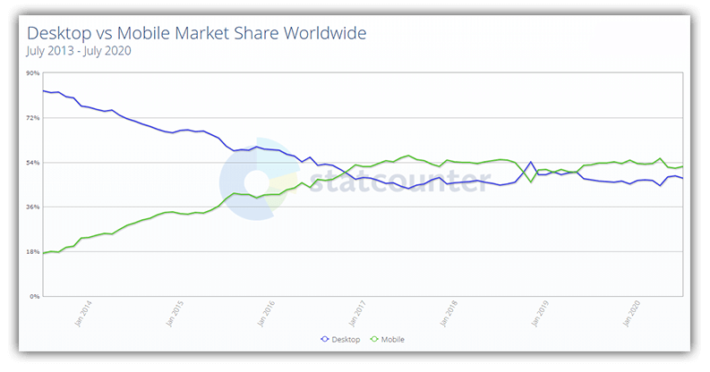

# Optimizing Your Website with Fiddler and Lighthouse

Improving web performance has been a sort of rallying cry for some time now. As the world moves to an increasingly mobile-first view of the web, optimizing experiences for limited bandwidth, varying screen sizes, and minimal processing power is paramount.

It should also be no surprise that mobile web traffic eclipsed desktop traffic about four years ago, and has maintained a steady lead since then:

Born out of this mobile-first focus was a new type of app called a [Progressive Web App (PWA)](https://en.wikipedia.org/wiki/Progressive_web_application). Expanding upon the foundations laid by the responsive web design movement, PWAs are focused on providing a progressive experience (working on any browser), responsiveness, and native-like app functionality.

*Some key features of PWAs include:*

- 🏎️ **Speed!** PWAs are responsive to all user interactions and generally "jank-free".
- 😌 **Native-like.** PWAs feel as though they belong on your device with an engaging UX, virtually as good as a native app.
- 🔌 **Offline functionality.** PWAs work as well offline as online.

So as we collectively march towards this PWA/responsive design/mobile-first utopia on the web, how do we work to optimize existing websites? How do we measure our impact of utilizing optimized JavaScript assets, compressed images, and combined network requests? Enter the Lighthouse 💡🏠 tab of our [Chrome DevTools](https://developers.google.com/web/tools/chrome-devtools)!

[Lighthouse](https://developers.google.com/web/tools/lighthouse) allows us to measure the performance, accessibility, best practices (e.g. legible text, valid tags, successful return codes), SEO status, and PWA-readiness of our web apps. By using Lighthouse, we can iterate on changes to measure their performance impact.

Let's take a look at how we can take an existing website and optimize its performance with a few simple steps using our favorite web debugging tool, [Fiddler Everywhere](https://www.telerik.com/fiddler).

## What is Fiddler Everywhere?

Fiddler Everywhere is a web debugging proxy for any browser, any device, on any platform. It's a tool used to log all HTTP/S traffic between your computer and the world, inspect/edit/reply to that traffic, compose API requests, and *fiddle* with incoming and outgoing data.

You may have heard of the original Fiddler (Fiddler Classic) in the past as a robust Windows-only tool for web debugging. Fiddler Everywhere builds upon the core features of Fiddler Classic, but wraps them up with a new UX and a cross-platform shell for use on macOS, Windows, and Linux.

> **NOTE:** Fiddler Classic (the original Fiddler) isn't going anywhere! [You can still download Fiddler](https://www.telerik.com/download/fiddler) and use it like you always have on your Windows PC.

## Our Victim...I Mean Subject!

Most existing public websites aren't valid candidates for PWAs, but I would propose that most *are* in need of performance optimizations. Let's take a text- and image-heavy website like [npr.org](https://www.npr.org/) for example.

Taking a quick glance at the page source, we see numerous distinct `
	
	
	
	<link rel="stylesheet" data-persist="true" media="screen, print" href="https://bundles.npr.org/dist/bundles/persistent-css-b7e2f630d3eab0a610d7.css" />
	<link rel="stylesheet" media="screen, print" href="https://bundles.npr.org/dist/bundles/newsHp2-css-b7e2f630d3eab0a610d7.css" />
	

Our first step is to run a Lighthouse test against npr.org with our browser's DevTools (focusing on only the **Performance** option):

Yikes! 😨 This performance score is downright awful. If we look at the recommendations provided by Lighthouse, the top three correspond to just what Fiddler Everywhere can help us with:

1. Remove unused JavaScript
2. Serve images in next-gen formats
3. Remove unused CSS

Let's see how with a few simple steps we can use the [Traffic Inspection](https://docs.telerik.com/fiddler-everywhere/get-started/capture-traffic) and [Auto Responder](https://docs.telerik.com/fiddler-everywhere/get-started/mock-server-response) features of Fiddler Everywhere to help optimize this site even just a little.

If I open up Fiddler and reload npr.org, we can get an idea of the sheer number of network requests and the types of assets returned:

And this is only about 1/3 of the total number of requests! 🤯

What we need to focus on now is reducing the number and size of our requests for JavaScript and CSS files to see if we can improve our Lighthouse score.

## Reducing Size and Scope of JavaScript Requests

My first step would be to see if we can combine and minify some of our JavaScript assets. If I filter by type of request and narrow that down to `.js` and `.css` files, we see the following (and then some):

In a perfect world, I would be able to quickly combine all of my JavaScript and CSS assets into two files (e.g. `app.js` and `app.css`). Your mileage may vary depending on how many third party files you are accessing, but since nothing is real on the Internet anyway, we can at least pretend it's possible here! 😎

We now need a way to effectively redirect requests for the original `.js` files to this new magical consolidated file we've created locally. This is where the Fiddler Everywhere Auto Responder rules come into play.

Fiddler Everywhere's Auto Responder allows us to intercept specific requests and swap out the response with a variety of actions:

- **exit** (Stop processing rules at this point)
- **drop** (Close the client connection immediately without sending a response)
- **reset** (Reset the client connection immediately using a TCP/IP RST to the client)
- **delay:100** (Delay sending request to the server by x number of milliseconds)
- **ReplyWithTunnel** (When Fiddler sees a CONNECT Tunnel matching this rule, it informs the client that the connection was successful without actually creating a tunnel.)
- **header:HeaderName=NewValue** (Set the Request header with the given Name to the specified value. If no header of that name exists, a new header will be created. Non-final action.)
- **redir:http://www.example.com** (Return a HTTP Redirect to the target URL. Unlike the simple URL rule, this ensures that the client knows where its request is going so proper cookies are sent, etc)
- **http://www.example.com** (Basic HTTP redirect)
- **Return manually crafted response** (Literally compose a response string in Fiddler Everywhere)
- **Choose saved response file...** (Return contents of the filename as the response)

What we want to do is relatively straightforward. We want to **drop** all requests for `.js` files *except* for one which will return our local consolidated and optimized `app.js` file. How might we accomplish this in an Auto Responder rule?

	MATCH: EXACT:https://apps.npr.org/elections20-primaries/embeds/headlines.js
	RETURN: C:\src\app.js

☝️ this matches a specific JavaScript file request and replaces it with my optimized local file.

How do we create this rule? I can quickly set up a new Auto Responder rule by right-clicking on a specific request in our traffic pane and choose **Add New Rule**:

And then we need another rule:

	MATCH: regex:(?inx).js
	RETURN: *drop

☝️ this matches all other requests containing `.js` and simply drops the requests.

We can use a very similar set of rules to do the same for our CSS files:

## Optimizing CSS Requests

What we just did for JavaScript files we can now apply to our stylesheets. I'll again create a set of Auto Responder rules, one to intercept a single request and the other to block the rest:

	MATCH: EXACT:https://apps.npr.org/elections20-primaries/embed.css
	RETURN: C:\src\app.css

☝️ this matches a single, specific, CSS file and replaces the response with my local version.

	MATCH: regex:(?inx).css
	RETURN: *drop

☝️ this matches all other requests containing `.css` and drops them entirely.

## Image Optimization

Clearly npr.org is an image-heavy website. Often overlooked in favor of squeezing out an extra 2KB from your favorite JavaScript library, optimizing image files can have a massive impact on page load speed. My favorite tool is [TinyPNG](https://tinypng.com/) (which has a [CLI](https://www.npmjs.com/package/tinypng-cli)) and it provides lossless optimization of PNGs and JPEGs.

I already took the time to download the images separately and ran them through the TinyPNG optimizer. By adding another Fiddler Everywhere Auto Responder rule, I can intercept all image requests and replace them with the same-named local file by piping the file name from the request to the response. How is that done?

Create a single Auto Responder rule to match any image in a specific directory and return the optimized local file:

	MATCH: REGEX:(?inx).+/assets/img/(?'fname'[^?]*).*
	RETURN: C:\src\${fname}

☝️ this allows us to create one rule that handles all requests at once instead of one request for each image file.

> **NOTE:** If your images are scattered around various directories, this will be more tedious to accomplish as you'll have to create separate Auto Responder rules for each directory. Or maybe you're a regex expert and can figure out a way to accomplish this!

Ok, with our JavaScript, CSS, and images optimized, let's see how we fare with Lighthouse.

## Drumroll Please

**But wait, there's a catch!**

When you run a Lighthouse test, it downloads a JavaScript file to run its tests. So if you're blocking all requests that contain `.js` you will also prevent Lighthouse from functioning! To get around this, look for a request in the Fiddler Everywhere traffic pane where the **Host** contains `devtools`. On both Microsoft Edge and Google Chrome, this will likely be a reference to the `lighthouse_worker_module.js` file.

Download that file and save it locally. Then, create one more Auto Responder rule by right-clicking the remote request to the `lighthouse_worker_module.js` file and choosing **Add Rule**. Your rule should look something like this (but with a different host and character string):

	MATCH: EXACT:https://devtools.azureedge.net/serve_file/@602bb6b61c9016b6b9452adf1dc65b2242f501ae/lighthouse_worker/lighthouse_worker_module.js
	RETURN: C:\src\lighthouse_worker_module.js

Just make sure this rule's priority is *above* the rule that blocks all JavaScript requests!

We've created some pretty simple optimizations here, so now it's time to test the results for real. With Fiddler Everywhere's Auto Responder rules running, we can reload npr.org and run the Lighthouse performance test again.

And...? 🥁

Hey, not bad! We improved our score by 17 points with some simple optimizations. Ideally we would continue to look into how we can improve our image sizes (e.g. by using the new `.webp` format) and actually *remove* unused JavaScript and CSS (instead of just minimizing/combining). I'm willing to bet that those steps alone would get us another 10 points!

## Next Steps

Of course we are merely scratching the surface on web debugging and inspection scenarios we can tackle with Fiddler Everywhere. [Grab your copy of Fiddler Everywhere today](https://www.telerik.com/fiddler) and happy debugging! 🐛