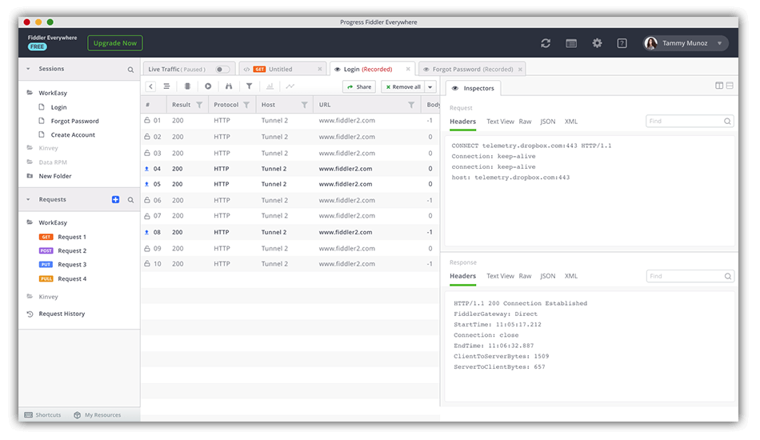
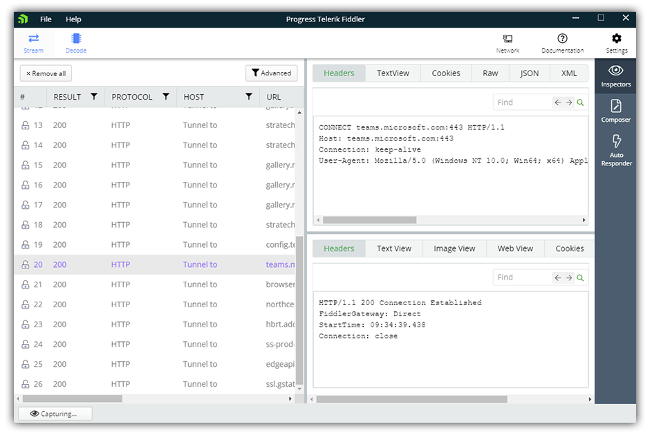
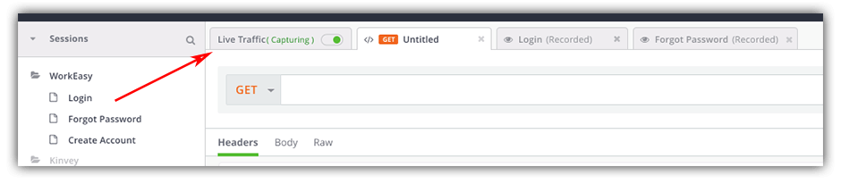
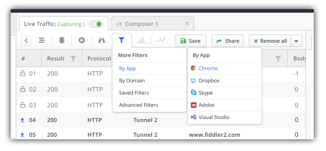
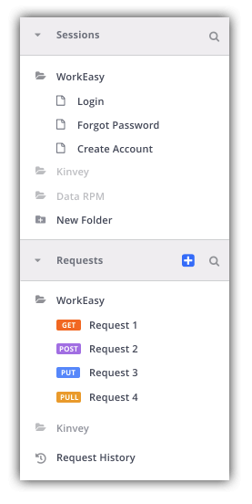
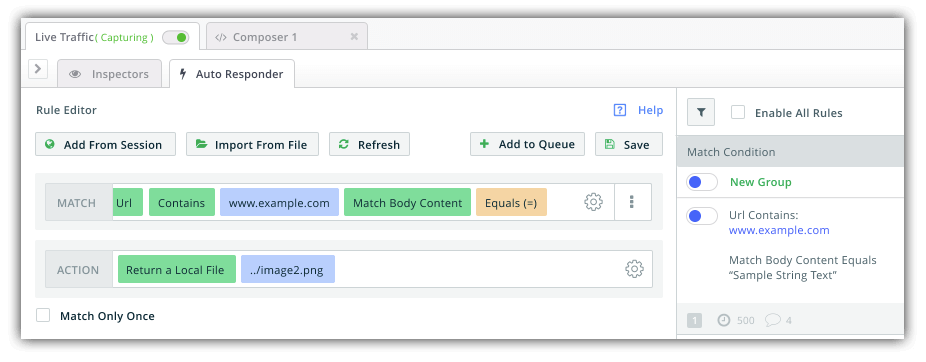

# Fiddler Everywhere is Getting a New Look

[Fiddler](https://www.telerik.com/fiddler): you know it, you love it. Some of you have even been using it for 15+ years! Our venerable network debugging tool for desktop and web apps remains *one of the most popular products* in the Telerik portfolio for good reason: it just works.

But one of the top feature requests we have repeatedly received is to provide a compatible version for macOS and Linux. And that's precisely where [Fiddler Everywhere](https://www.telerik.com/fiddler-everywhere) comes in!

> [Join our webinar on Thursday, April 28th](https://www.progress.com/campaigns/kinvey/webinar-fiddler-everywhere) as we dive into the new features of Fiddler Everywhere.

Fiddler Everywhere is the next generation of Fiddler. It was built from the ground-up to work in a cross-platform manner for macOS, Linux, and yes of course, Windows. We've taken the most-used and most-loved features from the original Fiddler (which you may see called "Fiddler Classic"), are applying some additional polish, and actively making them available in Fiddler Everywhere.

In the coming weeks and months you're going to see **a lot of activity** from the Fiddler team in relation to Fiddler Everywhere. We have some exciting plans in place for feature additions, expansions, and improvements. Today though, we'd like to specifically call out the new user experience.

> You can download the latest beta of Fiddler Everywhere [right here](https://www.telerik.com/download/fiddler-everywhere). And before you ask, nope, the original Fiddler isn't going anywhere!

*The NEW Fiddler Everywhere UI*

The Fiddler team is working on moving from the relatively antiquated Fiddler Everywhere UI we have today (for example):

...to a much more engaging and intuitive experience!

## New UX == New Features

Of course, along with a new UX comes a variety of new and improved features. For instance, to make it easier for you to manage multiple concurrent sessions and tasks, we are introducing a tabbed interface. 📑

Improved filtering options will make it easier for you to see only the requests you want, when you want them. 🔽

You can view a history of your saved sessions and request history, and easily access them. 📜

And the *Auto Responder* feature is getting some major improvements in its UX and functionality, allowing you to more easily debug a variety of network scenarios with your web and desktop apps.

Need to test what happens when your CDN goes down? Want to swap in some local assets in place of remote files to see how your production site reacts? *Auto Responder* to the rescue! ⛑️

We even have a **brand new collaboration feature** coming out, but you'll have to [attend our webinar](https://www.progress.com/campaigns/kinvey/webinar-fiddler-everywhere) to find out more. 🤫

## Try Fiddler Everywhere

We welcome you to [download Fiddler Everywhere](https://www.telerik.com/download/fiddler-everywhere) for free today and get a head start on some of these features.

*Please note that depending on when you are reading this, the new UI we just covered may or may not be implemented, but with the auto-updating feature in place rest assured you'll get it as soon as it's available.*