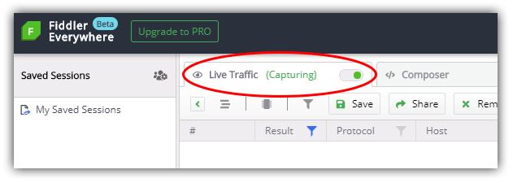
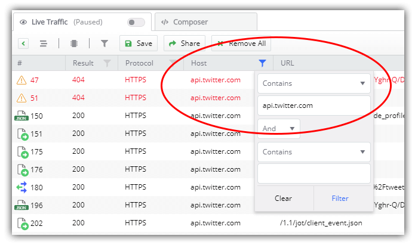

# Debugging with Fiddler Everywhere: Scanning for 404 and 500 Status Codes

[Fiddler](https://www.telerik.com/fiddler) has proven itself as a trusted Windows-based tool for diagnosing and debugging network issues during web and desktop app development. And you may have heard about this [Fiddler Everywhere](https://www.telerik.com/fiddler-everywhere) thing - it's a NEW generation of Fiddler that shares the same core engine, but with a modern UI, improved user experience, and fully enabled across macOS, Windows, and Linux!

In this blog series, we are looking at a variety of real world scenarios that can be effectively addressed with Fiddler Everywhere. Today we are going to look into how to effectively scan for "silent" 404 and 500 errors that may otherwise be missed during app development and testing.

*What else are we covering?*

- [Mocking Remote Issues](https://www.telerik.com/blogs/debugging-with-fiddler-everywhere-mocking-remote-issues)
- Scanning for 404 and 500 Status Codes (today!)
- Collaborative Debugging (coming soon)
- Resolving an Error in Production (coming soon)
- Diagnosing a Remote API Failure (coming soon)

> **NOTE:** Fiddler Classic (the original Fiddler) isn't going anywhere! You can still [download Fiddler](https://www.telerik.com/download/fiddler) and use it like you always have on your Windows PC.

## Our Scenario: Scanning for 404/500 Errors

As a developer, I have defined a set of user scenarios that my app addresses. Since it's <s>an ancient app</s> well-loved app, it's pretty massive and I'd like to scan for any potential 404 or 500 errors that may not be immediately visible when casually using the app. The "silent killer" of legacy apps!

Maybe a background service is throwing a 500 error that isn't immediately evident. There could be some missing images throwing 404s that don't interrupt my UI. Even a process running on a worker thread that silently errors out but doesn't impact the app directly.

In all of these situations, and more, we can see how quickly Fiddler Everywhere can help us to resolve these issues by quickly inspecting **all** of the network traffic to and from my app.

## Fiddler Everywhere's Solution

Since Fiddler Everywhere intercepts *literally* every network request coming/going to/from your apps (over both HTTP and HTTPS), it's actually quite easy for us to track all of our network sessions and quickly sniff-out any erroneous requests.

*Let's try it out:*

**1)** Open Fiddler Everywhere and toggle the **Live Traffic** option to **Capturing**:

**2)** Open the web or desktop app you are working with - and use it as you normally would to test out all of your user scenarios.

**3)** Back in Fiddler Everywhere, toggle the **Live Traffic** option to **Paused** so as to limit new sessions coming into our UI and reduce the clutter.

**4)** Before we start scanning the (likely) ridiculous number of network requests you see, let's first **filter our requests** by URL of your app. This way you'll only see sessions that are relevant to the app we care about.

> **NOTE:** If you are debugging a desktop app, you can also filter this view by process!

**5)** We can then add another filter in the **Result** column to only display 404 or 500 status codes.

**6)** Find any culprits? Just double-click on that particular request to view the details, fix the problem, and test again!

Easy! 🎉

## Summary

Fiddler Everywhere can help us diagnose and resolve many different types of issues you may commonly run into. Today we took a quick look at scanning for certain status codes that might interrupt our app's performance or usability, but the flexibility of Fiddler Everywhere allows us to address numerous other issues, allowing us to quickly resolve issues before our customers complain 😅.

Start your journey with Fiddler Everywhere by [downloading it today](https://www.telerik.com/download/fiddler-everywhere) on macOS, Linux, or Windows.