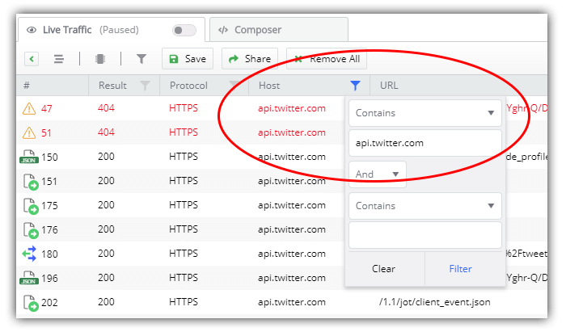

# Fiddler Everywhere: Resolving an Error in Production (Literally)

We've been using [Fiddler](https://www.telerik.com/fiddler) for years to inspect and debug HTTP/S traffic between our computer and the rest of the world. It trivializes the overly complex problems experienced when we try to inspect network activity both to *and* from both web *and* desktop apps. Oh, and we can also set breakpoints and then *fiddle* with the request and response. See what I did there?

[Fiddler Everywhere](https://www.telerik.com/fiddler-everywhere) is the next generation of Fiddler tooling. Fiddler Everywhere brings forward everything you love about Fiddler to a new cross-platform tool with a revamped UX that performs identically across macOS, Linux, and Windows.

> **NOTE:** Fiddler Classic (the original Fiddler) isn't going anywhere! You can still [download Fiddler](https://www.telerik.com/download/fiddler) and use it like you always have on your Windows PC.

So today we are kicking-off a blog series in which we'll dive into scenarios most of us have encountered at some point in our careers. From remote APIs failing, to diagnosing errors in production, to finding a pesky 404 - Fiddler Everywhere is our trusted co-pilot when debugging these (and plenty of other) issues.

Let's start with that dreaded issue of not being able to replicate a production error locally...making it awfully hard to diagnose, debug, test an update (and ultimately resolve) the error in production.

## Our Scenario: Resolving a Production Error...in Production

As a web developer, I've seen some issues pop up from customers that show an error in the production environment for my app. Unfortunately, with the information I have, it's virtually impossible for me to replicate the issue locally due to one of the following factors.

*The error only seems to happen...*

- after scripts are minimized during the build process;
- when files are served from a CDN;
- because my app is part of a massive monolithic solution that cannot be run locally.

## Fiddler Everywhere's Solution

Using Fiddler Everywhere, we are going to fake out our application that is running in production. Instead of loading key assets from our production environment, we are going to tell our production app to load them from a different source (in this case our local desktop).

This way we can run most of the app "in production", while loading individual scripts/files/whatever I suspect as being the culprits, from our local development machine. To do this we can take advantage of Fiddler Everywhere's [Auto Responder](https://docs.telerik.com/fiddler/knowledgebase/autoresponder) capability.

1) Open Fiddler Everywhere and toggle the **Live Traffic** option to **Capturing**:

2) Open the web app (or desktop app) in question and make sure all of the suspected problem assets are loaded. Remember, this could be JavaScript bundles, libraries served by a CDN, images, or any other component of your application.

3) Back in Fiddler Everywhere, toggle the **Live Traffic** option to **paused** so as to limit new requests coming into our session pane.

*I mean, the app is using Bower as its package manager! Maybe the error we are looking for is the least of its concerns...*

4) Find the specific session(s) you are interested in. In my case, I'm going to filter by **URL** to only show me the `app.js` bundle file which is a minified JavaScript file with my core app logic (a key suspect in the case): 

5) Next I want to build an **Auto Responder** rule that will capture a request and do something, anything, with it. Right-click the session identified and choose **Add New Rule**.

6) Now, navigate to the **Auto Responder** tab where you'll see the session URL pre-loaded for you. Edit the rule and in the **Action** field, paste the location of the file you want to serve from your local file system. For instance:

- Windows: `C:\Users\myuser\Documents\my_bloated_app.js`
- macOS: `/User/myuser/Documents/apps/my_bloated_app.js`

7) Save the rule, make sure **Enable Auto Responses** is checked, head back to your website, and reload! Fiddler Everywhere will **intercept the request** and replace the remotely-served file with the specified one from your own file system.

In theory at least, this allows you to quickly and easily substitute in *virtually any* resource with any other resource.

Auto Responder can do more than just swap out files. In future posts of this series, we'll look into [other Auto Responder actions](https://docs.telerik.com/fiddler/knowledgebase/autoresponder) that you can experiment with today:

## Summary

We took a quick look at how Fiddler Everywhere can be used to diagnose possible issues in production, without negatively impacting existing users or the production system itself.

Start your journey with Fiddler Everywhere by [downloading it today](https://www.telerik.com/download/fiddler-everywhere) for either macOS, Linux, or Windows.