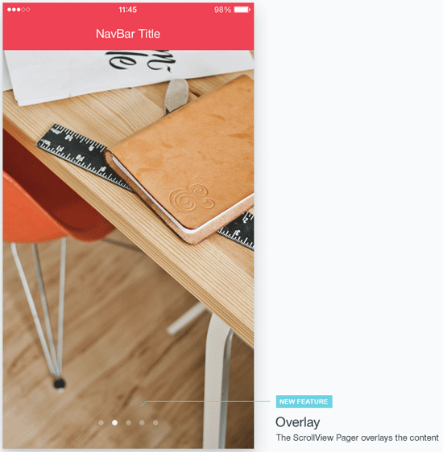
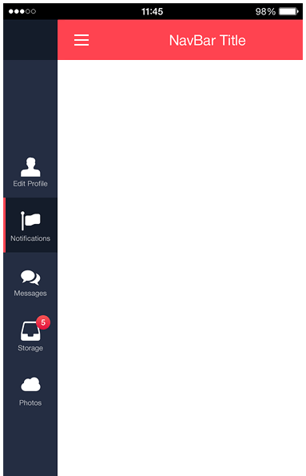
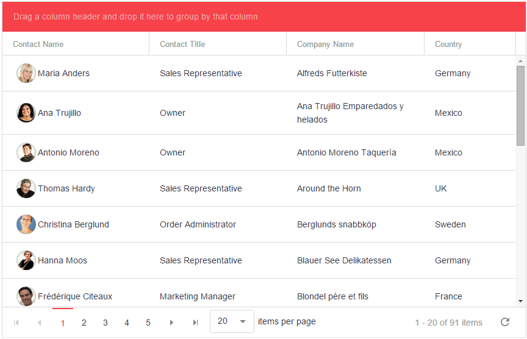

## Introducing Nova from Kendo UI

We've all heard the phrase, "don't judge a book by its cover". Yet the reality is that mobile apps are universally judged by their appearance and first few seconds of user experience. Developers who use Kendo UI know that gorgeous themes and widgets are a key ingredient in making this framework so great. That's why today I'd like to introduce you to a new Kendo UI theme we affectionately call "Nova".

### From Flat to Nova

Over two years ago [Kendo UI](http://www.telerik.com/kendo-ui) was among the first to introduce the concept of a universal flat theme for skinning your web and mobile apps. This theme was simply called "Flat" and is still widely used today. Upon its release, **our internal tests showed up to a 30% increase in app performance** over native styling. This made switching to a flat UI a no-brainer in many cases.

Times (and tastes) change, which is why we felt a new contemporary flat theme was in order, hence Nova was born!

> Interested in other (unofficial) flat Kendo UI themes? Take a look at [kendoflatthemes.com](http://kendoflatthemes.com/)

### New Features in Nova

More than just a new color scheme, the Nova theme is no longer strictly bound to the native concepts of our previous themes. This means we can do some cool things like adding a pager overlay on top of a series of images:

To use this feature, all you have to do is add the `km-scrollview-overlay` class to your **ScrollView** element, like so:

	

	    
Foo

	    
Bar

	

There is also a nested vertical tab strip that is activated like a drawer:

To activate this, add the `km-vertical-tabstrip` class to the **TabStrip** placed in a **Drawer**:

	

	    

	    

	

Nova also has optional color schemes for your app navigation (light, accent, and dark):

...which you use by adding the appropriate class (km-light, km-accent, or km-dark) to your navbar element:

	<header data-role="header">
		

	    

	</header>

There is much more as well, all documented in separate Nova sections of the Kendo UI docs:

- [Generic content styles](http://docs.telerik.com/kendo-ui/mobile/styling#nova-theme-features) 
- [Mobile Button](http://docs.telerik.com/kendo-ui/mobile/button/button#nova-theme-features)
- [ButtonGroup](http://docs.telerik.com/kendo-ui/mobile/buttongroup#nova-theme-features)
- [Forms](http://docs.telerik.com/kendo-ui/mobile/forms#nova-theme-features)
- [Mobile ListView](http://docs.telerik.com/kendo-ui/mobile/listview/overview#nova-theme-features)

### Converting to Nova

It couldn't be much easier to migrate your existing Kendo UI SPA to Nova. Simply enter "nova" as the skin name when you initialize your Kendo UI app, like so:

	var app = new kendo.mobile.Application(document.body, { skin: 'nova' });

If you are developing a hybrid mobile app using Kendo UI and Cordova, you should also take a good look at the [Telerik Platform](http://www.telerik.com/platform). The Telerik Platform provides an instantly productive environment for developing cross-platform mobile apps using Cordova/PhoneGap, along with a [verified plugins marketplace](http://plugins.telerik.com/cordova), advanced on-device debugging, and the best device simulator on the market. You can get your free trial [right here](https://platform.telerik.com/).

> Interested in getting started developing with Kendo UI Mobile? Take a look at [kendouimobileguide.com](http://www.kendouimobileguide.com/)

Likewise if you are an [Angular](https://angularjs.org/) developer, you may be interested to know that the Telerik Platform and Kendo UI fully support Angular development! [Take a look at this tutorial](http://docs.telerik.com/kendo-ui/mobile/angular/sushi-angular-tutorial) for developing mobile apps with Angular and Kendo UI.

### More than Mobile

Nova is about more than hybrid mobile apps too! With the latest release of Kendo UI, we introduced support for the Nova theme in our Kendo UI Web and DataViz offerings as well. Now you can use the Nova theme with our responsive [grid](http://demos.telerik.com/kendo-ui/grid/index) and [scheduler](http://demos.telerik.com/kendo-ui/scheduler/index) widgets!

Nova is also part of the [Kendo UI theme builder](http://demos.telerik.com/kendo-ui/themebuilder/), so you can customize the look and feel to your heart's content.

**Now go out and create a great app leveraging the power of Kendo UI and the beauty of Nova!**

