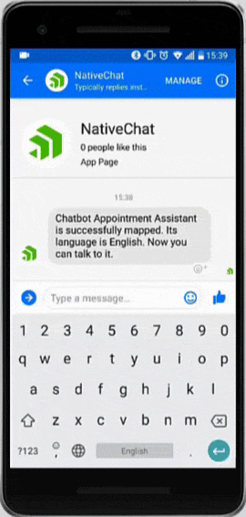

# Learn How To Add a Chatbot to Your Next Mobile App

Interactive chat is widely considered one of the next frontiers of web and mobile development. Whether it's to help guide users through a support issue, triage information requests, or even to sell them a product, chat opens myriad opportunities for user engagement.

There is a new capability of Progress Kinvey, called [Kinvey Chat](https://www.progress.com/kinvey/chat), that provides fully-featured chat capabilities. But it's more than your average chatbot solution. Kinvey Chat enables a "cognitive flow" that uses Natural Language Processing (NLP) and AI to actually *predict* conversation paths. This provides a more realistic and trusted chat experience, **eliminating the uncanny valley effect** which often frustrates users.

> Curious about Kinvey Chat? [Save your seat for our webinar](https://www.progress.com/campaigns/kinvey/webinar-enterprise-chatbots) on Thursday March 28th at 2PM ET.

What does Kinvey Chat have to do with NativeScript? Well, one of your deployment options for Kinvey Chat is mobile! And of course there is a NativeScript-optimized SDK for this very purpose.

*Take a look at Kinvey Chat in action, under its former name "NativeChat":*

## The Cognitive Flow Difference

Aside from being able to take advantage of the entire [Kinvey platform](https://www.progress.com/kinvey/) (think about secure business logic, robust performance, high levels of security, enterprise-grade identity management, cloud and on-prem data access...the list goes on), a main differentiator for Kinvey Chat is this "cognitive flow".

Let's break this down into digestible pieces:

### 1) Understanding User Input

The Kinvey Chat natural language engine supports dynamic training on top of existing enterprise data (such as product info, company info, or contact names). It then detects these entities, extracts the user's intent, and passes them along to the cognitive flow.

### 2) Process the Conversation

Kinvey Chat next analyzes the current conversation, the long-term bot memory, and the goals defined by you. Following this, it dynamically generates the conversation flow on *each* user input.

### 3) Deliver Intelligent Response to the User

Kinvey Chat requests needed data from internal systems like SAP, Salesforce, Microsoft SharePoint or any RESTful API. Finally, it displays the response in the user's channel of choice (such as a web app, mobile app, Facebook Messenger, or Viber).

## Learn More at the Webinar

There is far more to learn about Kinvey Chat, so your best bet is to [attend our free webinar coming up on Thursday, March 28th](https://www.progress.com/campaigns/kinvey/webinar-enterprise-chatbots). Grab a seat and learn how Kinvey Chat can help you engage your users like never before!