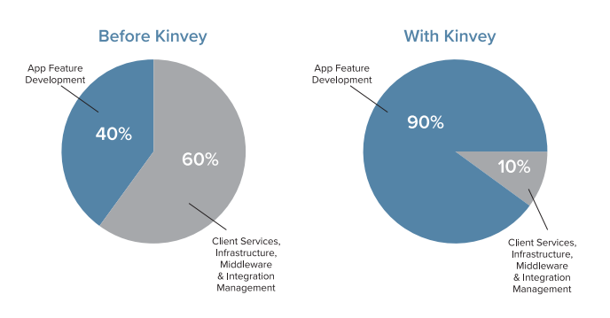
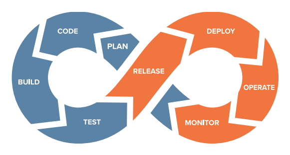

# Mobile Health Care Apps and HIPAA Compliance 

To say that data integrity and security are critically important is the understatement of the decade. What was once an afterthought for desktop computing has now become a multiple billion-dollar issue for every platform and screen we use.

Factor in health care, and there isn't a single person around who isn't concerned about the security and privacy of their own health data. The implications of data leaks around health care data are immense, which is at least partially why back in 1996 the United States government enacted the Health Insurance Portability and Accountability Act, more commonly known as [HIPAA](https://www.hhs.gov/hipaa/index.html).

## What Exactly is HIPAA?

HIPAA is actually comprised of not one, but *five* separate titles. In the context of this article, we are only concerned with Title II:

> HIPAA Title II: Preventing Health Care Fraud and Abuse; Administrative Simplification; Medical Liability Reform

There are a lot of strong words in this title such as "fraud", "abuse", and "reform" - which is easy to overlook considering how our esteemed elected officials like to overstate the power of the laws they enact in the titles! However, HIPAA has put into place critically important guidelines, requiring the establishment of standards for electronic health care transactions and national identifiers for everyone in the health care industry: providers, insurance plans, employers, and consumers.

A key component of this is the [HIPAA Privacy Rule](https://www.hhs.gov/hipaa/for-professionals/privacy/index.html). The Privacy Rule is composed of regulations for the *use and disclosure* of Protected Health Information (PHI):

* Patient names
* Addresses — Anything more specific than state, including street address, city, county, precinct, and in most cases zip code, and their equivalent geocodes.
* Dates — Including birth, discharge, admittance, and death dates.
* Telephone and fax numbers
* Email addresses
* Social Security numbers
* Driver's License information
* Medical record numbers
* Account numbers
* Health plan beneficiary numbers
* Certification/license numbers
* Vehicle identifiers and serial numbers, including license plate numbers
* Device identifiers and serial numbers
* Names of relatives
* Internet Protocol (IP) address numbers
* Biometric identifiers — including finger and voice prints.
* Full face photographic images and any comparable images.

Take a moment to re-read the above list, because if your business handles *any* of the above data elements in the United States in the service of (or on behalf of) a covered entity, then **HIPAA compliance is NOT optional**.

What is a "covered entity" you ask?

* Doctors' offices, dental offices, clinics, psychologists
* Nursing homes, pharmacies, hospitals or home health care agencies
* Health plans, insurance companies, HMOs
* Government programs that pay for health care
* Health care clearinghouses

Clearly there is a lot more to HIPAA than the above paragraphs. The tl;dr is that if you are developing an app that deals with PHI data in the health care industry, you absolutely need to make sure the data storage and transimission of said data is HIPAA-compliant.

> Read the [HIPAA Compliance Checklist](https://www.progress.com/solutions/health-cloud/resources/progress-hipaa-compliance-checklist)

## Mobility and HIPAA

It was one thing back in the 90s when electronic health care data was in its infancy and applications were managed in the relatively controlled environment of the desktop/mainframe. Mobility has shaken this to the core as PHI data can be carried around in the pocket of anyone and everyone around you.

The mobile health care market (a.k.a. mHealth) is poised to become a nearly [$60 billion market by 2020](https://www.marketsandmarkets.com/Market-Reports/mhealth-apps-and-solutions-market-1232.html). The liability around this market makes HIPAA compliance a critical part of the app dev experience, regardless of platform, screen, or consumer in the health care industry.

As this market booms, we are seeing a dramatic increase in mobile app usage by every individual in the health care sector. At the same time, cost pressures are forcing providers to move data to the cloud...all the while HIPAA oversight (and fines!) are increasingly critical factors when it comes to the choices you have for app development and deployment.

> Read more about [securing your mobile app](https://www.progress.com/papers/kinvey-cloud-services-security-overview).

*Let's summarize where we are at:*

1. Mobile and desktop apps in the health care industry are booming.
2. The mHealth market is exploding as it reaches $60 billion in just a couple of years.
3. Infallable data security and integrity is a non-negotiable part of the equation.
4. We are moving data from on-premise to the cloud to achieve the performance and cost effciencies we need.

*So where does this leave us?*

Let's get to the crux of this article: HIPAA compliance is critical, so we need the tools and services that provide out-of-the-box cloud-based HIPAA compliance that we can rely on.

Enter [Progress Kinvey](https://www.progress.com/kinvey).

## Progress Kinvey

At its core, Kinvey is a modern platform for rapidly building complex enterprise apps and scalable consumer app experiences. A key component of the Kinvey platform is [Progress Health Cloud](https://www.progress.com/solutions/health-cloud).

Progress Health Cloud is a HIPAA-compliant solution to quickly build and deliver patient-centric and connected digital health experiences across all health care segments.

> Read about the [business value of Progress Health Cloud](https://www.progress.com/solutions/health-cloud/resources/the-business-value-of-progress-health-cloud)

Running on top of AWS, this HIPAA-compliant solution addresses every aspect of data security and integrity for health care providers, payers, and insurers with a secure and complete platform for all of their needs.

**Health Cloud lets app developers forucs on delivering their apps instead of building, managing, securing, and patching infrastructure - thereby reducing operational expences and time to market.**

You can break down Progress Health Cloud into four key areas:

### Digital Experience Accelerators

Quickly deliver successful digital experiences with purpose-built app templates for patient engagement, eligibility, out-of-pocket expense calculation and other popular healthcare use cases. SDKs provide pre-built app development accelerators to deliver unified experiences across all digital channels.

### Cloud Service Accelerators

Significantly reduce costs using over 20+ pre-built services that enable digital experiences including: 360 view of the patient, data store for connected health devices, app notifications, access controls for security, compliance and more.

### Health Care Integration Accelerators
Get easy, secure and sub-second access to EPIC, Cerner, Allscripts, Salesforce, HL7 and FHIR, and many other healthcare, enterprise and cloud data sources.

### HIPAA Compliance Accelerators

Achieve end-to-end platform security and HIPAA compliance out of the box. Data is encrypted on the client, in transit and at rest. Comprehensive policies and procedures ensure our platform is secure today and tomorrow.

> Read how [Canopy Health leverages Progress Health Cloud](https://www.progress.com/customers/canopy-health)

With Progress Health Cloud, healthcare organizations can launch their Minimum Viable Product (MVP) app in record time while still creating great digital experiences with high user satisfaction.

## Next Steps

This is just a brief overview of what Progress Kinvey can do for you and your app developers. To learn more, visit us at [progress.com/kinvey](https://www.progress.com/kinvey) and [set up a time for a demonstration](https://www.progress.com/solutions/health-cloud/request-demo) of the Kinvey services.

If you'd like to learn even more about the security features provided by Progress Kinvey, take a look at [this extensive resource](https://www.progress.com/papers/kinvey-cloud-services-security-overview).

