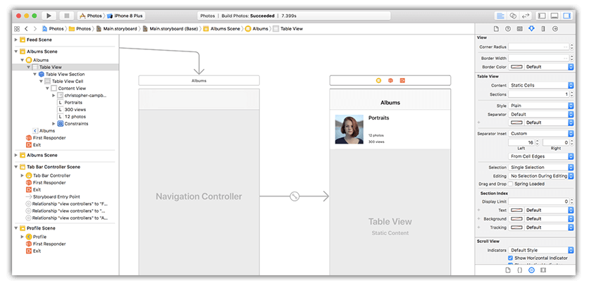
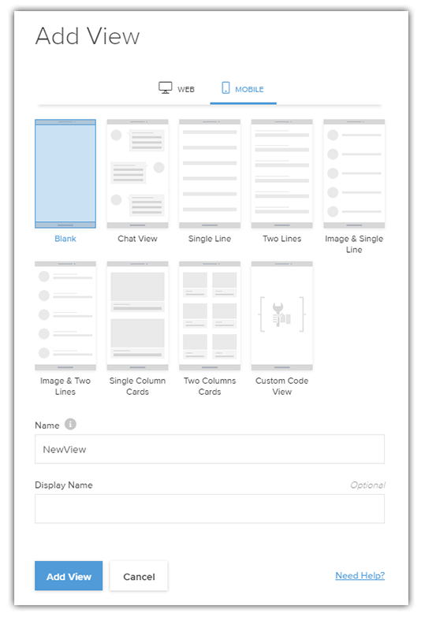
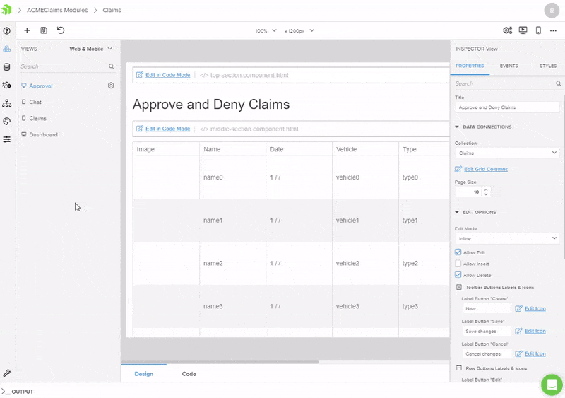
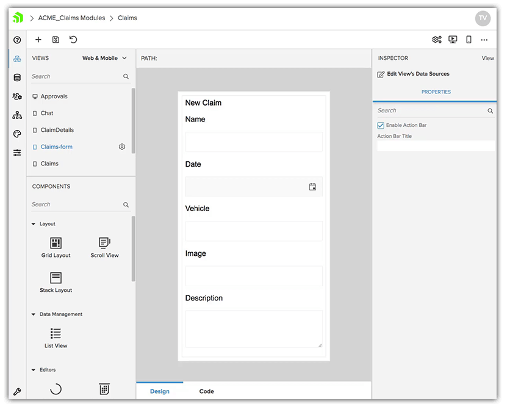
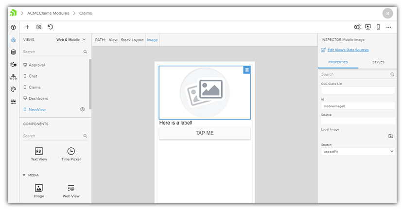
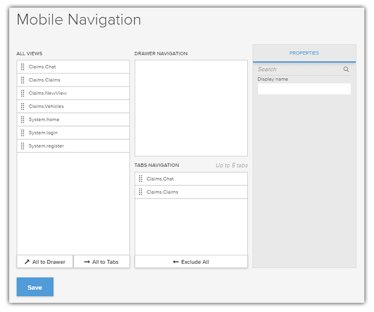
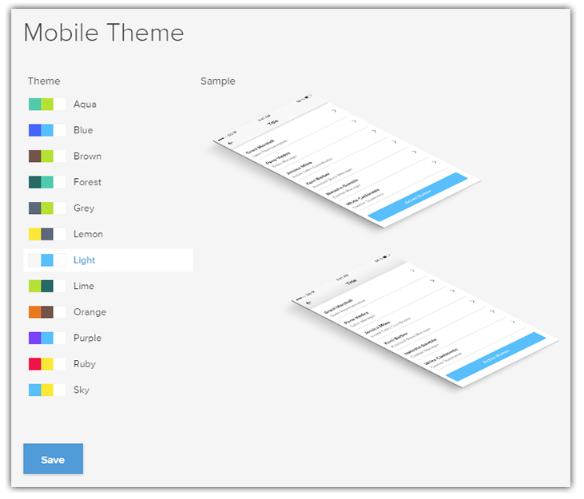
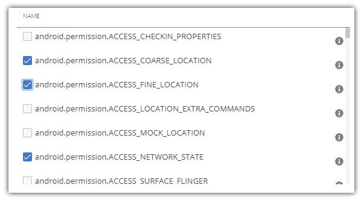

# Visually Drag-and-Drop Your Way to a Native Mobile App

Traditional native mobile app developers are used to using tools like [Xcode](https://developer.apple.com/xcode/) and [Android Studio](https://developer.android.com/studio) to construct their apps for iOS and Android, respectively. Even using the visual tooling capabilities in these tools, this meant (quite literally) duplicating every last piece of functionality from one platform to another. And some teams were more skilled on iOS than Android, and vice versa. Let's not even bring up adding a responsive web or PWA solution to the mix either!

For years this was the tax we have paid to use these incredibly powerful tools. The drag-and-drop design capabilities of both Xcode and Android Studio enabled rapid prototyping (and development) of new UI components and features. So in a way, the downsides *were actually worth it*.

What if I told you we could take advantage of very similar drag-and-drop canvas capabilities, but in a manner that leads to:

1. Developing truly native apps for iOS and Android **simultaneously**
2. Creating a responsive web app from the **same shared codebase**
3. Easily including a **chatbot** (that works across web *and* mobile)

...all on top of a mature and performant serverless backend?

**Let's take a spin around [Kinvey Studio](https://www.progress.com/kinvey/studio).**

## Introducing Kinvey Studio

By now you may have heard about Kinvey Studio (a key component of the [Progress Kinvey platform](https://www.progress.com/kinvey)). If you have, you likely know of it as part of an integrated solution to enable professional developers to build cross-platform mobile, web, and chat apps.

What I'd like to focus on today though, is the *visual* nature of Kinvey Studio. Being a "low code" solution means, well, writing less code. And how do we write less code? By relying on tooling that will write all of that boilerplate code for us.

## Building Your Mobile UI

When approaching an app with Kinvey Studio, we want to think about the app as a set of screens, or views. Each view is a set of distinct functionality comprised of native UI elements. Maybe it's a read-only display of data, a list with a master/detail relation, a customer service chatbot, or just a blank canvas to customize as-needed.

A key component of Kinvey Studio are the (growing) set of pre-defined views that are **powered by your data**, and save a dramatic amount of time that would normally be spent tediously scaffolding.

For example, let's say I have a backend collection of data that I simply want to expose via a dynamic listview with images. In Kinvey Studio the steps would be:

1. Create a new view from an existing template;
2. Link that view to an existing set of data;
3. Preview the native app on a real device!

...illustrated in-action here:

## Building a Custom Mobile UI

Using the pre-defined view templates is great...when your business case matches one of those templates! For other unique scenarios we recommend using the **Blank** view option.

This is where the power of Kinvey Studio really shines. The blank canvas allows you to completely customize your user interface. You can drag-and-drop UI elements (like labels, text fields, sliders, switches, and so on). You can also drag-and-drop *layout containers*, which are how you *arrange* your native UI elements on the canvas.

> Since Kinvey Studio uses [NativeScript](https://www.nativescript.org/) behind the scenes, anything you need to learn about layout containers can be [found in the NativeScript docs](https://docs.nativescript.org/ui/layouts/layout-containers)!

Need a view that shows an `Image`, a `Label`, and a `Button`? To do so, I would:

1. Start with dragging a `Stack Layout` container on to my canvas
2. Then drag an `Image`, `Label`, and `Button` elements over, one at a time.

...leading to the following UI:

Which, keep in mind, **took us all of five seconds!**

> While we are focusing on the *visual* aspect of Kinvey Studio today, you should also know that the generated code is stored locally. This also means that it is editable by your favorite text editor or IDE! Kinvey Studio supports *roundtrip editing* of an app, from Studio to IDE, and back again.

## Navigation Options

Clearly there are a lot of time-saving capabilities involved with creating the UI of your mobile app. Another common stumbling block is **app navigation**. Whether you want to use mobile-optimized tab- or drawer-based navigation, Kinvey Studio has you covered:

By simply including, excluding, or re-ordering the array of views provided, you can quickly create a fully-functional navigation system for your app in no time.

## Themes

It's one thing to build an app. It's another to make that app **actually look good**.

Kinvey Studio mobile apps with support for the [NativeScript core theme](https://docs.nativescript.org/ui/theme) out of the box. The advantages of using this theme include:

- Access to the existing class-based application of different UI styles;
- A variety of color schemes to choose from;
- An easy way to tweak and override the theme defaults with CSS.

Within Kinvey Studio, there is a **Themes** section that allows you to edit both your web and mobile themes. You can quickly experiment with a variety of pre-built color schemes:

> And remember, since mobile apps built with Kinvey Studio rely on the NativeScript framework, this means that apps are styled with CSS, the same CSS you and your developers have been using for years.

## Settings and Configurations

Are you a big fan of hand-editing your `info.plist` and `AndroidManifest.xml` files to configure your mobile apps? I didn't think so.

Kinvey Studio provides an intuitive UI on top of these iOS and Android configuration files, making sense out of such arcane code blocks as:

	<activity
		android:name="com.tns.NativeScriptActivity"
		android:label="@string/title_activity_kimera"
		android:configChanges="keyboardHidden|orientation|screenSize"
		android:theme="@style/LaunchScreenTheme">

		<meta-data android:name="SET_THEME_ON_LAUNCH" android:resource="@style/AppTheme" />

		<intent-filter>
			<action android:name="android.intent.action.MAIN" />
			<category android:name="android.intent.category.LAUNCHER" />
		</intent-filter>
	</activity>

For example, does your app need to access certain device permissions on Android? Instead of editing your `AndroidManifest.xml` file, you can use the interface provided to point and click your way to success:

## Summary

Today we've only just scratched the surface of what you can accomplish with [Kinvey Studio](https://www.progress.com/kinvey/studio). We focused on the **visual nature of the tool** (abstracting away the complexity and boilerplate that normally comes with native mobile app development). In the coming days and weeks you'll hear a lot more about the **power** of building a cross-platform app with Kinvey Studio on the Kinvey platform.

For example, did you know you can **quickly add a chatbot to your app with [Kinvey Chat](https://www.progress.com/kinvey/chat)**? Tap into secure server-side business logic with the Kinvey serverless backend? Add engaging mobile-only features like augmented reality? The options are endless when you choose Progress Kinvey.