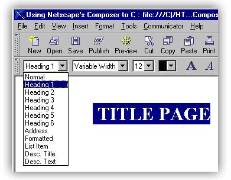
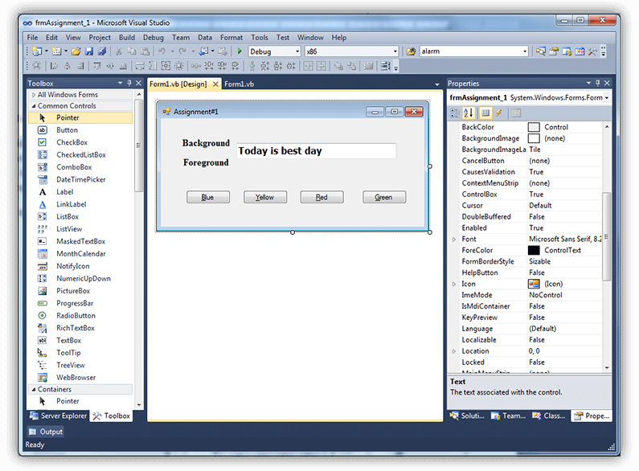
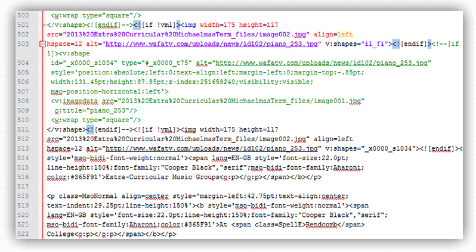
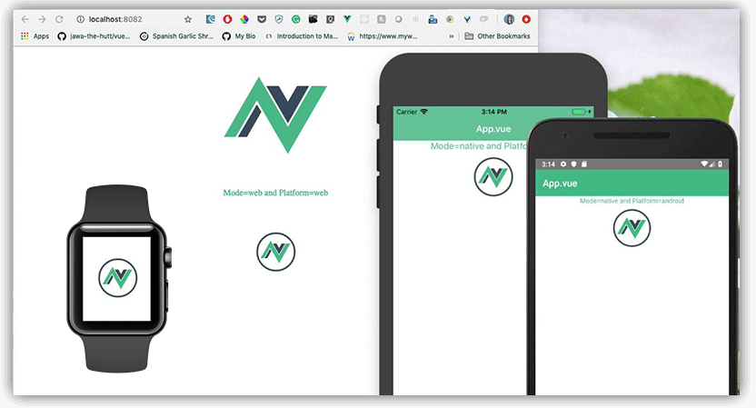
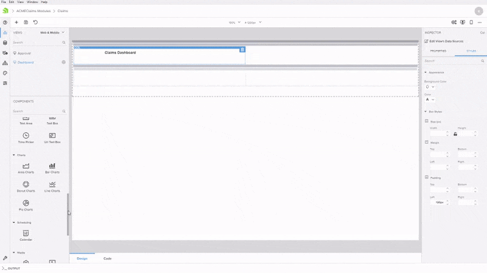
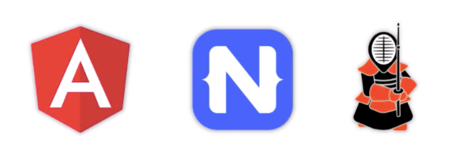

# Create Native Mobile Apps, Web Apps, and Chatbots - the Low Code Way

Since day one, a hallmark of NativeScript development has been its focus on making native mobile app development accessible to web developers. We improved upon this by extending the framework with support for [Angular](https://www.nativescript.org/nativescript-is-how-you-build-native-mobile-apps-with-angular) and shortly thereafter with [Vue.js](https://www.nativescript.org/vue). More recently, a focus has been on *sharing code* between web and mobile apps with both Angular- and Vue.js-based code sharing strategies.

Reusing skills and writing *less* code to cover *more* platforms is a clear priority. This includes making developers more productive with the skills and resources they have on-hand today. So it's high time that our developer tooling caught up!

Let me introduce you to a **new low code tool** from Progress for professional developers we call [Kinvey Studio](https://www.progress.com/kinvey/studio).

> Looking for a quick way to learn more about Kinvey Studio? [Save your seat for our webinar](https://www.progress.com/campaigns/kinvey/webinar-kinvey-studio) on Wednesday March 21st at 2PM ET.

But first, let's take a quick trip down memory lane and examine just *how* we got to where we are today.

## Low Code Development: No Longer a Myth

The truth is, "low code" or "no code" tooling has been around for years. Think back (way back) to the days of [Netscape Communicator](https://en.wikipedia.org/wiki/Netscape_Communicator) and its world-shattering combination of a web browser **with** an integrated WYSIWYG HTML editor!

Or what about Microsoft desktop developers who first got their feet wet with Visual Basic via a drag-and-drop canvas?

For many of us, low code tools started as a way to *learn* how to program. But problems arose when we realized the code generated by these tools was, let's just say, an utter disaster:

However, some tools like Adobe Dreamweaver worked *with* you, and not against you, leaving you with mostly human-readable (and editable) code. Providing the "roundtrip" capability to go from WYSIWYG visual design, to straight code, and back again, became a critical part of a real-world workflow.

Today though, app development needs are becoming more complex, with more screens needed across more distinct platforms. And today's definition of an "app" oftentimes means:

- a responsive website
- a Progresive Web App
- a native iOS app
- a native Android app
- a cross-platform chatbot
- a wearable on Android Wear OS and/or Apple Watch

Along with increased complexity comes an increased need for tooling that can keep up with today's needs. This is where Kinvey Studio comes in.

## Why Kinvey Studio?

If you're looking for an elevator pitch for Kinvey Studio, it goes something like this:

*"Kinvey Studio enables professional developers to build cross-platform mobile, web, chat, and wearable apps, leveraging a secure and performant backend, from a shared JavaScript codebase."*

Let's break down that sentence:

- **"Professional Developers"** - Kinvey Studio is not necessarily geared towards the "citizen developer". This is a tool that increases productivity (and generates clean code) for pro developers. All files are stored locally, and freely editable in your IDE of choice.
- **"Cross-Platform"** - Kinvey Studio focuses on creating less code in less time, and creating it for virtually any screen size and platform.
- **"Mobile/Web/Chat/Wearable"** - And yes, this means creating cross-device experiences, enabling you to meet your customers where they are, not where you want them to be.
- **"Shared Codebase"**: Apps built with Kinvey Studio utilize modern code sharing strategies across platforms, including a common shared backend.

## Built on Solid Foundations

With a name like "Kinvey Studio", it should be no surprise that the product itself relies on the mature foundations provided by the [Progress Kinvey](https://www.progress.com/kinvey/) serverless backend. But Kinvey Studio goes far beyond the backend and builds upon on a variety of mature and performant libraries and frameworks. For instance:

- Native mobile apps are built on top of [NativeScript](https://www.nativescript.org/) (of course!) plus [Angular](https://angular.io/)
- Web apps and PWAs are built with components from [Kendo UI](https://www.telerik.com/kendo-ui) (with Angular as well)
- Chatbots are created with [Kinvey Chat](https://www.progress.com/kinvey/chat)

## Next Steps!

You're going to hear A LOT more about Kinvey Studio in the coming weeks and months. In the meantime, if you'd like to know more, I suggest the following next steps:

1. [Reserve your spot for our webinar](https://www.progress.com/campaigns/kinvey/webinar-kinvey-studio) on Wednesday March 21st at 2PM ET.
2. [Download a BETA version](https://www.progress.com/kinvey/studio) of Kinvey Studio and take it for a spin yourself!