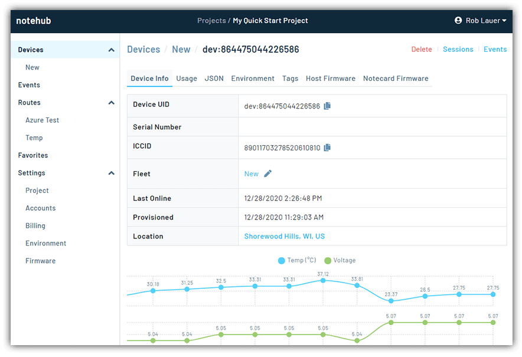

# Wireless IoT for the Rest of Us

When predicting the next 10 years of growth in IT markets, the famed tech analysts of our time (Gartner, Forrester, IDC, and the like) seem to strike out as often as they hit. I get it, reading the tea leaves of tech trends is not for the feint of heart.

However, one artifact of Gartner I'm a huge fan of is their [Hype Cycle](https://www.gartner.com/en/research/methodologies/gartner-hype-cycle). Gartner takes us on an annual roller coaster of technology niches as they advance through early life stages:

An example of this in practice is the [2020 Hype Cycle for the Internet of Things](https://www.gartner.com/en/documents/3987602/hype-cycle-for-the-internet-of-things-2020), which helps us to "assess the level of maturity and hype associated with critical IoT building blocks":

*Image provided by [PrimeKey](https://www.primekey.com/gartner-report-hype-cycle-for-the-internet-of-things/)*

This chart gets into some of the nuanced segments of IoT, but if you blur your eyes a bit, you can let yourself see the maturation of IoT as we collectively migrate to the right. A very meta "Internet of Things" entry is itself is nestled in the *Trough of Disillusionment*, poised to break out in the next 2-5 years.

So how exactly do we shake off the haters and advance IoT as a whole into the *Plateau of Productivity*?

I propose there are three "pillars" to help support the advancement of IoT hardware and platforms, for developers, in 2021.

## The Three Pillars of IoT for Developer Success

**1) Ubiquitous (and Reasonably-Priced) Cellular**

As an IoT developer, I want my devices to be able to communicate anywhere, with any service, at any time, at a reasonable price. As a hobbyist I can't stomach paying yet another monthly cellular bill. And as an organization we can't manage unpredictable pricing; nor do we want to pay for data, services, and capabilities we don't utilize.

**2) Familiar Developer Tooling and Languages**

As a modern developer, I feel like I'm having to learn new languages/frameworks/libraries at a blinding pace. In a perfect world, I could re-use existing constructs and focus on *building with what I know* and less on learning archaic low-level languages or syntax.

**3) Cloud-Agnostic Connectivity**

Living in the cloud, I will most definitely be connecting my devices to the cloud when they are deployed in the field. Instead of writing yet another new set of APIs to handle this data, I need my data automagically routed to my cloud of choice. It shouldn't matter if I'm invested in AWS, Azure, or GCP. It should be easy for me count on a platform to facilitate secure transmission and access to my own data.

Ok, let that digest and we'll come back to these three pillars in a bit. ⏱️

## IoT with Blues Wireless

I had the pleasure to review some hardware and a supporting backend platform from a new IoT company called [Blues Wireless](https://blues.io/). Their tagline is "the fastest path to build and deploy cellular connected products". Ok...I'll bite!

After spending some time on their quick start and tutorials, I'll admit Blues may be on to something.

### Blues Products

You can distill the Blues hardware down to [Notecard and Notecarrier](https://blues.io/products/).

**Notecard** is a single low-power System-on-Module (SoM) data pump that includes GPS and cellular with secure data transmission. It can be used with any microcontroller (e.g. Arduino, Adafruit, Raspberry Pi, and more) or with Blues' own Notecarrier.

**Notecarriers**, on the other hand, are development boards that provide seamless connectivity to Notecards (though not required, as Notecards can be used with other boards!). There are multiple Notecarrier options available:

- **Notecarrier A Series:** Includes cellular and GPS antennas and comes in three variants of its own:
	- "AL" for Lithium Polymer batteries (LiPo) or solar power
	- "AA" for AA batteries
	- "AE" for direct embedding
- **Notecarrier AF:** Used with Adafruit Feather microcontrollers.
- **Notecarrier Pi:** Used for, you guessed it, development with a Raspberry Pi.
- **Notecarrier B:** Is a small form-factor board that doesn't come with cellular or GPS (instead relying on a Notecard for connectivity).

### Blues Services

Arguably the most intriguing product from Blues isn't IoT hardware at all, but a cloud platform for managing your device fleet and the data transmitted to/from/between devices.

[Notehub](https://blues.io/services/) allows you to manage your fleet of Notecards, view device events, and route this event data to virtually any third-party cloud application. Device provisioning is transparent as well - no having to deal with certificates or manual claiming of devices.

It's the routing aspect that I found most intriguing. Since Notehub events are pure JSON, you can filter/transform/route them using (likely) skills you already know, like [JSONata](https://jsonata.org/) for JSON querying and transformations.

For example, this JSONata expression allows us to transform our sensor (event) data on the fly, to the format our cloud provider is anticipating:

	{
		"temp": body.temp,
		"humidity": body.humidity,
		"location": tower_location & ', ' & tower_country,
		"time": when
	}

The [Blues developer tutorials](https://dev.blues.io/) include in-depth walk-throughs for [routing your data](https://dev.blues.io/build/tutorials/route-tutorial/initialstate/) to AWS IoT Analytics, Azure, InitialState, and ThingSpeak.

*So how does Blues win?*

## The Blues Pillars

Recall my ambitious "three pillars of success" above. If the Blues Wireless products and services are as good as they appear to be, how do they measure up to my standards?

**Ubiquitous (and Reasonable) Cellular?** Blues appears to crack this nut with a straightforward $49 one-time fee that includes a Notecard plus 10 years (yes, YEARS) of cellular service with 500MB of data included.

**Familiar Developer Tooling and Languages?** The Notecard speaks your language. Tired of writing archaic AT commands? The Notecard API is driven entirely by JSON. Blues also provides [firmware libraries for your language of choice](https://dev.blues.io/tools-and-sdks/):

- Arduino
- Python
- C/C++
- Go

> **TIP:** On the Blues developer portal, there is an [in-browser playground](https://dev.blues.io/notecard-playground/) for connecting to your device via the Web Serial API as you follow along with their tutorials. How cool is that!?

**Cloud-Agnostic Connectivity?** Notehub provides a secure means of transmitting your data from device to your cloud of choice. No writing custom APIs to query, massage, and relay data. No messy management of your fleet(s) of devices either.

## So What's Your Next Step?

I encourage you to check out the tutorials and docs available on the Blues developer portal at [dev.blues.io](https://dev.blues.io/). Even without having any hardware in-hand, you'll get a good sense of what you can accomplish.

When you're ready to take your first step with a Blues product, I recommend the Adafruit Feather or Raspberry Pi [starter kits](https://shop.blues.io/collections/development-kits) as they include both a Notecard and Notecarrier.

Wishing you the best on your IoT journey! 🗺️