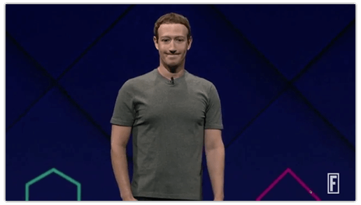
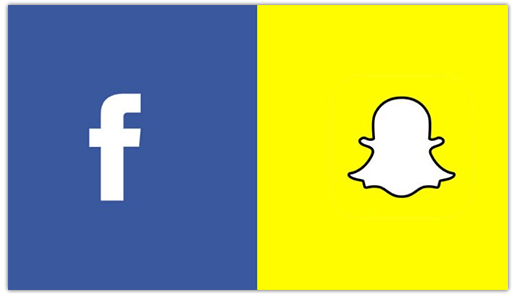
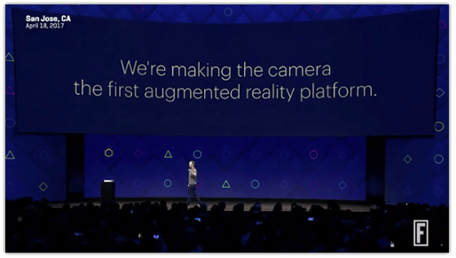
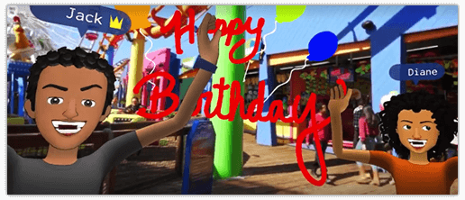
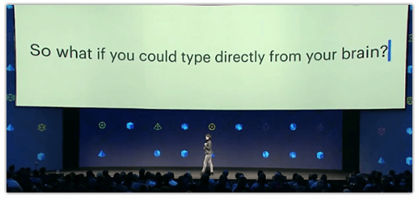

# What Did We Learn from Facebook's F8 Developer Conference?

Facebook's [F8 Developer Conference](https://www.fbf8.com/) was earlier this week and it presented a not-quite-crystal-clear vision of the future constrained by a fierce competition with Snap. But that's just the tl;dr of one fool's opinion (that's me). As developers with an eye on the future, what should we take away from this conference?

## Facebook is Extremely Concerned about Snap

[Snap](https://www.snap.com/en-US/) (the parent company of [Snapchat](https://www.snapchat.com/)) is quickly becoming Facebook's most significant competitor. As a self-described "camera company", does Snap really present that big of a threat to Facebook? Snap **is** a tech sector darling with a [relatively decent IPO](http://fortune.com/2017/03/21/snapchat-snap-ipo-wall-street/) and impressive [advertising revenue](https://techcrunch.com/2016/09/06/report-snapchat-ad-revenues-to-reach-almost-1-billion-in-2017/). Snapchat is also sitting on over [160 million daily active users](https://techcrunch.com/2017/02/02/snap-ipo/) and growing at a solid rate, with an extremely engaged user base that willingly subjects themselves to advertisements via [Snapchat Stories](https://support.snapchat.com/en-US/ca/stories).

Yet Facebook dwarfs Snapchat's numbers with 1.15 billion (yes, with a "B") daily active users.

But there is some cause for concern as Facebook is starting to lose the innovation battle and effectively copy more of Snapchat's features into Instagram (i.e. Snapchat Stories vs Instagram Stories).

**Dare I say Facebook looks like an early 90's Microsoft?** Facebook is using their leverage to adopt old school Microsoft strategies and muscle out competition by re-framing competitor features as their own. While reigning in innovation and focusing on competitors can certainly be profitable in the short term, there is loads of long term risk to be aware of.

We shall see how this plays out :popcorn:.

## Facebook Wants to Transform the Camera into a Platform

If there was a theme at F8 (and I'm honestly not sure there was), it would have to be AR/VR (augmented reality and virtual reality). Facebook wants to "transform the camera from a feature into a platform where any developer can build for augmented reality".

Here we see more of Facebook's obsession with Snapchat. Snapchat was the first to build an ecosystem around the camera. Facebook is implicitly acknowledging this (which isn't a bad thing) and pushing the envelope further to envision a world where cameras and AR displays truly become our window on the world in more immersive and engaging ways. We will see how this plays out.

There was a key product announcement too: [Facebook Spaces](https://www.facebook.com/spaces). Spaces is a VR app that lets you be "with" your friends in a virtual room (provided your friends also have an Oculus Rift). It's early to judge, but this could be an important step forward for the company in the VR space. Although admittedly it looks like a more accessible, but also more Wii-like, version of Microsoft Hololens's [holoportation POC](https://www.youtube.com/watch?v=7d59O6cfaM0).

Who knows how it might turn out, but you can have a depressing remote birthday party with your friends if you want!

## Facebook Wants You to Type with Your Brain

Facebook has been working on a [direct brain interface](https://techcrunch.com/2017/04/19/facebook-brain-interface/) that, in theory, can allow you to "type" in complete privacy, using no external interfaces whatsoever.

Clearly the impact of such technology would touch (pun intended) virtually every industry. However, don't get too excited, as it sounds like the project itself is a few years from launch and requires not-invented-yet hardware to measure brain activity at high frequencies.

## Bots are Still Very Much a Thing

While Facebook's bot platform got off to a slow start last year, they appear to be [doubling down on bots for Facebook Messenger](https://techcrunch.com/2017/04/18/facebook-bot-discovery/). Chat bots remain a technology without a true leader and Facebook remains one of the top companies with the ability to claim that title.

One notable mention was "100,000 bots for Messenger's 1.2 billion users" with increased discoverability in Facebook Messenger. There is significant upside with text-based interfaces for many industries and you can see a logical extension of the previously mentioned "direct brain interface" project with bots - what fun that could be :smile:.

## In the End...

I felt a certain amount of disappointment with Zuckerberg's keynote - only because it felt like a step back from true innovation and a step forward into Facebook/Instagram competing on a line-item basis with Snapchat (a Tim Cook keynote as opposed to Steve Jobs, if you will).

However, there are A LOT of exciting things happening at Facebook ([Developer Circles](https://developers.facebook.com/blog/post/2017/04/18/facebook-introduces-developer-circles/) is another potentially useful resource) and if any one of these is a hit, *I think we're all in for a very big treat*.

*I will personally mail a [NativeScript](https://www.nativescript.org/) t-shirt to the first person who correctly identifies the movie and quote referenced above in the comments :smile:.*
