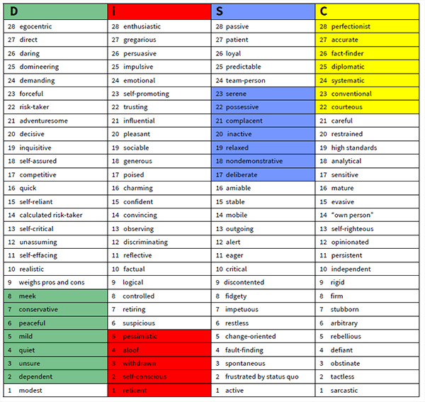
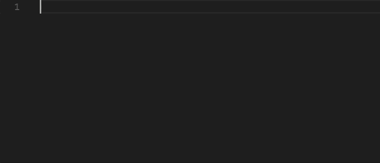

# Giving Your First Tech Talk? Well, Good Luck!

Are you one of those insane tech geeks looking to give your first public presentation on a topic near and dear to your heart?

Aww, that's so sweet! 😘 I do wish you all the best. Good luck with it, and...well, see you later!

What's that? You're sure about this? Do you have any idea what you're getting yourself into?

*What are you still doing here?*

I've been in Developer Relations, on-and-off, for about six years now. I'm also painfully shy at times, an introvert who would much rather sit in my dank basement than talk to you IRL, and scored as a "high C" on my [DiSC profile](https://www.discprofile.com/what-is-disc/overview/).

> Haven't heard of DiSC? It's like the Myers-Briggs personality test, but is effectively a measure of your OBSERVABLE behavior. 

*Here is my full DiSC profile from a few years ago:*

The "C" stands for "conscientiousness at work". It means I place an emphasis on quality and accuracy, expertise, and competency.

In practice, I don't like to speak up during group meetings unless I know exactly what I want to say and that I'm confident my message is clear and concise. The *I'm confident* part is quite important as well. Considering the phrase "ready, aim, fire" in metaphor form, DiSC "High C's" like me are more like "ready, aim, aim, aim, aim". We have a hard time pulling the trigger until we know the precise message we want to convey!

This all to inform you that I, as a new speaker ages ago, was semi-mortified to start public speaking. My first significant speaking engagement was at PhoneGap Day in Amsterdam back in 2013. **DON'T YOU DARE LOOK THAT UP ON YOUTUBE!**

When those semi-mortifying 20 minutes of my life were all over, I thought I had done a decent job. I didn't freeze up. I didn't stumble over my words too much. I was kinda confident. Nobody did a Nelson laugh at me.

However, when I went back to watch it later, I was horrified how many times I said "um, ah, um". Hello McFly! 📣 Public Speaking 101! 📣

So I give to you, dear reader, a set of tips and tricks that I would've found helpful to mold myself into this dynamic, amazing, engaging, inspiring speaker you see today. **LOL! I still suck!** But at least I suck more confidently!

## You Only Know What You Know

When you see a truly engaging presentation, it's likely the presenter has a passion for, and relatively good understanding of, the subject of their talk. So you think Vue.js is cool, but haven't used it in a real world app yet? Awesome! But is this the *best* topic for you to choose for your first tech talk?

**For your first talk, I want you to keep it simple.** If you think Vue.js is cool, it's likely you are already building upon a foundation of existing JavaScript or other frontend technology knowledge. Is there *any* component of app development, programming languages, testing, hardware tinkering, etc that you feel like you're a relative expert of?

**Don't sell yourself short!** While you may think that nobody wants to hear about your experience using Bootstrap, you might be surprised how many folks *don't* know what you know (and would actually like to hear about it!). I mean it. [Burke Holland once noted](https://www.freecodecamp.org/news/what-500-blog-posts-taught-me-about-writing-great-articles/) that Lea Verou did a full talk on a *single CSS property*. And the result was fantastic:

<iframe width="560" height="315" src="https://www.youtube.com/embed/b9HGzJIcfDE" frameborder="0" allow="accelerometer; autoplay; encrypted-media; gyroscope; picture-in-picture" allowfullscreen></iframe>

With that settled...do you have a topic in mind, but need a title? Check out [Portent's Content Idea Generator](https://www.portent.com/tools/title-maker)! It may seem ridiculous at first. Ok, it is completely ridiculous at first. But maybe 1 out of 20 tries, the ideas start sounding kinda cool!

## Slides, Slides, and Slides

So you have a topic, title, and a rough approximation of what you want to talk about. You know it backwards and forwards, inside and out. You're ready to share everything you know about spread syntax in JavaScript and how it allows an iterable such as an array expression or string to be expanded in places where zero or more arguments (for function calls) or elements (for array literals) are expected, or an object expression to be expanded in places where zero or more key-value pairs (for object literals) are expected.

LOL yeah that's copy-and-pasted.

Ok, for real though, you're ready to start working on your 100 slide PowerPoint deck.

**Hol up.**

Slides are great! I mean they can be! They are a good crutch to lean on when you want to distract your audience from staring at you. But the first rule of a Powerpoint presentation is to make it not *feel* like a Powerpoint presentation.

What I'm getting at is you don't want people to have to stare at a slide to read it. You also don't want them to have to read too much text.

> Check out TJ VanToll's post, [My Top 5 Tech Speaking Tips](https://dev.to/progress/my-top-5-tech-speaking-tips-4dej)

Once again, keep it simple with these rules-of-thumb:

1. Keep your slides to a minimum. Keep text to a minimum.
2. Don't literally read text off of your slides. Summarize. Your audience will fill in the gaps themselves.
3. Use a nice-looking slide template (use the Google, find a good template, and pay for it - it's well worth it!).

> Oh, and add some nice images to your slides! Check out Brian Rinaldi's post on [5 Options for Free Stock Images](https://remotesynthesis.com/blog/royalty-free-images).

## Before You Proceed, Make a Backup

I don't mean "copy your deck to a USB drive in case your laptop dies" (which I mean yeah, you should totally do!). I mean that you'll want to give yourself an "out" in case you get stuck. This means adding comments/speaker notes to your slide deck that show up when you are in "presenter mode":

Your comments should be concise. They should stick to the high level points, allow you to work *with* them while not directly reading *from* them. The moment you start reading content on your slides, or the speaker notes, your audience will pick up on it and you'll lose what precious engagement you've earned.

**Bullet points only. Got it?**

## Don't Live Code

Yeah I said it. Live coding is the worst. Nobody, and I mean NOBODY, wants to see you flail around as a dangling "," messes with your JavaScript. At least for your first talk, skip it.

But I don't mean *skip code*. On the contrary, I'd love to see code ALL DAY versus boring and repetitive slides.

Luckily there are ways to show code without *physically composing* said code:

### Use Code Snippets

Why reinvent the wheel? You've already written the code once, so just copy-and-paste it (like you're already doing from Stack Overflow!).

The universe's most popular code editor, Visual Studio Code, allows you to easily save and re-use [code snippets](https://code.visualstudio.com/docs/editor/userdefinedsnippets)!

This is incredibly useful for when you want to pretend you know what you're doing. Which is pretty much all of us these days.

### Code-on-Slides

If you really want to remove variables from the equation (no pun intended?), add some code text/images that are exceptionally legible, and walk through your code that way.

Is it cheating? I don't know, are we being tested?

**PRO TIP:** I'm a big fan of [Carbon](https://carbon.now.sh/) for generating code screenshots. And [BrowserFrame](https://browserframe.com/) for screenshots of browser views.

## Practice Makes Perfect...?

Topic? ✅ Slides? ✅ Demo/Code? ✅ Practiced? 😟

You're almost there! You've got a draft of your talk done and you're ready to focus on rehearsal.

My advice is to run it through *by yourself* AT LEAST 3-5 times. Alone. Go through the slides, keeping in mind:

- How long is this taking? (Make a mental note that when you speak in public, it'll probably be faster!)
- Are there any sections on which you pause or hesitate? If so, why? Maybe you need to clarify some slides or bullet points in your speaker notes.
- Are you telling a good story? Or is it just a vomiting of information? If so, you may need to head back up a few steps!

If you're comfortable enough with your talk in *incognito mode*, you're ready to move on to the next step:

## Start Small

Before you give your talk in front of a crowd, you **NEED** to practice in front of a person. I'm sorry, it might be awkward, but you need to have a pair of eyes boring into your soul before you're ready to present this to the world.

Maybe it's a technical friend (or a non-technical friend who just wants to help!). Maybe it's a co-worker. Maybe it's a significant other who makes fun of your geek speak! It doesn't matter. You just need the experience of delivering this talk in front of a living, breathing human.

> Sorry, cats do not count! 😿

How do you scale up from a private practice session? It depends on your final goal. If your first talk is at a local meetup in front of 10 people, I'd say you are well on your way to success. If, however, your talk is going to be in front of 100+. Yikes! I'd recommend doing your best to *find* a local meetup to give the talk to...giving you a fantastic dress rehearsal (and also spreading the gospel of your talk even more efficiently).

## Consider an Alternative

The way we think of giving talks is narrowly focused on meetups and tech conferences. Today though there are other options to get your feet wet with speaking. You might want to consider a streaming service like [Twitch](https://www.twitch.tv/) or [Mixer](https://mixer.com/). These allow you to speak in front of strangers without literally *being* in front of strangers. Granted, finding an audience can take some time, so using whatever company or personal social media presence you have can get you on your way to building a crowd.

Streaming services also have the added benefit of automatically recording the talks, allowing you to post them to YouTube for further reach. And embarrassing memories down the road! **HEY YOU DIDN'T LOOK UP MY PHONEGAP DAY TALK DID YOU?**

## Accept My Virtual Hugs

Remember this: if an introvert like me can do it, so can you. 🤗

Pick a topic you love. Practice a bit. Find a crowd. And let loose on the world with your knowledge. **YOU GOT THIS!**