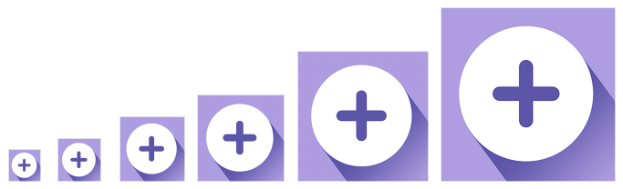
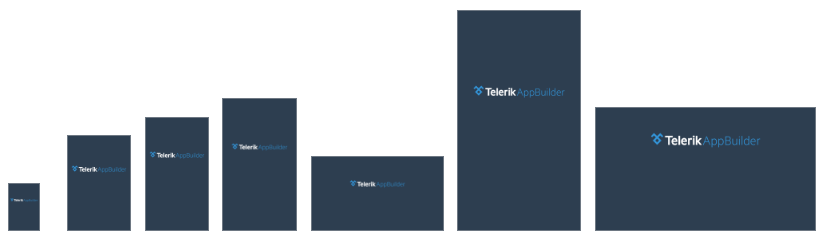
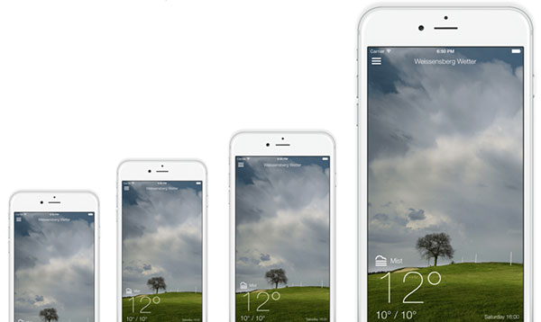
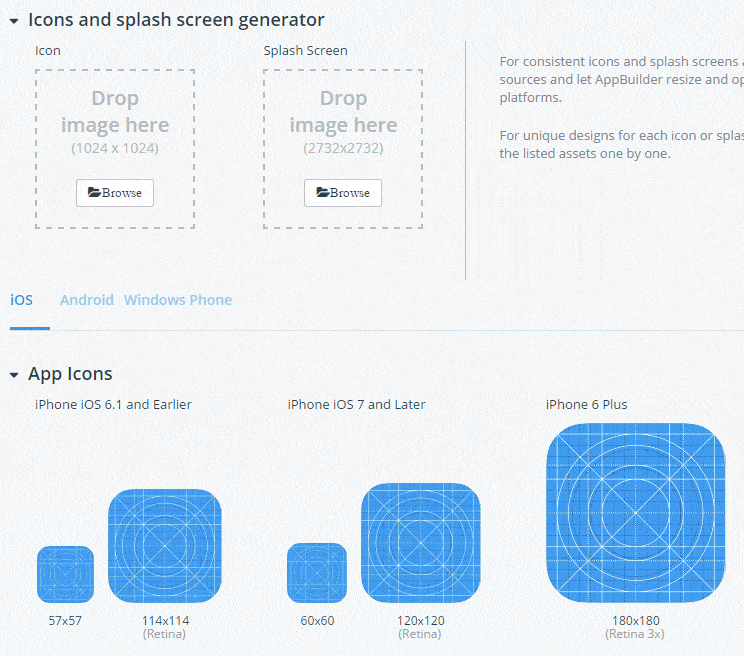

# Your Guide to App Store Images

You've just finished designing, coding, and testing the next killer app.  It's beautiful. It's engaging. It's rock solid. Next step is publishing to the app stores. No sweat.

This is when you realize there are 60+ different app icon sizes and 40+ splash screen sizes you can provide. Oh, and we haven't even gotten into screenshots yet.

In many ways, your battle has only just begun.

While we've blogged many times in the past about what it takes to [sign, build, and actually deliver an app](http://developer.telerik.com/featured/ios-app-distribution-7-steps/) to the app stores, **a critical piece of the puzzle is creating and organizing all of the supporting image assets you need for your app store listings**.

In this article we are going to look at the image asset requirements for the big three app stores. Just as importantly, we will also look at both free and paid options for creating image assets for app icons, splash screens, and screenshots for iOS, Android, and Windows.

And I don't care if you are creating an app with [NativeScript](https://www.nativescript.org/), Apache Cordova, Xamarin, or with native tooling - this is one case where we are all truly in it together!

> The app stores usually change guidelines with each major release. As this happens we will do our best to update this article, but sound off in the comments if we've missed anything! (Last updated Jan 2017)

- [App Icons](#app-icons)
- [Splash Screens](#splash-screens)
- [Screenshots](#screenshots)
- [Generating Your Images](#generating-assets)

## App Icons

The welcome mat of your app, your home screen/launcher app icon is a critical part of your app and app store listings:

### iOS

What follows are all of the currently *accepted* iOS app icons. Note that not all are *required* for your app to be approved, but they each have their purpose (whether it's for Apple Watch, Spotlight, or apps that target iOS <= 6.1).

- 29x29
- 40x40
- 48x48 (watchOS)
- 50x50
- 55x55 (watchOS)
- 57x57
- 58x58 (watchOS)
- 72x72
- 76x76
- 80x80 (watchOS)
- 87x87 (watchOS)
- 88x88 (watchOS)
- 100x100
- 114x114
- 120x120
- 144x144
- 152x152
- 172x172 (watchOS)
- 180x180
- 196x196 (watchOS)
- 512x512
- 1024x1024

**Minimum Required for App Store:**

- 57x57 (iPhone - if targeting iOS <= 6.1)
- 72x72 (iPad - if targeting iOS <= 6.1)
- 76x76 (iPad)
- 120x120 (iPhone)

> For a thorough description of iOS icon sizes, requirements, and usage, [consult Apple's docs](https://developer.apple.com/library/content/qa/qa1686/_index.html).

### Android

Android bases icon sizes on device pixel densities from low density to apparently adult-only density (ldpi, mdpi, hdpi, xhdpi, xxhdpi, xxxhdpi) and are much more straightforward than iOS. Here are all of the current standard size options:

- 36x36 (ldpi)
- 48x48 (mdpi)
- 72x72 (hdpi)
- 96x96 (xhdpi)
- 144x144 (xxhdpi)
- 192x192 (xxxhdpi)
- 512x512

**Minimum Required for Google Play:**

- 48×48
- 72×72
- 96×96
- 144×144
- 192×192
- 512 × 512 (Google Play Icon)
- 1024 w x 500 (Google Play Feature Graphic)

### Windows Phone

Windows categorizes app icons and tiles on a scale factor (from 100% to 400%) which roughly equates to iOS and Android scaling, based on the device that is displaying the assets:

<table>
<tr><th>Type</th><th>100%</th><th>125%</th><th>150%</th><th>200%</th><th>400%</th></tr>
<tr><td>Small Tile</td><td>71x71</td><td>89x89</td><td>107x107</td><td>142x142</td><td>284x284</td></tr>
<tr><td>Medium Tile</td><td>150x150</td><td>188x188</td><td>225x225</td><td>300x300</td><td>600x600</td></tr>
<tr><td>Wide Tile</td><td>310x150</td><td>388x188</td><td>465x225</td><td>620x300</td><td>1240x600</td></tr>
<tr><td>App Icon</td><td>44x44</td><td>55x55</td><td>66x66</td><td>88x88</td><td>176x176</td></tr>
</table>

**Minimum Required for Microsoft Store:**

- Microsoft doesn't appear to have strict requirements, however they "strongly recommend" supplying assets for the 100%, 200%, and 400% scale factors.

## Splash Screens

Love 'em or hate 'em, splash screens are a nice way to transition from the launching of your app to your first view (or even to ease user discomfort by providing a brief animation while your app loads!).

### iOS

On the iOS platform, splash screens are known as launch screens. iOS is the only platform that requires a launch screen when submitting to the app store.

- iPhone (Portrait)
	- 320x480 (iPhone <= 4)
	- 640x960 (iPhone 4S)
	- 640x1136 (iPhone 5/S/SE)
	- 750x1334 (iPhone 6/7)
	- 1242x2208 (iPhone 6/7 Plus)
- iPad (Portrait)
	- 768x1024
	- 1536x2048 (Retina)
	- 2048x2732 (Pro)

> Landscape dimensions are the same, just switch the width with the height for all of the above.

**Minimum Required for App Store:**

- One portrait launch screen for iPhone (both retina and non-retina resolutions)
- One portrait and one landscape launch screen for iPad (both retina and non-retina resolutions)

### Android

As with Android launcher icons, splash screens are sized based on the pixel density of the device:

- 200x320 (ldpi)
- 320x480 (mdpi)
- 480x800 (hdpi)
- 720px1280 (xhdpi)
- 960x1600 (xxhdpi)
- 1280x1920 (xxxhdpi)

> The above are portrait dimensions. Landscape dimensions are the same, just switch the width with the height.

Please note that in order to accommodate the myriad Android screen sizes, you should make sure you generate [9-patch images](https://developer.android.com/guide/topics/graphics/2d-graphics.html#nine-patch) so that they scale properly on all devices.

**Minimum Required for Google Play:**

- N/A - you don't need a splash screen in your app for Google Play publishing.

### Windows Phone

Your Windows Phone splash screen options are a little different depending on if you are targeting Windows 8/8.1 or Windows 10 (UWP):

- Windows 10 (UWP)
	- 300x620 (100% scale)
	- 375x775 (125% scale)
	- 450x930 (150% scale)
	- 600x1240 (200% scale)
	- 1200x2480 (400% scale)
- Windows 8/8.1
	- 480x800 (WVGA)
	- 720x1280 (720p)
	- 768x1280 (WXGA)
	- 1152x1920 (Windows 8.1)

**Minimum Required for Microsoft Store:**

- N/A - you don't need a splash screen in your app for Microsoft Store publishing.

## Screenshots

Unlike app icons and splash screens, screenshots are separate assets that are part of your app store listing (therefore not included in your app bundle). Screenshots should show off the best, most engaging parts of your app.

### iOS

Screenshots in iOS, while once a cumbersome array of varying resolutions, have now been made quite simple. Apple only requires you to upload the *largest* resolution file for iPhone and/or iPad, and it generates the rest for you. But they can't do that for icons? 

- 1242x2208 (iPhone 6/7 Plus)
- 2048x2732 (iPad Pro)

**Minimum Required for App Store:**

- One 5.5 inch screenshot for iPhone (per language/localization)
- One 12.9 inch screenshot for iPad (per language/localization)

### Android

There are no rigid restrictions on the sizes of your screenshots for Android. However, your dimensions must conform to the following guidelines:

- Minimum width/height = 320px
- Maximum width/height = 3840px

> Note that the maximum dimension can't be more than twice as long as the minimum dimension!

**Minimum Required for Google Play:**

- Minimum of two total screenshots (with the following caveats)
	- If designed for tablets, one screenshot must be of a tablet
	- If designed for Android TV or Android Wear, you must have a screenshot for those devices

### Windows Phone

Microsoft is actually [quite specific](https://msdn.microsoft.com/en-us/windows/uwp/publish/app-screenshots-and-images) on screenshot guidelines:

- 480x800
- 720x1280
- 768x1280

**Minimum Required for Microsoft Store:**

-  At least one screenshot (for any device family) is required

## Generating Your Images

Completely and utterly overwhelmed yet? Care to spend 20 hours in Photoshop to create each individual app icon and splash screen? What about taking screenshots of your app on various devices in various stages of use?

Luckily there are a variety of resources available to quickly and easily generate the majority of these assets for you.

### Telerik Platform

[Telerik Platform](http://www.telerik.com/platform) provides [built-in generation](http://docs.telerik.com/platform/appbuilder/nativescript/configuring-your-project/assets/generate-icons-splashscreens) of icons and splash screens from one master source.

It's as simple as choosing a master image and all of the icons - for every platform - are created for you. Not only are they generated for you, but they are properly named and attached to your app bundle without requiring any work on your end!

**Same goes for splash screens!** You choose one master 2732x2732 PNG and Telerik Platform will create all of the varying assets, for every platform, for you!

If you're creating a hybrid mobile app with Telerik Platform, you can use the built-in device simulator to take screenshots and save them to your desktop. A big time-saver versus deploying an app to a device on each platform and taking manual screenshots.

You can kick the tires for a while and try out a [free 30-day trial](https://platform.telerik.com/) for Telerik Platform anytime you like.

### Other Options

There are a variety of websites and command-line tools out there today that will generate icons and/or splash screens for you. I suggest looking at the following:

- [Photoshop Script for Icons](https://github.com/rdlauer/nativescript-icon-generation/blob/master/App%20Icon%20Generator.jsx) (Use this Photoshop script to generate all of your app icons from one master source)
- [nsimage.brosteins.com](http://nsimage.brosteins.com/) (NativeScript community resource for iOS/Android icons, splash screen support forthcoming)
- [pgicons.abiro.com](http://pgicons.abiro.com/) (Cordova community resource for iOS/Android/Windows icons and splash screens)

*Please note that your mileage may vary by using these resources.*

> Note that these options just provide you with the images themselves and don't perform the legwork of associating the images with your app bundle, as is done with [Telerik Platform](https://platform.telerik.com/).

**Screenshots** are mostly a manual process, created by using real hardware or emulators. For reference, the way to take screenshots on your emulators and devices is as follows:

- **iOS**
	- Device: Hold sleep/wake button and press the home button
	- iOS Simulator: Command + s or File > Save Screen Shot
- **Android** 
	- Device: Hold sleep/wake button and press the volume down button (may vary based on device)
	- Emulator: Click camera icon in Android Monitor (assumes using Android Studio, other options exist if using an emulator such as [Genymotion](https://docs.genymotion.com/Content/03_Virtual_Devices/Emulating_sensors_and_features/Capture.htm))
- **Windows**
	- Device: Press the power button and start button simultaneously
	- Emulator: Use the Windows Snipping Tool with the app open in the emulator

## What Did I Miss?

While we will do our best to keep this article updated with the constantly changing requirements from all of the app stores, please sound off in the comments if you notice any issues or inconsistencies!

