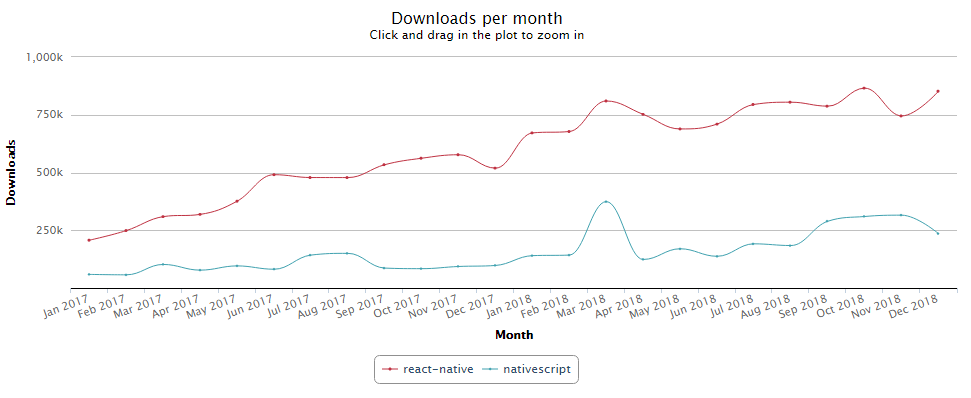
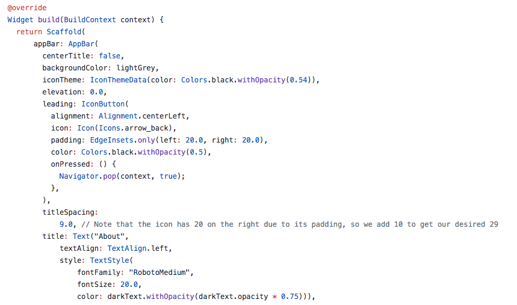
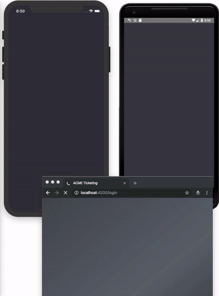

# "JavaScript-Native" Mobile Development

Time certainly flies when you realize it's been almost four years since the some of the most popular "JavaScript-native" frameworks were first released! Born back in 2015, [React Native](https://facebook.github.io/react-native/) and [NativeScript](https://www.nativescript.org/) both provide a similar model for JavaScript developers to crack into the *truly native* mobile development world. By using web skills like JavaScript, Typescript, and CSS - along with established frameworks like React, Angular, and Vue.js - these development options have created a new market for traditional web developers.

While the popularity of these frameworks is growing, some high-profile companies like AirBnb have [decided to scale back their usage of React Native](https://www.nativescript.org/blog/would-airbnb-have-fared-better-with-nativescript-instead-of-react-native). Where does this put JavaScript-native on the map today, where is it headed in 2019, and how does the upstart Dart-based Flutter come into play?

> **What is a JavaScript-native framework?** Hybrid app development frameworks like PhoneGap/Cordova/Ionic let you use your web skills (HTML/CSS/JavaScript) to create natively *installable* apps. However, hybrid-based apps run in a WebView, which presents performance and non-native UI limitations. JavaScript-native frameworks like NativeScript and React Native use JavaScript (and CSS) to power (and style) truly native UI on the device, without any WebViews, giving you the API reach and performance you demand.

## JavaScript-Native Today

For two years running, we've predicted a strong and steady rise in the adoption of both React Native and NativeScript, and we haven't been disappointed:

*Monthly npm downloads of the react-native and nativescript npm packages from 2017–2018 ([source](https://npm-stat.com/charts.html?package=nativescript&package=react-native&from=2017-01-01&to=2018-12-31))*

Year-over-year growth in adoption of both frameworks have been impressive, considering they are not necessarily competitors, but rather *complimentary* frameworks.

### React Native

Boosted by the rise of React over the past few years, React Native is THE way to develop native mobile apps with the React library. 73K GitHub stars and 45K questions on Stack Overflow make it clear how popular React Native has become. 2018 was another monster year for React Native, with companies like Facebook (of course), Walmart, and Bloomberg relying on it to power at least parts of their existing popular native mobile apps. However, Airbnb was extremely public in [their dismissal of React Native](https://medium.com/airbnb-engineering/react-native-at-airbnb-f95aa460be1c), stating “its benefits didn’t come without significant pain points”.

Undeterred, the future remains bright for React Native:

> “We're working on a large-scale rearchitecture of React Native to make the framework more flexible and integrate better with native infrastructure in hybrid JavaScript/native apps.” - [State of React Native, 2018](https://facebook.github.io/react-native/blog/2018/06/14/state-of-react-native-2018)

Going forward, the React Native team looks to be making the framework more lightweight and better able to fit into existing iOS and Android apps. By changing the threading model to one that is more similar to NativeScript, they hope to improve performance and stability. They are also incorporating async rendering capabilities into React Native to allow multiple rendering priorities and to simplify asynchronous data handling. Direct calls between native APIs and JavaScript will also be more efficient and easier to debug.

### NativeScript

Like React Native, NativeScript lets you use your web skills to create truly native mobile apps for iOS and Android. Unlike React Native, NativeScript provides official support for the Angular and Vue.js frameworks, along with plugin-free access to 100% of native device APIs. Large companies like SAP are [betting on NativeScript](https://blogs.sap.com/2017/05/24/sap-enterprise-app-modeler/), and the [#1 app in the US app stores over the holidays was a NativeScript-built app](https://www.nativescript.org/blog/portable-north-pole-your-go-to-nativescript-app-this-holiday-season).

*Portable North Pole, a NativeScript-built app, was the #1 trending app in the US iOS App Store over the holidays.*

**Where does NativeScript appear to be headed in 2019?**

While the core NativeScript framework has matured, there is always room for improving the developer experience, which is precisely a priority for the team in 2019.

By improving on capabilities such as Hot Module Replacement and adding additional support for CSS properties, the hope is to bring NativeScript as close as possible to a fast, iterative, workflow that we are all used to on the web.

*Hot Module Replacement, a feature NativeScript shipped in 2018, significantly speeds up how fast you can develop JavaScript-Native apps.*

The NativeScript team also wants to enable developers to create beautiful apps, by offering a full Material Design library out of the box. Both Angular and Vue.js developers will rejoice when they find that the "NativeScript to Web" code sharing stories will be a priority in 2019 as well.

### Flutter

The new kid on the block in 2018 was certainly Flutter. A product of Google, Flutter also lets you build native apps for iOS and Android from a single codebase. Flutter's architecture is very different from both NativeScript and React Native though, as instead of leveraging platform-specific native UI, you build your app UI on top of a 2D rendering engine. This leads to great performance, smaller app sizes, but a considerably steeper learning curve than React Native or NativeScript.

*Yes, even though Flutter requires you to develop with Dart, not JavaScript, we are including it here!*

Flutter was a big hit in 2018, scoring 52K GitHub stars and 10K questions on Stack Overflow.

The big downside to Flutter for JavaScript developers is that you must write your apps in Dart, which is definitely a learning curve. Furthermore, Flutter has no markup language, meaning, you must write not only your code in Dart, but also your UI layer as well—and code like this can get kind of messy.

*An example of what writing your UI looks like in Flutter ([source](https://github.com/2d-inc/HistoryOfEverything)).*

2019 will be a year to see if Flutter can overcome these obstacles and take off with JavaScript developers, as Google continues to stabilize and extend the framework.

## Moving Forward with JavaScript-Native

Rising tides lift all boats, and with React Native, NativeScript, and Flutter as tools, mobile app development has become more accessible to web developers than ever before. But how are these frameworks going to build on their successful pasts?

Developing with any of the JavaScript-native options today provide table stakes functionality in terms of native iOS and Android development with some amount of shared code between the two mobile platforms. And, while keeping up with the latest releases and APIs from Apple and Google will always be a priority, React Native has publicly stated their concerns with improving stability; NativeScript with focusing on developer productivity; and Flutter with targeting ease of adoption and core fundamentals.

With an argument that these frameworks are approaching a "feature-complete" state, where do we see them headed later in 2019?

### To the Web!

Wait a minute, didn't we just come from the web? Yes, but hear me out. Developing omni-channel mobile experiences is becoming a more and more critical component of what it means to create an "app" today. Responsive/mobile web, PWA, native iOS, native Android - that's arguably four distinct platforms to share a *single* experience.

This is where initiatives like React Native Web, NativeScript Schematics, and Flutter's Hummingbird come into play. With the ability to create responsive web experiences *along with* native iOS and Android apps, these frameworks are leading the way to advanced developer productivity and time-saving capabilities.

*An example of [building an iOS, Android, and web app simultaneously using NativeScript](https://docs.nativescript.org/angular/start/introduction).*

The ability to develop multiple apps from one code base, using one architecture and language, provide an enticing option for any team that needs to develop for native and the web simultaneously. Because of all these advantages, we see code-sharing approaches to boom in popularity in 2019.

### To Native Developers

Finally, our last prediction is one that jumps outside of the realm of the JavaScript world. With the growing power and stability of frameworks like NativeScript, React Native, and Flutter, we expect these tools to attract a growing number of iOS and Android developers.

Native developers already struggle with cross-platform development, as building and maintaining completely separate apps for iOS and Android can take a huge toll on any team or business. With the demand for native apps continuing to grow, we anticipate many native development teams will switch to JavaScript Native frameworks to meet their needs.