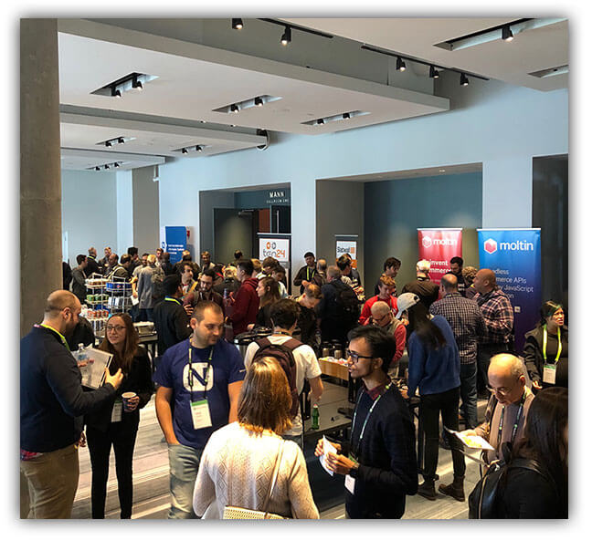
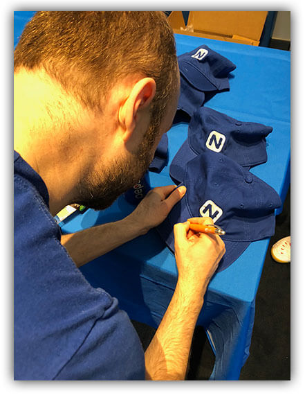

# The Future of JavaScript is Bright at jsMobileConf

A couple of weeks ago in Boston, Progress hosted [jsMobileConf](https://jsmobileconf.com/), an event for developers looking into and beyond the traditional JavaScript ecosystem.

Over 200 attendees packed the Aloft hotel in downtown Boston for a myriad of talks spanning virtually every technology that is impacted by JavaScript. What started as a mobile-only conference (hence the name!), jsMobileConf was molded by its speakers to become a host for cutting-edge JavaScript talks. From blockchain to VR to Machine Learning to AI to mobile apps to IoT, we covered a broad array of exciting new opportunities.

> We learned quickly that JavaScript is uniquely positioned as *the* gateway to a variety of new technologies.

## From {N} Developer Day to jsMobileConf

In previous years, what is today called jsMobileConf was known as NativeScript Developer Day (an event laser-focused on NativeScript developers). After a 2016 event in Boston and a 2017 event in New York City, it became clear that we had a lot more to offer the JavaScript community. And we are pleased to say it was a smashing success!

<blockquote class="twitter-tweet" data-lang="en">
<a href="https://twitter.com/BOS_TechEvents?ref_src=twsrc%5Etfw">@BOS_TechEvents</a> the <a href="https://twitter.com/hashtag/JSMobileConf?src=hash&amp;ref_src=twsrc%5Etfw">#JSMobileConf</a> was great! Learned a lot and met leaders in the industry and inspiring women in tech! <a href="https://t.co/99m93XZ9if">pic.twitter.com/99m93XZ9if</a>
&mdash; Michelle (@Maverick_7_) <a href="https://twitter.com/Maverick_7_/status/1056062299776135168?ref_src=twsrc%5Etfw">October 27, 2018</a></blockquote>

The quality of the speaker lineup was top-notch, with an opening keynote by Ethan Marcotte (who coined the term "responsive design"):

<blockquote class="twitter-tweet" data-conversation="none" data-lang="en">
Thank you so much, folks! And thanks so much for having me! Real honored to be a small part of <a href="https://twitter.com/hashtag/jsmobileconf?src=hash&amp;ref_src=twsrc%5Etfw">#jsmobileconf</a>
&mdash; Ethan Marcotte (@beep) <a href="https://twitter.com/beep/status/1055472463314862080?ref_src=twsrc%5Etfw">October 25, 2018</a></blockquote>

Other notable (and popular) sessions included Simon MacDonald's FaaS and the Serverless, tackling imposter syndrome with Diana Rodriguez, and Chris Fritz's inspiring talk on...believe it or not...writing great docs!

<blockquote class="twitter-tweet" data-lang="en">
.<a href="https://twitter.com/cotufa82?ref_src=twsrc%5Etfw">@cotufa82</a> rocking her talk on imposter syndrome at <a href="https://twitter.com/hashtag/JSMobileConf?src=hash&amp;ref_src=twsrc%5Etfw">#JSMobileConf</a>!!! <a href="https://t.co/QyuEcbCfwv">pic.twitter.com/QyuEcbCfwv</a>
&mdash; Brandon Satrom 🥕👖 (@BrandonSatrom) <a href="https://twitter.com/BrandonSatrom/status/1055526234539651072?ref_src=twsrc%5Etfw">October 25, 2018</a></blockquote>

While Microsoft's own Burke Holland gave a great talk on VS Code and Live Share, he also got to enjoy Macy Kuang's VR game demo:

<blockquote class="twitter-tweet" data-lang="en">
🥽 ⚡💡More <a href="https://twitter.com/hashtag/jsMobileConf?src=hash&amp;ref_src=twsrc%5Etfw">#jsMobileConf</a> fun with the  <a href="https://twitter.com/MiaomiaoGames?ref_src=twsrc%5Etfw">@MiaomiaoGames</a> booth game champion: <a href="https://twitter.com/burkeholland?ref_src=twsrc%5Etfw">@burkeholland</a> 💡⚡🥽 <a href="https://t.co/Q1d74YgP39">pic.twitter.com/Q1d74YgP39</a>
&mdash; 😆Tara Z. Manicsic🐺 (@Tzmanics) <a href="https://twitter.com/Tzmanics/status/1055939666166333441?ref_src=twsrc%5Etfw">October 26, 2018</a></blockquote>

A special thanks goes out to *all* of our speakers who helped put on such a fantastic show.

*Even Sebastian Witalec, who was spotted handing out autographs!*

## ICYMI

If you missed out on this year's jsMobileConf, have no fear, we've got your back.

All of the sessions were recorded and will be presented on the [Progress YouTube channel](https://www.youtube.com/channel/UCwr0eQsblxgpjkUXbiCjrRA) in the coming weeks. Speaker slidedecks are already available in [this Github repository](https://github.com/rdlauer/jsmobileconf-2018-speakers)!

Thanks to everyone who made jsMobileConf such a success, from the organizers to the speakers to the attendees...**and of course to the sponsors**:

- [Progress](https://progress.com/)
- [nStudio](https://nstudio.io/)
- [ten24](https://www.ten24web.com/)
- [Moltin](https://moltin.com/)
- [Thread](https://www.threadlearning.com/)

I think my colleague Brian Rinaldi summed up jsMobileConf best:

<blockquote class="twitter-tweet" data-lang="en">
The best part of running conferences is the opportunity to meet amazing people - both speakers and attendees. This was true of <a href="https://twitter.com/hashtag/jsMobileConf?src=hash&amp;ref_src=twsrc%5Etfw">#jsMobileConf</a> even moreso! Thanks all for making it awesome. 🙏
&mdash; Brian Rinaldi (@remotesynth) <a href="https://twitter.com/remotesynth/status/1055953623719600128?ref_src=twsrc%5Etfw">October 26, 2018</a></blockquote>

**See you next year!**