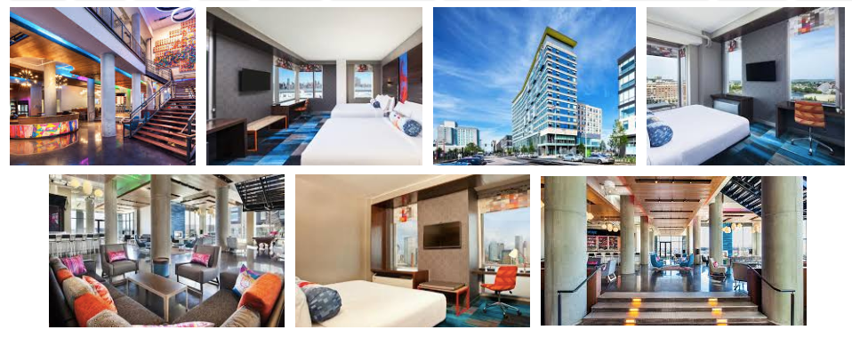

# {N} Blog: Meet the NativeScript Experts at jsMobileConf

It's almost fall - time to think about back-to-school activities 🏫, what you're going to dress up as for Halloween 🎃, and of course the fall tech conference season!

Over the past couple of years we've met many of you at our previous *NativeScript Developer Day* events in Boston and New York. This year we are doing something a little (ok A LOT) different. Building on our previous NativeScript-focused events, we are putting on an even bigger show that encompasses even more of the JavaScript ecosystem.

We are happy to be bringing you [jsMobileConf](https://jsmobileconf.com/) - a two-day, two-track event focused on all things JavaScript (*including* NativeScript!).

> jsMobileConf will be held on October 25th and 26th in Boston, MA. Skip the details and check out [jsMobileConf.com](https://jsmobileconf.com/) for speakers, sessions, and early bird pricing.

Come and meet some of the very best speakers from the broader NativeScript community. You'll find folks from the NativeScript Developer Relations team, members of the engineering team behind NativeScript, and a variety of community experts ([check out the full speaker list](https://jsmobileconf.com/#lgx-speakers)).

## You Can Do A Lot with JavaScript

**Why jsMobileConf?** The fact of the matter is there is very little you *can't* do with JavaScript these days. We've evolved quite a bit from the embedded `<script>` tag days with some jQuery animations sprinkled in (not that there is anything wrong with that!).

**Today JavaScript means more.** It means more to developers and reaches more technologies than ever before. So it's time to bring together some of the experts in a variety of cutting-edge fields to talk about how *you* can leverage **JavaScript** to hack on:

- Native Mobile Apps and PWAs
- Internet of Things (IoT)
- Blockchain
- Serverless
- AR and VR
- Artificial Intelligence

## Who is Speaking?

Ah, great question! We've already lined up some amazing speakers for you from Microsoft, Adobe, Progress, a variety of Google Developer Experts, and more.

*Here is but a small sample of the topics that may interest you most:*

<table class="speakers">
<tr>
<td></td>
<td><strong>Stanimira Vlaeva</strong>  <em>Webpack and Debugging</em></td>
<td></td>
<td><strong>Jeff Whelpley</strong>  <em>Angular</em></td>
</tr>
<tr>
<td></td>
<td><strong>Burke Holland</strong>  <em>VS Code Can Do That!?</em></td>
<td></td>
<td><strong>Jen Looper</strong>  <em>Humans vs AI</em></td>
</tr>
</table>

> For the full schedule, be sure to check out [jsMobileConf.com](https://jsmobileconf.com/#lgx-schedule)

## See You in Boston

jsMobileConf will be hosted at the magnificent [Aloft Boston Seaport District hotel](http://www.aloftbostonseaportdistrict.com/). Due to space restrictions we do anticipate selling out, so [grab your early bird tickets today](https://jsmobileconf.com/) and we will see you in Boston this October!

# Kendo UI (Telerik Blog): Meet the Kendo UI and PWA Experts at jsMobileConf

Even though our summer vacations are winding down, it's important to look at the bright side: the kids are headed back to school! 🎉

But more importantly, it's almost the fall tech conference season! If you've been following Progress and Telerik closely over the years, you know we only go big on conference season. [DevReach](https://devreach.com/) is a massively popular event we host in Sofia, Bulgaria. [ProgressNEXT](https://www.progress.com/next) is our flagship customer conference. We've also hosted *NativeScript Developer Day* events in Boston and New York the past two years.

While we are still hosting DevReach and ProgressNEXT, we are doing something a little different on the JavaScript mobility front this year. Building on the JavaScript theme, we are putting on an even bigger show that encompasses even more of the JavaScript ecosystem.

**We are happy to be bringing you [jsMobileConf](https://jsmobileconf.com/) - a two-day, two-track event focused on all things JavaScript (*including* Kendo UI and PWAs!).**

> jsMobileConf will be held on October 25th and 26th in Boston, MA. Skip the details and check out [jsMobileConf.com](https://jsmobileconf.com/) for speakers, sessions, and early bird pricing.

Come and meet some of the very best speakers from the broader Kendo UI community. You'll find folks from the Telerik Developer Relations team and a variety of community experts ready to engage you on all things JavaScript ([view the full speaker list](https://jsmobileconf.com/#lgx-speakers)).

## JavaScript FTW

**Why jsMobileConf?** The fact of the matter is there is very little you *can't* do with JavaScript these days. We've evolved quite a bit from the embedded `<script>` tag days with some jQuery animations sprinkled in (not that there is anything wrong with that!).

**Today JavaScript means more.** It means more to developers and reaches more technologies than ever before. So it's time to bring together some of the experts in a variety of cutting-edge fields to talk about how *you* can leverage **JavaScript** to hack on:

- Progressive Web Apps
- AR and VR
- Internet of Things (IoT)
- Blockchain
- Serverless
- Native Mobile Apps
- Artificial Intelligence

## Who is Speaking?

Ah, great question! We've already lined up some amazing speakers for you from Microsoft, Adobe, Progress, a variety of Google Developer Experts, and more.

*Here is but a small sample of the topics that may interest you most:*

<table class="speakers">
<tr>
<td></td>
<td><strong>Burke Holland</strong>  <em>VS Code Can Do That!?</em></td>
<td></td>
<td><strong>Tara Manicsic</strong>  <em>Service Workers</em></td>
</tr>
<tr>
<td></td>
<td><strong>Stanimira Vlaeva</strong>  <em>Webpack and Debugging</em></td>
<td></td>
<td><strong>Michael Solati</strong>  <em>Progressive Web Apps</em></td>
</tr>
</table>

> For a full session list, be sure to check out [jsMobileConf.com](https://jsmobileconf.com/#lgx-schedule)

## See You in Boston

jsMobileConf will be hosted at the magnificent [Aloft Boston Seaport District hotel](http://www.aloftbostonseaportdistrict.com/). Due to space restrictions we do anticipate selling out, so [grab your early bird tickets today](https://jsmobileconf.com/) and we will see you in Boston this October!

# Progress Blog: Meet the JavaScript Experts at jsMobileConf

Progress has been at the forefront of cutting edge JavaScript tech for years now. When you think of the web you think [Kendo UI](https://www.telerik.com/kendo-ui). When you think of native mobility you think [NativeScript](https://www.nativescript.org/). When you think serverless backend you think [Progress Kinvey](https://www.progress.com/kinvey).

This is why Progress is pleased to be hosting a new event this fall in Boston, MA. **[jsMobileConf](https://jsmobileconf.com/) is a two-day, two-track, event focused on all things JavaScript (*including* Kendo UI, NativeScript, and Kinvey!).**

But jsMobileConf is far more than Progress. With jsMobileConf we are putting on a show that encompasses *more* of the JavaScript ecosystem:

- Serverless
- Blockchain
- Internet of Things (IoT)
- Native mobile apps and Progressive Web Apps (PWAs)
- AR and VR
- Artificial Intelligence

> jsMobileConf will be held on October 25th and 26th in Boston, MA. Skip the details and check out [jsMobileConf.com](https://jsmobileconf.com/) for speakers, sessions, and early bird pricing.

Come and meet some of the leading voices in the JavaScript community - including the best from the Progress Developer Relations team and our favorite community experts.

## JavaScript++

**Why jsMobileConf?** The fact of the matter is there is very little you *can't* do with JavaScript these days. We've evolved quite a bit from the embedded `<script>` tag days with some jQuery animations sprinkled in (not that there is anything wrong with that!).

**Today JavaScript means more.** It means more to developers and reaches more technologies than ever before. So it's time to bring together some of the experts in a variety of cutting-edge fields to talk about how *you* can leverage **JavaScript** in new and innovative ways.

## Who is Speaking?

Ah, great question! We've already lined up some amazing speakers for you from Microsoft, Adobe, Progress, a variety of Google Developer Experts, and more.

<table class="speakers">
<tr>
<td></td>
<td><strong>Sage Franch</strong>  <em>Blockchain Crash Course</em></td>
<td></td>
<td><strong>Simon MacDonald</strong>  <em>FaaS???</em></td>
</tr>
<tr>
<td></td>
<td><strong>Tejas Ranade</strong>  <em>Serverless</em></td>
<td></td>
<td><strong>Macy Kuang</strong>  <em>Product Design for VR</em></td>
</tr>
</table>

> For a full session list, be sure to check out [jsMobileConf.com](https://jsmobileconf.com/#lgx-schedule)

## See You in Boston

jsMobileConf will be hosted at the magnificent [Aloft Boston Seaport District hotel](http://www.aloftbostonseaportdistrict.com/). Due to space restrictions we do anticipate selling out, so [grab your early bird tickets today](https://jsmobileconf.com/) and we will see you in Boston this October!

