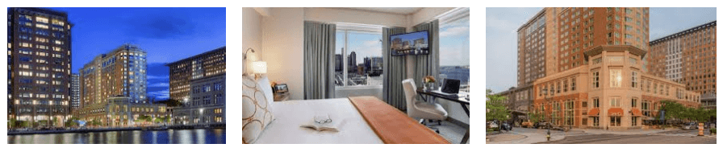

# {N} Blog: Meet the NativeScript Team at jsMobileConf

When the kiddos are headed back to school 🏫 and Halloween is right around the corner 🎃 it can only mean one thing...it's time for the fall tech conference season!

Over the past few years we've had the privilege of meeting many of you at our *NativeScript Developer Day* events in Boston, New York, and Amsterdam. Last year we tried something new - a community event (sponsored by Progress) showcasing the cutting edge capabilities unleashed by JavaScript.

And we are happy to bring you another year of [jsMobileConf](https://jsmobileconf.com/) - a two-day, two-track event focused on all things JavaScript (*including* NativeScript!).

> jsMobileConf will be held on November 12th and 13th in Boston, MA. Skip the details and check out [jsMobileConf.com](https://jsmobileconf.com/) for speakers, sessions, and pre-conference workshop info.

Come and meet some of the very best speakers from the NativeScript community! You'll find folks from the NativeScript Developer Relations team, members of the engineering team behind NativeScript, and a variety of community experts ([check out the full speaker list](https://jsmobileconf.com/#lgx-speakers)).

## Today JavaScript Means More

JavaScript means more to developers and reaches more technologies than ever before. So it's time to bring together some of the experts in a variety of fields to talk about how *you* can leverage **JavaScript** to hack on:

- Native Mobile Apps and PWAs
- Machine Learning
- Chatbots
- Serverless
- AR and VR
- Artificial Intelligence

## Who is Speaking at jsMobileConf?

We've lined up some amazing speakers for you from Microsoft, Adobe, Progress, Netlify, a variety of Google Developer Experts, and more.

*Here is but a small sample of the topics that may interest you most:*

<table class="speakers">
<tr>
<td></td>
<td><strong>Stanimira Vlaeva</strong>  <em>Embedding V8 in the Real World</em></td>
<td></td>
<td><strong>TJ VanToll</strong>  <em>10 Awesome Things You Can Build With NativeScript</em></td>
</tr>
<tr>
<td></td>
<td><strong>Alex Ziskind</strong>  <em>You Spin Me Round: NativeScript Animation Performance</em></td>
<td></td>
<td><strong>Jen Looper</strong>  <em>Lucy in the Sky with ML: Building the Ultimate Beatles Tribute App</em></td>
</tr>
</table> 

For the full schedule be sure to check out [jsMobileConf.com](https://jsmobileconf.com/#lgx-schedule).

> Don't miss the [pre-conference workshops](https://jsmobileconf.com/#lgx-register-workshops) as well! 

## See You in Boston!

jsMobileConf will be hosted at the [Seaport Hotel & World Trade Center](https://www.seaportboston.com/). Due to space restrictions we do anticipate selling out, so [grab your tickets today](https://jsmobileconf.com/) and we will see you in Boston this November!

# Telerik Blog: Meet the Kendo UI and PWA Experts at jsMobileConf

While our summer vacations are winding down 😭, it's important to look at the bright side: the kids are headed back to school! 🎉

But even more importantly, the fall tech conference season is upon us! If you've been following Progress and Telerik closely over the years, you know we only go big during conference season. [DevReach](https://devreach.com/) is a massively popular event we host in Sofia, Bulgaria. [ProgressNEXT](https://www.progress.com/next) is our flagship customer and partner conference. **And [jsMobileConf](https://jsmobileconf.com/) is back again this year!**

jsMobileConf is a two-day, two-track event focused on all things JavaScript (*including* Kendo UI and PWAs!).

> jsMobileConf will be held on November 12th and 13th in Boston, MA. Skip the details and check out [jsMobileConf.com](https://jsmobileconf.com/) for speakers, sessions, and pre-conference workshop info.

Come and meet some of the very best speakers from the broader Kendo UI and Progressive Web App community. You'll find folks from the Telerik Developer Relations team and a variety of community experts ready to engage you on all things JavaScript ([view the full speaker list](https://jsmobileconf.com/#lgx-speakers)).

## JavaScript FTW

JavaScript means more to developers and reaches more technologies than ever before. So it's time to bring together some of the experts in a variety of fields to talk about how *you* can leverage **JavaScript** to hack on:

- Native Mobile Apps and PWAs
- Machine Learning
- Chatbots
- Serverless
- AR and VR
- Artificial Intelligence

## Who is Speaking?

We've lined up some amazing speakers for you from Microsoft, Adobe, Progress, Netlify, a variety of Google Developer Experts, and more.

*Here is but a small sample of the topics that may interest you most:*

<table class="speakers">
<tr>
<td></td>
<td><strong>Max Firtman</strong>  <em>Keynote: How to Survive 20 Years Developing Apps</em></td>
<td></td>
<td><strong>Alyssa Nicoll</strong>  <em>Dark Patterns in UI — What NOT to Do to Your Users</em></td>
</tr>
<tr>
<td></td>
<td><strong>Jen Looper</strong>  <em>Lucy in the Sky with ML: Building the Ultimate Beatles Tribute App</em></td>
<td></td>
<td><strong>Carl Bergenhem</strong>  <em>Why Every Web App Should be a PWA</em></td>
</tr>
</table> 

For the full schedule be sure to check out [jsMobileConf.com](https://jsmobileconf.com/#lgx-schedule).

> Don't miss the [pre-conference workshops](https://jsmobileconf.com/#lgx-register-workshops) as well! 

## See You in Boston!

jsMobileConf will be hosted at the [Seaport Hotel & World Trade Center](https://www.seaportboston.com/). Due to space restrictions we do anticipate selling out, so [grab your tickets today](https://jsmobileconf.com/) and we will see you in Boston this November!

# Progress Blog: Meet the JavaScript Experts at jsMobileConf

For years Progress has been at the forefront of cutting edge JavaScript tech. When you think of the web you think [Kendo UI](https://www.telerik.com/kendo-ui). When you think of native mobility you think [NativeScript](https://www.nativescript.org/). When you think serverless you think [Progress Kinvey](https://www.progress.com/kinvey).

This is why Progress is pleased to be sponsoring jsMobileConf again this fall in Boston, MA! [jsMobileConf](https://jsmobileconf.com/) is a two-day, two-track, event focused on all things JavaScript (*including* Kendo UI, NativeScript, and Kinvey!).

But jsMobileConf is far more than Progress. With jsMobileConf we are putting on a show that encompasses *more* of the JavaScript ecosystem:

- Native Mobile Apps and PWAs
- Machine Learning
- Chatbots
- Serverless
- AR and VR
- Artificial Intelligence

> jsMobileConf will be held on November 12th and 13th in Boston, MA. Skip the details and check out [jsMobileConf.com](https://jsmobileconf.com/) for speakers, sessions, and pre-conference workshop info.

Come and meet some of the leading voices in the JavaScript community - including the best from the Progress Developer Relations team and our favorite community experts.

## Who is Speaking?

We've lined up some amazing speakers for you from Microsoft, Adobe, Progress, Netlify, a variety of Google Developer Experts, and more.

<table class="speakers">
<tr>
<td></td>
<td><strong>Aysegul Yonet</strong>  <em>How to Build Better Tutorials with Mixed Reality</em></td>
<td></td>
<td><strong>Jeff Whelpley</strong>  <em>Mobile UX from AMP to Native</em></td>
</tr>
<tr>
<td></td>
<td><strong>Carl Bergenhem</strong>  <em>Why Every Web App Should be a PWA</em></td>
<td></td>
<td><strong>Jen Looper</strong>  <em>Lucy in the Sky with ML: Building the Ultimate Beatles Tribute App</em></td>
</tr>
</table> 

For the full schedule be sure to check out [jsMobileConf.com](https://jsmobileconf.com/#lgx-schedule).

> Don't miss the [pre-conference workshops](https://jsmobileconf.com/#lgx-register-workshops) as well! 

## See You in Boston!

jsMobileConf will be hosted at the [Seaport Hotel & World Trade Center](https://www.seaportboston.com/). Due to space restrictions we do anticipate selling out, so [grab your tickets today](https://jsmobileconf.com/) and we will see you in Boston this November!

