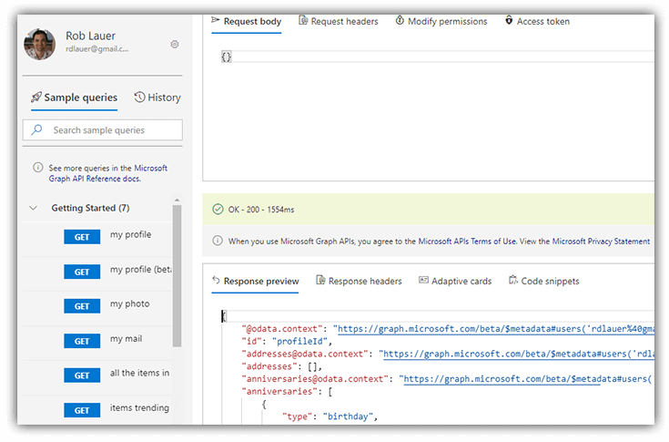

# A Gentle Introduction to Microsoft Graph

You know that feeling when a product or service transitions from "casual mention on Twitter" to "holy crap this is legit"? That's the sense I get on a topic that's been bandied about for some time now: [Microsoft Graph](https://docs.microsoft.com/en-us/graph/overview).

First announced back in 2015 (ah, the good old days!), Microsoft Graph has evolved into a complete, unified API platform that developers use to connect to Microsoft services. At a high level, those include Microsoft 365 (i.e. Word, Outlook, Sharepoint, OneDrive, etc), Azure Active Directory, and certain Windows services. With Microsoft Graph, you're not just connecting to these *services*, you're connecting to *your data*.

Put another way, Microsoft Graph helps developers make sense of this tangled web of data:

Provided via a single RESTful endpoint at `graph.microsoft.com`, Microsoft Graph is how developers build productivity apps on top of the Microsoft services their company is already invested in. With a single auth flow, we can easily connect to consumer and/or business data.

Want a simple example? How about getting my Microsoft profile:

	https://graph.microsoft.com/v1.0/me

Or take it up a notch and retrieve emails marked "high importance":

	https://graph.microsoft.com/v1.0/me/messages?$filter=importance%20eq%20'high'

## Ok...But Why?

Valid question. Let me answer the "why" in two different ways:

**1) Isn't my M365 data already exposed through other avenues?** 🤔

Yes! For years now, each service listed above has had a means of programmatically accessing underlying data. Sharepoint, Outlook, and others do have their own independent SDKs. **But never in a unified model.**

What happens when you want to answer a question like, "what are my next three tasks due in Planner, where are the associated files, and do I have any upcoming meetings with associated teammates?". Now you get into combining disparate data from multiple SDKs, and all hell breaks loose! 😡

**2) Why would I want to query my mail, contacts, calendar, or files? Aren't there already apps for that?** 🤨

I'm not suggesting you want to rebuild Outlook from scratch. I am suggesting that each business is unique and the questions they have on a daily basis are answerable by data stored in these systems.

With Microsoft Graph, we can query our data to answer virtually any question that pertains to the data stored in the Microsoft Cloud, across systems. These "cross-application" data querying possibilities are enabled out of the box.

*Think about the problems you can address:*

- Automatically reschedule meetings based on individual responses.
- Create real-time forecasts that merge sales data with sentiment analysis from prospect emails.
- Generate reports that show trending files and resources.
- Crack the whip on employees by measuring how quickly Planner tasks are closed.
- Send notifications when sensitive documents are accessed.

> I would argue the primary value of Microsoft Graph is to answer questions that can't be easily addressed by existing M365 products and services.

*So how do we use it?*

## A Path to Getting Started

Your first step in truly grokking Microsoft Graph is going to be the [Graph Explorer](https://developer.microsoft.com/en-us/graph/graph-explorer).

The Graph Explorer provides a friction-free means of exploring and understanding the underlying capabilities of Microsoft Graph. You start with a sample account, no auth required.

Curious about what *your* data looks like? Simply authenticate with your Microsoft credentials (either personal or corporate) and start playing with queries that expose real data:

## Sample Queries

The Graph Explorer is great and all, but the real value for me comes out of the sample queries. With ~100 different queries, you can get a better sense of the capabilities and questions that you can start answering with the Graph API.

Code snippets are also available along with the queries, allowing the laziest of us to copy-and-paste our way to app glory:

	// get all my mail (JavaScript SDK)
	
	const options = { authProvider };
	const client = Client.init(options);
	
	let res = await client.api('/me/messages').get();

What about more complicated queries you ask? Microsoft Graph supports [OData query parameters](https://docs.microsoft.com/en-us/graph/query-parameters) such as `$filter`, `$orderby`, and `$count`. For example, to get the count of my messages, I might do something like:

	/me/messages?$count=true

## YOU get an SDK and YOU get an SDK!

In typical (modern) Microsoft fashion, very few developers are left behind. [SDKs are currently available](https://docs.microsoft.com/en-us/graph/sdks/sdks-overview) for the following platforms:

- Android
- Angular
- ASP.NET
- iOS
- Javascript
- Node.js
- Java
- PHP
- Python
- Ruby

Not seeing your platform or language of choice above? No worries. These SDKs are here to make our lives easier, but they aren't prerequisites to utilizing the underlying API.

## Next Steps

Congratulations! 🎉 You've taken a single baby step towards understanding the value Microsoft Graph provides.

Maybe you're already brainstorming some solutions for solving real problems at your company. Maybe you ARE ready to build the next Sharepoint!?

In any case, when you're ready to take the next step I'd suggest:

1. Using the [Graph Explorer](https://developer.microsoft.com/en-us/graph/graph-explorer) to play around with some of the aforementioned sample queries.
2. Trying out the [Microsoft Graph Quick Start](https://developer.microsoft.com/en-us/graph/quick-start) to see code from your favorite language/platform in action.
3. Build out a full app with the [Microsoft Graph tutorials](https://docs.microsoft.com/en-us/graph/tutorials).

It's your data. Well, maybe it's your organization's data. Either way, let Microsoft Graph make your life easier to help you build the next great productivity app for your business.