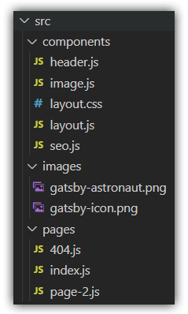
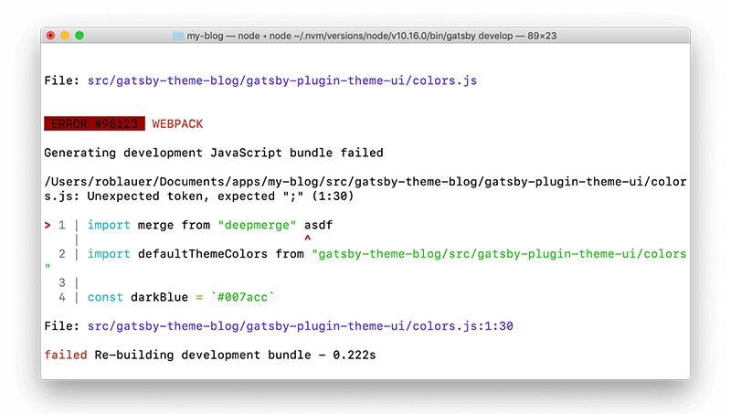

# What is Gatsby?

I've taken a keen interest in [Gatsby](https://www.gatsbyjs.com/) lately, one of the more popular "static site generators". This coming from a guy who was born in Active Server Pages, cut his teeth on Cold Fusion, dabbled in PHP, and built countless enterprise apps with ASP.NET.

The common thread in all of these web technologies is their *dynamic* nature. They query databases directly, collect info from users, display data on the fly, and provide engaging animated UX. So why would I regress to my roots of writing *static* websites?

```html
<P><FONT FACE="Comic Sans" COLOR="Red"><B>Rob's Backstreet Boys Fanpage</B></FONT></P>
<P></IMG></p>
```

Because static sites are from the 90's, right? Jekyll (and other "static site generators") are only good for marketing pages and blogs...right?


Needless to say, my preconceived notion of what a "static site" meant, was way, way, way off.

## Gatsby is a *Dynamic* Static Site Generator 😅

Gatsby is an open source (MIT-licensed) static site generator that enables you to build performant websites on top of React, GraphQL, and other frontend-friendly tooling such as webpack and react-router.

Yes, it's a *static* site generator. But this is the last time we are going to use that antiquated term. Because on the web, static != unchanging. And that's the first lesson I needed to learn.


For me, grokking Gatsby meant understanding some key capabilities and benefits:

- 🏎️ **Fast apps.** Gatsby leverages code splitting, minification, among other optimizations. Apps are PWA-enabled and built for speed.
- ⚒️ **Amazing DX.** Gatsby simplifies tooling configs and has minimal boilerplate. Hot reloading Just Works™.
- 🔌 **Vast plugin options.** Need to add Google Analytics support? There's a [plugin for that](https://www.gatsbyjs.org/packages/gatsby-plugin-google-analytics).
- 🥇 **Built on mature tech.** React is objectively the most popular frontend framework. GraphQL is the standard for querying APIs.

> Gatsby empowers developers to build blazing fast web apps with a somewhat-opinionated way of using React and GraphQL. It has an unparalleled developer experience to boot.

Let's see if I can prove this to you.

## The Simplest Gatsby Site

Before we start, you need to understand that a Gatsby app is still a React app. Anything you can do with React, you can still do with Gatsby.

So get your install on:

```javascript
$ npm install -g gatsby-cli
```

Create a boilerplate Gatsby app:

```javascript
$ gatsby new my-first-gatsby-app
```

Get yourself into this newly created directory:

```javascript
$ cd my-first-gatsby-app
```

And finally start your dev server:

```javascript
$ gatsby develop
```

This will perform a dev build of your app and be available locally at `http://localhost:8000`.

> **NOTE:** The other link you see in your terminal is this: `http://localhost:8000/___graphql`. [GraphiQL](https://github.com/graphql/graphiql) provides a web interface to test your GraphQL queries, which are critical to Gatsby apps.

Open up the generated project directory in [your favorite editor](https://code.visualstudio.com/), expand the `src` directory, and you should see something like this:



Anyone with the even most basic experience with React will be able to make sense of what is happening in `index.js`:

```javascript
import React from "react"
import { Link } from "gatsby"

import Layout from "../components/layout"
import Image from "../components/image"
import SEO from "../components/seo"

const IndexPage = () => (
  <Layout>
    <SEO title="Home" />
    <h1>Hi people</h1>
    <p>Welcome to your new Gatsby site.</p>
    <p>Now go build something great.</p>
    <div style={{ maxWidth: `300px`, marginBottom: `1.45rem` }}>
      <Image />
    </div>
    <Link to="/page-2/">Go to page 2</Link>
  </Layout>
)

export default IndexPage
```

Aside from the abhorrent lack of semicolons, I like the way this looks. 😀

## Pages in Gatsby

In the `pages` directory you'll see `404.js`, `index.js`, and `page-2.js`. These are React components, yes. But Gatsby automatically turns these components into real web pages with real URLs.

So if you wanted to manually see what's in `page-2` without clinking the link from `index`, just type `http://localhost:8000/page-2` into your browser.


## The Gatsby Link Component

But let's look at how you *really* want to move people around your app. It starts with the `<Link>` component. You probably guessed this is what allows you to create links to other pages on your site. And that would be correct! My understanding of routing in React is that it's a hot mess, so Gatsby has chosen to leverage the `@reach/router`. `<Link>` is a wrapper around their link component.

My favorite part about using `<Link>` is the fact that pre-fetching is enabled by default. In our scenario, this means `page-2` will be preloaded and almost instantly available when the user clicks on the link in the browser! From the Gatsby docs:

> We use an `IntersectionObserver` to fetch a low-priority request when the `Link` is in the viewport and then use an `onMouseOver` event to trigger a high-priority request when it is likely that a user will navigate to the requested resource.

## Optimized Images in Gatsby (also, Plugins FTW!)

Much of the power of Gatsby comes from its [extensive collection of plugins](https://www.gatsbyjs.org/plugins/).


One example that ships as part of our starter app is the `Image` component (powered by the `gatsby-image` plugin).

`gatsby-image` leverages core Gatsby image optimization capabilities along with some fancy image loading techniques to automagically optimize images for your site.

Why would you want to use the `gatsby-image` component vs a regular `` element?

1. It lazy loads your images.
2. Small versions of images are loaded first while using a "blur" effect as the full image loads.
3. The optimal image size is used based on the consuming device.
4. It can use WebP if your browser supports it.

> **NOTE:** This isn't a replacement for a service like [Cloudinary](https://cloudinary.com/), but does provide some quick zero-config optimizations of static images in your app.

## Styling Gatsby Sites

You know how Gatsby sites are still just React sites, yeah? Well that means you can still perform inline styling of your elements:

```html
<div style={{ maxWidth: `300px`, marginBottom: `1.45rem` }}>
```

But it gets cooler. 😎

**Want to use a global CSS file?** Create a `src/styles/global.css` file and import it in `gatsby-browser.js`:

```javascript
import "./src/styles/global.css"
```

**Do you use multiple page layouts in your site?** This is a much more common scenario, so Gatsby lets you assign CSS files to `Layout` components (and of course individual `Layout` components can be imported on individual pages).

So in our starter app, you'll see there is a `layout.js` component and a `layout.css` file. And in `index.js` you'll see the `Layout` import and usage of the `<Layout>` element:

```javascript
const IndexPage = () => (
  <Layout>
	...
```

[Layouts are a whole beast](https://www.gatsbyjs.org/docs/layout-components/) in and of themselves, but a key concept to learn.

## Hot Reload and the Developer Experience

Where Gatsby truly stands out is in its Developer Experience (DX). To repeat myself: hot reloading Just Works™.

In your `index.js`, change `<h1>Hi people</h1>` to `<h1>Rob's Backstreet Boys Fanpage</h1>`. And check out your browser. 😍

The CLI display is also clean and concise, it's not overly verbose. When you hit an error, you don't get overwhelmed with debugging messages:



Last, but certainly not least, [the docs are top-notch](https://www.gatsbyjs.org/docs/). You just don't often see documentation this pristine!

## GraphQL and Gatsby

Much is made about how Gatsby relies on [GraphQL](https://www.gatsbyjs.org/docs/graphql-concepts/). And this is no joke. GraphQL is used not only for remote data operations, but also for querying local file assets.

A simple example of the latter concept is easily understood when considering a global site heading. Instead of re-typing `Rob's Backstreet Boys Fanpage` on every page of your site, you can store that in one file, query it with GraphQL, and expose it via a `Layout`.

Update the `siteMetadata` node of your `gatsby-config.js` and change the `title`:

```javascript
module.exports = {
  siteMetadata: {
    title: `Rob's Backstreet Boys Fanpage`,
    description: `Kick off your next, great Gatsby project with this default starter.`,
    author: `@gatsbyjs`,
  },
```

> **NOTE:** When you change certain Gatsby configs, you'll have to restart your server with `$ gatsby develop` to see the updates.

In `layout.js`, you'll see a pre-existing GraphQL query:

```javascript
const data = useStaticQuery(graphql`
	query SiteTitleQuery {
	  site {
	    siteMetadata {
	      title
	    }
	  }
	}
`)
```

...with a corresponding property in the `<Header>` element:

```html
<Header siteTitle={data.site.siteMetadata.title} />
```

Earth-shattering? No, but just one of many examples on how you can leverage the power of GraphQL to power your site.

## Gatsby in a Nutshell

While I'm still new to Gatsby, I believe it has the potential to be a paradigm shift in website development. As the world becomes more mobile and performance becomes even more critical, we need frameworks like Gatsby to empower developers to stay on the leading edge.