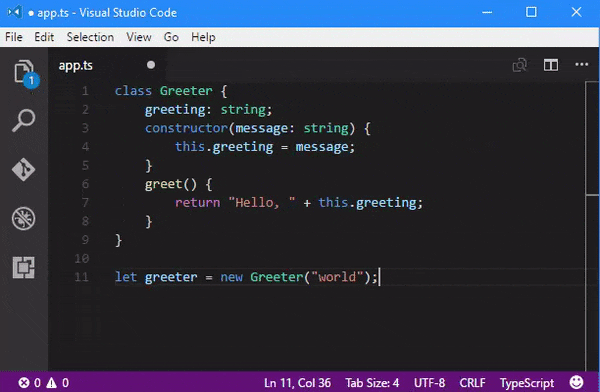

# What is TypeScript?

Even as I mature as a developer (a.k.a. "as I get older..."), at times I still feel like a complete beginner. And these days I can attest that we noobs are feeling a bit overwhelmed with the expanding footprint of JavaScript.

It's alternately amazing and overwhelming what you can do with the language. Frameworks like Angular 2, React, NativeScript, Ionic, and Vue are showing us the diverse implementations of JavaScript. **It is everywhere.** So what can we do to make JavaScript easier to write and more maintainable, all while using cutting edge standards?

That is the question asked by Microsoft some years back. And the answer became [TypeScript](https://www.typescriptlang.org/).

## A Brief History of TypeScript

If you're curious about the birth of TypeScript, look no further than its creator, [Anders Hejlsberg](https://twitter.com/ahejlsberg), who provided a great introductory video back in 2012 when the first public version was released.

 <iframe src="https://channel9.msdn.com/posts/Anders-Hejlsberg-Introducing-TypeScript/player" width="550" height="310" allowFullScreen frameBorder="0"></iframe>

The concepts Anders mentions in this video are still valid today, which explains some of the recent explosion in interest for TypeScript.

Let's take a quick look at how far the TypeScript team has come:

- 2010 - Anders and his team begin development
- 2012 - First public version released (TypeScript 0.8)
- 2013 - TypeScript 0.9 released, adding support for generics
- 2014 - TypeScript 1.0 released, including support baked into Visual Studio
- 2017 - TypeScript 2.1 released (see [what's new](https://github.com/Microsoft/TypeScript/wiki/What's-new-in-TypeScript))

TypeScript has matured, so let's look at **what TypeScript is in practice and what it provides for us today**.

## So What IS TypeScript?

> JavaScript is TypeScript, but TypeScript is not JavaScript.

Philosophy majors rejoice! The truth is that TypeScript is an extension (a "superset") of the JavaScript language. It differentiates itself from competitors like [CoffeeScript](http://coffeescript.org/) and [Dart](https://www.dartlang.org/) in that plain JavaScript code can be intermixed with TypeScript.

*Therefore JavaScript IS TypeScript.* But TypeScript has to be compiled into JavaScript before it can run in any JavaScript engine (with a web browser or in [node.js](https://nodejs.org/en/)). This means you cannot embed TypeScript into a web page directly using `<script>` tags, but TypeScript (in .ts files) can get compiled into JavaScript (in .js files) for usage.

Let's look at an example of TypeScript syntax from the [TypeScript Playground](http://www.typescriptlang.org/play/). In this case we have TypeScript code:

	class Greeter {
	    greeting: string;
	    constructor(message: string) {
	        this.greeting = message;
	    }
	    greet() {
	        return "Hello, " + this.greeting;
	    }
	}

...that gets transpiled into JavaScript:

	var Greeter = (function () {
	    function Greeter(message) {
	        this.greeting = message;
	    }
	    Greeter.prototype.greet = function () {
	        return "Hello, " + this.greeting;
	    };
	    return Greeter;
	}());

Wait a minute, is that a `class` I see? In JavaScript?! Here we see the first of the main advantages of TypeScript: **TypeScript includes support for modern features such as modules, classes, constants, and arrow functions that are part of [ECMAScript 6](http://es6-features.org/#Constants) (ES6)**.

This means that by using TypeScript you can use the latest ES6 standards but not worry about browser or node version support, since TypeScript compiles to "standard JavaScript".

> "TypeScript is a typed superset of JavaScript that compiles to plain JavaScript"

This is a great quote that comes from the TypeScript website. Let's break down each part to dig into more of the advantages TypeScript offers.

## TypeScript is a Superset of JavaScript

This is a fancy way of saying that TypeScript builds upon the foundation laid by JavaScript. Any syntactically-valid JavaScript you write today is perfectly compatible with TypeScript. You can intermix JavaScript and TypeScript without the TypeScript compiler making any rude comments on your coding style.

More importantly, as briefly mentioned already, TypeScript allows you to leverage bleeding edge features of ECMAScript 6 and compile it into JavaScript. Some of those features include:

- [Classes](http://www.typescriptlang.org/docs/handbook/classes.html)
- [Modules](https://www.typescriptlang.org/docs/handbook/modules.html)
- [Arrow Functions](https://www.typescriptlang.org/docs/handbook/functions.html)

Arrow functions, for example, make it easier to code a function. In TypeScript this:

	var inc = (x)=>x+1;

...becomes this in JavaScript:

	var inc = function (x) {
		return x + 1;
	};

TypeScript also introduced [Generics](https://www.typescriptlang.org/docs/handbook/generics.html) to the JavaScript language. And while Generics don't have a lot to do with ES6, they are a very familiar construct to people coming from C# or Java.

## TypeScript is Typed

Due to the dynamic nature of JavaScript variables, it can be difficult to identify bugs until the code is executed at runtime. TypeScript helps to solve this by providing optional static typing. The difference between dynamic and static typing can be huge when it comes to debugging an application. Take this overly simplistic scenario as an example:

	var x = 2;
	x = "two"; // some crazy person re-assigned a variable!
	var y = x/2;

Now who would write such a thing? Well, if you wrote this with JavaScript you would normally not spot the error until runtime. This code could be buried and you might not realize the error until a user complains.

TypeScript, by using type inference, would notice that you are changing the type from a `number` to a `string`. And you would know this **as you are typing**, not at runtime, saving you valuable debugging cycles.

TypeScript can also make your code more legible for other people. Take this chunk of JavaScript for instance:

	function addThese(x, y) {
	    if (typeof x !== 'number' || typeof y !== 'number') {
	        throw new Error("Problemo!");
	    }
	    return x + y;
	}

...could be simplified quite a bit in TypeScript with:

	function addThese(x: number, y: number): number {
	    return x + y;
	}

**This is accomplished simply by adding types to your variables!**

Another bonus of a strongly-typed language is that modern IDEs can take advantage of this fact and provide code-completion options (a.k.a. intellisense). For example, here in [Visual Studio Code](https://code.visualstudio.com/), you'll see how useful intellisense can be when writing TypeScript:

Finally, you can even take advantage of code completion in external libraries via [TypeScript declaration files](https://www.typescriptlang.org/docs/handbook/declaration-files/introduction.html) (think autocompletion for [jQuery](https://github.com/DefinitelyTyped/DefinitelyTyped/tree/master/jquery), [Angular](https://github.com/DefinitelyTyped/DefinitelyTyped/tree/master/angular), [React](https://github.com/DefinitelyTyped/DefinitelyTyped/tree/master/react), and so on).

You can find TypeScript declaration files on [DefinitelyTyped](http://definitelytyped.org/).

## TypeScript Compiles to Plain JavaScript

As you know by now, TypeScript gets compiled into standard JavaScript. This compilation happens as you are writing code (using a compatible IDE or the TypeScript compiler), but before the code is executed in your website or app.

We've already seen an example from the TypeScript Playground of how TypeScript code gets compiled into readable JavaScript. In some cases the compilation step generates more code, in some cases less, but you can always trust that the compiled TypeScript code will generate valid JavaScript, ready to run on any client or server application.

## Angular 2 and NativeScript

TypeScript received a huge boost in notoriety when the Angular team announced that [Angular 2 would be written with TypeScript](https://vsavkin.com/writing-angular-2-in-typescript-1fa77c78d8e8#.gr3w1nkhg). This helped to legitimize the tool and even led to the [NativeScript](https://www.nativescript.org) team adopting TypeScript.

To get started developing truly native mobile apps for iOS and Android with TypeScript (with or without Angular), check out the [NativeScript getting started experience](http://docs.nativescript.org/) or just run these commands right now:

	// install nativescript from npm	
	$ npm install -g nativescript
	
	// create a Telerik NativeScript (tns) app with TypeScript enabled (--tsc flag)
	$ tns create your-app-name --tsc
	
	// switch to that new app directory
	$ cd your-app-name
	
	// run the app in either the iOS Simulator or an Android emulator
	$ tns run ios|android

## Next Steps

Curious to learn more about TypeScript? Check out these free resources:

- [Official TypeScript Quick Start](http://www.typescriptlang.org/docs/tutorial.html) (by Microsoft)
- [TypeScript Deep Dive](https://basarat.gitbooks.io/typescript/content/docs/getting-started.html) (free book by Basarat Ali Syed)
- [Hello World with TypeScript in NativeScript](https://www.youtube.com/watch?v=2JDXnduTlgs) (video from Alex Ziskind)

