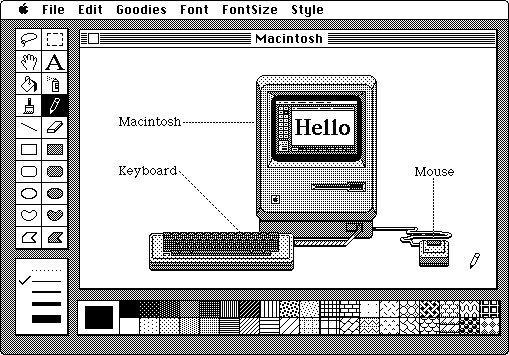

# Migrating from Windows to macOS in 2021

Yeah I know, you've seen this article a million times before. Everyone has their own story of moving from Windows to Mac or vice versa. But this is my story, and hopefully it'll help at least one person out there avoid the annoyances I ran into when migrating from Windows 10 to macOS Big Sur.

The good news is in 2021, it's never been easier to move between completely different operating systems due to cloud storage of app configurations, documents, and everything in between.

The bad news? Well, get ready to try and adapt to how a *different* trillion dollar company thinks you should work!

Almost any motion between platforms requires combatting some level of muscle memory. In my case, I grew up on a Mac. I spent 1985-1999 invested in a Mac Plus, LC III, Centris 610, and a Performa.

All good things must come to an end, and just when Steve Jobs was revving up the Apple machine again, I switched over to Windows 2000. Because real business was done on Windows (or so I was told).

20-ish years later, it's time to re-invent myself on macOS. Skipping a few hardware generations (and writing this on a M1 MacBook Pro) I've run into a few roadblocks on my journey back to the land of Dark Castle and MacPaint.

Without further ado, here are some key issues I had to address to re-learn how to become productive on macOS.

## Just Show the Damn Desktop

Windows 10 can't make it any easier to show the desktop. Click in the lower-right corner hotspot and voila, there is your desktop!

macOS can *kinda* do this using a three-finger swipe (or similar mouse action) to bring up a new desktop. Or you can configure a hotspot in **Mission Control** to hide all open windows and show the desktop.

Sorry Mac-heads, but I'm not a fan of either method. Instead, I found free tool called [Show Desktop](https://www.everydaysoftware.net/showdesktop/). It lives in my dock and when I click it, what does it do? It shows my Finder desktop *without* also hiding open folders!

## Window Minimization WTF Part I

After 20 years of mousing to the upper-right corner of a window to minimize or close it, switching to the upper-left has been near impossible.

Lo and behold, I ran across the **Dock & Menu Bar** setting which allows you to simply double-click anywhere in an application's title bar to minimize an open window.

## Window Minimization WTF Part II

Yeah, so that window gets minimized, but it also pollutes my dock.

I'm more used to the Windows 10 method of minimizing back to the host application icon. Keeps my menu bar nice and tidy.

Luckily there is a dock setting that allows you to do just this.

See that image I posted above? Imagine the red box is around "Minimize windows into application icon" instead. 🤝

## Window Re-Sizing for the Anal Retentive

One thing I always, always, always hated about macOS is the fact that application windows have rounded corners. I know, it's silly, but something about being able to re-size windows in Windows (what?) to a pixel-perfect location that 100% fills the space allocated always scratched some kind of latent itch for me.

Well, I found another awesome open source tool to help me out on macOS. [Rectangle](https://rectangleapp.com/) scratches this itch by allowing me to assign keyboard commands to resize windows to perfection.

Now I can have a window that is anchored to the left, middle, right, or anywhere in between. All perfectly sized to my way-too wide monitor dimensions.

## Speaking of Ultrawide Monitors

Three thumbs down Apple! 👎👎👎

One of the admittedly shocking moments of moving from Windows to macOS was the diminished quality of my beloved Dell U3415W ultrawide monitor. RIP in peace. 🪦

In hindsight, I shouldn't have been surprised. Why would I think that using a relatively low DPI monitor with a computer that is ready to pump out Retina-dense pixels would just work?

Unfortunately for me, one of my first post-Mac purchases was to buy a new "hidpi" monitor, the ridiculously wide MSI PS341WU.

**The upside?** With a true 5K2K monitor, I effectively get near-Retina quality from a reasonably priced non-Apple monitor.

**The downside?** As of macOS 11.2.3, 5K2K ultrawide monitor resolutions are not *actually* supported on the M1 Mac. **Say what?** So instead of true 5120x2160 resolution, I'm downscaled to 3008x1269. Still looks ok, but [people are complaining](https://forums.macrumors.com/threads/m1-mbp-lg-34-inch-ultra-wide-5k2k.2267299/).

## Case of the Missing Calendar

One mind-boggling missing feature from macOS is quick access to a monthly calendar view. How many meetings am I on where I need to quickly look at a monthly calendar? The answer: loads.

Windows 10 enables this by default by simply clicking on the date and time:

But not macOS. 😥

Yet another cheap (so cheap it's free) utility to the rescue. [Mini Calendar](https://apps.apple.com/us/app/mini-calendar/id1088779979?mt=12) throws a little icon in the menu bar that gives you a small month-by-month calendar view . Case closed.

## Ctrl-C Ctrl-V Forever

The last issue I still have not gotten over is `cmd` vs `ctrl` for keyboard shortcuts. I'm only two months into my transition, but this one feels like it may never go away.

*No advice on this one (yet)...*

## What Are Your Tips?

Hopefully this post has been helpful and steered at least one of y'all in the right direction. I'm sure some of you have some good tips for me as well, so please sound off in the comments!

Thanks for listening. Writing this article was cheaper than therapy 🥲.

