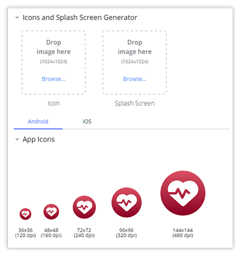
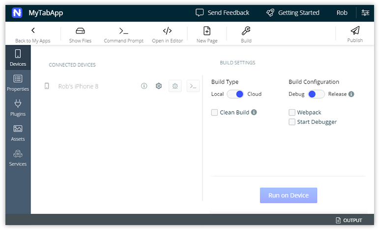
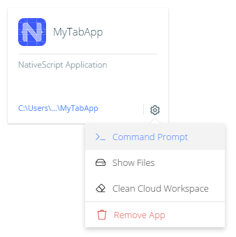
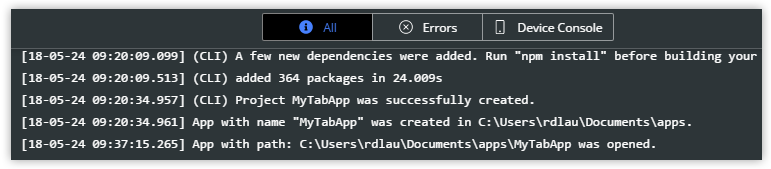
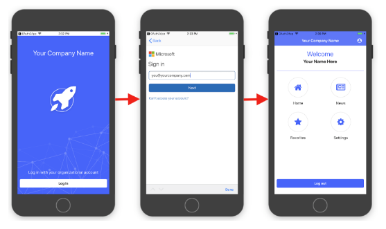

# What's New in NativeScript Sidekick

It's hard to believe, but we are approaching the one year anniversary of the first public release of [NativeScript Sidekick](https://www.nativescript.org/nativescript-sidekick)! Your trusted companion for developing cross-platform apps with NativeScript has matured a lot, especially with the most recent release.

*Let's take a quick look at some of the highlights:*

> **NOTE:** We've also squashed A LOT of bugs 🐛. [Follow the issues on GitHub](https://github.com/NativeScript/sidekick-feedback/issues?q=is%3Aissue+is%3Aclosed) to see what's been fixed.

## Icon and Splashscreen Generation

The bane of any app developer's existence, generating app icons and splash screens is a monumentally tedious chore. At last count, iOS alone asks for 18 icons and 24 splash screens!

NativeScript Sidekick's mission is to make life easier for you. So to help you out, Sidekick now provides the ability to **automatically create** all of your image assets for you, from one master source.

## New Device/Build Screen

One of the most common questions we heard from new Sidekick users was, "what am I supposed to do first!?". So, we've redesigned the app home screen to focus on what matters to you most: getting an app built and deployed to your device ASAP 🏎️.

## New App Cards

A subtle change for this release is a new app card UI:

You'll notice now that you have easy access to some of the most important functions you'll want to take advantage of with your apps like:

- Opening the app in your command prompt/terminal;
- Showing the files on your local machine;
- Cleaning your cloud workspace (which deletes any cached files saved after cloud builds).

## Redesigned Logging Pane

If you're a debug-by-console kind of person like me, you'll appreciate the redesigned logging UI:

Instead of just showing **All** logged statements or only **Errors**, you can now filter by what shows up on the **Device Console** as well, making debugging a little less tedious.

## New App Templates

Everybody loves templates! We have a brand new template called "Enterprise Auth". You can use this template to get a head start on integration with an enterprise single sign-on provider, so what has historically been an arduous task has now been made significantly easier.

Previously this template was only for Angular, but now it is available in TypeScript and vanilla JavaScript flavors as well 🍦

With **support for SAML, OAuth 2, and Open ID Connect**, the Enterprise Auth template in Sidekick guides you through the process of connecting to your provider and makes it easy to customize the look and feel of your login screen.

> **TIP:** [Watch a free online course](https://courses.nativescripting.com/p/nativescript-enterprise-auth/?product_id=308158&coupon_code=AUTH101) on securing your enterprise apps.

## What's on the Sidekick Roadmap?

With the foundation laid, it's time to look to the not-so-far-away future for what's next:

- Release of the first public beta of our **Sidekick extension for Visual Studio**;
- **Launch native simulators/emulators** directly from Sidekick;
- Automatic NativeScript **dependency installation** (no more nagging messages about upgrading your CLI!);
- **Performance improvements** for app creation and cloud builds;
- Brand new app templates for [**Vue.js**](https://nativescript-vue.org/);
- ...and much more.