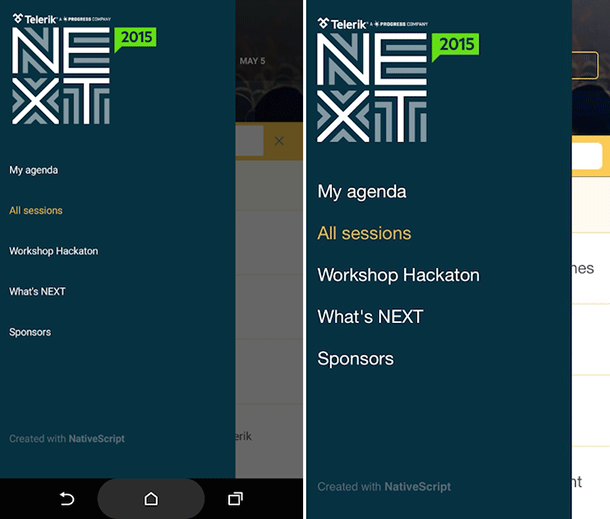
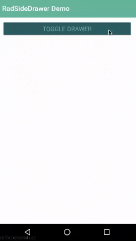
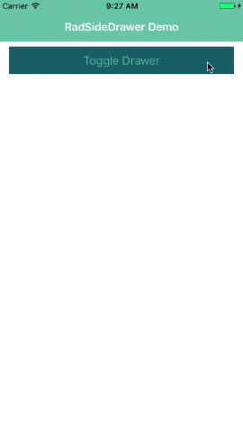
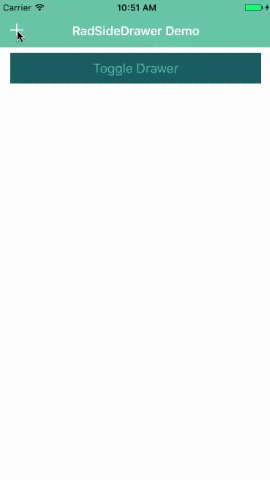

# A Deep Dive into Telerik UI for NativeScript's SideDrawer

When planning your mobile app, how soon in the process are you considering your user interface? Do you have the plans and designs in place to build not only a robust app, but one which delights and engages your customers?

For nearly 15 years now, the [Telerik UI components](http://www.telerik.com/devcraft) have been in millions of developer's hands. From .NET to JavaScript, Xamarin to PHP, Telerik UI components have allowed you to build engaging apps and have helped make you a more productive developer.

What's next in this great line of tools? Why [Telerik UI for NativeScript](http://www.telerik.com/nativescript-ui) of course! With UI for NativeScript we are building on the Telerik tradition of providing easy to use components that delight developers with their ease of use - and delight end users with their engaging features.

This post is part of our "week of UI for NativeScript" that dives deep into the how-to of each UI for NativeScript component. Today we are going to cover the [SideDrawer](http://docs.telerik.com/devtools/nativescript-ui/Controls/NativeScript/SideDrawer/overview) component, and as time goes on you can see other UI for NativeScript component "deep dives":

- ListView
- Chart
- SideDrawer
- DataForm
- AutoCompleteTextView
- Calendar

## What is UI for NativeScript?

UI for NativeScript is a set of premium UI components for native cross-platform mobile apps written with the [NativeScript](https://www.nativescript.org/) framework. Our goal is to simplify NativeScript app development by providing pre-built, ready-to-use, components that are easy to implement in your app (and equally as easy to style to match your app's look and feel).

Let's get started with learning all about the SideDrawer component!

## SideDrawer (a.k.a. RadSideDrawer)

So you find yourself with a mobile app that has more pages and content than can fit on a single screen. Or maybe you want an easy way to expose a set of options for an individual page. Whether you are looking for a navigation solution or a smooth manner to display an inline menu, RadSideDrawer can help.

> RadSideDrawer is part of the *completely free* version of UI for NativeScript. If you are interested in a free trial of UI for NativeScript Pro, which includes additional components, [check it out here](http://www.telerik.com/download-trial-file/v2/nativescript-ui).

With RadSideDrawer, you can specify the location of your drawer component (i.e. does it appear from the top, bottom, left, or right?). You can also specify a variety of transitions for the appearance of the drawer and programmatically control the appearance.

## Installing UI for NativeScript

There are a few different ways to get started, depending on your environment and preferences.

**Using the free version of UI for NativeScript?**

Navigate to your NativeScript project directory and install UI for NativeScript with the following command (no manual download required):

	tns plugin add nativescript-telerik-ui

**Using UI for NativeScript Pro?**

Download the UI for NativeScript `.tgz` file from [your Telerik account](https://www.telerik.com/account) or grab a [free trial](http://www.telerik.com/download-trial-file/v2/nativescript-ui). Navigate to your project directory and install UI for NativeScript with the following command:

	tns plugin add <path-to-tgz>

**Using Telerik AppBuilder?**

If you are using [Telerik AppBuilder](http://www.telerik.com/platform/appbuilder) (part of [Telerik Platform](http://www.telerik.com/platform)), you may [follow these instructions](http://docs.telerik.com/devtools/nativescript-ui/appbuilder).

## Getting Started with RadSideDrawer

> Note that all of the code demonstrated here is available [in this GitHub repo](https://github.com/rdlauer/ui-for-nativescript-sidedrawer). For more code samples, check out the official [UI for NativeScript sample repo](https://github.com/telerik/nativescript-ui-samples).

Plugin installed? Great! Now we'll need to add an XML namespace to the root of the page where we want to use RadSideDrawer. If "XML namespace" scares you, have no fear. You just need to add a property to your root `<Page>` element, like one of these:

	<Page xmlns:sd="nativescript-telerik-ui-pro/sidedrawer"> // ui for nativescript pro version
	<Page xmlns:sd="nativescript-telerik-ui/sidedrawer"> // ui for nativescript free version

Finally, we need to add a RadSideDrawer component to our XML markup, as in:

	<Page xmlns:sd="nativescript-telerik-ui-pro/sidedrawer">
		<sd:RadSideDrawer>
		</sd:RadSideDrawer>
	</Page>

Obviously this code won't do much of anything, but it does give us something to build off of going forward.

## Creating a Simple Side Drawer

Let's build a simple RadSideDrawer that we could use for navigation purposes. We can start with this markup for our UI:

	<Page xmlns="http://schemas.nativescript.org/tns.xsd" xmlns:sd="nativescript-telerik-ui-pro/sidedrawer" loaded="pageLoaded">
	
		<ActionBar title="RadSideDrawer Demo" class="action-bar" />
	
		<sd:RadSideDrawer id="sideDrawer">
	
			<!-- side drawer content -->
			<sd:RadSideDrawer.drawerContent>
				<StackLayout class="sidedrawer-left">
					<StackLayout class="sidedrawer-header">
						<Label text="Hello RadSideDrawer!" class="sidedrawer-header-brand" />
					</StackLayout>
					<StackLayout class="sidedrawer-content">
						<Label text="Home" class="sidedrawer-list-item-text" />
						<Label text="Basics" class="sidedrawer-list-item-text" />
						<Label text="Options" class="sidedrawer-list-item-text" />
						<Label text="Help" class="sidedrawer-list-item-text" />
						<Label text="Advanced" class="sidedrawer-list-item-text" />
					</StackLayout>
				</StackLayout>
			</sd:RadSideDrawer.drawerContent>
	
			<!-- The main content -->
			<sd:RadSideDrawer.mainContent>
				<StackLayout>
					<Button text="Toggle Drawer" class="btn btn-primary" tap="toggleDrawer" />
				</StackLayout>
			</sd:RadSideDrawer.mainContent>
			
		</sd:RadSideDrawer>
	
	</Page>

Ok, I know I just threw **a lot** at you, but bear with me as I think you'll be able to figure out what's going on pretty quickly:

- We added a `pageLoaded` function to the `loaded` event (see below).
- We inserted an `ActionBar` to show a title in our view.
- We added the `<sd:RadSideDrawer.drawerContent>` element, which is where the content of our **side drawer** will appear.
- We added the `<sd:RadSideDrawer.mainContent>` element, which is where the content of our **main view** will appear.

Next, we need a little splash of code-behind JavaScript to make it all work:

	var view = require("ui/core/view");
	var drawer;
	
	exports.pageLoaded = function(args) {
		var page = args.object;
		drawer = view.getViewById(page, "sideDrawer");
	};
	
	exports.toggleDrawer = function() {
		drawer.toggleDrawerState();
	};

> Looking for Angular 2 code samples? Check out our [complete docs for Angular 2](http://docs.telerik.com/devtools/nativescript-ui/Controls/Angular/overview) as well!

Nothing too fancy here. The important part is the definition of our `toggleDrawer` function, which allows us to hide/show the drawer from the button specified in the main view.

This all results in the following:

You can open the drawer with the button, or just slide your finger from the left to the right.

> Note that the styles you see come from the [core light theme](https://docs.nativescript.org/ui/theme) that is part of NativeScript, plus some customizations made with the [NativeScript Theme Builder](http://www.nativescriptthemebuilder.com/).

## Changing the Location of the RadSideDrawer

Using a RadSideDrawer for navigation is great, but what if you want to use it to expose, say, a settings menu?

With RadSideDrawer, you can specify the location of the drawer. Whether you want it to appear from the top, left (default), bottom, or right.

To do so you simply utilize the `drawerLocation` property, like so:

	<sd:RadSideDrawer id="sideDrawer" drawerLocation="Bottom">
	
By cycling through the top, right, bottom, and left options (plus some video editing magic!), we can see how the drawer looks in each position, with the same content we used above:

> If you would like your RadSideDrawer to slide over your action bar, follow the [instructions provided in our docs](http://docs.telerik.com/devtools/nativescript-ui/Controls/NativeScript/SideDrawer/getting-started#showing-radsidedrawer-over-the-navigation-baraction-bar).

## Adding RadSideDrawer Transitions

As you've seen by now, the default transition to expose a RadSideDrawer is to slide it over the main content. There are a variety of other [transition options](http://docs.telerik.com/devtools/nativescript-ui/Controls/NativeScript/SideDrawer/transitions) though:

- FadeTransition
- PushTransition
- RevealTransition
- ReverseSlideOutTransition
- ScaleDownPusherTransition
- ScaleUpTransition
- SlideAlongTransition
- SlideInOnTopTransition

You can play around with all of these transitions, simply by adding the `drawerTransition` property like so:

	<sd:RadSideDrawer id="sideDrawer" drawerTransition="PushTransition">

## Opening RadSideDrawer from the Action Bar

Now it's all fine to show a RadSideDrawer on a button tap, but more realistically you'll want to expose it from a small icon on your action bar:

There are **many** different ways you can add icons to your action bar:

- Custom fonts (like [Font Awesome](https://www.thepolyglotdeveloper.com/2016/01/use-font-awesome-glyph-icons-with-nativescript/))
- System icons (see below)
- [Images](http://docs.nativescript.org/ui/images)

For this example, we are using the built-in system icons. Just replace our existing `ActionBar` element with this:

	<ActionBar title="RadSideDrawer Demo" class="action-bar">
		<ActionItem tap="toggleDrawer" ios.systemIcon="4" android.systemIcon="ic_menu_btn_add" ios.position="left" />
	</ActionBar>
	
You can see the `systemIcon` properties referenced for iOS and Android [in the docs](http://docs.nativescript.org/ui/action-bar).

## Sharing a RadSideDrawer Across Pages

Up to this point we've been set up to only use our RadSideDrawer on one page. If you are using your drawer for navigation, odds are quite good you will **not** want to replicate this code across every page of your app!

Luckily it's easy to share one RadSideDrawer across multiple pages by using NativeScript [custom components](http://docs.nativescript.org/ui/basics#custom-components).

Custom components allow us to specify a set of markup that can be shared across pages. This requires two quick changes to our app:

1) Everything that is currently in the `<sd:RadSideDrawer.drawerContent>` element should be moved to a new file at `app/shared/sidedrawer.xml`.

2) Add a new `<shared:sidedrawer />` element to your `drawerContent`. Your new `<sd:RadSideDrawer.drawerContent>` should now look like this:

	<sd:RadSideDrawer.drawerContent>
		<shared:sidedrawer />
	</sd:RadSideDrawer.drawerContent>

Repeat this on any page that uses your RadSideDrawer!

> While app navigation is a bit out of scope for this article, you can [read the NativeScript docs](https://docs.nativescript.org/core-concepts/navigation) and learn more about navigating between pages.

## Anything Else?

**But of course!** RadSideDrawer exposes a variety of [events](http://docs.telerik.com/devtools/nativescript-ui/Controls/NativeScript/SideDrawer/callbacks) you can tap into, as well as offering pure [programmatic control](http://docs.telerik.com/devtools/nativescript-ui/Controls/NativeScript/SideDrawer/programmatic) over your drawer actions.

While you're checking that out, be sure to grab a [free trial copy](http://www.telerik.com/download-trial-file/v2/nativescript-ui) of UI for NativeScript Pro to use the AutoCompleteTextView, Calendar, Chart, and DataForm components!