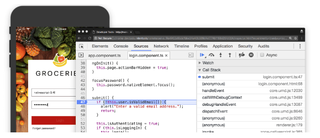
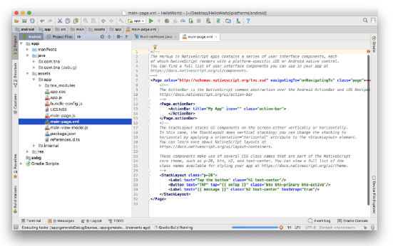
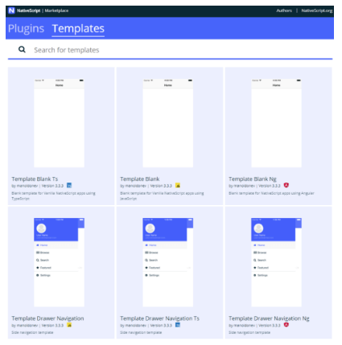
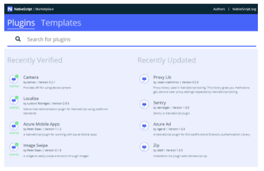
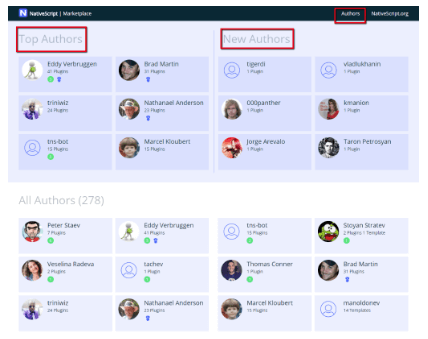
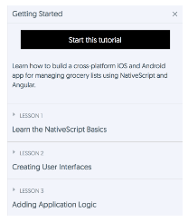
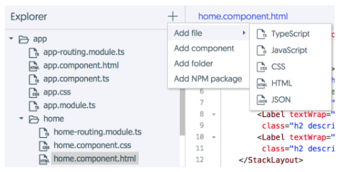
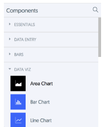
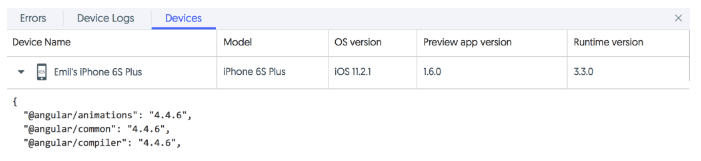
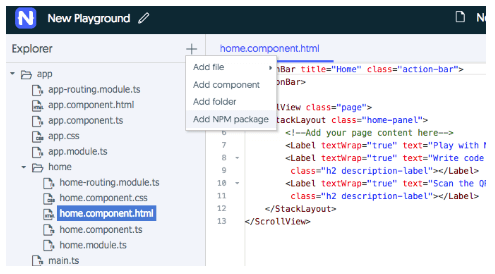

# Announcing the Release of NativeScript 3.4

Here at NativeScript we’re excited to announce one last release before the holiday season: NativeScript 3.4 🎉

The 3.4 release is [live on npm](https://www.npmjs.com/package/nativescript), so let’s take a look at what’s new:

- [Debugging with Chrome Dev Tools for iOS by Default](#chrome)
- [Android Studio Enablement](#android-studio)
- [Angular 5 Support](#angular5)
- [Updated Webpack Support](#webpack)
- [NativeScript Marketplace Update](#marketplace)
- [NativeScript UI Updates](#nativescript-ui)
- [NativeScript Playground Improvements](#playground)
- ["Thank You" to the Community!](#thankyou)

## Debugging with Chrome Dev Tools for iOS by Default 

The Chrome Dev Tools are now the default debugging tool when debugging for iOS. Prior to today, you needed to provide a `--chrome` option to the `debug` command when you wanted to use the Chrome Dev Tools for iOS debugging. Now, `tns debug ios` launches the Chrome Dev Tools automatically, exactly like `tns debug android` does when working on Android applications.

The `debug` command has a new `--inspector` option, which you can use to launch the Safari-based inspector that used to be the default debugger. You can check each debugger's supported features in the [Chrome DevTools Debugging documentation](https://docs.nativescript.org/tooling/chrome-devtools). Currently "Timeline and CPU Profiling" is only in the Safari Inspector, and "Elements" debugging is in the Chrome Dev Tools.

## Android Studio Enablement 

With this release, NativeScript users are now able to use [Android Studio](https://developer.android.com/studio/index.html) to work with their Android projects. This unlocks functionality like debugging, profiling, and working with resources in a way that is more familiar to native developers. A lot of this native tooling was impossible to use in previous versions of NativeScript. 

All you need to do is open your app’s `platforms/android` folder in Android Studio to get started.

## Angular 5 Support

Along with NativeScript 3.4 we also released a new version of the [nativescript-angular plugin](https://www.npmjs.com/package/nativescript-angular) with **official support for Angular 5**. The update includes support for Angular’s new `AnimationBuilder` APIs, as well as some iOS-specific startup time improvements. You can learn more about these changes in the [nativescript-angular changelog](https://github.com/NativeScript/nativescript-angular/blob/master/CHANGELOG.md#500-2017-12-20).

## Updated Webpack Support

We’re also happy to announce a new version (0.9.0) of the [nativescript-dev-webpack plugin](https://www.npmjs.com/package/nativescript-dev-webpack) with a number of new features. There’s a lot to cover with this one, so stay tuned for a detailed blog post tomorrow on the new features and how to update your apps.

## NativeScript Marketplace Updates

We’re not done yet! The [NativeScript Marketplace](https://market.nativescript.org/) also has a number of new features that are already live:

### Templates

The Marketplace now hosts app templates in addition to plugins. The templates are great for using as starting points for your next app.

### Plugins

Do you spend your nights wondering which NativeScript plugins have recently been updated or verified? Well no more! Recently verified and updated plugins now show on the Marketplace home page:

> Speaking of verified, we recently verified two new NativeScript plugins: [Localize](https://market.nativescript.org/plugins/nativescript-localize) by [Ludovic Fabrèges](https://market.nativescript.org/author/lfabreges) and [Camera](https://market.nativescript.org/plugins/nativescript-camera).

### Authors

You can now [view all plugin authors](https://market.nativescript.org/authors) along with their contributions to the NativeScript plugins Ecosystem. There are two new sections on this page: "Top Authors", where we recognize top contributors, and "New Authors", where we recognize authors who have recently submitted a new plugin.

> Do you want to make your plugin verified? [This is how you do it!](https://github.com/NativeScript/marketplace-feedback/blob/master/docs/verified-plugins.md)

## NativeScript UI Updates

A new (3.2) release of [NativeScript UI](https://www.nativescript.org/ui-for-nativescript) is [now available on npm](https://www.npmjs.com/package/nativescript-pro-ui). This release has a variety of bug fixes for most components, and you can find details in the [release notes](http://docs.telerik.com/devtools/nativescript-ui/release-notes#release-notes-320). 

Also, as part of this release we’ve started our work on [splitting the NativeScript UI components into separate packages](https://www.nativescript.org/blog/nativescript-ui-whats-next). The first step was to separate the iOS framework into smaller frameworks, and that work is already done. Next we’ll work on splitting up and Android implementations and JavaScript code. Stay tuned for these updates in a later release. 

## NativeScript Playground Improvements

We’re still not done! The [NativeScript Playground](https://play.nativescript.org/) also has a number of new features!

### Interactive Tutorials

The NativeScript getting started tutorials are now available in the Playground. New users can take advantage of this new way to onboard themselves with NativeScript:

### Manage Project Files

One of the most requested features by the community is now live – the ability to add new files to your project and build more complex examples:

### Build UI with all NativeScript Components

All UI components from the NativeScript core modules and [NativeScript UI](https://www.nativescript.org/ui-for-nativescript) are now available in the components panel. Use these components to get creative and build the UI you want by dragging and dropping.

### Display Connected Devices

You can now see information about the devices that are connected to your Playground session – including the device model, OS version, Preview app version, NativeScript runtime version, and core modules versions.

### Add npm Package

The feature we’re most excited about is the ability to add npm packages to apps running in NativeScript Playground!

> Note: NativeScript plugins that depend on native SDKs such as CocoaPods and Android SDKs do not work in the Playground environment.

## Anything Else in 3.4?

We’ve got so much to say about this release that these last few features only get honorable mentions:

- Support for High Sierra and XCode 9.2;
- Node 9 is now supported;
- [Bug fixes and improvements](https://github.com/NativeScript/NativeScript/blob/master/CHANGELOG.md#340-2017-december-20) in the core modules.

## "Thank You" to the Community! 🤗

Finally, a huge THANKS to all of you folks that helped to make NativeScript better with your PRs. We appreciate your hard work and involvement! 

- [Shiva Prasad](https://github.com/shiv19) for the [contribution](https://github.com/NativeScript/nativescript-camera/pull/65) to nativescript-camera plugin;
- [aliyksel](https://github.com/aliyksel) for the [contribution](https://github.com/NativeScript/nativescript-camera/pull/66) to nativescript-camera plugin; 
- [surdu](https://github.com/surdu) for the [contribution](https://github.com/NativeScript/nativescript-camera/pull/73) to nativescript-camera plugin;
- [Evan Payne](https://github.com/evanfuture) for the [contribution](https://github.com/NativeScript/nativescript-dev-sass/pull/48) to nativescript-dev-sass plugin;
- [dnadoba](https://github.com/dnadoba) for the [contribution](https://github.com/NativeScript/nativescript-cli/pull/3213) to nativescript-cli **on his first day with NativeScript**;
- [dean-huczok](https://github.com/dean-huczok) for the [contribution](https://github.com/NativeScript/nativescript-cli/pull/3220) to nativescript-cli;
- [dbenninger](https://github.com/dbenninger) for the [contribution](https://github.com/NativeScript/NativeScript/pull/5113) to nativescript;
- [triniwiz](https://github.com/triniwiz) for the [contribution](https://github.com/NativeScript/NativeScript/pull/5093) to nativescript;
- [Daniel Freiling](https://github.com/ddfreiling) for the [contribution](https://github.com/NativeScript/NativeScript/pull/5091) to nativescript;
- [Darío Hereñú](https://github.com/kant) for the [contribution](https://github.com/NativeScript/NativeScript/pull/5075) to nativescript;
- [Dick Smith](https://github.com/DickSmith) for the [contribution](https://github.com/NativeScript/NativeScript/pull/5063) to nativescript;
- [Dirk Rudolph](https://github.com/Buuhuu) for the [multiple contributions](https://github.com/NativeScript/NativeScript/pulls?utf8=%E2%9C%93&q=is%3Apr+author%3ABuuhuu) to nativescript.

## Wrapping Up

So what are you waiting for? Go ahead and `npm install –g nativescript` to update and get started using 3.4!

If you run into issues feel free to reach out on the [NativeScript community forum](https://discourse.nativescript.org/).

We hope you enjoy all the new things in the NativeScript world, and you can look forward to a bunch more in 2018. For now, happy holidays from all of us on the NativeScript team 🎄