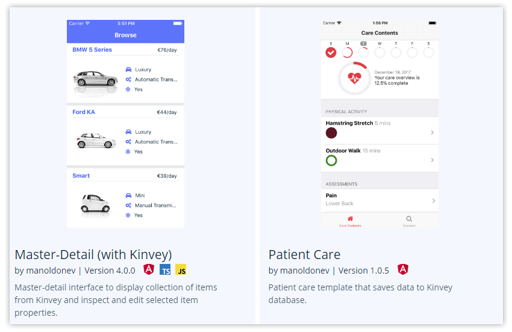
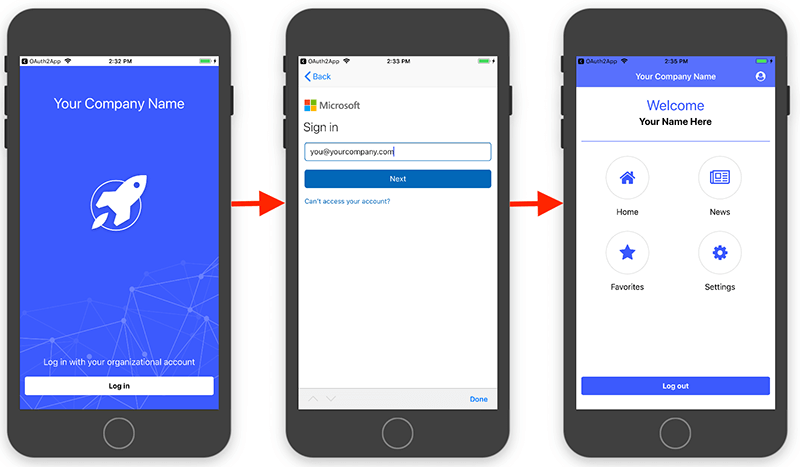
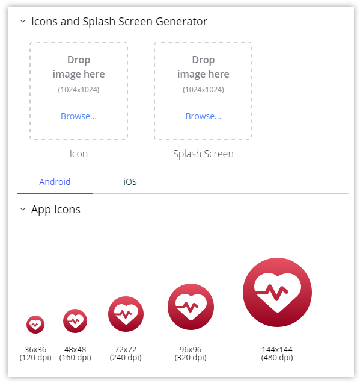

# NativeScript 4.0 is out! 🎉

The fastest way to build truly native mobile apps has just arrived – join me in welcoming the NativeScript 4.0 release!

It’s been awhile since our [last major release](https://www.nativescript.org/blog/announcing-the-release-of-nativescript-3.4) back in December, but that serves to make 4.0 even more exciting. Tons of good stuff is now available and waiting for you, so update NativeScript today:

	npm install -g nativescript

...and don't forget to [update the runtimes](https://docs.nativescript.org/releases/upgrade-instructions) of your apps as well.

*On to the updates!*

## Core Framework and Plugins

### Changing the Application Root View

With NativeScript 4.0 you can now use any `View` as the root of your application. Previously, the root of the app was always a `Frame`, in which you can navigate using `Pages`. Now, you have the flexibility to put a [TabView](https://github.com/NativeScript/template-tab-navigation) or a RadSideDrawer as the root of the app. This enables many more commonly-used navigation patterns and also allows for creating a more optimized UI tree.

Let's see how this looks in code. With NativeScript 4.0 you start your application with:

	application.run({ moduleName: "app-root" });

> **Note:** We are keeping the `start()` method for backwards compatibility - it will still work and it will create a root `Frame` and expect a path to a `Page`.

In the `app-root.xml` you can still have a `Frame` hosting a page navigation. When defined in XML the `Frame` should have a `defaultPage` pointing to the initial page that will be loaded inside it:

	<Frame defaultPage="main-page-module-name">
	</Frame>

Now the fun part - you can put anything inside the `app-root.xml`. For example, `TabView`:

	<TabView>
		<TabViewItem title="Teams">
			<Frame defaultPage="teams-main-page"></Frame>
		</TabViewItem>
		<TabViewItem title="Players">
			<GridLayout>
				<!-- content here -->
			</GridLayout>
		</TabViewItem>
	</TabView>

...or `SideDrawer`:

	<SideDrawer>
		<SideDrawer.drawerContent>
			<!-- side drawer content here -->
		</SideDrawer.drawerContent>
		<SideDrawer.mainContent>
			<Frame defaultPage="main-page-module-name"></Frame>
		</SideDrawer.mainContent>
	</SideDrawer>

### Flexible Frame Composition

As you see in the examples above - now you have more flexibility of where to use the `Frame` view. You can even use more than one `Frame` in your app. This can be useful for implementing secondary navigation with frames, when the top level navigation is `TabView` or `RadSideDrawer`.

You might have more than one `Frame` in your app and the good old `frame.topmost()` method might not be enough. There are now couple of [new suggested ways](https://docs.nativescript.org/core-concepts/navigation#getting-frame-reference) of getting the `Frame` reference you need.

> **Note:** Having **multiple** `Frames` in Angular (which are actually `<page-router-outlets>` in Angular terminology) is something that is still not stable. The team is actively working on this so keep your eyes on the @next tag!

### Modal View Changes

We can now show almost anything as а modal dialog ([example app](https://github.com/NativeScript/modal-navigation-demo)). The `showModal` method has moved from the `Page` to `View` component and there is no limitation to have `Page` as root element when showing something as a modal view. Combine this with the flexible frame composition feature and you can have a modal dialog with a separate navigation inside it!

We also removed the "only one modal at a time" limitation, so now you can show a modal dialog from inside another modal dialog!

### Updated Templates

Good news! Most of these techniques and best practices are already live in the [NativeScript app templates](https://market.nativescript.org/?tab=templates) in the NativeScript Marketplace. You can now even see and select template flavors (Angular, TypeScript, JavaScript) for each template - nice!

### Enterprise Authentication Template

As part of the [NativeScript + Kinvey integration](https://devcenter.kinvey.com/nativescript), we've introduced a new template that makes authentication with different single sign-on providers as easy as pie 🥧. The best way to take advantage of the new [Enterprise Auth template](https://www.nativescript.org/blog/enterprise-authentication-made-easier-with-nativescript) is to use it via [NativeScript Sidekick](https://www.nativescript.org/nativescript-sidekick). Sidekick will take care of setting up all the Kinvey configuration for you and provide you with a nice login view out of the box:

### Professional UI Components in NativeScript UI

For NativeScript 4.0, we managed to break up the monolithic [NativeScript UI](https://www.nativescript.org/ui-for-nativescript) plugin into multiple independent components. So now, using a `ListView` only in your app will not require you to have a dependency on `Calendar` for example. [Read more about “The Big Breakup”](https://www.nativescript.org/blog/professional-components-from-nativescript-ui-the-big-breakup) and the migration to split plugins. 

> Follow the updates of the specific split components in our [release notes](https://github.com/telerik/nativescript-ui-feedback/tree/master/releases).

For any issues you experience with NativeScript UI, feel free to describe them in the [NativeScript UI feedback repository](https://github.com/telerik/nativescript-ui-feedback/issues).

## Tooling Updates

### Configurable project structure

NativeScript developers are now able to configure the path to the application folder and the path to the `App_Resources` folder. The configuration is placed in a newly introduced configuration file named `nsconfig.json`. If the configuration file is missing the default values are the ones used previous to 4.0 to ensure backwards compatibility.

Read more about the [Configurable Project Structure](https://github.com/NativeScript/nativescript-cli/issues/3257) on Github.

### Assets Generation

A common pain for app developers, you are now able to generate icons and splash screens based on a single high resolution image provided by you!

This is a great time-saver and eliminates an effort that developers traditionally don't want to deal with - editing images. The feature is accessible through the new `tns resources generate` command:

	tns resources generate icons <path-to-image>

...and...

	tns resources generate splashes <path to image> [--background <color>]

> **Note:** Asset generation is also available in [NativeScript Sidekick](https://www.nativescript.org/nativescript-sidekick)!

Read more about [Asset Generation](https://github.com/NativeScript/nativescript-cli/issues/3496) on Github.

### LiveSync with Webpack

NativeScript developers can now enable LiveSync with Webpack simultaneously!

This feature can be used with the new flag `--bundle` added to the `tns run <platform>` command. This allows for better developer experience and will allow you to Webpack your application as part of the development process. Any problems you might hit will be visible earlier and will be easier to fix.

### Debugging Android Native Problems with Android Studio

With the NativeScript 4.0, it's now possible to open your NativeScript application in [Android Studio](https://developer.android.com/studio/index.html) and debug it as a native Android project. This will be helpful when you want to investigate a problem in the NativeScript Android runtime or you want to use some of the native tools in Android Studio like [Profiling](https://developer.android.com/studio/profile/android-profiler.html).

### Plugin Development Workflow

After a lot of [discussion and experimentation](https://github.com/NativeScript/android-runtime/issues/890), we managed to provide all the benefits of the 4.0 release without introducing breaking changes in plugins!

Although all plugins are compatible with 4.0, there are **still some plugin improvements that we recommend** to implement to benefit even more from the release:

- Publish plugins with an already built .aar file;
- Make sure to `npm ignore` all files in `platforms/android` except `include.gradle, *.aar and *.jar`;
- Specify package name in `AndroidManifest`;
- Remove `productFlavors` from `include.gradle`;
- To ensure the plugin's `.aar` file is built automatically for you, make sure to add a `prepare` script in the `package.json` of your plugin. [Review this PR](https://github.com/NativeScript/nativescript-plugin-seed/pull/68/files) for an example. An easy way to check how it all works is to clone the plugin seed and follow the steps to run the demo.

To read more details about the pros and cons of these changes, you can review the discussion in the [nativescript-plugin-seed](https://github.com/NativeScript/nativescript-plugin-seed/issues/65) and the [android-runtime](https://github.com/NativeScript/android-runtime/issues/890) repos on Github.

### Sass Plugin Improvements

There are two major improvements in the way Sass files are handled:

- the default `node-sass` watcher is now [replaced with chokidar watcher](https://github.com/NativeScript/nativescript-dev-sass/pull/71) which we expect to fix multiple reported issues about files that are not compiled under certain circumstances. 
- if a sass compilation error occurs, this [won't break LiveSync](https://github.com/NativeScript/nativescript-dev-sass/pull/74).

## Everything Else

If you need any other details for all the specific features and fixes you can check the [change logs](https://docs.nativescript.org/releases/changes) on Github.

But you may be thinking to yourself: "this is great, but what's next!?!?" We've revamped the [Roadmaps & Releases](https://www.nativescript.org/roadmap-and-releases) section of nativescript.org, so you should check that out to get an idea of what's coming in 2018!

## Thank You!

Thanks to our community in [Slack](http://tinyurl.com/nativescriptslack) and the [NativeScript Forum](https://discourse.nativescript.org/), as we are up to over 6400 Slack users and 2000+ registered users of the forum!

Finally, **an extra huge THANKS** to all of you that helped to make NativeScript better with your PRs to the framework, documentation, and plugins. We appreciate your hard work and involvement! 🤗

