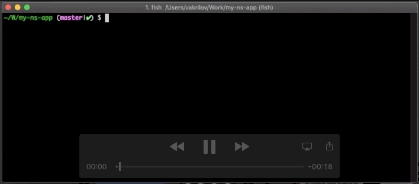
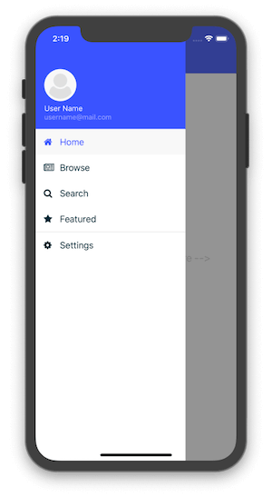
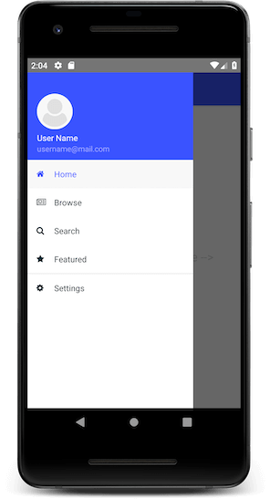

# May the 5.4th release be with you!

Got it? We have another stellar release of NativeScript ready for you. Here are the highlights:

## Webpack Development by Default

With this release, we are promoting the Webpack development workflow for all new projects. Also, for existing projects users will be advised to enable this workflow for their apps. This change is really important, as this is the last step before making the Webpack workflow the *only* development option. We are looking to gather as much feedback as possible and address all open issues before the next release. If you are experiencing problems with using Webpack today - please, open an issue in the [appropriate repository on GitHub](https://github.com/nativescript/nativescript-dev-webpack/issues). 

Accepting the new workflow will create the `nsconfig.json` file in your project with `useLegacyWorkflow` set to `false`. After that you will no longer have to specify `--hmr` or `--bundle` when running CLI commands - webpack will now be the default build workflow. It's a good idea to add the `nsconfig.json` file to source control:

## Support for Unit Tests in TypeScript Projects 

In the previous release we introduced the option to run your unit tests with a bundled application, i.e. `tns test <platform> --bundle`. As we've said, this was just part of a long-term effort to solidify the unit testing story in NativeScript. For 5.4.0 we've worked on improving the TypeScript part of the unit testing story, i.e.:

* In case you have TypeScript project, `tns test init` command will create a `.ts` file instead of `.js` one.
* Ability to run TypeScript tests with `tns test <platform> [--bundle]` command (previously you had to apply some manual changes in order to run your TypeScript tests with the `--bundle` option). With the latest release this comes out-of-the-box - just be sure to update your `nativescript-dev-webpack` version and your `webpack.config.js` file.

## SideDrawer Template for Vue.js Projects

The team is continuing its effort to improve the Vue.js integration in NativeScript. With 5.4 we are adding a new `SideDrawer` template for NativeScript-Vue projects. You can try it out:

	tns create my-drawer-vue --template tns-template-drawer-navigation-vue

## Initial Integration of Apple Watch Applications

The goal of the Apple Watch was to enhance the uses of an iPhone while also providing the user with some additional new features. In recent years the number of apps with Apple Watch support has increased greatly. Each of them provides a unique experience for the user.

Prior to NativeScript 5.4, it was difficult to support a WatchOS application within your NativeScript app. Our goal is to provide a way to consume an Apple Watch extension without the need to write custom scripts and error-prone logic. Ideally,you should be able to copy your watch application and watch extension in the `App_Resources/iOS/` folder, and from there the CLI should take care to package and deploy it properly.

> **NOTE:** You'll still have to develop your Apple Watch application in Xcode, but now, once it is ready, you can integrate it easily in your NativeScript application. Also, this integration is still in BETA, so please share your opinion and any issues you may experience.

*Here is a quick demo of the current experience:*

<iframe width="560" height="315" src="https://www.youtube.com/embed/Xu4hKVsM4vU?rel=0&autoplay=1" frameborder="0" allow="accelerometer; autoplay; encrypted-media; gyroscope; picture-in-picture" allowfullscreen></iframe>

## New Uglifier

Previously, the NativeScript CLI was using UglifyJS to minify when the `--env.uglify` option was provided to the `run` or `build` commands. With this release we switched to [Terser](https://github.com/terser-js/terser) for several reasons. First, Terser is a more optimized and more efficient way to minimize your code. Second, this library has been used by Angular and Vue.js which made even more sense for us to use it. Nothing is required from you related to this change - just continue providing the `--env.uglify option to your commands and Terser will take care for the rest!

## Contributors

As always a big shout-out to everyone that contributed to the 5.4 release. 🤗

**You Are Awesome:**

## What's Next?

With 5.4 behind us we are looking forward to the next release - 6.0! It is planned for mid-July and we are hyped about what's on the [roadmap](https://www.nativescript.org/roadmap-and-releases#releases)! Some of the big things coming up are the webpack-only workflow (which we already mentioned), AndroidX support, and next steps of Apple Watch integration.