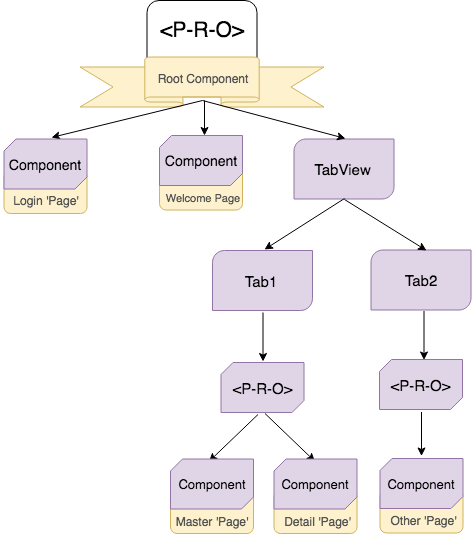
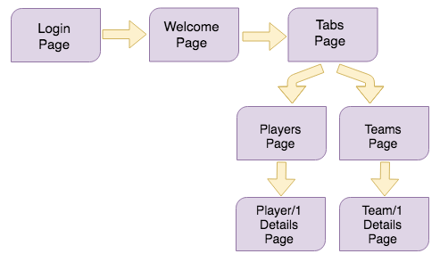
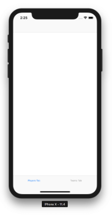
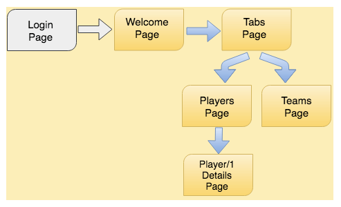

# Implementing a Login for NativeScript Apps with Tab-based Navigation

Enabling nested aux page outlets gives us the power to compose a lot of new and more flexible [application scenarios](https://github.com/NativeScript/nativescript-angular/issues/1351). Before going into details let’s shed some light over what [auxiliary outlets in Angular](https://angular-2-training-book.rangle.io/handout/routing/aux-routes.html) are:

> “Angular supports the concept of auxiliary routes, which allow you to set up and navigate multiple independent routes in a single app. Each component has one primary route and zero or more auxiliary outlets. **Auxiliary outlets must have unique name within a 
component.**”

In web Angular these auxiliary outlets (also called named outlets) are usually used to implement side navigations in a section of your screen. In NativeScript Angular we are using this feature to provide what is called lateral navigation. This refers to navigating between screens at the same level of your navigation hierarchy. The main usage for NativeScript's auxiliary page router outlets is in lateral navigation components like the `TabView` or the `Modal View`. More on this - later.

## Back Story

Until nativescript-angular@6.2.0, the framework supported auxiliary outlets only partially. Defining named outlets, which can have their own independent routes, was possible only on the root level of application navigation (usually the `app.component`):

	const routes: Routes = [
	    { path: "", redirectTo: "/(homeTab:home//browseTab:browse//searchTab:search)", pathMatch: "full" },
	
	    { path: "home", component: HomeComponent, outlet: "homeTab" },
	    { path: "browse", component: BrowseComponent, outlet: "browseTab" },
	    { path: "search", component: SearchComponent, outlet: "searchTab" }
	];

The setup above required you to have the `TabView` in your `app.component` in order to have inner page navigation inside every tab item. So far so good, but what if we want to have some other pages that shouldn’t be inside a `TabView` (which is already the root component) e.g. a **login** page?

Until now there was no way to achieve that.

## Why We Want to Change It

Introducing the *Nested Outlets* feature brings us closer to the native Angular auxiliary outlets. We no longer need TabView as a root component in order to have lateral navigation. We can now set a regular `<page-router-outlet>` in `app.component` and define separate routes for **login** and **tabs** pages. The tabs page can now have its own child routes for the separate tabs.

Refer to the diagrams below for a visual explanation on how the current app setup can be changed to handle the login + tabs scenario:

*Without ‘Nested Aux Page Outlets’ feature (old way):*

*With ‘Nested Aux Page Outlets’ feature:*

## Sample App

Let’s return to the app that has a **Login** page and then, after successful login or button tap, navigates to Welcome page. There is a button on Welcome page that leads to `TabView` page with master-detail navigation in every tab.

You can find the complete app that covers the above scenario using the new Nesting Outlets approach [in this Github repo](https://github.com/NativeScript/login-tab-navigation-ng). We are now going to walk through some of the key points of this app in more details. First, let’s spell out the exact workflow we are aiming for:

Note that the two master/details pages will be shown in separate tabs and the user will be able to navigate forward in each of them independently of the other.

### Routing

The above navigation architecture would require the following routing:

(1.0) [app-routing.module](https://github.com/NativeScript/login-tab-navigation-ng/blob/master/src/app/app-routing.module.ts):

	{ path: "", redirectTo: "/login", pathMatch: "full" },
	{ path: "login", component: LoginComponent },
	{ path: "welcome", component: WelcomeComponent }
	{ path: "tabs", loadChildren: "~/app/tabs/tabs.module#TabsModule" },

In order to bring this app closer to a real application scenario, we are going to use a lazy loaded module for the tabs page (the one with the `TabView`), and for the nested master/details pages inside both tabs.

(1.1) [TabsModule routing](https://github.com/NativeScript/login-tab-navigation-ng/blob/master/src/app/tabs/tabs.module.ts):

	import { NSEmptyOutletComponent } from "nativescript-angular/router";
	
	...
	
	{
	   path: "default", component: TabsComponent, children: [
	       {
	           path: "players",
	           outlet: "playerTab",
	           component: NSEmptyOutletComponent,
	           loadChildren: "~/app/player/players.module#PlayersModule",
	       },
	       {
	           path: "teams",
	           outlet: "teamTab",
	           component: NSEmptyOutletComponent,
	           loadChildren: "~/app/team/teams.module#TeamsModule"
	       }
	   ]
	}

(1.2) The nested [PlayersModule](https://github.com/NativeScript/login-tab-navigation-ng/blob/master/src/app/player/players.module.ts)/[TeamsModule](https://github.com/NativeScript/login-tab-navigation-ng/blob/master/src/app/team/teams.module.ts) routing:

	{ path: "", redirectTo: "players" },
	{ path: "players", component: PlayerComponent },
	{ path: "player/:id", component: PlayerDetailComponent}

(1.3)

	{ path: "", redirectTo: "teams" },
	{ path: "teams", component: TeamsComponent },
	{ path: "team/:id", component: TeamDetailComponent }

You may have noticed the component property value in (1.1) for the separate tabs paths - `NSEmptyOutletComponent`. Setting your component to `NSEmptyOutletComponent` will now be mandatory when you need to define a **named lazy loaded page outlet** path.

### Forward Navigation

We shall begin exploring the app with some forward navigation. After successful login on the Login page, we want to navigate to the Welcome page without preserving history (we don’t want to go back to Login page when hitting back button) as follows:

	this.routerExtension.navigate(["../welcome"], { clearHistory: true });

Now let’s go further and navigate to the Tabs page, but this time we want to preserve history for the Welcome page in order to navigate back later. Since there is no need to pass any extra params for this forward navigation, we could navigate directly using the `<Button>` from the `WelcomeComponent` template:

	<Button text="Go To Tabs Page" [nsRouterLink]="['../tabs/default']"></Button>

But something strange happens after we navigate to Home page. There is a white empty `TabView`:

**Did our app just crash or did something else happened?** Actually, the application is just fine, since we only navigated to the Tabs page that loads the `TabsComponent` and its `TabView`. If you go back to the [TabsModule routing definitions](https://github.com/NativeScript/login-tab-navigation-ng/blob/master/src/app/tabs/tabs.module.ts) (1.1) above you’ll see that there are two children paths to the `tabs` path - `players` and `teams`. Both of these paths have outlet names and corresponding `<page-router-outlet>` with names in the `<TabView>` [template](https://github.com/NativeScript/login-tab-navigation-ng/blob/master/src/app/tabs/tabs.component.html):

	<TabView androidTabsPosition="bottom">
	   <page-router-outlet *tabItem="{title: 'Players Tab'}" name="playerTab">
	   </page-router-outlet>
	
	   <page-router-outlet *tabItem="{title: 'Teams Tab'}" name="teamTab">
	   </page-router-outlet>
	</TabView>

This means that we have to manually navigate these outlets to their desired routes. The best place to do that is inside the `ngOnInit()` of the `TabsComponent`:

	this.routerExtension.navigate(
	   [{ outlets: { playerTab: ["players"], teamTab: ["teams"] } }],
	   { relativeTo: this.activeRoute }
	);

There are two important things to consider in the code snippet above:

1. Always pass the exact `<page-router-outlet>` name to the `outlets` collection object.
1. Navigating relative to the current activated route is essential, since `players` and `teams`  are children paths of the current one - `tabs`.

> Note: if no `{ relativeTo: this.activeRoute }` is passed the navigation will be absolute.

After navigating both nested outlets to the `players` and `teams` routes, Angular will load their correspondent lazy modules, `PlayersModule` and `TeamsModule`, respectively. Both modules have their own path routes defined:

	{ path: "", redirectTo: "players" },
	{ path: "players", component: PlayerComponent },
	{ path: "player/:id", component: PlayerDetailComponent }

	{ path: "", redirectTo: "teams" },
	{ path: "teams", component: TeamsComponent },
	{ path: "team/:id", component: TeamDetailComponent }

We are going to make one last forward navigation in this application before going back. Since the current visible tab item is the one with the players loaded, we are going to [navigate to the first player details](https://github.com/NativeScript/login-tab-navigation-ng/blob/5b0342c753244d6e62906b572c0977e4d35fe2d2/src/app/player/players.component.html#L6) by tapping on its `<Label>`:

	<Label [nsRouterLink]="['../player', item.id]" [text]="item.name"></Label>

### Back Navigation

Now is the time to explain an important difference between the web approach to outlets and the NativeScript one. By default in web you have linear history defined by the sequence of URLs that you passed through. Clicking the back button of your browser will take you to the previous URL you visited. In short, this means that there is one navigation controller for all your outlets.

Mobile navigation is a bit different in this regard. In mobile, it’s expected that different navigation containers would have separate navigation controllers. For the user this means that they can back in each tab, and even in the root controller, independently. To accommodate for this in NativeScript Angular, each page router outlet holds a navigation controller in itself. This means that each outlet has its own history and you can back in each separately.

Currently the navigation stack of the app looks like this:

There are three outlets in the navigation stack:

- The `primary` outlet has `welcome` and `tabs` routes in its stack (keep in mind that the Login page is no longer accessible since we have navigated from it with `clearHistory:true`).
- The `playerTab` outlet has the `players` and `player/1` routes.
- The `teamTab` outlet has the `teams` route.

We are now in `PlayerDetailsComponent` with the activated route for the first player details - `player/1`. Here we have four back navigation buttons, accepting different parameters, and executing back navigations in a different `<page-router-outlet>`:

➡️ **Back()** will navigate back to the outlet that was last navigated in:

	this.routerExtension.back();

In our case this is `playersOutlet` since we navigated to `player/1` details in the last forward navigation. Currently this outlet has two navigation states - `players` and `player/1`.  **Back()** will send us back to the `players` state (Players page).

➡️ **Back(ActivatedRoute)** will navigate back the outlet that is relative to the currently activated route which in this case is `playersOutlet`:

	this.routerExtension.back({ relativeTo: this.activeRoute});

Using **Back(ActivatedRoute)** here will result in the same back navigation as using **Back()**.

➡️ **Back(OutletName)** will navigate back a specific outlet - the `<page-router-outlet>` defined in `app.component.html`:

	this.routerExtension.back({ outlets: ["primary"] });

Navigating with `outlets` param only will search for the given outlets on a root `app-routing.module.ts` level. All unnamed `<page-router-outlets>` automatically use `primary` assigned name. **Back(OutletName)** button will navigate us back to Welcome Page since it was the page before Tabs.

➡️ **Back(ParentRoute)** will back the app to same page as the **Back(OutletName)** button - Welcome Page:

	this.routerExtension.back({ relativeTo: this.activeRoute.parent });

The current activated route parent points to the `<page-router-outlet>` defined in `app.component.html`, whose previous page was Welcome Page.

Keep in mind that both **Back(OutletName)** and **Back(ParentRoute)** navigations will ignore any nested outlet navigations (`playersOutlet` and `teamsOutlet`).

### More Examples of the Back() and canGoBack() APIs

Here are a few more navigation scenarios that might come in handy when dealing with auxiliary outlets:

➡️ **Back outlet** relative to specific route:

	this.routerExtension.back({ outlets: ["teamTab"], relativeTo: this.activeRoute });

➡️ **Back(..) multiple outlets at once** relative to the root activated route:

	this.routerExtension.back({ outlets: ["teamTab", "playerTab"]});

➡️ **Back(..) multiple outlets at once** relative to specific route:

	this.routerExtension.back({ outlets: ["teamTab", "playerTab"], relativeTo: this.activeRoute.parent });

➡️ **CanGoBack(..)** can be used with the parameters variations as **Back()**:

	this.routerExtension.canGoBack({ outlets: ["teamTab", "playerTab"], relativeTo: this.activeRoute });

> Keep in mind that `CanGoBack()` will return `true` only if all provided outlets can go back.

Using auxiliary page outlets could bring your application closer to the native mobile application patterns. For a complete application example, using the new functionality, you can check the [login-tabs repo](https://github.com/NativeScript/login-tab-navigation-ng).

