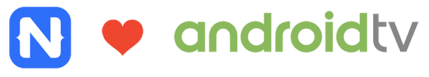
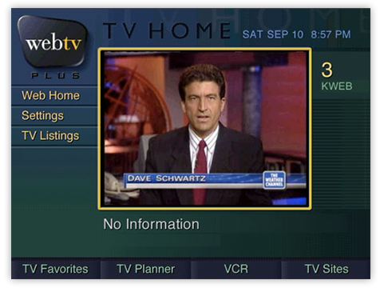
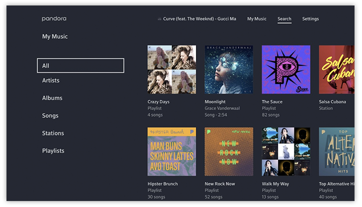

# Your First Android TV App

If you're here, I'm guessing NativeScript is your first choice (or will be soon!) when it comes to developing cross-platform apps from one codebase, for both iOS and Android. I suppose the title gives it away, but did you know you can *also* build NativeScript apps for [Android TV](https://www.android.com/tv/)?

While Android TV isn't taking the world by storm (yet), it's still an interesting exercise to consider another channel for your app development skills.

An Android TV is a set-top box (powered by Android) that lets you stream content to your TV 📺. In many ways, you can compare it to Apple TV, without the hardware restrictions inherent to Apple's ecosystem.

While the most common uses of Androit TV are for gaming or passive media consumption, as an alternative to handheld devices there are opportunities to expand the platform in new and exciting ways.

You could even make your own WebTV clone! 😉

## A Little History

One day we received a message from a [NativeScript Sidekick](https://www.nativescript.org/nativescript-sidekick) user who wanted to leverage his NativeScript skills for an Android TV app:

It was a bit of a 💡 moment for us, as we realized this neglected platform deserved a home here at NativeScript HQ. Enter our old pal [Eddy "the plugin" Verbruggen](https://github.com/eddyverbruggen).

In no time at all, Eddy put together a POC to effectively offer Android TV as another build target for your NativeScript app.

EMBED: https://www.youtube.com/watch?v=HjxvDxbAOW0

You know what he had to do? It's shockingly simple. In order to achieve raw compatibility with Android TV, you just need to add one line to your `AndroidManifest.xml` file:

	<category android:name="android.intent.category.LEANBACK_LAUNCHER" />

But basic compatibility with Android TV is one thing. What about embracing the unique capabilities of the platform?

> Consult [this GitHub repository](https://github.com/EddyVerbruggen/nativescript-android-tv/issues) for a basic, but fully-functional, NativeScript Android TV app example!
	
## The D-Pad Controls

Unlike an iOS or Android device that allows you to use your fingers to control a UI, with Android TV you are navigating with a little remote control (the D-pad or [directional pad](https://developer.android.com/training/tv/start/navigation.html)). You need the ability to:

- Move through menu options with a D-pad control, and
- Be able to *actively see* where you are in the UI.

This means making some minor UI adjustments to your NativeScript app, and you have a couple of valid options:

### Selectors

You can use [Android Selectors](https://developer.android.com/reference/java/nio/channels/Selector.html) to specifically set view states for your UI elements.

	<?xml version="1.0" encoding="utf-8"?>
	<selector xmlns:android="http://schemas.android.com/apk/res/android">
	  <item android:state_pressed="true" android:drawable="@drawable/bluebutton_focused"/> <!-- pressed -->
	  <item android:state_focused="true" android:drawable="@drawable/bluebutton_focused"/> <!-- focused -->
	  <item android:state_hovered="true" android:drawable="@drawable/bluebutton_focused"/> <!-- hovered -->
	  <item android:drawable="@drawable/bluebutton"/> <!-- default -->
	</selector>

While this does work perfectly fine, it's not *really* the NativeScript way. However, it works and wiring a selector is not too painful:

	export function elementLoaded(args: observable.EventData): void {
	  const view = <ViewBase>args.object;
	
	  // use a resource that speficies a 'focused' state:
	  view.android.setBackgroundResource(identifier);
	}

### KeyEvents

Arguably a more proper way to implement a "focused" state is with [Android KeyEvents](https://developer.android.com/reference/android/view/KeyEvent.html):

	  public dispatchKeyEvent(event: android.view.KeyEvent): boolean {
	    // you can respond to specific keycodes by fi. registering a listener and invoking it when appropriate
	    console.log("D-Pad center button pressed? " + (event.getKeyCode() === android.view.KeyEvent.KEYCODE_DPAD_CENTER));
	
	    // let's highlight the element that currently has the focus
	    const tnsButton = <ViewBase>this.getCurrentFocus()["jsview"];
	    if (tnsButton && tnsButton !== this.highlightedElement) {
	      tnsButton.addPseudoClass("focused");
	      if (this.highlightedElement) {
	        this.highlightedElement.deletePseudoClass("focused");
	      }
	      this.highlightedElement = tnsButton;
	    }
	    return super.dispatchKeyEvent(event);
	  }
	  
> The above example is a good opportunity to [build a new NativeScript plugin](https://docs.nativescript.org/plugins/building-plugins), hint hint... 😜
	  
...which you can wire up in your UI with:

	export function elementLoaded(args: observable.EventData): void {
	  const view = <ViewBase>args.object;
	
	  // set a backreference so 'dispatchKeyEvent' in app.ts can swap CSS classes
	  view.android["jsview"] = args.object;
	}

## Separate UI Views

With NativeScript, you've always been able to have separate UI views by platform. With a clever little hack, you can also have a separate Android TV view:

	if (utils.ad) {
	  // Android: Load either the TV or phone UI
	  const uiModeManager = utils.ad.getApplicationContext().getSystemService(android.content.Context.UI_MODE_SERVICE);
	  if (uiModeManager.getCurrentModeType() === android.content.res.Configuration.UI_MODE_TYPE_TELEVISION) {
	    console.log("Running on a TV");
	    application.start({moduleName: "main-page-tv"});
	  } else {
	    console.log("Running on a Phone / Tablet");
	    application.start({moduleName: "main-page"});
	  }
	} else {
	  // iOS
	  application.start({moduleName: "main-page"});
	}

## Wrapping Up

Now it's your turn! Try taking a simple NativeScript app and add these customizations. Deploy the app to an Android TV emulator (available as part of the Android SDK) to test it out.

> Remember, you can find a fully-functional NativeScript Android TV app in [this GitHub repository](https://github.com/EddyVerbruggen/nativescript-android-tv/issues).

Finally, let us know about your experience in the comments (or [submit an issue](https://github.com/EddyVerbruggen/nativescript-android-tv/issues)) so we can continue to fine-tune this solution for Android TV developers.

