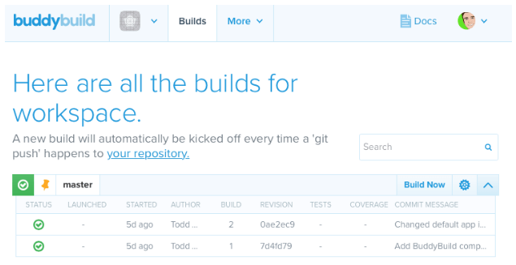
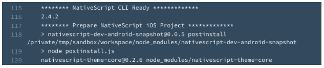
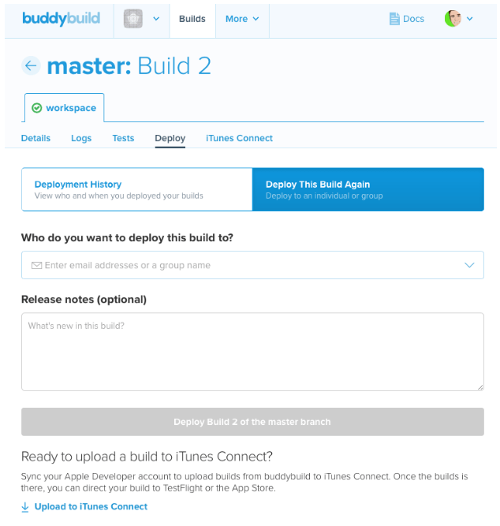

# Making NativeScript Work with BuddyBuild

When you start working on a mobile project with a team, it’s often desirable to have a shared build server to help create a continuous delivery workflow. This build server recompiles your app every time a new commit (or “check-in” as we used to call them) is pushed to your project, and can even notify testers and beta users when new (working) builds are available. There are many ways to set up build servers for continuous delivery, but as with all things involving servers these days, isn’t this something the cloud can do? Wouldn’t it be nice if someone else managed your build servers for you?

Enter [BuddyBuild](https://www.buddybuild.com/). A cloud-based service for building Android *and* iOS apps. Cool.

I saw a few people trying to use this with NativeScript, so I had to give it a try. Getting started is a cinch:

1. Log-in with an existing ID from GitHub, GitLab or similar
1. Select the repo that has the project you want BuddyBuild to compile
1. Watch BuddyBuild download your project, look for an iOS or Android app and then create a build

The compiled apps can be downloaded and run on local devices, or you can use BuddyBuild to help distribute your app to beta testers (similar to capabilities in Telerik’s [AppManager](http://www.telerik.com/blogs/frictionless-app-distribution-with-telerik-appmanager) and Microsoft’s [HockeyApp](https://hockeyapp.net/), both of which also work with NativeScript).

## Making NativeScript Builds Work

BuddyBuild does not (yet) support NativeScript projects right out of the box (if you want that, [let them know](https://twitter.com/buddybuild/)!), but they do offer a flexible system that allows you to customize the build process. Every build gets its own, fresh server instance, so that means you have quite a bit of control to configure that environment as necessary to make your builds work.

There are three primary points at which you can run shell scripts to modify the build environment:

1. Post Clone (right after BB is done importing the latest copy of your project)
1. Pre Build (right before your actual mobile app build begins)
1. Post Build (you can figure it out)

To make NativeScript builds work, we need BuddyBuild to do two extra steps before executing the native app build:

1. Install the NativeScript CLI
1. Prepare our NativeScript app project for a native build

We’ll do that by adding a “Post Clone” BuddyBuild step to our NativeScript project that installs the CLI from npm and runs the `tns prepare` command to generate our XCode or Gradle platform project files.

In the root of your project (your source project, not the `app` directory), create a new file named `buddybuild_postclone.sh`. BuddyBuild looks for a file with this name and runs the contents at the right time. In that file, include the following shell script:

	#!/usr/bin/env bash
	
	# Install NativeScript CLI
	echo "******** Install NativeScript CLI *************"
	npm install -g nativescript
	
	# NativeScript Ready
	echo "******** NativeScript CLI Ready *************"
	tns --version
	
	# Prepare NativeScript Project
	echo "******** Prepare NativeScript iOS Project *************"
	tns prepare ios

Obviously, this snippet is set up to work for an iOS app build. If you wanted to support both iOS and Android builds, you can use the [BuddyBuild environment variables](http://docs.buddybuild.com/docs/custom-prebuild-and-postbuild-steps) to create a more advanced script.

> NOTE: BuddyBuild requires separate “projects” in their system to build the same app for iOS and Android, so you can set specific environment variables in those two projects to build NativeScript source for iOS and Android.

The `echo` comments are included in this script to help with debugging. You get the complete command line output for all builds in BuddyBuild (the “Logs”), so these comments will help you see where the various Post Clone actions are being performed.

With this script in place, BuddyBuild should build your NativeScript project and give you an app package you can deploy to your testers or beta users!

## Gotchas

It wouldn’t be mobile app development if it were just that easy.

In my experiments, I found this solution works fine for the NativeScript “Hello World” example and relatively simple apps. For apps that had large numbers of plugins, particularly native iOS plugins, your milage may vary. One large iOS app I tested would only compile on BuddyBuild some of the time, and even when it did, it would fail to work when installed on a device.

So...it’s not perfect. But hopefully the BuddyBuild team will be able to help polish the rough edges when they add first class support for NativeScript to their systems.

Until then, it’s a very cool continuous integration build server solution for iOS and Android apps, and with very little configuration, it might work for your NativeScript app.

