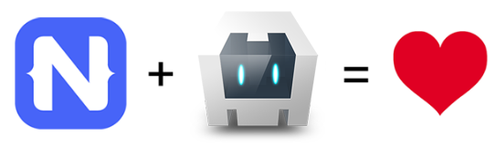

# How to Use Any Cordova Plugin with NativeScript

Many NativeScript developers are former hybrid developers. We grew up with the web, decided PhoneGap/Cordova was the best way to dip our collective toes into mobility, and saw the light when NativeScript arrived 🌞.

This also means we are either maintaining legacy hybrid apps, or hopefully starting down a migration path [from Cordova to NativeScript](https://developer.telerik.com/content-types/tutorials/migrating-cordova-nativescript/).

> **TIP:** Read more about [upgrading your hybrid mobile apps](https://www.hybridtonative.com/).

Luckily this migration is often far less painful than we expect. Why? Because NativeScript already supports the same languages (JavaScript, [TypeScript](https://www.nativescript.org/using-typescript-with-nativescript-when-developing-mobile-apps)), frameworks ([Angular](https://www.nativescript.org/nativescript-is-how-you-build-native-mobile-apps-with-angular), [Vue.js](https://nativescript-vue.org/)), and styling capabilities ([CSS](https://docs.nativescript.org/ui/styling), [Sass](https://github.com/NativeScript/nativescript-dev-sass), [LESS](https://www.npmjs.com/package/nativescript-dev-less)) we are already using.

The heavier lifting 🏋️ comes into play when migrating the UI layer and custom Cordova plugins that we've previously had to use to access native device features.

**But of course we have solutions for you 😀!** There are extensive [docs](https://docs.nativescript.org/ui/components) and [tutorials](https://www.nslayouts.com/) for learning how to create a *truly native* cross-platform UI layer. There is also an extensive [plugins marketplace](https://market.nativescript.org/) for you to discover equivalent plugins.

What about the scenario when you can't find an appropriate Cordova plugin, or maybe the NativeScript version's API is just too different for you to use?

## Cordova-NativeScript

Enter `cordova-nativescript-plugin`, a soon-to-be-released plugin that **allows you to use *any* existing Cordova plugin in your NativeScript apps**. Currently in alpha phase (and only supporting Android at the moment, with iOS in the works) this plugin will be another bridge for those of you looking to migrate from Cordova.

Let's take a look at a real-world scenario for using this plugin with the [Cordova image picker](https://github.com/Telerik-Verified-Plugins/ImagePicker) plugin and a simple NativeScript app.

## Android Proof of Concept

You can follow along with [this repo on GitHub](https://github.com/NativeScript/nativescript-cordova-imagepicker-showcase).

> Again, this plugin is in an early alpha stage as of this writing. **And yes, iOS development is in progress!**

The [plugin](https://github.com/NativeScript/nativescript-cordova-imagepicker-showcase/tree/master/cordova-nativescript-plugin) itself contains all of the native files that are used to run Cordova plugins and the `before-prepare` hook. This hook is responsible for finding all of the Cordova plugins inside your NativeScript project and **transform them into NativeScript plugins**.

The [demo app](https://github.com/NativeScript/nativescript-cordova-imagepicker-showcase/tree/master/demo) has references to both `cordova-nativescript-plugin` and to the `cordova-plugin-telerik-imagepicker` Cordova plugin in its `package.json` file:

	"dependencies": {
		"cordova-nativescript-plugin": "file:..\\cordova-nativescript-plugin",
		"cordova-plugin-telerik-imagepicker": "2.1.10",
		...

With that brief setup out of the way, there are a few things we have to do in order to actually run the Image Picker plugin in a NativeScript view:

1) Require the `cordova-nativescript-plugin`:

	require("cordova-nativescript-plugin");

2) Require the `cordova-plugin-telerik-imagepicker` Cordova plugin:

	const imagePicker = cordova.require("com.synconset.imagepicker.ImagePicker").imagePicker;

> **TIP:** The string inside `cordova.require` is the id of the plugin - `com.synconset.ImagePicker` - plus the name of the exported js-module from the plugin's `plugin.xml` [file](https://github.com/Telerik-Verified-Plugins/ImagePicker/blob/master/plugin.xml#L19).

3) Execute the ImagePicker plugin with:

	imagePicker.getPictures(successCallback, failCallback);

*You can try this exact example yourself by running these commands in your terminal:*

	git clone https://github.com/NativeScript/nativescript-cordova-imagepicker-showcase
	cd nativescript-cordova-imagepicker-showcase
	cd demo
	tns run android

## What's Next?

Have I mentioned this is an early alpha view of the plugin!? 🤔

Obviously support for iOS is critical, bringing the "cross-platform" part of NativeScript back into play. We also hope to make it even easier for you to `require` the Cordova plugin. But stay tuned as we will have a lot more to share about this exciting new opportunity for Cordova developers!

